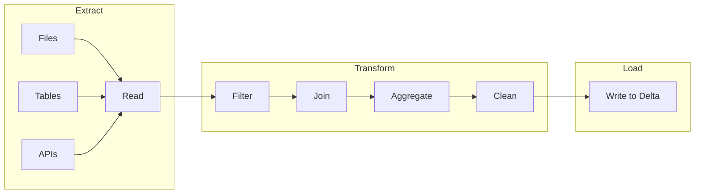
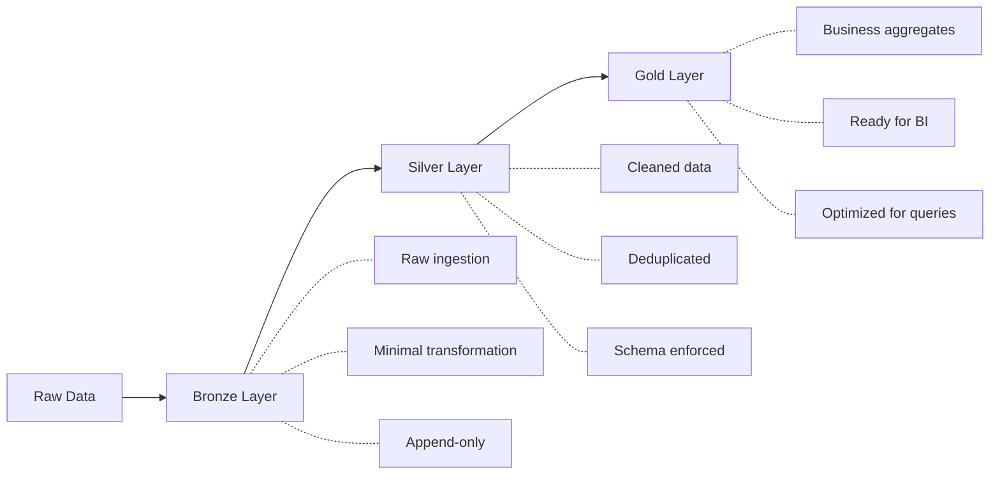
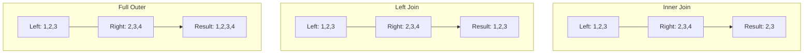
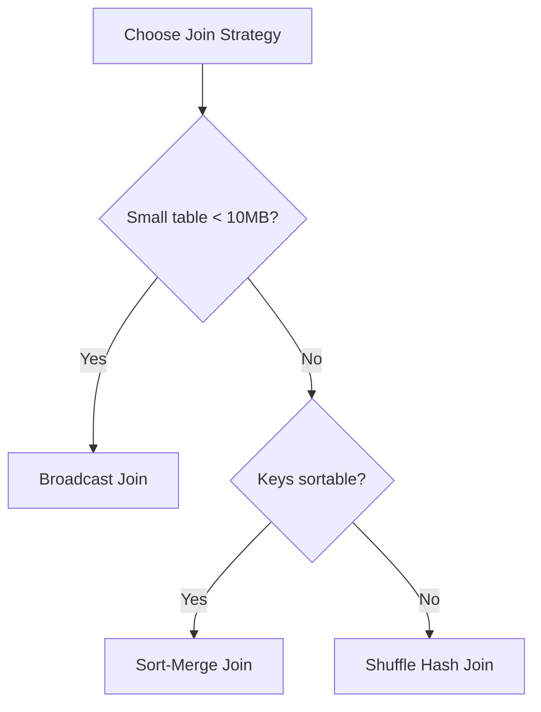

# Batch ETL Pipelines

Batch ETL is foundational to data engineering. Understanding DataFrame transformations, read/write operations, and join strategies is essential for the exam.

## Overview



## ETL vs ELT

| Aspect | ETL | ELT |
|--------|-----|-----|
| Transform location | Before loading | After loading |
| Best for | Structured data, compliance | Raw data, data lakes |
| Databricks approach | Use ELT with medallion architecture | |
| Flexibility | Less flexible | More flexible |

### Medallion Architecture (Bronze/Silver/Gold)



## Reading Data

### Read from Files

```python
# Read Parquet
df = spark.read.format("parquet").load("/path/to/files")

# Read CSV with options
df = spark.read.format("csv") \
    .option("header", "true") \
    .option("inferSchema", "true") \
    .option("multiLine", "true") \
    .load("/path/to/files/*.csv")

# Read JSON
df = spark.read.format("json") \
    .option("multiLine", "true") \
    .load("/path/to/files")

# Read Delta
df = spark.read.format("delta").load("/path/to/delta")
df = spark.table("catalog.schema.table_name")
```

### Read Options by Format

| Format | Key Options |
|--------|-------------|
| CSV | `header`, `inferSchema`, `delimiter`, `multiLine`, `quote`, `escape` |
| JSON | `multiLine`, `primitivesAsString`, `allowComments` |
| Parquet | `mergeSchema` |
| Delta | `versionAsOf`, `timestampAsOf` |

### Schema Definition

```python
from pyspark.sql.types import StructType, StructField, StringType, IntegerType, TimestampType

# Define schema explicitly (recommended for production)
schema = StructType([
    StructField("id", IntegerType(), nullable=False),
    StructField("name", StringType(), nullable=True),
    StructField("created_at", TimestampType(), nullable=True)
])

df = spark.read.format("json") \
    .schema(schema) \
    .load("/path/to/files")
```

### Handling Corrupt Records

```python
# Mode options for corrupt records
df = spark.read.format("json") \
    .option("mode", "PERMISSIVE") \  # Default: nulls for corrupt fields
    .option("columnNameOfCorruptRecord", "_corrupt_record") \
    .load("/path/to/files")

# DROPMALFORMED: Skip corrupt records
df = spark.read.format("csv") \
    .option("mode", "DROPMALFORMED") \
    .load("/path/to/files")

# FAILFAST: Fail immediately on corrupt record
df = spark.read.format("csv") \
    .option("mode", "FAILFAST") \
    .load("/path/to/files")
```

| Mode | Behavior |
|------|----------|
| `PERMISSIVE` | Set corrupt fields to null, store in `_corrupt_record` |
| `DROPMALFORMED` | Skip corrupt records |
| `FAILFAST` | Throw exception on first corrupt record |

## DataFrame Transformations

### Select and Column Operations

```python
from pyspark.sql.functions import col, lit, when, coalesce, concat, upper

# Select columns
df.select("col1", "col2")
df.select(col("col1"), col("col2").alias("renamed"))

# Add new column
df.withColumn("new_col", lit("constant"))
df.withColumn("full_name", concat(col("first"), lit(" "), col("last")))

# Conditional column
df.withColumn("status",
    when(col("amount") > 100, "high")
    .when(col("amount") > 50, "medium")
    .otherwise("low")
)

# Handle nulls
df.withColumn("value", coalesce(col("primary"), col("backup"), lit(0)))
```

### Filter Operations

```python
# Basic filter
df.filter(col("status") == "active")
df.filter("status = 'active'")  # SQL expression

# Multiple conditions
df.filter((col("amount") > 100) & (col("status") == "active"))
df.filter((col("region") == "US") | (col("region") == "CA"))

# Null handling
df.filter(col("email").isNotNull())
df.filter(col("phone").isNull())

# String operations
df.filter(col("name").like("%Smith%"))
df.filter(col("name").rlike("^[A-Z].*"))  # Regex
df.filter(col("email").contains("@company.com"))
```

### Type Casting

```python
from pyspark.sql.functions import col, to_date, to_timestamp

# Cast types
df.withColumn("amount", col("amount").cast("double"))
df.withColumn("id", col("id").cast("integer"))

# Date/timestamp conversions
df.withColumn("date", to_date(col("date_string"), "yyyy-MM-dd"))
df.withColumn("timestamp", to_timestamp(col("ts_string"), "yyyy-MM-dd HH:mm:ss"))
```

### SQL Expressions

```python
from pyspark.sql.functions import expr

# Use SQL expressions in DataFrame API
df.withColumn("discount_price", expr("price * (1 - discount_rate)"))
df.selectExpr("*", "price * quantity AS total")
```

## Join Operations

### Join Types



```python
# Inner join (default)
df1.join(df2, df1.id == df2.id, "inner")

# Left join
df1.join(df2, df1.id == df2.id, "left")

# Right join
df1.join(df2, df1.id == df2.id, "right")

# Full outer join
df1.join(df2, df1.id == df2.id, "full")

# Left anti join (rows in left not in right)
df1.join(df2, df1.id == df2.id, "left_anti")

# Left semi join (rows in left that have match in right)
df1.join(df2, df1.id == df2.id, "left_semi")

# Cross join
df1.crossJoin(df2)
```

### Join on Multiple Columns

```python
# Multiple join conditions
df1.join(df2,
    (df1.id == df2.id) & (df1.date == df2.date),
    "inner"
)

# Same column names (simpler syntax)
df1.join(df2, ["id", "date"], "inner")
```

### Join Strategies



| Strategy | When Used | Performance |
|----------|-----------|-------------|
| Broadcast | Small table (< 10MB default) | Fast, no shuffle |
| Sort-Merge | Large tables, sorted keys | Good for equi-joins |
| Shuffle Hash | Large tables, unsorted | Expensive shuffle |

### Join Hints

```python
from pyspark.sql.functions import broadcast

# Force broadcast join
df1.join(broadcast(df2), "id")

# SQL hints
spark.sql("""
    SELECT /*+ BROADCAST(small_table) */ *
    FROM large_table
    JOIN small_table ON large_table.id = small_table.id
""")

# Merge hint (sort-merge join)
spark.sql("""
    SELECT /*+ MERGE(df2) */ *
    FROM df1 JOIN df2 ON df1.id = df2.id
""")

# Shuffle hash hint
spark.sql("""
    SELECT /*+ SHUFFLE_HASH(df2) */ *
    FROM df1 JOIN df2 ON df1.id = df2.id
""")
```

### Broadcast Threshold

```python
# Default broadcast threshold is 10MB
# Increase for larger dimension tables
spark.conf.set("spark.sql.autoBroadcastJoinThreshold", "50MB")

# Disable auto broadcast
spark.conf.set("spark.sql.autoBroadcastJoinThreshold", "-1")
```

## Aggregations

### Basic Aggregations

```python
from pyspark.sql.functions import count, sum, avg, min, max, countDistinct

# Single aggregation
df.agg(count("*").alias("total"))

# Multiple aggregations
df.agg(
    count("*").alias("total_rows"),
    sum("amount").alias("total_amount"),
    avg("amount").alias("avg_amount"),
    countDistinct("customer_id").alias("unique_customers")
)
```

### Group By

```python
# Group by single column
df.groupBy("region").agg(
    count("*").alias("order_count"),
    sum("amount").alias("total_amount")
)

# Group by multiple columns
df.groupBy("region", "product_category").agg(
    sum("amount").alias("total")
)
```

### Pivot

```python
# Pivot table
df.groupBy("region").pivot("year").agg(sum("amount"))

# Pivot with specific values (more efficient)
df.groupBy("region").pivot("year", [2022, 2023, 2024]).agg(sum("amount"))
```

## Window Functions

Window functions compute values across a set of rows related to the current row.

### Window Specification

```python
from pyspark.sql.window import Window
from pyspark.sql.functions import row_number, rank, dense_rank, lead, lag, sum

# Basic window
window = Window.partitionBy("customer_id").orderBy("order_date")

# Window with frame
window_frame = Window.partitionBy("customer_id") \
    .orderBy("order_date") \
    .rowsBetween(Window.unboundedPreceding, Window.currentRow)
```

### Ranking Functions

```python
# Row number (unique rank)
df.withColumn("row_num", row_number().over(window))

# Rank (gaps for ties)
df.withColumn("rank", rank().over(window))

# Dense rank (no gaps for ties)
df.withColumn("dense_rank", dense_rank().over(window))
```

| Function | Ties Handling | Example: [100, 100, 90] |
|----------|---------------|------------------------|
| `row_number()` | Arbitrary order | 1, 2, 3 |
| `rank()` | Same rank, skip next | 1, 1, 3 |
| `dense_rank()` | Same rank, no skip | 1, 1, 2 |

### Lead and Lag

```python
# Next value
df.withColumn("next_order_date", lead("order_date", 1).over(window))

# Previous value
df.withColumn("prev_amount", lag("amount", 1).over(window))

# With default value
df.withColumn("prev_amount", lag("amount", 1, 0).over(window))
```

### Running Totals

```python
# Cumulative sum
window_running = Window.partitionBy("customer_id") \
    .orderBy("order_date") \
    .rowsBetween(Window.unboundedPreceding, Window.currentRow)

df.withColumn("running_total", sum("amount").over(window_running))
```

### Deduplication with Window Functions

```python
# Keep latest record per customer
window = Window.partitionBy("customer_id").orderBy(col("updated_at").desc())

df.withColumn("rn", row_number().over(window)) \
    .filter(col("rn") == 1) \
    .drop("rn")
```

## Writing Data

### Write Modes

```python
# Append - add to existing data
df.write.format("delta").mode("append").save("/path/to/table")

# Overwrite - replace all data
df.write.format("delta").mode("overwrite").save("/path/to/table")

# Error (default) - fail if data exists
df.write.format("delta").mode("error").save("/path/to/table")

# Ignore - skip if data exists
df.write.format("delta").mode("ignore").save("/path/to/table")
```

| Mode | Behavior |
|------|----------|
| `append` | Add new records to existing data |
| `overwrite` | Replace all existing data |
| `error` / `errorifexists` | Fail if target exists |
| `ignore` | Do nothing if target exists |

### Write to Tables

```python
# Write to managed table
df.write.format("delta").saveAsTable("catalog.schema.table_name")

# Write to table (append)
df.write.format("delta").mode("append").saveAsTable("catalog.schema.table_name")

# Insert into existing table
df.write.insertInto("catalog.schema.table_name")
```

### Partitioning

```python
# Write with partitioning
df.write.format("delta") \
    .partitionBy("year", "month") \
    .mode("overwrite") \
    .save("/path/to/table")

# Overwrite specific partitions
df.write.format("delta") \
    .mode("overwrite") \
    .option("replaceWhere", "year = 2024 AND month = 1") \
    .save("/path/to/table")
```

### Dynamic Partition Overwrite

```python
# Only overwrite partitions that have data in the DataFrame
spark.conf.set("spark.sql.sources.partitionOverwriteMode", "dynamic")

df.write.format("delta") \
    .mode("overwrite") \
    .partitionBy("date") \
    .save("/path/to/table")
```

## SQL Batch Operations

### CTAS (Create Table As Select)

```sql
-- Create new table from query
CREATE TABLE catalog.schema.new_table AS
SELECT * FROM source_table WHERE status = 'active';

-- Create or replace
CREATE OR REPLACE TABLE catalog.schema.new_table AS
SELECT * FROM source_table;
```

### INSERT Operations

```sql
-- Insert values
INSERT INTO table_name VALUES (1, 'John', '2024-01-01');

-- Insert from select
INSERT INTO table_name
SELECT * FROM source_table WHERE date = '2024-01-01';

-- Insert overwrite (replace all data)
INSERT OVERWRITE table_name
SELECT * FROM source_table;

-- Insert overwrite partition
INSERT OVERWRITE table_name PARTITION (date = '2024-01-01')
SELECT id, name FROM source_table WHERE date = '2024-01-01';
```

## User-Defined Functions (UDFs)

### Python UDFs

```python
from pyspark.sql.functions import udf
from pyspark.sql.types import StringType

# Define UDF
@udf(returnType=StringType())
def format_phone(phone):
    if phone and len(phone) == 10:
        return f"({phone[:3]}) {phone[3:6]}-{phone[6:]}"
    return phone

# Use UDF
df.withColumn("formatted_phone", format_phone(col("phone")))
```

### Pandas UDFs (Vectorized)

```python
from pyspark.sql.functions import pandas_udf
import pandas as pd

# Scalar Pandas UDF (much faster than regular UDFs)
@pandas_udf("double")
def calculate_discount(amount: pd.Series, rate: pd.Series) -> pd.Series:
    return amount * (1 - rate)

df.withColumn("discounted", calculate_discount(col("amount"), col("rate")))
```

| UDF Type | Performance | Use Case |
|----------|-------------|----------|
| Python UDF | Slow (row-by-row) | Complex logic, external libraries |
| Pandas UDF | Fast (vectorized) | Numerical computations |
| Built-in functions | Fastest | Use whenever possible |

**Best Practice**: Always prefer built-in Spark functions over UDFs when possible.

## Performance Optimization

### Photon Engine

Photon is Databricks' native vectorized query engine written in C++ for faster SQL and DataFrame operations.

```python
# Photon is enabled at cluster level, not via code
# Check if Photon is active
spark.conf.get("spark.databricks.photon.enabled")
```

| Workload | Photon Benefit |
|----------|----------------|
| Joins | High - vectorized hash joins |
| Aggregations | High - SIMD operations |
| Filters | High - predicate pushdown |
| Scans | High - optimized Parquet/Delta reads |
| Python UDFs | None - not accelerated |
| Complex nested types | Limited |

**Photon Limitations**:

- Python/Scala UDFs not accelerated (runs in fallback mode)
- Some window functions not fully supported
- Certain complex data types may fall back to Spark

**When to use Photon**:

- SQL-heavy workloads with joins and aggregations
- Large scan operations on Delta/Parquet
- Filter-heavy queries

### Dynamic Partition Pruning (DPP)

DPP optimizes joins by pushing partition filters from one side of the join to the other.

```sql
-- DPP applies automatically in queries like this:
SELECT f.*
FROM fact_sales f
JOIN dim_date d ON f.date_key = d.date_key
WHERE d.year = 2024;
-- Spark pushes year=2024 filter to fact_sales scan
```

```python
# Check DPP configuration
spark.conf.get("spark.sql.optimizer.dynamicPartitionPruning.enabled")  # true by default

# Disable if causing issues (rare)
spark.conf.set("spark.sql.optimizer.dynamicPartitionPruning.enabled", "false")
```

| Condition | DPP Applied? |
|-----------|--------------|
| Join on partition column | Yes |
| Broadcast join | Yes (most effective) |
| Sort-merge join | Yes (with subquery) |
| Filter on dimension table | Triggers DPP |

### Adaptive Query Execution (AQE)

AQE optimizes queries at runtime based on actual data statistics.

```python
# AQE is enabled by default in Databricks
spark.conf.get("spark.sql.adaptive.enabled")  # true

# Key AQE features
spark.conf.get("spark.sql.adaptive.coalescePartitions.enabled")  # Reduce partitions
spark.conf.get("spark.sql.adaptive.skewJoin.enabled")  # Handle skew
spark.conf.get("spark.sql.adaptive.localShuffleReader.enabled")  # Optimize shuffles
```

| AQE Feature | Behavior |
|-------------|----------|
| Coalesce partitions | Reduces small partitions after shuffle |
| Skew join handling | Splits skewed partitions automatically |
| Join strategy switch | Changes join type based on actual sizes |
| Local shuffle reader | Avoids shuffle when possible |

```python
# Configure shuffle partitions (AQE adjusts automatically)
spark.conf.set("spark.sql.shuffle.partitions", "auto")  # Let AQE decide

# Or set initial value that AQE can reduce
spark.conf.set("spark.sql.shuffle.partitions", "200")
```

### Broadcast Join Optimization

```python
from pyspark.sql.functions import broadcast

# Force broadcast for small tables
result = large_df.join(broadcast(small_df), "key")

# Check/set broadcast threshold (default 10MB)
spark.conf.get("spark.sql.autoBroadcastJoinThreshold")  # 10485760 (10MB)

# Increase for larger dimension tables
spark.conf.set("spark.sql.autoBroadcastJoinThreshold", "50MB")

# Disable auto broadcast (force sort-merge)
spark.conf.set("spark.sql.autoBroadcastJoinThreshold", "-1")
```

```sql
-- SQL broadcast hint
SELECT /*+ BROADCAST(dim_product) */ *
FROM fact_sales f
JOIN dim_product p ON f.product_id = p.product_id;
```

### Partition Pruning Best Practices

```python
# Good: Filter on partition column - triggers partition pruning
df = spark.read.format("delta").load("/path/to/table")
filtered = df.filter(col("date") == "2024-01-15")  # Only reads one partition

# Bad: Filter after load without pushdown
df = spark.read.format("delta").load("/path/to/table")
filtered = df.filter(col("date").cast("string") == "2024-01-15")  # May scan all partitions
```

| Pattern | Partition Pruning? |
|---------|-------------------|
| `col("date") == "2024-01-15"` | Yes |
| `col("date") >= "2024-01-01"` | Yes |
| `col("date").cast("string") == "2024-01-15"` | No (function on column) |
| `year(col("date")) == 2024` | No (function on column) |

## Error Handling

### Try-Catch Pattern

```python
try:
    df = spark.read.format("delta").load("/path/to/table")
    # Process data
    result = df.filter(col("status") == "active")
    result.write.format("delta").mode("overwrite").save("/output/path")
except AnalysisException as e:
    print(f"Table not found: {e}")
except Exception as e:
    print(f"Processing error: {e}")
    raise
```

### Data Quality Checks

```python
# Assert row count
row_count = df.count()
assert row_count > 0, "DataFrame is empty"

# Check for nulls in critical columns
null_count = df.filter(col("id").isNull()).count()
assert null_count == 0, f"Found {null_count} null IDs"

# Validate schema
expected_columns = {"id", "name", "amount"}
actual_columns = set(df.columns)
assert expected_columns.issubset(actual_columns), "Missing required columns"
```

## Use Cases

Understanding when to apply specific techniques is crucial for the exam and real-world engineering.

### Ingestion & Reading

| Scenario | Recommended Technique | Why? |
|----------|----------------------|------|
| **Daily Batch Processing** | Standard `spark.read` with Schema | Explicit schemas prevent drift and ensure data quality. |
| **Corrupt Data Handling** | `PERMISSIVE` mode + `_corrupt_record` column | Allows pipeline to continue processing valid data while capturing bad records for later analysis. |
| **Small Reference Data** | Cache or Broadcast | faster access during lookups. |

### Transformations & Performance

| Scenario | Recommended Technique | Why? |
|----------|----------------------|------|
| **Complex Math/Logic** | Built-in Spark Functions | Significantly faster than UDFs due to Catalyst optimization. |
| **Custom Complex Logic** | Pandas UDF (Vectorized) | Better performance than standard Python UDFs for row-by-row operations. |
| **Joins with Small Tables (<10MB)** | Broadcast Join | Avoids shuffling large tables across the network. |
| **Joins with Large/Skewed Data** | AQE (Adaptive Query Execution) | Automatically handles skew and optimizes join strategies at runtime. |
| **Filtering Large Datasets** | Partition Pruning (Filter on Partition Key) | Skips scanning irrelevant files/partitions. |

### Aggregation & De-duplication

| Scenario | Recommended Technique | Why? |
|----------|----------------------|------|
| **Latest Record per Key** | Window `row_number()` | Flexible way to pick the "latest" based on any ordering column. |
| **Running Totals** | Window `sum()` with `rowsBetween` | Efficiently calculates cumulative sums without self-joins. |
| **Pivot Reports** | `groupBy().pivot()` | Transforms unique column values into columns for reporting. |

### Writing & Loading

| Scenario | Recommended Technique | Why? |
|----------|----------------------|------|
| **Full Table Refresh** | `overwrite` mode | Completely replaces target table. |
| **Daily Incremental Load** | `append` mode | Adds new records to the end of the table. |
| **Reprocessing Specific Dates** | Dynamic Partition Overwrite | Safely overwrites only the partitions being touched by the current job, preserving others. |

## Common Issues & Errors

### 1. AnalysisException: Path does not exist
**Scenario:** Reading from a path that hasn't been created yet.

**Fix:** Use `dbutils.fs.ls()` to verify path or use `try-catch` block.

**Exam Context:** Trick questions often omit the check for file existence before reading.

### 2. OutOfMemoryError: Java heap space during specific transformation
**Scenario:** Calling `.collect()` on a large DataFrame or broadcasting a table larger than the driver's memory.

**Fix:** Remove `.collect()` (use `.take()` or `.show()` instead) or increase broadcast threshold/disable broadcast.

**Exam Context:** Identifying the specific line causing OOM (usually an action that brings data to the driver).

### 3. Skew Join (Slow Stages/Stragglers)
**Scenario:** One task takes significantly longer than others during a join (e.g., specific keys have millions of records while others have few).

**Fix:** Enable checking `spark.sql.adaptive.skewJoin.enabled` (default true) or use "salting" technique (manually add a random key).

**Exam Context:** Identifying "straggler tasks" as a symptom of data skew.

### 4. NullPointerException in UDFs
**Scenario:** Python UDF fails on null input because it assumes a value exists.

**Fix:** Explicitly handle `None` in Python code or use `df.na.fill()` before calling the UDF.

### 5. Cartesian Product (Cross Join)
**Scenario:** Accidental cross join when join conditions are missing or incorrect.

**Fix:** Ensure join keys are specified correctly. If intentional, set `spark.sql.crossJoin.enabled` to true.

**Exam Context:** Queries that run forever or produce massive output unexpectedly.

### 6. Small File Problem
**Scenario:** Writing too many small files (e.g., using `partitionBy` on a high-cardinality column like `timestamp`).

**Fix:** choosing a lower cardinality partition column (like `date`) or using `OPTIMIZE` / Auto Optimize.

## Exam Tips

1. **Know all join types** - especially left_anti and left_semi
2. **Window functions** - row_number vs rank vs dense_rank behavior with ties
3. **Write modes** - what happens with each mode when data exists
4. **Broadcast joins** - default threshold is 10MB
5. **Corrupt record handling** - PERMISSIVE, DROPMALFORMED, FAILFAST
6. **Pandas UDFs** are faster than regular Python UDFs
7. **Partition pruning** - filter on partition columns for performance
8. **Photon** accelerates joins/aggregations but not UDFs
9. **AQE** handles skew and optimizes joins at runtime
10. **DPP** pushes filters from dimension to fact tables automatically

## Best Practices

- Define schemas explicitly instead of using `inferSchema`
- Use built-in functions instead of UDFs when possible
- Broadcast small dimension tables for faster joins
- Partition large tables by date or other common filter columns
- Use `replaceWhere` for efficient partition overwrites
- Always handle null values explicitly

## Related Topics

- [Delta Lake Operations](06-delta-lake-operations.md) - MERGE for upserts
- [Data Deduplication](07-data-deduplication.md) - Dedup strategies
- [SQL Functions Cheat Sheet](../cheat-sheets/sql-functions.md)

## Official Documentation

- [Spark SQL Guide](https://spark.apache.org/docs/latest/sql-programming-guide.html)
- [Databricks DataFrame Guide](https://docs.databricks.com/spark/latest/dataframes-datasets/index.html)
- [Delta Lake Write Operations](https://docs.databricks.com/delta/delta-batch.html)
