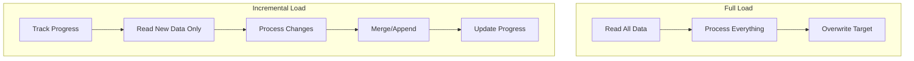
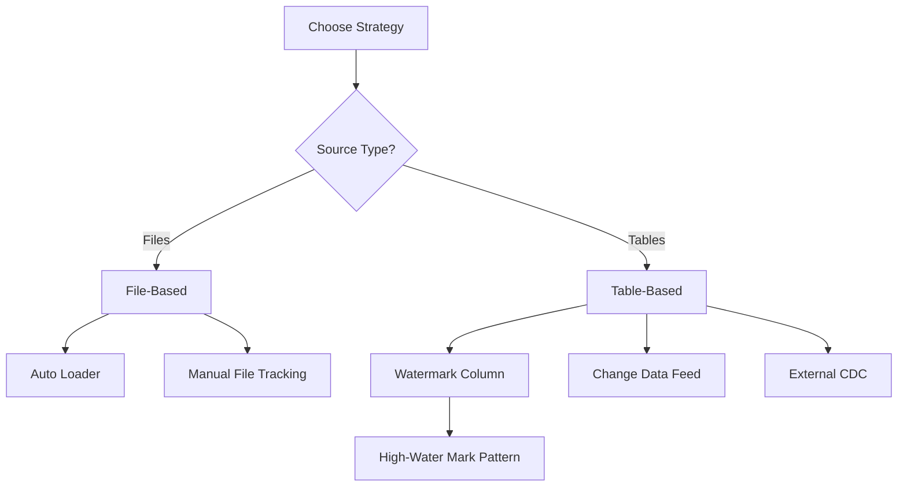
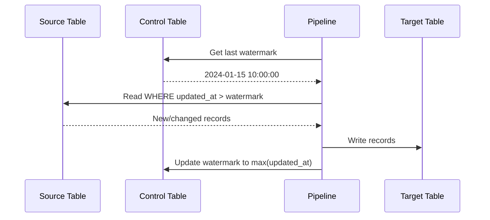

# Incremental Processing

Incremental processing is essential for efficient data pipelines. Understanding when and how to process only new or changed data can significantly impact performance and cost.

## Overview



## Full Load vs Incremental Load

| Aspect | Full Load | Incremental Load |
|--------|-----------|------------------|
| Data processed | All data every time | Only new/changed data |
| Processing time | Grows with data size | Relatively constant |
| Cost | Higher | Lower |
| Complexity | Simple | More complex |
| Use case | Small datasets, initial loads | Large datasets, frequent updates |

### When to Use Each

| Scenario | Recommendation |
|----------|----------------|
| Initial data load | Full load |
| Small reference tables | Full load |
| Large fact tables | Incremental load |
| Frequent updates (hourly/daily) | Incremental load |
| Source supports change tracking | Incremental load |
| No reliable change indicator | Full load or CDC |

## Incremental Strategies



### Strategy Comparison

| Strategy | Best For | Pros | Cons |
|----------|----------|------|------|
| Auto Loader | File ingestion | Automatic tracking, scalable | Files only |
| High-Water Mark | Append-only tables | Simple, widely applicable | Misses updates/deletes |
| Change Data Feed | Delta tables | Captures all changes | Delta only |
| External CDC | Source systems | Complete change capture | Requires source setup |

## High-Water Mark Pattern

The most common pattern for incremental processing using a timestamp or sequence column.

### Concept



### Implementation

```python
# Get last processed watermark from control table
last_watermark = spark.sql("""
    SELECT MAX(watermark_value) as watermark
    FROM control.incremental_tracking
    WHERE table_name = 'orders'
""").collect()[0]["watermark"]

# Handle first run (no watermark)
if last_watermark is None:
    last_watermark = "1900-01-01"

# Read only new records
new_records = spark.sql(f"""
    SELECT *
    FROM source.orders
    WHERE updated_at > '{last_watermark}'
""")

# Process and write
new_records.write \
    .format("delta") \
    .mode("append") \
    .save("/path/to/target")

# Update watermark
new_max = new_records.agg(max("updated_at")).collect()[0][0]
if new_max:
    spark.sql(f"""
        INSERT INTO control.incremental_tracking
        VALUES ('orders', '{new_max}', current_timestamp())
    """)
```

### Control Table Schema

```sql
CREATE TABLE control.incremental_tracking (
    table_name STRING,
    watermark_value TIMESTAMP,
    last_updated TIMESTAMP
) USING DELTA;
```

### SQL-Based Implementation

```sql
-- Create or replace view with incremental logic
CREATE OR REPLACE VIEW incremental_orders AS
WITH watermark AS (
    SELECT COALESCE(MAX(watermark_value), '1900-01-01') as wm
    FROM control.incremental_tracking
    WHERE table_name = 'orders'
)
SELECT o.*
FROM source.orders o
CROSS JOIN watermark w
WHERE o.updated_at > w.wm;
```

## Checkpoint Management

Checkpoints track streaming progress for exactly-once processing.

### Checkpoint Location

```python
query = df.writeStream \
    .option("checkpointLocation", "/path/to/checkpoint") \
    .start()
```

### Checkpoint Structure

| Directory | Purpose |
|-----------|---------|
| `commits/` | Completed micro-batches |
| `offsets/` | Source positions (Kafka offsets, file paths) |
| `sources/` | Source-specific metadata |
| `state/` | Stateful operation data |

### Checkpoint Recovery

When a streaming query restarts:

1. Reads checkpoint to find last committed batch
2. Resumes from that position
3. Reprocesses any incomplete batch (exactly-once)

```python
# Streaming query automatically recovers from checkpoint
query = df.writeStream \
    .option("checkpointLocation", "/path/to/checkpoint") \
    .start()

# After failure, restart the same query
# It will resume from last checkpoint
```

### When to Reset Checkpoints

| Scenario | Action |
|----------|--------|
| Schema change in source | May need reset |
| Logic change in transformations | Usually safe to keep |
| New streaming query | New checkpoint location |
| Change output location | New checkpoint location |
| Reprocess all data | Delete checkpoint directory |

```python
# To reprocess from beginning, delete checkpoint
dbutils.fs.rm("/path/to/checkpoint", recurse=True)
```

## Delta Lake as Incremental Source

### Streaming from Delta

```python
# Basic streaming read
df = spark.readStream \
    .format("delta") \
    .load("/path/to/delta/table")

# Start from specific version
df = spark.readStream \
    .format("delta") \
    .option("startingVersion", 10) \
    .load("/path/to/delta/table")

# Start from timestamp
df = spark.readStream \
    .format("delta") \
    .option("startingTimestamp", "2024-01-01") \
    .load("/path/to/delta/table")
```

### Handling Updates and Deletes

By default, streaming from Delta fails if source has updates or deletes.

```python
# Skip deletes
df = spark.readStream \
    .format("delta") \
    .option("ignoreDeletes", "true") \
    .load("/path/to/table")

# Skip updates and deletes
df = spark.readStream \
    .format("delta") \
    .option("ignoreChanges", "true") \
    .load("/path/to/table")
```

| Option | Behavior |
|--------|----------|
| Default | Fails on updates/deletes |
| `ignoreDeletes` | Skips delete operations |
| `ignoreChanges` | Skips update and delete operations |

### Rate Limiting

```python
# Limit files per trigger
df = spark.readStream \
    .format("delta") \
    .option("maxFilesPerTrigger", 100) \
    .load("/path/to/table")

# Limit bytes per trigger
df = spark.readStream \
    .format("delta") \
    .option("maxBytesPerTrigger", "10g") \
    .load("/path/to/table")
```

## MERGE for Incremental Updates

MERGE combines insert, update, and delete in one operation.

### Incremental MERGE Pattern

```python
from delta.tables import DeltaTable

# Read incremental changes
changes = spark.sql(f"""
    SELECT *
    FROM source_table
    WHERE updated_at > '{last_watermark}'
""")

# MERGE into target
target = DeltaTable.forPath(spark, "/path/to/target")

target.alias("t").merge(
    changes.alias("s"),
    "t.id = s.id"
).whenMatchedUpdateAll(
).whenNotMatchedInsertAll(
).execute()
```

### MERGE with Delete Handling

```python
target.alias("t").merge(
    changes.alias("s"),
    "t.id = s.id"
).whenMatchedDelete(
    condition="s.is_deleted = true"
).whenMatchedUpdateAll(
    condition="s.is_deleted = false"
).whenNotMatchedInsertAll(
    condition="s.is_deleted = false"
).execute()
```

## Batch Incremental Patterns

### Pattern 1: Timestamp-Based

```python
def process_incremental(table_name, source_query, target_path):
    # Get watermark
    watermark = get_watermark(table_name)

    # Read incremental data
    df = spark.sql(source_query.format(watermark=watermark))

    if df.count() > 0:
        # Write to target
        df.write.format("delta").mode("append").save(target_path)

        # Update watermark
        new_watermark = df.agg(max("updated_at")).collect()[0][0]
        update_watermark(table_name, new_watermark)
```

### Pattern 2: Version-Based

```python
# Track processed Delta version
last_version = get_last_processed_version("orders")

# Get current version
current_version = DeltaTable.forPath(spark, source_path).history(1) \
    .select("version").collect()[0][0]

# Read changes between versions
changes = spark.read.format("delta") \
    .option("versionAsOf", current_version) \
    .load(source_path)

# Filter to only new versions (time travel comparison)
# ... process changes ...

# Update tracked version
update_processed_version("orders", current_version)
```

## availableNow Trigger

The `availableNow` trigger processes all available data in multiple batches, then stops.

### Use Case

Ideal for scheduled incremental jobs that need streaming semantics (checkpoints, exactly-once) but run as batch jobs.

```python
# Process all available data, then stop
query = df.writeStream \
    .format("delta") \
    .trigger(availableNow=True) \
    .option("checkpointLocation", "/checkpoint") \
    .start("/output")

# Wait for completion
query.awaitTermination()
```

### Comparison with once=True

| Aspect | once=True (Deprecated) | availableNow=True |
|--------|------------------------|-------------------|
| Batches | Single batch | Multiple batches |
| Rate limiting | Ignored | Respected |
| Large backlogs | May OOM | Handles gracefully |
| Status | Deprecated | Recommended |

### Scheduled Pipeline Example

```python
# Run daily via Databricks Workflows
def daily_incremental_job():
    # Read stream from source
    source = spark.readStream \
        .format("delta") \
        .option("maxFilesPerTrigger", 1000) \
        .load("/source/path")

    # Transform
    transformed = source.transform(apply_transformations)

    # Write with availableNow
    query = transformed.writeStream \
        .format("delta") \
        .trigger(availableNow=True) \
        .option("checkpointLocation", "/checkpoint") \
        .start("/target/path")

    query.awaitTermination()
```

## Idempotent Incremental Processing

Ensure same input produces same output, even on rerun.

### MERGE for Idempotency

```python
def idempotent_incremental(batch_df, batch_id):
    # MERGE handles duplicates naturally
    target = DeltaTable.forPath(spark, "/target")

    target.alias("t").merge(
        batch_df.alias("s"),
        "t.id = s.id"
    ).whenMatchedUpdateAll(
    ).whenNotMatchedInsertAll(
    ).execute()

# Use with foreachBatch
query = source_stream.writeStream \
    .foreachBatch(idempotent_incremental) \
    .option("checkpointLocation", "/checkpoint") \
    .start()
```

### Deduplication Before Write

```python
def process_with_dedup(batch_df, batch_id):
    # Deduplicate within batch
    deduped = batch_df.dropDuplicates(["id"])

    # Then MERGE
    # ...
```

## Monitoring Incremental Jobs

### Track Processing Metrics

```python
# Create metrics table
spark.sql("""
    CREATE TABLE IF NOT EXISTS monitoring.incremental_metrics (
        job_name STRING,
        run_time TIMESTAMP,
        records_processed LONG,
        processing_duration_seconds DOUBLE,
        watermark_before STRING,
        watermark_after STRING
    ) USING DELTA
""")

# Log metrics after each run
def log_metrics(job_name, count, duration, wm_before, wm_after):
    spark.sql(f"""
        INSERT INTO monitoring.incremental_metrics
        VALUES ('{job_name}', current_timestamp(), {count},
                {duration}, '{wm_before}', '{wm_after}')
    """)
```

### Alerting on Lag

```python
# Check for processing lag
lag_check = spark.sql("""
    SELECT
        table_name,
        watermark_value,
        current_timestamp() - watermark_value as lag
    FROM control.incremental_tracking
    WHERE current_timestamp() - watermark_value > INTERVAL 2 HOURS
""")

if lag_check.count() > 0:
    # Send alert
    pass
```

## Exam Tips

1. **High-water mark** requires a reliable timestamp/sequence column in source
2. **Checkpoints** enable exactly-once semantics in streaming
3. **availableNow** is the recommended replacement for `once=True`
4. **ignoreChanges** skips updates and deletes when streaming from Delta
5. **MERGE** is inherently idempotent - same input = same output
6. **startingVersion/startingTimestamp** control where streaming starts
7. **Rate limiting** (maxFilesPerTrigger) prevents OOM on large backlogs

## Best Practices

- Use `availableNow` for scheduled batch-style streaming jobs
- Store watermarks in a control table with audit columns
- Always use checkpoints for streaming queries
- Deduplicate before MERGE to handle source duplicates
- Monitor lag between watermark and current time
- Use `ignoreChanges` when updates don't need downstream propagation
- Test incremental logic with edge cases (empty batches, duplicates)

## Related Topics

- [Structured Streaming](03-structured-streaming.md) - Streaming fundamentals
- [Auto Loader](04-auto-loader.md) - File-based incremental
- [Change Data Capture](05-change-data-capture.md) - CDF for incremental
- [Delta Lake Operations](06-delta-lake-operations.md) - MERGE patterns

## Official Documentation

- [Delta Lake Streaming](https://docs.databricks.com/delta/delta-streaming.html)
- [Structured Streaming](https://docs.databricks.com/structured-streaming/index.html)
- [availableNow Trigger](https://docs.databricks.com/structured-streaming/triggers.html)
