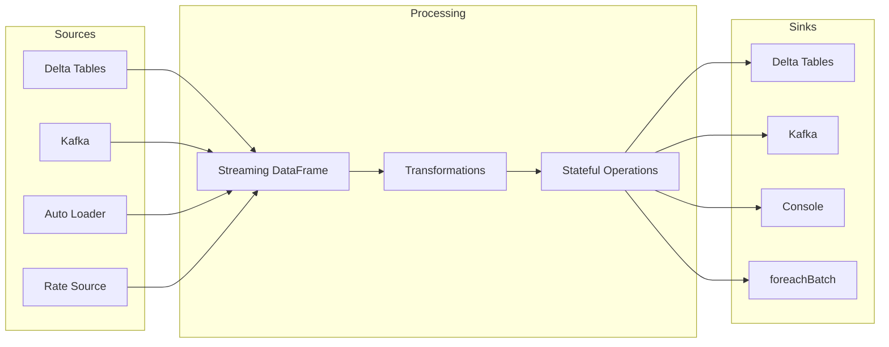
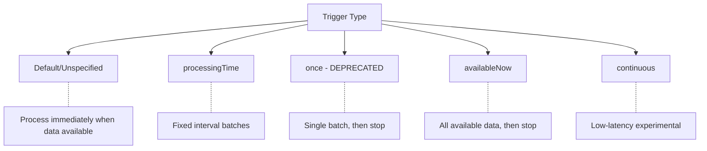
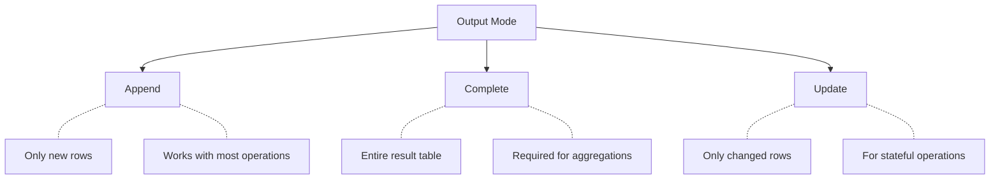
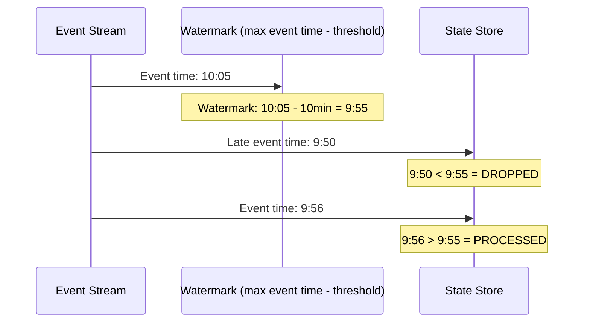
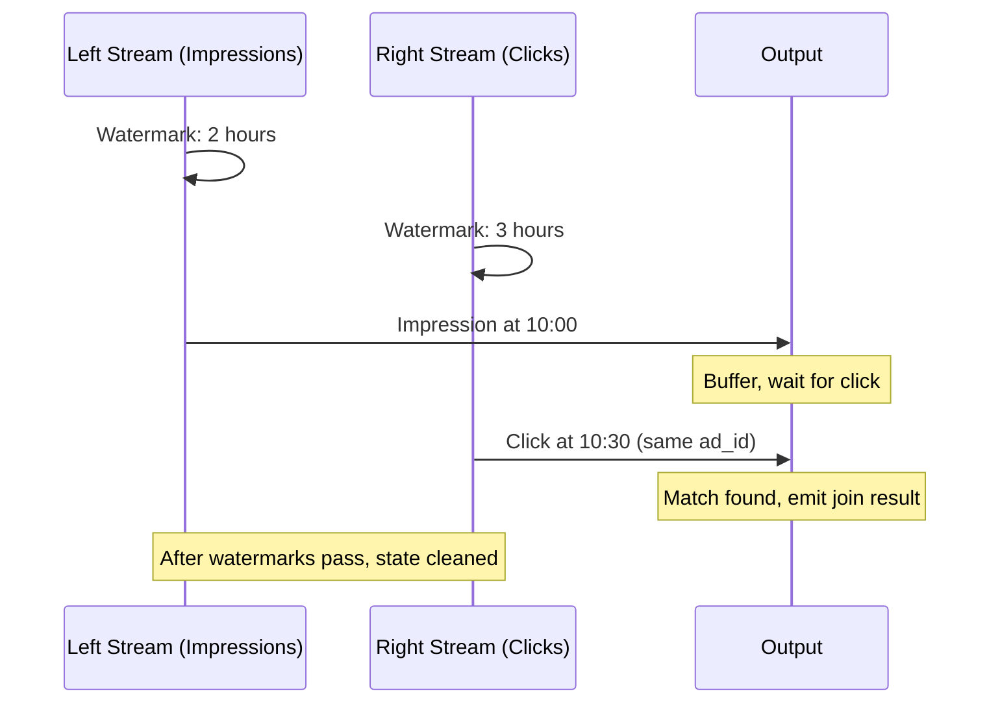

# Structured Streaming

Structured Streaming is heavily tested on the exam. Focus on triggers, output modes, watermarking, and the differences between streaming patterns.

## Overview



## Streaming Fundamentals

### Micro-Batch vs Continuous

| Aspect | Micro-Batch | Continuous |
|--------|-------------|------------|
| Latency | ~100ms minimum | ~1ms |
| Processing | Batch-at-a-time | Record-at-a-time |
| Guarantees | Exactly-once | At-least-once |
| Status | Production ready | Experimental |

Databricks uses **micro-batch processing** by default, providing exactly-once semantics.

### Basic Streaming Query

```python
# Read stream from Delta
stream_df = spark.readStream \
    .format("delta") \
    .load("/path/to/source")

# Apply transformations
transformed = stream_df \
    .filter(col("status") == "active") \
    .select("id", "name", "amount")

# Write stream to Delta
query = transformed.writeStream \
    .format("delta") \
    .outputMode("append") \
    .option("checkpointLocation", "/path/to/checkpoint") \
    .start("/path/to/target")
```

## Streaming Sources

### Delta Table Source

```python
# Basic Delta stream
df = spark.readStream.format("delta").load("/path/to/table")
df = spark.readStream.table("catalog.schema.table_name")

# Start from specific version
df = spark.readStream \
    .format("delta") \
    .option("startingVersion", 10) \
    .load("/path/to/table")

# Start from timestamp
df = spark.readStream \
    .format("delta") \
    .option("startingTimestamp", "2024-01-01") \
    .load("/path/to/table")

# Handle schema changes
df = spark.readStream \
    .format("delta") \
    .option("ignoreChanges", "true") \  # Skip updates/deletes
    .load("/path/to/table")
```

| Option | Behavior |
|--------|----------|
| `startingVersion` | Start reading from specific version |
| `startingTimestamp` | Start reading from specific timestamp |
| `ignoreDeletes` | Skip delete operations |
| `ignoreChanges` | Skip update and delete operations |
| `maxFilesPerTrigger` | Limit files processed per batch |
| `maxBytesPerTrigger` | Limit bytes processed per batch |

### Kafka Source

```python
df = spark.readStream \
    .format("kafka") \
    .option("kafka.bootstrap.servers", "broker1:9092,broker2:9092") \
    .option("subscribe", "topic1,topic2") \
    .option("startingOffsets", "latest") \
    .load()

# Kafka schema: key, value, topic, partition, offset, timestamp
# Value is binary - parse as needed
parsed = df.select(
    col("key").cast("string"),
    from_json(col("value").cast("string"), schema).alias("data")
).select("key", "data.*")
```

| Option | Values |
|--------|--------|
| `startingOffsets` | `earliest`, `latest`, or JSON offsets |
| `subscribe` | Topic names (comma-separated) |
| `subscribePattern` | Regex pattern for topics |

### Auto Loader (cloudFiles)

```python
df = spark.readStream \
    .format("cloudFiles") \
    .option("cloudFiles.format", "json") \
    .option("cloudFiles.schemaLocation", "/path/to/schema") \
    .load("/path/to/files")
```

See [Auto Loader](04-auto-loader.md) for detailed coverage.

### Rate Source (Testing)

```python
# Generate test data
df = spark.readStream \
    .format("rate") \
    .option("rowsPerSecond", 100) \
    .load()
# Schema: timestamp, value (Long)
```

## Streaming Sinks

### Delta Sink

```python
query = df.writeStream \
    .format("delta") \
    .outputMode("append") \
    .option("checkpointLocation", "/path/to/checkpoint") \
    .start("/path/to/table")

# Write to table
query = df.writeStream \
    .format("delta") \
    .outputMode("append") \
    .option("checkpointLocation", "/path/to/checkpoint") \
    .toTable("catalog.schema.table_name")
```

### Kafka Sink

```python
query = df.selectExpr("CAST(id AS STRING) AS key", "to_json(struct(*)) AS value") \
    .writeStream \
    .format("kafka") \
    .option("kafka.bootstrap.servers", "broker:9092") \
    .option("topic", "output_topic") \
    .option("checkpointLocation", "/path/to/checkpoint") \
    .start()
```

### Console Sink (Debugging)

```python
query = df.writeStream \
    .format("console") \
    .outputMode("append") \
    .option("truncate", False) \
    .start()
```

### foreachBatch Sink

```python
def process_batch(batch_df, batch_id):
    # Custom processing for each micro-batch
    batch_df.write \
        .format("delta") \
        .mode("append") \
        .save("/path/to/table")

query = df.writeStream \
    .foreachBatch(process_batch) \
    .option("checkpointLocation", "/path/to/checkpoint") \
    .start()
```

## Trigger Types (Exam Critical)



### Trigger Comparison

| Trigger | Behavior | Use Case |
|---------|----------|----------|
| Default | Process ASAP when data arrives | Low-latency streaming |
| `processingTime("10 seconds")` | Fixed interval micro-batches | Controlled throughput |
| `once=True` | **Deprecated** - Single batch | Legacy batch-streaming |
| `availableNow=True` | Process all available, multiple batches | Scheduled batch jobs |
| `continuous` | Low-latency (~1ms), experimental | Not for production |

### once vs availableNow (Exam Important)

```python
# DEPRECATED: once=True - processes ONE batch only
query = df.writeStream \
    .trigger(once=True) \
    .start()

# RECOMMENDED: availableNow=True - processes ALL available data
query = df.writeStream \
    .trigger(availableNow=True) \
    .start()
```

| Aspect | once=True | availableNow=True |
|--------|-----------|-------------------|
| Batches | Single batch only | Multiple batches (rate limited) |
| Data processed | May miss data | All available data |
| Backlog handling | Poor | Excellent |
| Status | Deprecated | Recommended |

### Trigger Syntax

```python
from pyspark.sql.streaming import Trigger

# Processing time trigger
query = df.writeStream \
    .trigger(processingTime="10 seconds") \
    .start()

# Available now trigger (batch-style streaming)
query = df.writeStream \
    .trigger(availableNow=True) \
    .start()

# Continuous trigger (experimental)
query = df.writeStream \
    .trigger(continuous="1 second") \
    .start()
```

## Output Modes (Exam Critical)



| Mode | Output | Use Case | Restrictions |
|------|--------|----------|--------------|
| `append` | New rows only | Inserts, filters, maps | No aggregations |
| `complete` | All rows in result | Aggregations | Must have aggregation |
| `update` | Changed rows only | Stateful updates | Not all sinks support |

### Mode Compatibility

| Operation | append | complete | update |
|-----------|--------|----------|--------|
| select, filter | Yes | No | Yes |
| Aggregation without watermark | No | Yes | Yes |
| Aggregation with watermark | Yes (after watermark) | Yes | Yes |
| mapGroupsWithState | Depends | No | Yes |
| flatMapGroupsWithState | Depends | No | Yes |

## Watermarking

Watermarks handle late-arriving data and enable state cleanup in streaming aggregations.

### Watermark Concept



### Watermark Syntax

```python
from pyspark.sql.functions import window

# Define watermark
df_with_watermark = df \
    .withWatermark("event_time", "10 minutes")

# Windowed aggregation with watermark
result = df_with_watermark \
    .groupBy(
        window("event_time", "5 minutes"),
        "device_id"
    ) \
    .agg(avg("temperature").alias("avg_temp"))
```

### Watermark Behavior

| Scenario | Behavior |
|----------|----------|
| Event time > watermark | Processed normally |
| Event time <= watermark | Dropped (late data) |
| Watermark advances | State for old windows cleaned up |

**Key Point**: Watermark = max(event_time) - threshold

### Choosing Watermark Delay

```python
# Short delay: Less memory, drops more late data
df.withWatermark("event_time", "1 minute")

# Long delay: More memory, accepts more late data
df.withWatermark("event_time", "1 hour")
```

| Delay | Memory Usage | Late Data Tolerance |
|-------|--------------|---------------------|
| Short (minutes) | Low | Low |
| Long (hours) | High | High |

## Windowed Aggregations

### Tumbling Windows

Non-overlapping, fixed-size windows.

```python
from pyspark.sql.functions import window

# 5-minute tumbling windows
df.withWatermark("event_time", "10 minutes") \
    .groupBy(
        window("event_time", "5 minutes"),
        "device_id"
    ) \
    .agg(count("*").alias("event_count"))
```



```mermaid
gantt
    title Tumbling Windows (5 min)
    dateFormat HH:mm
    axisFormat %H:%M
    section Windows
    Window 1 :w1, 00:00, 5m
    Window 2 :w2, 00:05, 5m
    Window 3 :w3, 00:10, 5m
```

### Sliding Windows

Overlapping windows with a slide interval.

```python
# 10-minute windows, sliding every 5 minutes
df.withWatermark("event_time", "10 minutes") \
    .groupBy(
        window("event_time", "10 minutes", "5 minutes"),
        "device_id"
    ) \
    .agg(avg("value").alias("avg_value"))
```



```mermaid
gantt
    title Sliding Windows (10 min window, 5 min slide)
    dateFormat HH:mm
    axisFormat %H:%M
    section Windows
    Window 1 :w1, 00:00, 10m
    Window 2 :w2, 00:05, 10m
    Window 3 :w3, 00:10, 10m
```

### Session Windows

Dynamic windows based on activity gaps.

```python
from pyspark.sql.functions import session_window

# Session windows with 5-minute gap
df.withWatermark("event_time", "10 minutes") \
    .groupBy(
        session_window("event_time", "5 minutes"),
        "user_id"
    ) \
    .agg(count("*").alias("events_in_session"))
```

| Window Type | Size | Overlap | Use Case |
|-------------|------|---------|----------|
| Tumbling | Fixed | No | Periodic aggregations |
| Sliding | Fixed | Yes | Moving averages |
| Session | Dynamic | No | User sessions |

## Stream-Stream Joins

### Inner Join with Watermarks

```python
# Both streams need watermarks
impressions = impressions_df \
    .withWatermark("impression_time", "2 hours")

clicks = clicks_df \
    .withWatermark("click_time", "3 hours")

# Join with time range condition
joined = impressions.join(
    clicks,
    (impressions.ad_id == clicks.ad_id) &
    (clicks.click_time >= impressions.impression_time) &
    (clicks.click_time <= impressions.impression_time + expr("INTERVAL 1 HOUR"))
)
```



### Stream-Stream Join Requirements

| Join Type | Watermark Required | State |
|-----------|-------------------|-------|
| Inner | Both sides | Buffered until watermark |
| Left Outer | Right side required | Left buffered |
| Right Outer | Left side required | Right buffered |
| Full Outer | Both sides | Both buffered |

## Stream-Static Joins

Join a streaming DataFrame with a static (batch) DataFrame.

```python
# Static dimension table
dim_products = spark.table("catalog.schema.dim_products")

# Stream of events
events_stream = spark.readStream.format("delta").load("/events")

# Join stream with static
enriched = events_stream.join(
    dim_products,
    events_stream.product_id == dim_products.id,
    "left"
)
```

**Important**: The static DataFrame is read once at query start. Changes to the static table won't be reflected until the streaming query is restarted.

## Stateful Operations

### mapGroupsWithState

Custom stateful processing with exactly-once semantics.

```python
from pyspark.sql.streaming import GroupState, GroupStateTimeout

def update_session(key, events, state: GroupState):
    # Custom state management logic
    if state.exists:
        current_count = state.get
    else:
        current_count = 0

    new_count = current_count + len(list(events))
    state.update(new_count)

    return (key, new_count)

result = df \
    .groupByKey(lambda x: x.user_id) \
    .mapGroupsWithState(
        update_session,
        outputMode="update",
        timeoutConf=GroupStateTimeout.ProcessingTimeTimeout
    )
```

### flatMapGroupsWithState

Similar to mapGroupsWithState but can emit multiple output records.

```python
def emit_alerts(key, events, state: GroupState):
    alerts = []
    # Process events and potentially emit multiple alerts
    for event in events:
        if event.value > threshold:
            alerts.append(Alert(key, event.value, event.timestamp))
    return iter(alerts)
```

## Query Management

### Starting Queries

```python
# Start with path
query = df.writeStream \
    .format("delta") \
    .option("checkpointLocation", "/checkpoint") \
    .start("/output/path")

# Start with table
query = df.writeStream \
    .format("delta") \
    .option("checkpointLocation", "/checkpoint") \
    .toTable("catalog.schema.table")

# Named query
query = df.writeStream \
    .queryName("my_streaming_query") \
    .format("delta") \
    .start("/output/path")
```

### Monitoring Queries

```python
# Get active queries
spark.streams.active

# Query status
query.status

# Last progress
query.lastProgress

# Recent progress
query.recentProgress

# Check if running
query.isActive

# Exception (if failed)
query.exception()
```

### Stopping Queries

```python
# Wait for termination
query.awaitTermination()

# Wait with timeout
query.awaitTermination(timeout=3600)  # 1 hour

# Stop query
query.stop()

# Stop all queries
for q in spark.streams.active:
    q.stop()
```

## Checkpoints

Checkpoints store query progress for fault tolerance.

```python
query = df.writeStream \
    .option("checkpointLocation", "/path/to/checkpoint") \
    .start()
```

### Checkpoint Contents

| Directory | Contents |
|-----------|----------|
| `commits/` | Completed batch info |
| `offsets/` | Source offsets for each batch |
| `sources/` | Source-specific state |
| `state/` | Aggregation state |
| `metadata` | Query metadata |

### Checkpoint Best Practices

- Use cloud storage (S3, ADLS, GCS) for durability
- One checkpoint location per query
- Don't share checkpoints between different queries
- Keep checkpoints in same region as data

## Exam Tips

1. **Triggers**: `availableNow=True` replaces deprecated `once=True` - processes all available data in multiple batches
2. **Output modes**: `append` for inserts, `complete` for aggregations, `update` for stateful
3. **Watermarks**: Required for streaming aggregations to enable state cleanup
4. **Stream-stream joins**: Both sides need watermarks for inner joins
5. **Checkpoints**: Required for exactly-once semantics and failure recovery
6. **ignoreChanges**: Use when source has updates/deletes you want to skip
7. **foreachBatch**: Enables batch operations (like MERGE) in streaming

## Best Practices

- Always specify checkpoint location for production queries
- Use watermarks with streaming aggregations
- Choose appropriate trigger based on latency needs
- Monitor query progress with `lastProgress`
- Use `availableNow` for scheduled batch-style streaming
- Test with rate source before connecting production sources

## Related Topics

- [Incremental Processing](02-incremental-processing.md) - Checkpoint management
- [Auto Loader](04-auto-loader.md) - File ingestion streaming
- [Data Deduplication](07-data-deduplication.md) - Streaming dedup

## Official Documentation

- [Structured Streaming Guide](https://docs.databricks.com/structured-streaming/index.html)
- [Streaming Triggers](https://docs.databricks.com/structured-streaming/triggers.html)
- [Watermarks](https://docs.databricks.com/structured-streaming/watermarks.html)
