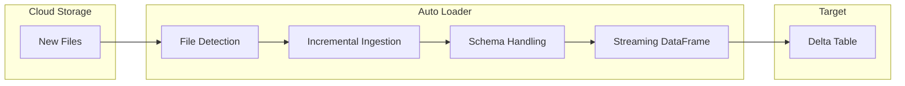
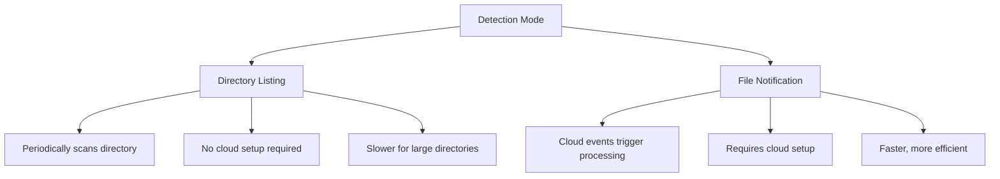
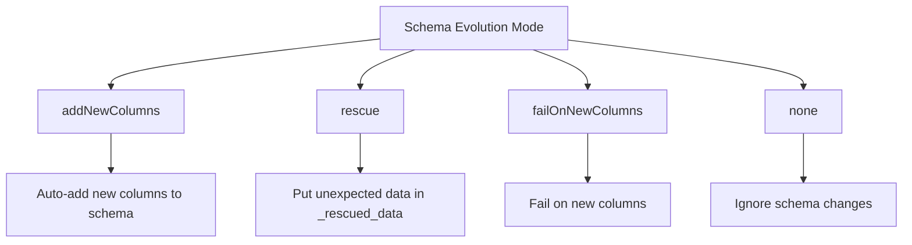

# Auto Loader

Auto Loader is Databricks' recommended solution for incrementally ingesting files from cloud storage. Understanding its modes and schema handling is critical for the exam.

## Overview



## Why Auto Loader?

| Challenge | Auto Loader Solution |
|-----------|---------------------|
| Tracking processed files | Automatic checkpointing |
| Handling new file arrivals | Event-driven or polling |
| Schema changes | Schema inference and evolution |
| Corrupt files | Rescue data column |
| Scale | Handles millions of files |

## Basic Usage

```python
# Basic Auto Loader read
df = spark.readStream \
    .format("cloudFiles") \
    .option("cloudFiles.format", "json") \
    .option("cloudFiles.schemaLocation", "/path/to/schema") \
    .load("/path/to/files")

# Write to Delta
query = df.writeStream \
    .format("delta") \
    .option("checkpointLocation", "/path/to/checkpoint") \
    .start("/path/to/target")
```

### Supported File Formats

| Format | cloudFiles.format |
|--------|-------------------|
| JSON | `json` |
| CSV | `csv` |
| Parquet | `parquet` |
| Avro | `avro` |
| ORC | `orc` |
| Text | `text` |
| Binary | `binaryFile` |

## Directory Listing vs File Notification



### Directory Listing Mode (Default)

```python
# Uses directory listing by default
df = spark.readStream \
    .format("cloudFiles") \
    .option("cloudFiles.format", "json") \
    .option("cloudFiles.useNotifications", "false") \  # Default
    .option("cloudFiles.schemaLocation", "/schema") \
    .load("/path/to/files")
```

| Aspect | Directory Listing |
|--------|-------------------|
| How it works | Periodically lists directory contents |
| Setup | No additional cloud setup |
| Scalability | Slower with millions of files |
| Cost | Directory listing API calls |
| Best for | Small to medium file volumes |

### File Notification Mode

```python
# Use file notification mode
df = spark.readStream \
    .format("cloudFiles") \
    .option("cloudFiles.format", "json") \
    .option("cloudFiles.useNotifications", "true") \
    .option("cloudFiles.schemaLocation", "/schema") \
    .load("/path/to/files")
```

| Aspect | File Notification |
|--------|-------------------|
| How it works | Cloud events (SNS/SQS, Event Grid, Pub/Sub) |
| Setup | Requires cloud infrastructure setup |
| Scalability | Highly scalable, constant time |
| Cost | Event notification costs |
| Best for | High-volume file ingestion |

### Cloud Provider Setup

| Cloud | Service | Setup |
|-------|---------|-------|
| AWS | S3 + SNS + SQS | Auto Loader creates queue |
| Azure | ADLS + Event Grid + Queue | Auto Loader creates resources |
| GCP | GCS + Pub/Sub | Auto Loader creates subscription |

### Mode Comparison

| Factor | Directory Listing | File Notification |
|--------|-------------------|-------------------|
| Setup complexity | None | Medium |
| Latency | Higher | Lower |
| Cost at scale | Higher (listing) | Lower |
| File volume | < 1M files | Unlimited |
| Incremental setup | Recommended start | Migrate when needed |

## Schema Inference

Auto Loader can automatically infer and track schema.

### Schema Location

```python
# Schema is stored and tracked at this location
df = spark.readStream \
    .format("cloudFiles") \
    .option("cloudFiles.format", "json") \
    .option("cloudFiles.schemaLocation", "/path/to/schema") \
    .load("/path/to/files")
```

The schema location stores:

- Inferred schema
- Schema evolution history
- Partition information

### Schema Inference Options

```python
df = spark.readStream \
    .format("cloudFiles") \
    .option("cloudFiles.format", "json") \
    .option("cloudFiles.schemaLocation", "/schema") \
    .option("cloudFiles.inferColumnTypes", "true") \  # Infer types (not just strings)
    .option("cloudFiles.schemaHints", "id INT, amount DOUBLE") \  # Override specific columns
    .load("/path/to/files")
```

| Option | Default | Description |
|--------|---------|-------------|
| `inferColumnTypes` | true | Infer actual types vs all strings |
| `schemaHints` | none | Override types for specific columns |

### Explicit Schema

```python
from pyspark.sql.types import StructType, StructField, StringType, IntegerType

# Define schema explicitly
schema = StructType([
    StructField("id", IntegerType(), True),
    StructField("name", StringType(), True),
    StructField("amount", DoubleType(), True)
])

df = spark.readStream \
    .format("cloudFiles") \
    .option("cloudFiles.format", "json") \
    .schema(schema) \
    .load("/path/to/files")
```

## Schema Evolution Modes (Exam Critical)



### Schema Evolution Options

```python
df = spark.readStream \
    .format("cloudFiles") \
    .option("cloudFiles.format", "json") \
    .option("cloudFiles.schemaLocation", "/schema") \
    .option("cloudFiles.schemaEvolutionMode", "addNewColumns") \
    .load("/path/to/files")
```

| Mode | Behavior | Use Case |
|------|----------|----------|
| `addNewColumns` | Add new columns automatically | Flexible schema sources |
| `rescue` | Store unexpected in `_rescued_data` | Data quality monitoring |
| `failOnNewColumns` | Fail stream on new columns | Strict schema enforcement |
| `none` | Ignore schema changes | Fixed schema, drop new columns |

### addNewColumns Mode

```python
# New columns are automatically added to the schema
df = spark.readStream \
    .format("cloudFiles") \
    .option("cloudFiles.format", "json") \
    .option("cloudFiles.schemaLocation", "/schema") \
    .option("cloudFiles.schemaEvolutionMode", "addNewColumns") \
    .load("/path/to/files")
```

When a new field appears:

1. Schema is updated at schemaLocation
2. Streaming query may need restart to pick up new schema
3. New column added to output

### Rescue Data Column

```python
# Enable rescue column for unexpected data
df = spark.readStream \
    .format("cloudFiles") \
    .option("cloudFiles.format", "json") \
    .option("cloudFiles.schemaLocation", "/schema") \
    .option("cloudFiles.schemaEvolutionMode", "rescue") \
    .load("/path/to/files")

# _rescued_data column contains JSON of unexpected fields
```

| Data Scenario | Rescued Column Contains |
|---------------|-------------------------|
| New field in record | `{"new_field": "value"}` |
| Type mismatch | `{"field": "wrong_type_value"}` |
| Nested schema change | Full unexpected nested structure |

### Combining Evolution and Rescue

```python
# Add new columns AND rescue corrupt data
df = spark.readStream \
    .format("cloudFiles") \
    .option("cloudFiles.format", "json") \
    .option("cloudFiles.schemaLocation", "/schema") \
    .option("cloudFiles.schemaEvolutionMode", "addNewColumns") \
    .option("rescuedDataColumn", "_rescued_data") \
    .load("/path/to/files")
```

## Key Configuration Options

### File Processing Options

```python
df = spark.readStream \
    .format("cloudFiles") \
    .option("cloudFiles.format", "json") \
    .option("cloudFiles.schemaLocation", "/schema") \
    # File selection
    .option("cloudFiles.includeExistingFiles", "true") \  # Process existing files
    .option("pathGlobFilter", "*.json") \  # Filter by pattern
    # Rate limiting
    .option("cloudFiles.maxFilesPerTrigger", 1000) \
    .option("cloudFiles.maxBytesPerTrigger", "10g") \
    .load("/path/to/files")
```

| Option | Default | Description |
|--------|---------|-------------|
| `includeExistingFiles` | true | Process files present at start |
| `pathGlobFilter` | none | Glob pattern to filter files |
| `maxFilesPerTrigger` | 1000 | Max files per micro-batch |
| `maxBytesPerTrigger` | none | Max bytes per micro-batch |

### Format-Specific Options

```python
# JSON options
df = spark.readStream \
    .format("cloudFiles") \
    .option("cloudFiles.format", "json") \
    .option("multiLine", "true") \
    .option("primitivesAsString", "false") \
    .load("/path/to/files")

# CSV options
df = spark.readStream \
    .format("cloudFiles") \
    .option("cloudFiles.format", "csv") \
    .option("header", "true") \
    .option("delimiter", ",") \
    .option("inferSchema", "true") \
    .load("/path/to/files")
```

## Handling Corrupt Records

### Bad Records Path

```python
df = spark.readStream \
    .format("cloudFiles") \
    .option("cloudFiles.format", "json") \
    .option("cloudFiles.schemaLocation", "/schema") \
    .option("badRecordsPath", "/path/to/bad_records") \
    .load("/path/to/files")
```

Bad records are written to the specified path with:

- Original file content
- Error message
- Timestamp

### Corrupt Record Column

```python
# Add column for unparseable records
df = spark.readStream \
    .format("cloudFiles") \
    .option("cloudFiles.format", "json") \
    .option("cloudFiles.schemaLocation", "/schema") \
    .option("columnNameOfCorruptRecord", "_corrupt_record") \
    .load("/path/to/files")
```

## Auto Loader with Unity Catalog

### Ingesting to Managed Tables

```python
# Read with Auto Loader
df = spark.readStream \
    .format("cloudFiles") \
    .option("cloudFiles.format", "json") \
    .option("cloudFiles.schemaLocation", "/schema") \
    .load("/path/to/source/files")

# Write to Unity Catalog managed table
query = df.writeStream \
    .format("delta") \
    .option("checkpointLocation", "/checkpoint") \
    .toTable("catalog.schema.table_name")
```

### Reading from Volumes

```python
# Read from Unity Catalog Volume
df = spark.readStream \
    .format("cloudFiles") \
    .option("cloudFiles.format", "parquet") \
    .option("cloudFiles.schemaLocation", "/Volumes/catalog/schema/volume/schema") \
    .load("/Volumes/catalog/schema/volume/data/")
```

## Common Patterns

### Bronze Layer Ingestion

```python
# Ingest raw data to Bronze layer
bronze_df = spark.readStream \
    .format("cloudFiles") \
    .option("cloudFiles.format", "json") \
    .option("cloudFiles.schemaLocation", "/bronze/schema/orders") \
    .option("cloudFiles.schemaEvolutionMode", "addNewColumns") \
    .option("rescuedDataColumn", "_rescued_data") \
    .load("/landing/orders/")

# Add metadata columns
bronze_with_metadata = bronze_df \
    .withColumn("_ingestion_timestamp", current_timestamp()) \
    .withColumn("_source_file", input_file_name())

# Write to Bronze Delta table
query = bronze_with_metadata.writeStream \
    .format("delta") \
    .option("checkpointLocation", "/checkpoints/bronze_orders") \
    .option("mergeSchema", "true") \
    .toTable("bronze.orders")
```

### Multi-Format Ingestion

```python
# Function to create Auto Loader stream for different formats
def create_ingestion_stream(format, source_path, schema_path):
    return spark.readStream \
        .format("cloudFiles") \
        .option("cloudFiles.format", format) \
        .option("cloudFiles.schemaLocation", schema_path) \
        .option("cloudFiles.schemaEvolutionMode", "addNewColumns") \
        .load(source_path)

# Create streams for different sources
json_stream = create_ingestion_stream("json", "/data/json/", "/schema/json/")
csv_stream = create_ingestion_stream("csv", "/data/csv/", "/schema/csv/")
parquet_stream = create_ingestion_stream("parquet", "/data/parquet/", "/schema/parquet/")
```

### Scheduled Batch with availableNow

```python
# Run as scheduled job
df = spark.readStream \
    .format("cloudFiles") \
    .option("cloudFiles.format", "json") \
    .option("cloudFiles.schemaLocation", "/schema") \
    .option("cloudFiles.maxFilesPerTrigger", 10000) \
    .load("/source/path")

query = df.writeStream \
    .format("delta") \
    .trigger(availableNow=True) \
    .option("checkpointLocation", "/checkpoint") \
    .start("/target/path")

query.awaitTermination()
```

## Performance Tuning

### Parallelism

```python
# Increase parallelism for large files
df = spark.readStream \
    .format("cloudFiles") \
    .option("cloudFiles.format", "json") \
    .option("cloudFiles.schemaLocation", "/schema") \
    .option("maxFilesPerTrigger", 10000) \
    .option("spark.sql.files.maxPartitionBytes", "128mb") \
    .load("/path/to/files")
```

### Memory Optimization

```python
# For very large schemas or many files
spark.conf.set("spark.databricks.cloudFiles.schemaInference.sampleSize.numFiles", 100)
spark.conf.set("spark.databricks.cloudFiles.schemaInference.sampleSize.numBytes", "10mb")
```

### Backlog Processing

```python
# For processing large backlogs efficiently
df = spark.readStream \
    .format("cloudFiles") \
    .option("cloudFiles.format", "parquet") \
    .option("cloudFiles.schemaLocation", "/schema") \
    .option("maxFilesPerTrigger", 10000) \
    .option("maxBytesPerTrigger", "100g") \
    .load("/path/to/files")

# Use availableNow to process all then stop
query = df.writeStream \
    .trigger(availableNow=True) \
    .option("checkpointLocation", "/checkpoint") \
    .start("/target")
```

## SQL Interface

```sql
-- Create streaming table with Auto Loader
CREATE OR REFRESH STREAMING TABLE bronze_orders
AS SELECT
    *,
    _metadata.file_path AS source_file,
    _metadata.file_modification_time AS file_mod_time
FROM STREAM read_files(
    '/landing/orders/',
    format => 'json',
    schemaLocation => '/schema/orders'
);
```

## Troubleshooting

### Common Issues

| Issue | Cause | Solution |
|-------|-------|----------|
| Schema mismatch | Source schema changed | Check schemaLocation, restart query |
| Missing files | Files processed already | Check checkpoint, use includeExistingFiles |
| Slow processing | Too many small files | Increase maxFilesPerTrigger |
| OOM errors | Large files or schema | Reduce maxBytesPerTrigger |

### Debugging

```python
# Check Auto Loader metrics
query = df.writeStream \
    .format("delta") \
    .option("checkpointLocation", "/checkpoint") \
    .start("/target")

# View progress
print(query.lastProgress)
print(query.status)
```

## Exam Tips

1. **Directory listing vs file notification** - Know when to use each
2. **Schema evolution modes** - `addNewColumns`, `rescue`, `failOnNewColumns`, `none`
3. **schemaLocation** is required for schema inference
4. **_rescued_data** column stores unexpected fields and type mismatches
5. **includeExistingFiles** controls whether existing files are processed
6. **maxFilesPerTrigger** controls processing rate
7. Auto Loader automatically handles **exactly-once** processing with checkpoints

## Best Practices

- Start with directory listing, switch to file notification at scale
- Always set schemaLocation for schema tracking
- Use `addNewColumns` for flexible sources, `rescue` for data quality monitoring
- Add `_source_file` and `_ingestion_timestamp` metadata columns
- Use `availableNow` for scheduled batch-style processing
- Set appropriate rate limits to prevent OOM
- Store schema and checkpoint in cloud storage for durability

## Related Topics

- [Structured Streaming](03-structured-streaming.md) - Streaming fundamentals
- [Incremental Processing](02-incremental-processing.md) - Incremental patterns
- [Change Data Capture](05-change-data-capture.md) - CDC from files

## Official Documentation

- [Auto Loader](https://docs.databricks.com/ingestion/auto-loader/index.html)
- [Auto Loader Options](https://docs.databricks.com/ingestion/auto-loader/options.html)
- [Schema Evolution](https://docs.databricks.com/ingestion/auto-loader/schema.html)
