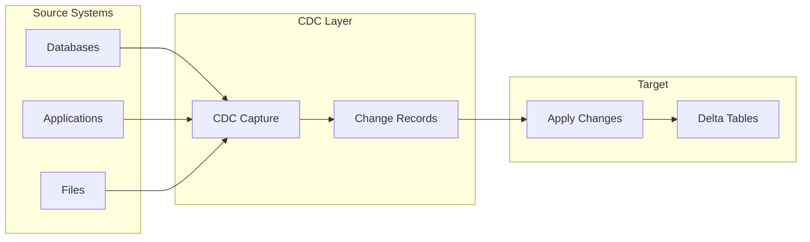
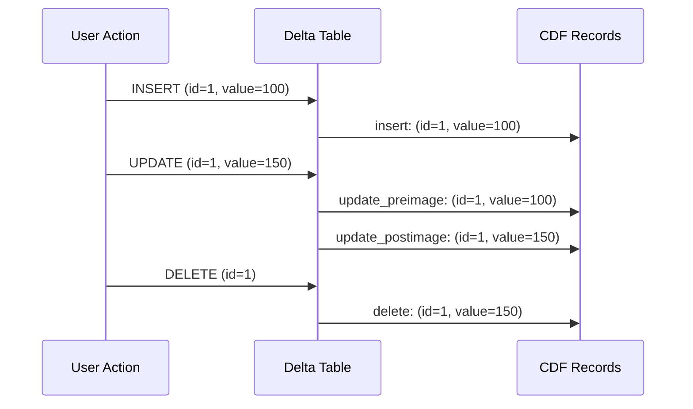
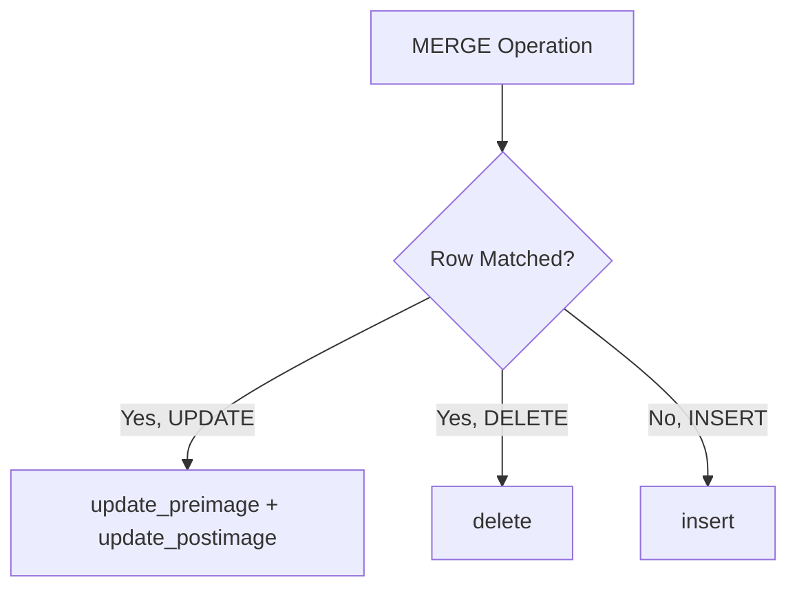
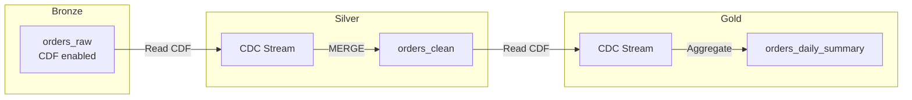
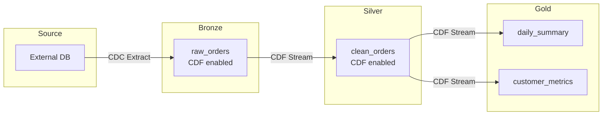

# Change Data Capture (CDC)

Change Data Capture tracks data changes (inserts, updates, deletes) for downstream propagation. Understanding Delta CDF and the APPLY CHANGES API is essential for the exam.

## Overview



## CDC Fundamentals

### What is CDC?

CDC captures row-level changes (INSERT, UPDATE, DELETE) instead of full data snapshots.

| Approach | Data Captured | Volume | Use Case |
|----------|---------------|--------|----------|
| Full Load | All rows | High | Initial loads, small tables |
| CDC | Changed rows only | Low | Incremental updates |

### CDC Operation Types

| Operation | Description | CDF _change_type |
|-----------|-------------|------------------|
| INSERT | New row added | `insert` |
| UPDATE | Existing row modified | `update_preimage`, `update_postimage` |
| DELETE | Row removed | `delete` |

## Delta Change Data Feed (CDF)

CDF is Delta Lake's built-in CDC capability that tracks changes made to a table.

### Enabling CDF

```sql
-- Enable on new table
CREATE TABLE orders (
    order_id INT,
    customer_id INT,
    amount DOUBLE,
    status STRING
) USING DELTA
TBLPROPERTIES ('delta.enableChangeDataFeed' = 'true');

-- Enable on existing table
ALTER TABLE orders
SET TBLPROPERTIES ('delta.enableChangeDataFeed' = 'true');
```

```python
# Enable via Python
spark.sql("""
    ALTER TABLE orders
    SET TBLPROPERTIES ('delta.enableChangeDataFeed' = 'true')
""")
```

### CDF Metadata Columns

When reading change data, these columns are added:

| Column | Type | Description |
|--------|------|-------------|
| `_change_type` | STRING | `insert`, `update_preimage`, `update_postimage`, `delete` |
| `_commit_version` | LONG | Delta version of the change |
| `_commit_timestamp` | TIMESTAMP | When the change was committed |

### Reading Change Data - SQL

```sql
-- Read changes between versions
SELECT * FROM table_changes('catalog.schema.orders', 1, 10);

-- Read changes between timestamps
SELECT * FROM table_changes('catalog.schema.orders', '2024-01-01', '2024-01-31');

-- Read changes from specific version to latest
SELECT * FROM table_changes('catalog.schema.orders', 5);
```

### Reading Change Data - Python (Batch)

```python
# Read changes by version range
changes_df = spark.read.format("delta") \
    .option("readChangeFeed", "true") \
    .option("startingVersion", 1) \
    .option("endingVersion", 10) \
    .table("catalog.schema.orders")

# Read changes by timestamp range
changes_df = spark.read.format("delta") \
    .option("readChangeFeed", "true") \
    .option("startingTimestamp", "2024-01-01") \
    .option("endingTimestamp", "2024-01-31") \
    .table("catalog.schema.orders")
```

### Reading Change Data - Python (Streaming)

```python
# Stream changes
changes_stream = spark.readStream.format("delta") \
    .option("readChangeFeed", "true") \
    .option("startingVersion", 1) \
    .table("catalog.schema.orders")

# Process the stream
query = changes_stream.writeStream \
    .format("delta") \
    .option("checkpointLocation", "/checkpoint") \
    .start("/target/path")
```

### CDF Change Types



## Processing CDF Changes

### Filter by Change Type

```python
from pyspark.sql.functions import col

changes_df = spark.read.format("delta") \
    .option("readChangeFeed", "true") \
    .option("startingVersion", 1) \
    .table("orders")

# Get only inserts
inserts = changes_df.filter(col("_change_type") == "insert")

# Get only updates (postimage has new values)
updates = changes_df.filter(col("_change_type") == "update_postimage")

# Get only deletes
deletes = changes_df.filter(col("_change_type") == "delete")

# Get inserts and updates (latest values)
latest_changes = changes_df.filter(
    col("_change_type").isin("insert", "update_postimage")
)
```

### Propagate Changes to Downstream Table

```python
# Read changes from source
source_changes = spark.read.format("delta") \
    .option("readChangeFeed", "true") \
    .option("startingVersion", last_processed_version) \
    .table("bronze.orders")

# Filter to actionable changes
actionable = source_changes.filter(
    col("_change_type").isin("insert", "update_postimage", "delete")
)

# Apply to target with MERGE
from delta.tables import DeltaTable

target = DeltaTable.forName(spark, "silver.orders")

target.alias("t").merge(
    actionable.alias("s"),
    "t.order_id = s.order_id"
).whenMatchedDelete(
    condition="s._change_type = 'delete'"
).whenMatchedUpdateAll(
    condition="s._change_type = 'update_postimage'"
).whenNotMatchedInsertAll(
    condition="s._change_type = 'insert'"
).execute()
```

## MERGE and CDF

When you perform MERGE operations on a CDF-enabled table, the changes are automatically recorded.

### How MERGE Generates CDF Records



```sql
-- This MERGE on a CDF-enabled table
MERGE INTO orders AS t
USING updates AS s
ON t.order_id = s.order_id
WHEN MATCHED AND s.deleted = true THEN DELETE
WHEN MATCHED THEN UPDATE SET *
WHEN NOT MATCHED THEN INSERT *;

-- Generates CDF records:
-- For matched deletes: _change_type = 'delete'
-- For matched updates: _change_type = 'update_preimage' and 'update_postimage'
-- For not matched: _change_type = 'insert'
```

## APPLY CHANGES (Lakeflow/DLT)

APPLY CHANGES is the declarative CDC API in Lakeflow Declarative Pipelines (formerly DLT).

### Basic Syntax

```python
import dlt
from pyspark.sql.functions import col

@dlt.table
def orders_clean():
    return dlt.read_stream("orders_raw")

dlt.apply_changes(
    target="orders",
    source="orders_clean",
    keys=["order_id"],
    sequence_by=col("updated_at"),
    apply_as_deletes=expr("operation = 'DELETE'"),
    apply_as_truncates=expr("operation = 'TRUNCATE'"),
    except_column_list=["operation", "_rescued_data"]
)
```

### APPLY CHANGES Parameters

| Parameter | Required | Description |
|-----------|----------|-------------|
| `target` | Yes | Target table name |
| `source` | Yes | Source table/stream name |
| `keys` | Yes | Primary key columns |
| `sequence_by` | Yes | Column to determine order (timestamp/version) |
| `apply_as_deletes` | No | Condition identifying delete records |
| `apply_as_truncates` | No | Condition identifying truncate records |
| `except_column_list` | No | Columns to exclude from target |
| `stored_as_scd_type` | No | 1 (default) or 2 for SCD handling |

### SCD Type 1 (Default)

Overwrites with the latest value - no history.

```python
dlt.apply_changes(
    target="dim_customer",
    source="customer_changes",
    keys=["customer_id"],
    sequence_by=col("updated_at"),
    stored_as_scd_type=1  # Default
)
```

### SCD Type 2

Maintains full history with effective dates.

```python
dlt.apply_changes(
    target="dim_customer",
    source="customer_changes",
    keys=["customer_id"],
    sequence_by=col("updated_at"),
    stored_as_scd_type=2
)
```

SCD Type 2 adds these columns to the target:

- `__START_AT` - When the record became effective
- `__END_AT` - When the record was superseded (null if current)

```mermaid
gantt
    title SCD Type 2 Record History
    dateFormat YYYY-MM-DD
    section Customer 123
    Version 1 (Name: John) :v1, 2024-01-01, 2024-03-15
    Version 2 (Name: Johnny) :v2, 2024-03-15, 2024-06-01
    Version 3 (Name: John D.) :active, v3, 2024-06-01, 2024-12-31
```

### SQL Syntax (DLT)

```sql
-- Create streaming table
CREATE OR REFRESH STREAMING TABLE customers_staged
AS SELECT * FROM STREAM(LIVE.customers_raw);

-- Apply changes
APPLY CHANGES INTO LIVE.customers
FROM STREAM(LIVE.customers_staged)
KEYS (customer_id)
SEQUENCE BY updated_at
COLUMNS * EXCEPT (operation, _rescued_data)
STORED AS SCD TYPE 2;
```

## SCD Patterns with MERGE

### SCD Type 1 (Overwrite)

```sql
MERGE INTO dim_customer AS t
USING stg_customer AS s
ON t.customer_id = s.customer_id
WHEN MATCHED THEN
    UPDATE SET
        t.name = s.name,
        t.email = s.email,
        t.updated_at = current_timestamp()
WHEN NOT MATCHED THEN
    INSERT (customer_id, name, email, created_at, updated_at)
    VALUES (s.customer_id, s.name, s.email, current_timestamp(), current_timestamp());
```

### SCD Type 2 (Historical)

```sql
-- Step 1: Close existing records
MERGE INTO dim_customer AS t
USING stg_customer AS s
ON t.customer_id = s.customer_id AND t.is_current = true
WHEN MATCHED AND (
    t.name != s.name OR
    t.email != s.email
) THEN
    UPDATE SET
        t.is_current = false,
        t.end_date = current_timestamp();

-- Step 2: Insert new versions
INSERT INTO dim_customer
SELECT
    customer_id,
    name,
    email,
    current_timestamp() AS start_date,
    NULL AS end_date,
    true AS is_current
FROM stg_customer s
WHERE NOT EXISTS (
    SELECT 1 FROM dim_customer t
    WHERE t.customer_id = s.customer_id
    AND t.is_current = true
    AND t.name = s.name
    AND t.email = s.email
);
```

### SCD Type 2 with MERGE (Single Statement)

```python
from delta.tables import DeltaTable

dim_customer = DeltaTable.forName(spark, "dim_customer")

# Prepare updates for existing records
updates = spark.sql("""
    SELECT
        s.*,
        true as is_new_version
    FROM stg_customer s
    JOIN dim_customer t ON s.customer_id = t.customer_id
    WHERE t.is_current = true
    AND (t.name != s.name OR t.email != s.email)
""")

# Single MERGE for SCD Type 2
dim_customer.alias("t").merge(
    updates.alias("s"),
    "t.customer_id = s.customer_id AND t.is_current = true"
).whenMatchedUpdate(
    set={
        "is_current": "false",
        "end_date": "current_timestamp()"
    }
).execute()

# Insert new versions
spark.sql("""
    INSERT INTO dim_customer
    SELECT
        customer_id, name, email,
        current_timestamp() as start_date,
        null as end_date,
        true as is_current
    FROM stg_customer s
    WHERE NOT EXISTS (
        SELECT 1 FROM dim_customer t
        WHERE t.customer_id = s.customer_id
        AND t.is_current = true
        AND t.name = s.name AND t.email = s.email
    )
""")
```

## CDC Best Practices

### Idempotent Processing

```python
def process_cdc_idempotent(changes_df, target_table):
    """Process CDC changes idempotently using MERGE."""

    # Deduplicate changes - keep latest per key
    from pyspark.sql.window import Window
    from pyspark.sql.functions import row_number

    window = Window.partitionBy("id").orderBy(col("_commit_version").desc())
    latest_changes = changes_df \
        .withColumn("rn", row_number().over(window)) \
        .filter(col("rn") == 1) \
        .drop("rn")

    # MERGE ensures idempotency
    target = DeltaTable.forName(spark, target_table)

    target.alias("t").merge(
        latest_changes.alias("s"),
        "t.id = s.id"
    ).whenMatchedDelete(
        condition="s._change_type = 'delete'"
    ).whenMatchedUpdateAll(
        condition="s._change_type IN ('insert', 'update_postimage')"
    ).whenNotMatchedInsertAll(
        condition="s._change_type IN ('insert', 'update_postimage')"
    ).execute()
```

### Handling Out-of-Order Events

```python
# Use sequence column to handle out-of-order
window = Window.partitionBy("order_id").orderBy(col("event_timestamp").desc())

ordered_changes = changes_df \
    .withColumn("rn", row_number().over(window)) \
    .filter(col("rn") == 1) \
    .drop("rn")
```

### Deduplication Before Apply

```python
# Remove duplicates before applying CDC
deduped = changes_df.dropDuplicates(["id", "_commit_version"])
```

## CDC Pipeline Patterns

### Bronze to Silver CDC Propagation



```python
# Bronze table - CDF enabled
spark.sql("""
    ALTER TABLE bronze.orders
    SET TBLPROPERTIES ('delta.enableChangeDataFeed' = 'true')
""")

# Stream Bronze CDC to Silver
bronze_cdf = spark.readStream.format("delta") \
    .option("readChangeFeed", "true") \
    .table("bronze.orders")

def apply_to_silver(batch_df, batch_id):
    # Process and apply changes
    actionable = batch_df.filter(
        col("_change_type").isin("insert", "update_postimage", "delete")
    )

    target = DeltaTable.forName(spark, "silver.orders")
    # ... MERGE logic ...

query = bronze_cdf.writeStream \
    .foreachBatch(apply_to_silver) \
    .option("checkpointLocation", "/checkpoint/bronze_to_silver") \
    .start()
```

## Row Tracking

Row Tracking (Delta 3.2+) provides stable row identifiers for tracking changes across versions.

### Enabling Row Tracking

```sql
-- Enable on new table
CREATE TABLE table_name (
    id INT,
    name STRING
) USING DELTA
TBLPROPERTIES ('delta.enableRowTracking' = 'true');

-- Enable on existing table (backfills existing rows)
ALTER TABLE table_name
SET TBLPROPERTIES ('delta.enableRowTracking' = 'true');
```

### Row Tracking Columns

Row tracking adds hidden system columns:

| Column | Description |
|--------|-------------|
| `_metadata.row_id` | Stable unique identifier for each row |
| `_metadata.row_commit_version` | Version when row was last modified |

```python
# Access row tracking columns
df = spark.table("table_name")
df.select("*", "_metadata.row_id", "_metadata.row_commit_version").show()
```

### Row Tracking Use Cases

- **CDC Verification**: Confirm changes applied correctly
- **Audit Trails**: Track row-level lineage
- **Debugging**: Identify when specific rows changed
- **Deduplication Validation**: Verify no duplicate row_ids

```python
# Find rows modified in specific version
df.filter(col("_metadata.row_commit_version") == 5).show()

# Detect potential duplicates
df.groupBy("_metadata.row_id").count().filter(col("count") > 1).show()
```

## Multi-Hop CDC Propagation

Propagating changes through medallion architecture layers.

### Multi-Hop Pattern



### Implementation

```python
# Bronze: Raw CDC ingestion with CDF
bronze_table = spark.sql("""
    ALTER TABLE bronze.orders
    SET TBLPROPERTIES ('delta.enableChangeDataFeed' = 'true')
""")

# Silver: Stream from Bronze CDF
bronze_changes = spark.readStream.format("delta") \
    .option("readChangeFeed", "true") \
    .table("bronze.orders")

def bronze_to_silver(batch_df, batch_id):
    # Apply transformations
    cleaned = batch_df.filter(col("_change_type") != "update_preimage") \
        .transform(apply_data_quality_rules) \
        .transform(standardize_columns)

    # MERGE to Silver (also CDF enabled)
    silver_table = DeltaTable.forName(spark, "silver.orders")
    silver_table.alias("t").merge(
        cleaned.alias("s"),
        "t.order_id = s.order_id"
    ).whenMatchedDelete(
        condition="s._change_type = 'delete'"
    ).whenMatchedUpdateAll(
    ).whenNotMatchedInsertAll(
    ).execute()

query = bronze_changes.writeStream \
    .foreachBatch(bronze_to_silver) \
    .option("checkpointLocation", "/checkpoint/bronze_to_silver") \
    .start()

# Gold: Stream from Silver CDF
silver_changes = spark.readStream.format("delta") \
    .option("readChangeFeed", "true") \
    .table("silver.orders")

# Aggregate to Gold
gold_query = silver_changes \
    .filter(col("_change_type").isin("insert", "update_postimage")) \
    .groupBy(to_date("order_date").alias("date")) \
    .agg(
        sum("amount").alias("daily_total"),
        count("*").alias("order_count")
    ) \
    .writeStream \
    .format("delta") \
    .outputMode("complete") \
    .option("checkpointLocation", "/checkpoint/silver_to_gold") \
    .toTable("gold.daily_summary")
```

### CDC Amplification

Changes in upstream tables can multiply in downstream aggregations.

| Layer | Change | Downstream Effect |
|-------|--------|-------------------|
| Bronze | 1 UPDATE | 1 update_preimage + 1 update_postimage |
| Silver | 1 MERGE | May trigger aggregation recalculation |
| Gold | Aggregation | All related rows may update |

**Best Practices for Multi-Hop CDC**:

- Use `update_postimage` for latest values (skip `preimage`)
- Consider incremental aggregation patterns
- Monitor CDC lag at each layer
- Use different checkpoint locations per stream

## External CDC Integration

Integrating with external CDC tools like Debezium.

### Debezium Format Handling

```python
# Debezium CDC format from Kafka
debezium_df = spark.readStream \
    .format("kafka") \
    .option("kafka.bootstrap.servers", "broker:9092") \
    .option("subscribe", "dbserver1.inventory.orders") \
    .load()

# Parse Debezium envelope
from pyspark.sql.functions import from_json, col

debezium_schema = StructType([
    StructField("before", order_schema),
    StructField("after", order_schema),
    StructField("op", StringType()),  # c=create, u=update, d=delete, r=read
    StructField("ts_ms", LongType()),
    StructField("source", source_schema)
])

parsed = debezium_df \
    .select(from_json(col("value").cast("string"), debezium_schema).alias("data")) \
    .select("data.*")

# Map Debezium ops to Delta operations
def debezium_to_delta(df):
    return df.withColumn(
        "_change_type",
        when(col("op") == "c", "insert")
        .when(col("op") == "u", "update")
        .when(col("op") == "d", "delete")
        .otherwise("unknown")
    ).select(
        when(col("op") == "d", col("before")).otherwise(col("after")).alias("*"),
        col("_change_type"),
        col("ts_ms").alias("_source_ts")
    )
```

### Custom CDC Format Parsing

```python
# Generic CDC format with operation column
def parse_custom_cdc(df, op_column="operation"):
    """Convert custom CDC format to standard change types."""
    op_mapping = {
        "I": "insert",
        "U": "update",
        "D": "delete",
        "INSERT": "insert",
        "UPDATE": "update",
        "DELETE": "delete"
    }

    return df.withColumn(
        "_change_type",
        when(upper(col(op_column)).isin(list(op_mapping.keys())),
             create_map([lit(k), lit(v) for k, v in op_mapping.items()])[upper(col(op_column))])
        .otherwise("unknown")
    )
```

## Monitoring CDC

### Track CDC Lag

```python
# Monitor CDC processing lag
lag_df = spark.sql("""
    SELECT
        source_table,
        last_processed_version,
        current_version,
        current_version - last_processed_version as version_lag,
        last_processed_timestamp,
        current_timestamp() - last_processed_timestamp as time_lag
    FROM cdc_monitoring.processing_status
""")
```

### CDC Metrics

```sql
-- Create monitoring table
CREATE TABLE cdc_monitoring.metrics (
    table_name STRING,
    batch_id LONG,
    records_processed LONG,
    inserts LONG,
    updates LONG,
    deletes LONG,
    processing_time_ms LONG,
    timestamp TIMESTAMP
) USING DELTA;
```

## Exam Tips

1. **CDF must be enabled** before changes are tracked - not retroactive
2. **_change_type values**: `insert`, `update_preimage`, `update_postimage`, `delete`
3. **table_changes()** function reads CDF in SQL
4. **readChangeFeed** option reads CDF in DataFrame API
5. **APPLY CHANGES** is the DLT/Lakeflow declarative CDC API
6. **sequence_by** is required in APPLY CHANGES to order events
7. **SCD Type 1** = overwrite, **SCD Type 2** = history with effective dates
8. MERGE on CDF-enabled tables **automatically generates** change records
9. **Row Tracking** provides stable `_metadata.row_id` for lineage
10. **Multi-hop CDC** requires CDF enabled at each layer
11. Use `update_postimage` (not `preimage`) for latest values in downstream

## Best Practices

- Enable CDF on tables that need change tracking
- Use streaming for near-real-time CDC propagation
- Deduplicate and handle out-of-order events
- Use `sequence_by` column for consistent ordering
- Track CDC processing lag for monitoring
- Use MERGE for idempotent change application
- Consider SCD Type 2 for dimension tables requiring history

## Related Topics

- [Delta Lake Operations](06-delta-lake-operations.md) - MERGE patterns
- [Structured Streaming](03-structured-streaming.md) - Streaming CDC
- [Data Deduplication](07-data-deduplication.md) - Dedup before CDC apply
- [Lakeflow Pipelines](../07-lakeflow-pipelines/README.md) - APPLY CHANGES API

## Official Documentation

- [Change Data Feed](https://docs.databricks.com/delta/delta-change-data-feed.html)
- [APPLY CHANGES API](https://docs.databricks.com/delta-live-tables/cdc.html)
- [SCD in Lakeflow](https://docs.databricks.com/delta-live-tables/cdc.html#scd)
