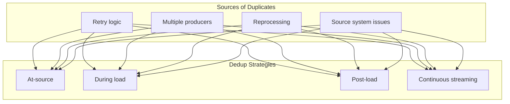
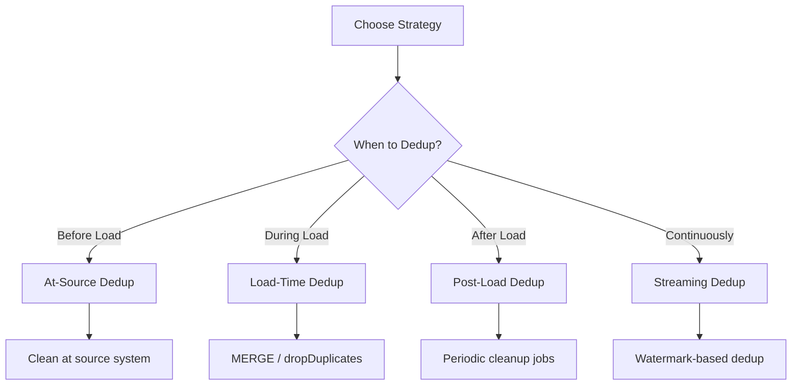
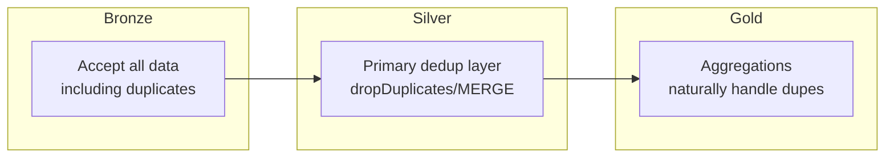

# Data Deduplication

Deduplication ensures data quality by removing duplicate records. Understanding batch and streaming deduplication patterns is important for the exam.

## Overview



## Why Duplicates Occur

| Source | Cause | Example |
|--------|-------|---------|
| Producer retries | At-least-once delivery | Kafka producer retry |
| Multiple sources | Same data from different paths | Multi-region replication |
| Pipeline reruns | Failure recovery reprocessing | Job restart after crash |
| Source systems | Application bugs, sync issues | Double-submitted orders |

## Deduplication Strategies



| Strategy | When | Pros | Cons |
|----------|------|------|------|
| At-source | Before ingestion | Cleanest approach | Not always possible |
| During load | ETL pipeline | Prevents duplicates entering | Processing overhead |
| Post-load | Scheduled cleanup | Simple implementation | Duplicates exist temporarily |
| Streaming | Continuous | Near-real-time | Memory for state |

## Batch Deduplication

### dropDuplicates()

```python
# Remove exact duplicates (all columns)
df_deduped = df.dropDuplicates()

# Remove duplicates based on specific columns
df_deduped = df.dropDuplicates(["order_id"])

# Remove duplicates on multiple columns
df_deduped = df.dropDuplicates(["customer_id", "order_date", "product_id"])
```

### Keep First vs Keep Last

By default, `dropDuplicates()` keeps an arbitrary record. To control which record is kept:

```python
from pyspark.sql.window import Window
from pyspark.sql.functions import row_number, col

# Keep the LATEST record per key
window = Window.partitionBy("order_id").orderBy(col("updated_at").desc())

df_latest = df \
    .withColumn("rn", row_number().over(window)) \
    .filter(col("rn") == 1) \
    .drop("rn")

# Keep the FIRST record per key
window = Window.partitionBy("order_id").orderBy(col("created_at").asc())

df_first = df \
    .withColumn("rn", row_number().over(window)) \
    .filter(col("rn") == 1) \
    .drop("rn")
```

### SQL Deduplication

```sql
-- Using ROW_NUMBER
WITH ranked AS (
    SELECT *,
        ROW_NUMBER() OVER (
            PARTITION BY order_id
            ORDER BY updated_at DESC
        ) AS rn
    FROM orders
)
SELECT * FROM ranked WHERE rn = 1;

-- Using DISTINCT
SELECT DISTINCT customer_id, email FROM customers;

-- Using GROUP BY (with aggregation)
SELECT
    customer_id,
    MAX(updated_at) as latest_update,
    FIRST(name) as name
FROM customers
GROUP BY customer_id;
```

### rank() vs row_number() vs dense_rank()

```python
from pyspark.sql.functions import rank, row_number, dense_rank

window = Window.partitionBy("customer_id").orderBy(col("amount").desc())

df.withColumn("row_num", row_number().over(window)) \
    .withColumn("rank", rank().over(window)) \
    .withColumn("dense_rank", dense_rank().over(window))
```

| Function | Ties Handling | Values for [100, 100, 90] |
|----------|---------------|---------------------------|
| `row_number()` | Arbitrary | 1, 2, 3 |
| `rank()` | Same rank, skip | 1, 1, 3 |
| `dense_rank()` | Same rank, no skip | 1, 1, 2 |

**For deduplication, use `row_number()` to guarantee exactly one row per key.**

## Deduplication with MERGE

MERGE naturally handles duplicates by matching on keys.

### Insert-Only MERGE (Dedup Pattern)

```sql
-- Only insert if key doesn't exist
MERGE INTO target AS t
USING source AS s
ON t.id = s.id
WHEN NOT MATCHED THEN INSERT *;
```

### MERGE with Duplicate Source

When source has duplicates, deduplicate before MERGE:

```python
from delta.tables import DeltaTable

# Source may have duplicates
source_df = spark.table("staging.orders")

# Deduplicate source first
source_deduped = source_df.dropDuplicates(["order_id"])

# Then MERGE
target = DeltaTable.forName(spark, "target.orders")

target.alias("t").merge(
    source_deduped.alias("s"),
    "t.order_id = s.order_id"
).whenMatchedUpdateAll(
).whenNotMatchedInsertAll(
).execute()
```

### Handling Multiple Matches in MERGE

If MERGE finds multiple matching rows in source, it fails. Always deduplicate source:

```python
# This will fail if source has duplicate order_ids
target.merge(source, "t.order_id = s.order_id")  # Error!

# Fix: Deduplicate source
source_deduped = source.dropDuplicates(["order_id"])
target.merge(source_deduped, "t.order_id = s.order_id")  # Works
```

## Streaming Deduplication

### dropDuplicates in Streaming

```python
# Basic streaming deduplication
stream_df = spark.readStream.format("delta").load("/source")

deduped_stream = stream_df.dropDuplicates(["id"])

query = deduped_stream.writeStream \
    .format("delta") \
    .option("checkpointLocation", "/checkpoint") \
    .start("/target")
```

### Watermark Requirement (Exam Important)

For streaming deduplication with unbounded state, you **must** use watermarks:

```python
from pyspark.sql.functions import col

# Streaming dedup WITH watermark - required for production
stream_df = spark.readStream.format("delta").load("/source")

deduped_stream = stream_df \
    .withWatermark("event_time", "10 minutes") \
    .dropDuplicates(["id", "event_time"])

query = deduped_stream.writeStream \
    .format("delta") \
    .option("checkpointLocation", "/checkpoint") \
    .start("/target")
```

**Why watermarks are required:**

- Without watermark, state grows unbounded
- Watermark enables state cleanup for old data
- Prevents out-of-memory errors

### dropDuplicatesWithinWatermark

More efficient streaming dedup that only checks within watermark window:

```python
# Only deduplicate within the watermark window
deduped_stream = stream_df \
    .withWatermark("event_time", "10 minutes") \
    .dropDuplicatesWithinWatermark(["id"])
```

| Method | State Size | Duplicate Detection |
|--------|------------|---------------------|
| `dropDuplicates()` | Large (all keys) | All time |
| `dropDuplicatesWithinWatermark()` | Smaller | Within watermark only |

### Streaming Dedup with Window

```python
from pyspark.sql.functions import window

# Deduplicate within time windows
deduped = stream_df \
    .withWatermark("event_time", "1 hour") \
    .dropDuplicates(["id", window("event_time", "1 hour")])
```

## Idempotent Writes (Exam Critical)

Idempotent writes ensure the same input always produces the same output, even if reprocessed.

### Why Idempotency Matters

| Without Idempotency | With Idempotency |
|---------------------|------------------|
| Rerun = duplicates | Rerun = same result |
| Difficult recovery | Easy recovery |
| Data inconsistency | Data consistency |

### MERGE for Idempotency

MERGE is inherently idempotent:

```python
def idempotent_write(batch_df, batch_id):
    """MERGE ensures same result on reprocess."""
    target = DeltaTable.forPath(spark, "/target")

    target.alias("t").merge(
        batch_df.alias("s"),
        "t.id = s.id"
    ).whenMatchedUpdateAll(
    ).whenNotMatchedInsertAll(
    ).execute()
```

### foreachBatch Idempotent Pattern

```python
def process_batch_idempotent(batch_df, batch_id):
    """Idempotent batch processing."""

    # 1. Deduplicate within batch
    deduped = batch_df.dropDuplicates(["id"])

    # 2. Use MERGE for idempotent upsert
    target = DeltaTable.forName(spark, "catalog.schema.target")

    target.alias("t").merge(
        deduped.alias("s"),
        "t.id = s.id"
    ).whenMatchedUpdateAll(
    ).whenNotMatchedInsertAll(
    ).execute()

# Apply to streaming
query = stream_df.writeStream \
    .foreachBatch(process_batch_idempotent) \
    .option("checkpointLocation", "/checkpoint") \
    .start()
```

### Transaction ID Pattern

Track processed batches to prevent reprocessing:

```python
def process_with_txn_tracking(batch_df, batch_id):
    """Skip already processed batches."""

    # Check if batch already processed
    processed = spark.sql(f"""
        SELECT 1 FROM processing_log WHERE batch_id = {batch_id}
    """).count() > 0

    if processed:
        return  # Skip - already done

    # Process the batch
    batch_df.write.format("delta").mode("append").save("/target")

    # Log the processed batch
    spark.sql(f"""
        INSERT INTO processing_log VALUES ({batch_id}, current_timestamp())
    """)
```

## Deduplication in Medallion Architecture



### Bronze Layer

Accept duplicates, add lineage:

```python
# Bronze: Append all data, track source
bronze_df = raw_df \
    .withColumn("_ingestion_time", current_timestamp()) \
    .withColumn("_source_file", input_file_name())

bronze_df.write.format("delta").mode("append").save("/bronze/orders")
```

### Silver Layer

Primary deduplication:

```python
# Silver: Deduplicate from Bronze
bronze_df = spark.read.format("delta").load("/bronze/orders")

# Deduplicate - keep latest per order_id
window = Window.partitionBy("order_id").orderBy(col("_ingestion_time").desc())

silver_df = bronze_df \
    .withColumn("rn", row_number().over(window)) \
    .filter(col("rn") == 1) \
    .drop("rn", "_source_file")

# MERGE to Silver
target = DeltaTable.forPath(spark, "/silver/orders")
target.alias("t").merge(
    silver_df.alias("s"),
    "t.order_id = s.order_id"
).whenMatchedUpdateAll(
).whenNotMatchedInsertAll(
).execute()
```

### Gold Layer

Aggregations naturally deduplicate:

```python
# Gold: Aggregations handle duplicates naturally
gold_df = spark.sql("""
    SELECT
        date,
        COUNT(DISTINCT order_id) as unique_orders,
        SUM(amount) as total_amount
    FROM silver.orders
    GROUP BY date
""")
```

## Performance Considerations

### Dedup Key Selection

```python
# Good: Use minimal unique key
df.dropDuplicates(["order_id"])

# Avoid: Using all columns when key exists
df.dropDuplicates()  # Slower, hashes all columns
```

### Partition Alignment

```python
# Efficient: Dedup within partitions
df.repartition("date") \
    .dropDuplicates(["order_id"])

# Better for skewed data: Salt the key
from pyspark.sql.functions import concat, lit, floor, rand

df.withColumn("salt", floor(rand() * 10)) \
    .repartition("salt") \
    .dropDuplicates(["order_id"])
```

### Memory for Streaming State

```python
# Monitor state size
query.lastProgress["stateOperators"]

# Configure state checkpointing
spark.conf.set("spark.sql.streaming.stateStore.stateSchemaCheck", "true")
```

## Monitoring Duplicates

### Count Duplicates

```python
# Find duplicate counts
duplicate_counts = df.groupBy("order_id") \
    .count() \
    .filter(col("count") > 1)

total_duplicates = duplicate_counts.agg(
    sum(col("count") - 1)
).collect()[0][0]

print(f"Total duplicate records: {total_duplicates}")
```

### Duplicate Detection Query

```sql
-- Find records with duplicates
SELECT
    order_id,
    COUNT(*) as occurrence_count,
    COLLECT_LIST(updated_at) as timestamps
FROM orders
GROUP BY order_id
HAVING COUNT(*) > 1
ORDER BY occurrence_count DESC;
```

### Data Quality Metrics

```python
# Calculate dedup metrics
total_records = df.count()
unique_records = df.dropDuplicates(["id"]).count()
duplicate_records = total_records - unique_records
duplicate_rate = duplicate_records / total_records * 100

print(f"Duplicate rate: {duplicate_rate:.2f}%")
```

## Exam Tips

1. **Streaming dedup requires watermarks** for state cleanup
2. **`dropDuplicatesWithinWatermark`** is more efficient than `dropDuplicates` in streaming
3. **MERGE is naturally idempotent** - same input = same output
4. **Deduplicate source before MERGE** to avoid multiple match errors
5. **`row_number()`** guarantees exactly one record per key (use for dedup)
6. **Bronze accepts duplicates**, Silver deduplicates
7. **foreachBatch + MERGE** is the idempotent streaming pattern

## Best Practices

- Use `row_number()` with window functions for deterministic dedup
- Always deduplicate source data before MERGE
- Use watermarks with streaming deduplication
- Implement idempotent writes with MERGE in foreachBatch
- Monitor duplicate rates as a data quality metric
- Choose dedup keys carefully - prefer natural business keys
- Consider `dropDuplicatesWithinWatermark` for large-scale streaming

## Related Topics

- [Batch ETL Pipelines](01-batch-etl-pipelines.md) - Window functions
- [Structured Streaming](03-structured-streaming.md) - Streaming and watermarks
- [Delta Lake Operations](06-delta-lake-operations.md) - MERGE patterns
- [Change Data Capture](05-change-data-capture.md) - Dedup before CDC apply

## Official Documentation

- [Streaming Deduplication](https://docs.databricks.com/structured-streaming/dedup.html)
- [Delta Lake MERGE](https://docs.databricks.com/delta/merge.html)
- [Watermarks](https://docs.databricks.com/structured-streaming/watermarks.html)
