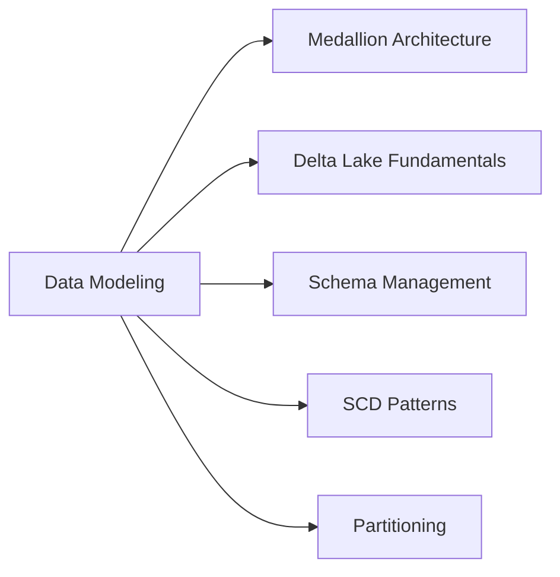
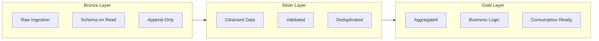

# Data Modeling (15% of Exam)

Data modeling in Databricks centers around Delta Lake and the medallion architecture pattern.

## Topics Overview

## Section Contents

| File | Topic | Priority |
|------|-------|----------|
| [01-medallion-architecture.md](01-medallion-architecture.md) | Bronze/Silver/Gold layers, data quality tiers | High |
| [02-delta-lake-fundamentals.md](02-delta-lake-fundamentals.md) | ACID transactions, table formats, cloning | High |
| [03-schema-management.md](03-schema-management.md) | Schema enforcement, evolution, constraints | High |
| [04-scd-patterns.md](04-scd-patterns.md) | SCD Type 1, Type 2 implementations | Medium |
| [05-partitioning-strategies.md](05-partitioning-strategies.md) | Partition selection, liquid clustering | Medium |

## Medallion Architecture

### Layer Characteristics

| Layer | Data Quality | Schema | Updates | Use Case |
|-------|-------------|--------|---------|----------|
| Bronze | Raw | Flexible | Append-only | Data lake, audit |
| Silver | Cleansed | Enforced | Merge/Upsert | Single source of truth |
| Gold | Curated | Strict | Aggregated | BI, ML features |

## Delta Lake Features

| Feature | Description |
|---------|-------------|
| ACID Transactions | Serializable isolation level |
| Time Travel | Query previous versions |
| Schema Enforcement | Reject bad data on write |
| Schema Evolution | Add columns automatically |
| Audit History | Full transaction log |

## SCD Pattern Comparison

| Type | Description | History | Implementation |
|------|-------------|---------|----------------|
| Type 1 | Overwrite | No | Simple UPDATE |
| Type 2 | Add row | Yes | INSERT with effective dates |
| Type 3 | Add column | Limited | UPDATE with previous value column |

## Exam Tips

1. **Delta vs Parquet** - Know when Delta's features justify the overhead
2. **Shallow vs Deep Clone** - Shallow shares data files, deep copies everything
3. **Schema evolution modes** - `mergeSchema` vs `overwriteSchema`
4. **Partition pruning** - Only effective for equality and range filters
5. **Liquid clustering** - Replacement for static partitioning + ZORDER

## Practice Focus Areas

- [ ] Design medallion architecture for a use case
- [ ] Implement SCD Type 2 with MERGE
- [ ] Configure schema evolution for Auto Loader
- [ ] Choose optimal partition columns
- [ ] Use Delta constraints for data quality
