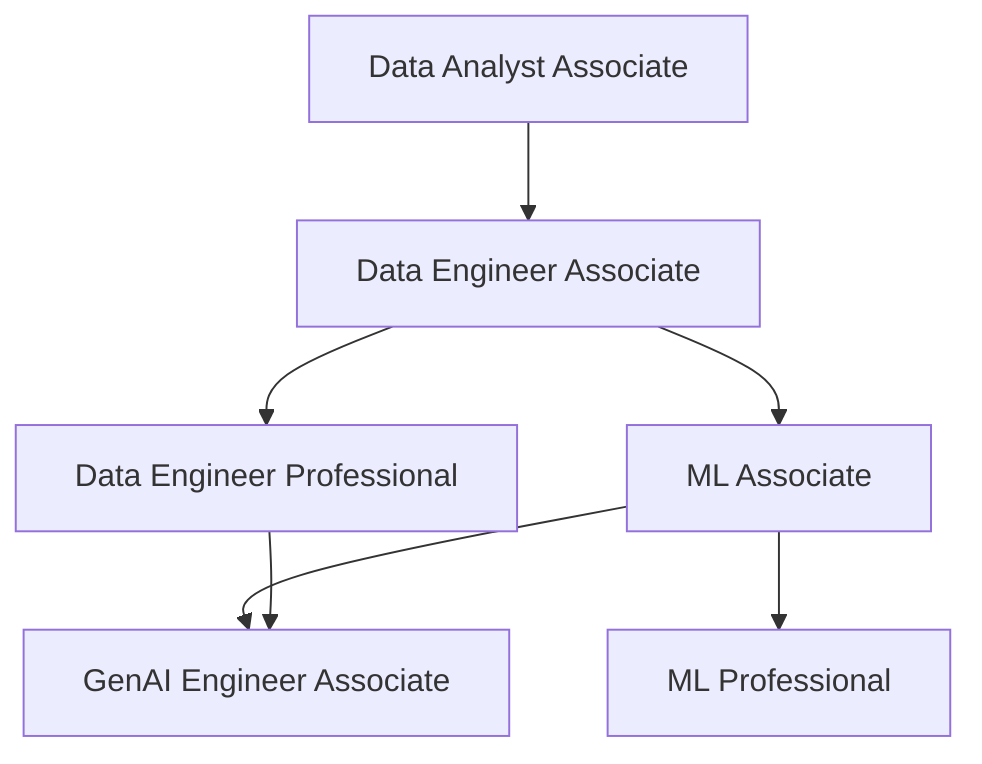

<p align="center">
  <a href="https://www.databricks.com/learn/certification">
    
  </a>
</p>

<h1 align="center">Databricks Certification Study Guide</h1>
<h3 align="center">Open-source community study guide for all six Databricks certifications</h3>

<p align="center">
  <a href="./LICENSE"></a>
  <a href="https://www.databricks.com/learn/certification"></a>
  <a href="./CHANGELOG.md"></a>
  <a href="https://delta.io/"></a>
  <a href="https://spark.apache.org/"></a>
  <a href="https://mlflow.org/"></a>
  <br>
  <a href="#"></a>
  <a href="#"></a>
  <a href="#"></a>
  <a href="#"></a>
  <a href="#"></a>
  <a href="#"></a>
</p>

<p align="center">
  <i>A community-maintained study guide covering every active Databricks certification.<br>
  Refreshed against the official Databricks exam guides current as of <b>May 21, 2026</b>.</i>
</p>

> [!note]
> **These are the exam notes I built while preparing for the Databricks certification series.** Cheat sheets, practice questions, mock exams, and end-to-end worked examples — now open-sourced under MIT so the next person doesn't have to start from scratch. Every certification section maps to the current official Databricks exam guide for that credential. If it helped you, ⭐ the repo and pass it on.

> [!info]
> **Read in another language**: 🇹🇭 [ภาษาไทย](./i18n/th/README.md) (in progress) · For other languages and the translation policy, see [`TRANSLATING.md`](./TRANSLATING.md) and [`i18n/README.md`](./i18n/README.md).

---

## Contents

- [Why this guide exists](#why-this-guide-exists)
- [Who this is for](#who-this-is-for)
- [The six certifications at a glance](#the-six-certifications-at-a-glance)
- [Per-certification exam details](#per-certification-exam-details)
- [What changed in the 2025–2026 exam guides](#what-changed-in-the-20252026-exam-guides)
- [Getting started with Obsidian](#getting-started-with-obsidian-recommended)
- [How to use this guide](#how-to-use-this-guide)
- [Study roadmaps](#study-roadmaps) — 4-week, 8-week, and 12-week plans per cert tier
- [Certification paths](#certification-paths)
- [Roadmap for the guide itself](#roadmap-for-the-guide-itself)
- [Repository layout](#repository-layout)
- [Official Databricks resources](#official-databricks-resources)
- [Contributing](#contributing)
- [License](#license)

---

## Why this guide exists

Databricks' certification line-up grew fast: six active credentials across data engineering, analytics, ML, and generative AI — each with its own evolving exam guide. The official skills lists change quarterly. Public study resources are scattered across blog posts, training courses, and community forums.

This repo is the consolidated notes I wrote while preparing for the series. Now it's yours.

## Who this is for

- **Data engineers** preparing for the **Data Engineer Associate** or **Professional**
- **Analysts and BI developers** preparing for the **Data Analyst Associate**
- **ML engineers and data scientists** preparing for the **ML Associate** or **Professional**
- **AI/LLM application developers** preparing for the **Generative AI Engineer Associate**
- **Anyone** building on the Databricks Data Intelligence Platform who wants a structured reference for Delta Lake, Unity Catalog, Lakeflow, MLflow, Feature Store, Mosaic AI, and Vector Search

You don't need to be taking an exam to get value — the guide doubles as a reference for the platform itself.

## The six certifications at a glance

| Certification | Tier | Fee | Duration | Scored Qs | Exam Guide |
| :--- | :---: | :---: | :---: | :---: | :--- |
| [**Data Engineer Associate**](certifications/data-engineer-associate/README.md) | Associate | $200 | 90 min | 45 | May 2026 |
| [**Data Engineer Professional**](certifications/data-engineer-professional/README.md) | Professional | $200 | 120 min | 59 | Nov 30, 2025 |
| [**Data Analyst Associate**](certifications/data-analyst-associate/README.md) | Associate | $200 | 90 min | 45 | Oct 2025 |
| [**ML Associate**](certifications/ml-associate/README.md) | Associate | $200 | 90 min | 48 | Mar 1, 2025 |
| [**ML Professional**](certifications/ml-professional/README.md) | Professional | $200 | 120 min | 59 | Sep 2025 |
| [**GenAI Engineer Associate**](certifications/genai-engineer-associate/README.md) | Associate | $200 | 90 min | 45 | Mar 2026 |

All six certifications:

- **Pass/fail.** Databricks does not publish a numeric passing threshold.
- **Multiple choice.** Online or on-site delivery.
- **Validity: 2 years.** Renew by retaking or sitting an updated version.
- **No formal prerequisites.** Hands-on experience and the [Databricks Academy](https://www.databricks.com/learn/training) course are strongly recommended.
- **Languages available:** English on every exam. Japanese, Portuguese (BR), and Korean are available on every associate exam **except Data Analyst Associate** (English-only), and on the Data Engineer Professional. The ML Professional and Data Analyst Associate exams are English-only.

## Per-certification exam details

<details>
<summary><b>📊 Data Engineer Associate — May 2026 blueprint</b></summary>

| Detail | Value |
| :--- | :--- |
| **Exam ID / page** | [Databricks Certified Data Engineer Associate](https://www.databricks.com/learn/certification/data-engineer-associate) |
| **Exam guide PDF** | [May 2026 exam guide](https://www.databricks.com/sites/default/files/2026-05/databricks-certified-data-engineer-associate-exam-guide-may-2026.pdf) |
| **Duration** | 90 minutes |
| **Scored questions** | 45 multiple-choice |
| **Languages** | English, Japanese, Portuguese (BR), Korean |
| **Recommended experience** | 6+ months hands-on with Databricks |

The May 2026 refresh replaces legacy "Workflows" terminology with **Lakeflow Jobs**, and adds explicit coverage of ingestion patterns, modelling, and CI/CD. Existing topic folders in this guide preserve the prior structure; see the [DE Associate README](certifications/data-engineer-associate/README.md) for the up-to-date domain list.

</details>

<details>
<summary><b>📊 Data Engineer Professional — November 30, 2025 blueprint</b></summary>

| Detail | Value |
| :--- | :--- |
| **Exam ID / page** | [Databricks Certified Data Engineer Professional](https://www.databricks.com/learn/certification/data-engineer-professional) |
| **Duration** | 120 minutes |
| **Scored questions** | 59 multiple-choice |
| **Languages** | English, Japanese, Portuguese (BR), Korean |
| **Recommended experience** | 1+ years building production data pipelines on Databricks |

**Ten domains** in the current exam guide:

| Domain | Weight |
| :--- | :---: |
| Developing Code for Data Processing | 22 % |
| Cost & Performance Optimization | 13 % |
| Data Transformation, Cleansing, and Quality | 10 % |
| Monitoring and Alerting | 10 % |
| Ensuring Data Security and Compliance | 10 % |
| Debugging and Deploying | 10 % |
| Data Ingestion & Acquisition | 7 % |
| Data Governance | 7 % |
| Data Modelling | 6 % |
| Data Sharing and Federation | 5 % |

</details>

<details>
<summary><b>📊 Data Analyst Associate — October 2025 blueprint</b></summary>

| Detail | Value |
| :--- | :--- |
| **Exam ID / page** | [Databricks Certified Data Analyst Associate](https://www.databricks.com/learn/certification/data-analyst-associate) |
| **Duration** | 90 minutes |
| **Scored questions** | 45 multiple-choice |
| **Languages** | English |
| **Recommended experience** | 6+ months hands-on with Databricks SQL |

**Nine domains** in the current exam guide, including the new **AI/BI Genie Spaces** section:

| Domain | Weight |
| :--- | :---: |
| Executing Queries Using Databricks SQL and Warehouses | 20 % |
| Creating Dashboards and Visualizations | 16 % |
| Analyzing Queries | 15 % |
| Developing, Sharing, and Maintaining AI/BI Genie Spaces | 12 % |
| Understanding Databricks Data Intelligence Platform | 11 % |
| Managing Data | 8 % |
| Securing Data | 8 % |
| Importing Data | 5 % |
| Data Modeling with Databricks SQL | 5 % |

</details>

<details>
<summary><b>📊 ML Associate — March 1, 2025 blueprint</b></summary>

| Detail | Value |
| :--- | :--- |
| **Exam ID / page** | [Databricks Certified Machine Learning Associate](https://www.databricks.com/learn/certification/machine-learning-associate) |
| **Duration** | 90 minutes |
| **Scored questions** | 48 multiple-choice |
| **Languages** | English, Japanese, Portuguese (BR), Korean |
| **Recommended experience** | 6+ months hands-on ML on Databricks |

| Domain | Weight |
| :--- | :---: |
| Databricks Machine Learning | 38 % |
| Model Development | 31 % |
| ML Workflows | 19 % |
| Model Deployment | 12 % |

Code is Python; non-ML supporting tasks may include SQL.

</details>

<details>
<summary><b>📊 ML Professional — September 2025 blueprint</b></summary>

| Detail | Value |
| :--- | :--- |
| **Exam ID / page** | [Databricks Certified Machine Learning Professional](https://www.databricks.com/learn/certification/machine-learning-professional) |
| **Duration** | 120 minutes |
| **Scored questions** | 59 multiple-choice |
| **Languages** | English |
| **Recommended experience** | 1+ years building enterprise-scale ML on Databricks |

| Domain | Weight |
| :--- | :---: |
| Model Development | 44 % |
| ML Ops | 44 % |
| Model Deployment | 12 % |

The current exam guide consolidates the previous four domains into three; "Solution & Data Monitoring" responsibilities now sit inside ML Ops.

</details>

<details>
<summary><b>📊 GenAI Engineer Associate — March 2026 blueprint</b></summary>

| Detail | Value |
| :--- | :--- |
| **Exam ID / page** | [Databricks Certified Generative AI Engineer Associate](https://www.databricks.com/learn/certification/genai-engineer-associate) |
| **Duration** | 90 minutes |
| **Scored questions** | 45 multiple-choice |
| **Languages** | English, Japanese, Portuguese (BR), Korean |
| **Recommended experience** | 6+ months hands-on building GenAI solutions on Databricks |

**Six domains** in the current exam guide:

| Domain | Weight |
| :--- | :---: |
| Application Development | 30 % |
| Assembling and Deploying Apps | 22 % |
| Design Applications | 14 % |
| Data Preparation | 14 % |
| Evaluation and Monitoring | 12 % |
| Governance | 8 % |

</details>

## What changed in the 2025–2026 exam guides

> [!important]
> Several Databricks exam guides were updated in 2025–2026. Highlights to know:

- **Data Engineer Associate (May 2026)** — terminology shifted from "Workflows" to **Lakeflow Jobs**; the guide also clarifies expectations around Delta ingestion patterns and CI/CD with Databricks Asset Bundles. [exam guide PDF](https://www.databricks.com/sites/default/files/2026-05/databricks-certified-data-engineer-associate-exam-guide-may-2026.pdf)
- **Data Engineer Professional (Nov 30, 2025)** — restructured to **10 domains** with explicit weights; **Data Sharing and Federation** (Delta Sharing, Lakehouse Federation) and **Data Modelling** are now first-class domains.
- **Data Analyst Associate (Oct 2025)** — added the **AI/BI Genie Spaces** domain (12 %); SQL warehouses + query analysis remain the highest-weight blocks.
- **ML Associate (Mar 1, 2025)** — current blueprint emphasises **Databricks ML** (Unity Catalog, AutoML, Mosaic AI) at 38 % and dedicates 31 % to **Model Development**.
- **ML Professional (Sep 2025)** — collapsed to **three domains**: Model Development, ML Ops, and Model Deployment (44 / 44 / 12).
- **GenAI Engineer Associate (Mar 2026)** — refactored into **six domains** with **Application Development** (30 %) as the largest block; **Governance** is now an explicit (8 %) domain covering Unity Catalog for AI assets, PII handling, and content safety.

All passing-score references in older study materials should be ignored: **Databricks no longer publishes a numeric passing threshold** for any of these certifications. Treat the exam as pass/fail and aim to be comfortable across every domain, not just the high-weight ones.

## Getting started with Obsidian (recommended)

This guide is written in [Obsidian Flavored Markdown](https://help.obsidian.md/). It renders fine on GitHub, but in **Obsidian** you get callouts, foldable practice-question answers, Mermaid diagrams, backlinks, and a navigable Graph View of every cross-link — which makes studying meaningfully better.

### 5-minute onboarding

1. **Install [Obsidian](https://obsidian.md/download)** (free; macOS, Windows, Linux).
2. **Clone this repo** somewhere on your machine:

   ```bash
   git clone https://github.com/kengio/databricks-certification-study-guide.git
   cd databricks-certification-study-guide
   ```

3. **Open the vault**: launch Obsidian → *Open folder as vault* → pick the cloned `databricks-certification-study-guide/` directory.
4. **Trust the author** when Obsidian asks (the included `.obsidian/` config has pre-tuned settings — line numbers, tab width, no inline titles).
5. **Open the certification you're targeting** — e.g., `certifications/data-engineer-associate/README.md`. Press `Cmd/Ctrl + O` to fuzzy-find any topic.
6. **Toggle Graph View** (`Cmd/Ctrl + G`) to see how topics cross-link — surprisingly useful for spotting weak areas.

### Recommended plugins

Two are essential, the rest are quality-of-life. Install via **Settings → Community plugins → Browse**.

- **Obsidian Git** — back up your notes and progress checkboxes to your own fork.
- **Linter** — keeps your edits consistent with the project's markdown conventions.
- **Advanced Tables** — auto-aligns Markdown tables as you type.
- **Codeblock Customizer** (or *Better CodeBlock*) — line numbers, titles, copy buttons on code blocks.
- **Copilot** (by logancyang) — chat with Claude / GPT-4o / Ollama inside Obsidian; **Vault QA** mode indexes the guide so the AI can quiz you using your actual notes.

> 📖 **See [`OBSIDIAN-SETUP.md`](./OBSIDIAN-SETUP.md)** for the full setup walkthrough — plugin configuration details, Copilot Vault QA setup, recommended study prompts, and tips for using AI to generate active-recall questions from your notes.

### Don't want Obsidian?

No problem. The guide also renders perfectly in:

- **GitHub** — browse the files online; callouts and Mermaid diagrams render natively
- **VS Code** with the [Markdown All in One](https://marketplace.visualstudio.com/items?itemName=yzhang.markdown-all-in-one) extension
- **Any Markdown reader** that supports GFM — you'll lose callouts and Graph View, but the content is fully readable

## How to use this guide

1. **Pick a certification.** Start from the [six-certs table](#the-six-certifications-at-a-glance) above, open that cert's `README.md`. Each one has a domain-weighted study plan and a progress tracker.
2. **Review shared fundamentals first** — `shared/fundamentals/` covers the cross-cert concepts (platform architecture, Delta Lake basics, Spark fundamentals, Unity Catalog basics, medallion architecture, MLflow basics, RAG/vector-search basics).
3. **Work through the cert's numbered topic folders in order.** Each topic file is 300–600 lines with examples, comparison tables, common-mistake callouts, and exam tips.
4. **Use the [cheat sheets](shared/cheat-sheets/README.md)** for fast review after each domain.
5. **Hit the [practice questions](certifications/data-engineer-associate/resources/practice-questions/README.md)** for your cert. Aim for 70 %+ per domain before moving on.
6. **Sit the [mock exams](certifications/data-engineer-associate/resources/mock-exam/README.md) under timed conditions** when you think you're close.
7. **Reference the [interview prep](shared/interview-prep/README.md)** if you're using the cert as a stepping stone to a role change — those questions explore system-design depth beyond the exam.
8. **Run the [hands-on lab pack](labs/README.md)** to exercise the core features end-to-end in a Databricks workspace — labs cover medallion ingestion, UC governance, Lakeflow Declarative Pipelines, MLflow + Model Registry, and a Mosaic AI RAG demo.

## Study roadmaps

Pick the plan that matches the time you have. The hour estimates assume an experienced practitioner brushing up on Databricks specifics; double them if you're newer to Spark or the lakehouse pattern. Each plan ends with the same outcome — sitting the exam with confidence.

### Associate tier (DE Associate / DA Associate / ML Associate / GenAI Engineer Associate)

#### 🏃 4-week sprint (~25–30 hours total)

| Week | Focus | Hours |
| :--- | :--- | :---: |
| **1** | Shared fundamentals + first half of the cert's topic folders | 7 |
| **2** | Second half of the cert's topic folders | 7 |
| **3** | All cheat sheets + per-domain practice questions (target 70 %+ each) | 8 |
| **4** | Mock Exam 1 (timed) → review → Mock Exam 2 → interview-prep spot-checks → exam | 6 |

#### 🚶 8-week balanced (~45–55 hours total)

| Week | Focus | Hours |
| :--- | :--- | :---: |
| **1** | Read shared fundamentals + cert's first topic folder | 6 |
| **2** | Cert topic folders 2–3 | 6 |
| **3** | Cert topic folders 4–end | 6 |
| **4** | **Checkpoint:** cheat sheets + practice questions for domains 1–2 | 6 |
| **5** | Practice questions for remaining domains; revisit weak topics | 7 |
| **6** | Mock Exam 1 (timed) + per-question debrief | 6 |
| **7** | Gap-fill from Mock 1 debrief; second pass on weakest cheat sheet | 5 |
| **8** | Mock Exam 2 + final review → exam | 5 |

### Professional tier (DE Professional / ML Professional)

#### 🚶 8-week balanced (~70–80 hours total)

| Week | Focus | Hours |
| :--- | :--- | :---: |
| **1** | Shared fundamentals + first 25 % of cert's topic folders | 10 |
| **2** | Topic folders 25–50 % | 10 |
| **3** | Topic folders 50–75 % | 10 |
| **4** | Topic folders 75–100 % + appendix entries for trickiest topics | 10 |
| **5** | All cheat sheets + Practice questions, domains 1–5 | 10 |
| **6** | Practice questions, remaining domains; revisit cross-cutting concerns (security, perf, deployment) | 10 |
| **7** | Mock Exam 1 (timed) → debrief → topic-file deep-dive on every miss | 10 |
| **8** | Mock Exam 2 → final review → interview-prep spot-checks → exam | 10 |

#### 🧘 12-week comprehensive (~100–120 hours total)

Best for: newcomers to the professional-tier scope, candidates targeting a role change, or anyone wanting deeper retention. Spread the 8-week plan above across 12 weeks with extra time on the highest-weight domains and add a hands-on lab week per quarter of the syllabus.

### Suggested daily cadence

```text
Weekday    (45–60 min):  Read 1 topic sub-file + run the examples in a Databricks workspace
Weekend    (90–120 min): Cheat sheet review + practice questions
Pre-exam   (last 3 days): Stop new material. Re-read cheat sheets only.
Exam day:                Read the cheat sheet stack once over coffee. Eat. Go pass it.
```

## Certification paths



See [Learning Paths](learning-paths/README.md) for role-specific progression guides (Data Engineer, Analytics Engineer, ML Engineer, AI Engineer).

## Roadmap for the guide itself

This guide ships as a living resource. The roadmap below is what's planned for the next two quarters — issues and PRs against any of these are welcome.

### Q3 2026 (next 3 months)

- ✅ **MIT license + open-source release** — complete
- ✅ **Refresh all 6 cert READMEs to current exam-guide versions** — complete
- ✅ **2025–2026 update callouts** in the top-level README and per-cert READMEs — complete
- ✅ **Topic-folder reorganisation for DE Professional** to match the November 2025 10-domain structure — complete
- ✅ **Topic-folder reorganisation for Data Analyst Associate** to surface AI/BI Genie Spaces as its own folder — complete
- ✅ **Topic-folder reorganisation for GenAI Engineer Associate** to match the March 2026 6-domain structure — complete
- ✅ **Refreshed mock exams** for the three certifications above — complete (terminology + new-domain questions for Data Sharing/Federation, AI/BI Genie Spaces, and GenAI Governance)
- ✅ **Hands-on lab pack** — runnable PySpark / SQL / dbutils scripts that walk through medallion ingestion, Unity Catalog setup, Lakeflow Pipelines, MLflow tracking, and a Mosaic AI Vector Search RAG demo — complete (see [`labs/`](labs/README.md))

### Q4 2026 (3–6 months out)

- ✅ **DE Associate topic-folder refresh** for the May 2026 Lakeflow Jobs terminology — complete (added CI/CD and Monitoring folder, refreshed terminology)
- ✅ **ML Associate / ML Professional folder reorg** to match the Mar 2025 (4-domain) and Sep 2025 (3-domain) blueprints — complete
- ✅ **Per-cert "final review" file** (20-minute exam-morning scan) modelled on the dp-800 pattern — complete (6 files, one per cert)
- ✅ **Per-cert mock-exam debrief files** mapping every question to a topic file and cheat sheet — complete (12 files, one per mock)
- ✅ **CONTRIBUTORS.md** listing community contributors — complete (see [`CONTRIBUTORS.md`](./CONTRIBUTORS.md))

### Q1 2027 (6–12 months out)

- ✅ **Renewal guide** for candidates whose 2-year validity expires in 2027–2028 — complete (see [`shared/appendix/renewal-guide.md`](./shared/appendix/renewal-guide.md))
- ✅ **Translation scaffolding** — Thai in-tree, other languages via fork model — complete (see [`TRANSLATING.md`](./TRANSLATING.md) + [`i18n/`](./i18n/README.md))
- ✅ **Spaced-repetition deck (Anki)** — markdown-source decks + stdlib-only builder, two starter decks (Delta Lake 27 cards, Unity Catalog 22 cards) — complete (see [`anki/README.md`](./anki/README.md))
- 🌱 **Adaptive practice questions** — JSON-driven question bank with difficulty tagging

Legend: ✅ done · 🔄 in progress / next up · ⏳ planned · 🌱 ideas being explored

## Repository layout

```text
databricks-certification-study-guide/
├── certifications/
│   ├── data-engineer-associate/         # 6 topic folders + resources/ (May 2026 blueprint refresh)
│   ├── data-engineer-professional/      # 10 topic folders + resources/ (Nov 2025 blueprint)
│   ├── data-analyst-associate/          # 9 topic folders + resources/ (Oct 2025 blueprint)
│   ├── ml-associate/                    # 4 topic folders + resources/ (Mar 2025 blueprint)
│   ├── ml-professional/                 # 3 topic folders + resources/ (Sep 2025 blueprint)
│   └── genai-engineer-associate/        # 6 topic folders + resources/ (Mar 2026 blueprint)
├── shared/
│   ├── fundamentals/                    # cross-cert concepts (platform, Delta, Spark, UC, Medallion, MLflow, RAG)
│   ├── cheat-sheets/                    # quick-reference sheets (Delta, DLT, MLflow, PySpark, SQL, UC, performance)
│   ├── appendix/                        # glossary, comparison tables, error reference
│   ├── code-examples/                   # python/ and sql/ (always .md files)
│   └── interview-prep/                  # 15 topic files, 108 open-ended design questions
├── learning-paths/                      # role-based progression guides
├── labs/                                # runnable hands-on lab pack (5 labs)
├── i18n/                                # translations index + th/ (Thai in-tree translation)
├── anki/                                # spaced-repetition decks (markdown source + stdlib builder)
├── images/databricks-ui/                # screenshots organised by feature area
├── CLAUDE.md                            # repo conventions for AI assistants
├── OBSIDIAN-SETUP.md                    # full Obsidian onboarding walkthrough
├── CONTRIBUTING.md                      # ground rules + 3-round review workflow
├── TRANSLATING.md                       # translation policy + Thai contribution flow
├── CHANGELOG.md                         # release history per exam-guide version
├── LICENSE                              # MIT
└── README.md                            # this file
```

## Official Databricks resources

<details>
<summary><b>📋 Certifications and exam scheduling</b></summary>

- [Databricks Certifications hub](https://www.databricks.com/learn/certification) — landing page with links to every active exam
- [Data Engineer Associate](https://www.databricks.com/learn/certification/data-engineer-associate)
- [Data Engineer Professional](https://www.databricks.com/learn/certification/data-engineer-professional)
- [Data Analyst Associate](https://www.databricks.com/learn/certification/data-analyst-associate)
- [Machine Learning Associate](https://www.databricks.com/learn/certification/machine-learning-associate)
- [Machine Learning Professional](https://www.databricks.com/learn/certification/machine-learning-professional)
- [Generative AI Engineer Associate](https://www.databricks.com/learn/certification/genai-engineer-associate)
- [Databricks Academy](https://www.databricks.com/learn/training) — free + paid courses mapped to each certification

</details>

<details>
<summary><b>📚 Platform documentation</b></summary>

- [Databricks documentation](https://docs.databricks.com/)
- [Delta Lake documentation](https://docs.delta.io/latest/index.html)
- [Apache Spark documentation](https://spark.apache.org/docs/latest/)
- [PySpark API reference](https://spark.apache.org/docs/latest/api/python/index.html)
- [Unity Catalog](https://docs.databricks.com/en/data-governance/unity-catalog/index.html)
- [Lakeflow Jobs (formerly Workflows)](https://docs.databricks.com/en/jobs/index.html)
- [Lakeflow Declarative Pipelines (formerly DLT)](https://docs.databricks.com/en/delta-live-tables/index.html)
- [Databricks SQL](https://docs.databricks.com/en/sql/index.html)
- [AI/BI Genie](https://docs.databricks.com/en/genie/index.html)
- [Mosaic AI Vector Search](https://docs.databricks.com/en/generative-ai/vector-search.html)
- [Mosaic AI Model Serving](https://docs.databricks.com/en/machine-learning/model-serving/index.html)
- [MLflow on Databricks](https://docs.databricks.com/en/mlflow/index.html)
- [Feature Engineering in Unity Catalog](https://docs.databricks.com/en/machine-learning/feature-store/index.html)
- [Databricks Asset Bundles](https://docs.databricks.com/en/dev-tools/bundles/index.html)
- [Delta Sharing](https://docs.databricks.com/en/data-sharing/index.html)
- [Lakehouse Federation](https://docs.databricks.com/en/query-federation/index.html)

</details>

<details>
<summary><b>👥 Community and learning</b></summary>

- [Databricks Community](https://community.databricks.com/) — forums for exam policy, study strategy, and platform Q&A
- [Databricks Blog](https://www.databricks.com/blog) — product launches and best practices
- [Databricks YouTube channel](https://www.youtube.com/databricks)
- [Databricks Data + AI Summit recordings](https://www.databricks.com/dataaisummit)
- [Awesome Databricks (community list)](https://github.com/devmotion/awesome-databricks)

</details>

## Contributing

Found an error, a stale link, or a topic that needs deeper coverage? PRs are welcome.

- **Small fixes** (typos, link rot, factual corrections) — open a PR directly
- **New practice questions or topic expansions** — open an issue first to discuss scope
- **Blueprint changes** — Databricks updates the exam guides periodically; PRs that bring sections in line with the latest exam-guide PDF for a certification are especially appreciated

Every PR goes through a **3-round self-review** (technical, factual, style) before squash-merge. The PR template walks you through the checklist. Full details in [`CONTRIBUTING.md`](./CONTRIBUTING.md).

Contributors are credited in [`CONTRIBUTORS.md`](./CONTRIBUTORS.md) — your PR description can ask to be listed (or to be skipped if you'd prefer to stay anonymous).

Conventions live in [`CLAUDE.md`](./CLAUDE.md).

## License

Released under the [MIT License](./LICENSE). Use, fork, remix, redistribute — just keep the copyright notice.

---

<p align="center">
  <i>This guide is a community resource. It is <b>not</b> affiliated with, endorsed by, or sponsored by Databricks.<br>
  "Databricks", "Delta Lake", "Lakeflow", "MLflow", "Unity Catalog", and "Mosaic AI" are trademarks of Databricks Inc.<br>
  Always verify against the current <a href="https://www.databricks.com/learn/certification">official Databricks exam guides</a> — they are the source of truth.</i>
</p>

<p align="center"><b>Good luck on your exam. You've got this. ⭐ this repo if it helped you pass.</b></p>
