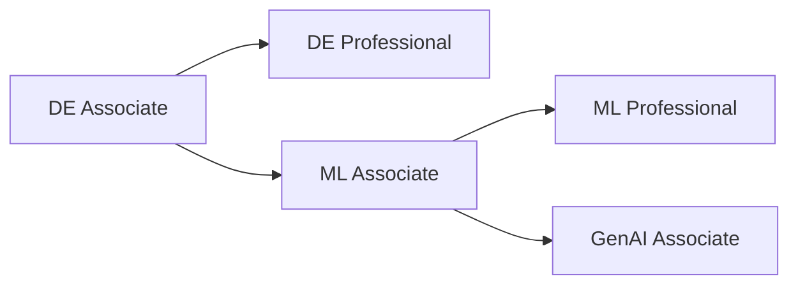

# Databricks Certification Study Guide

A comprehensive study guide for all Databricks certifications.

## Certifications

### Data Engineering

| Certification                                                                     | Level        | Status         |
| --------------------------------------------------------------------------------- | ------------ | -------------- |
| [Data Engineer Associate](certifications/data-engineer-associate/README.md)       | Associate    | 📝 Placeholder |
| [Data Engineer Professional](certifications/data-engineer-professional/README.md) | Professional | ✅ In Progress |

### Data Analytics

| Certification                                                             | Level     | Status         |
| ------------------------------------------------------------------------- | --------- | -------------- |
| [Data Analyst Associate](certifications/data-analyst-associate/README.md) | Associate | 📝 Placeholder |

### Machine Learning

| Certification                                                | Level        | Status         |
| ------------------------------------------------------------ | ------------ | -------------- |
| [ML Associate](certifications/ml-associate/README.md)        | Associate    | 📝 Placeholder |
| [ML Professional](certifications/ml-professional/README.md)  | Professional | 📝 Placeholder |

### Generative AI

| Certification                                                                 | Level     | Status         |
| ----------------------------------------------------------------------------- | --------- | -------------- |
| [GenAI Engineer Associate](certifications/genai-engineer-associate/README.md) | Associate | 📝 Placeholder |

## Certification Paths



See [Learning Paths](learning-paths/README.md) for detailed progression guides.

## Shared Resources

| Resource                                                     | Description                            |
| ------------------------------------------------------------ | -------------------------------------- |
| [Fundamentals](shared/fundamentals/README.md)               | Core concepts used across certifications |
| [Cheat Sheets](shared/cheat-sheets/delta-lake-commands.md)  | Quick reference guides                 |
| [Appendix](shared/appendix/glossary.md)                     | Glossary, comparisons, error reference |
| Code Examples | Python and SQL examples (coming soon) |

## Quick Start

1. Choose a certification from the table above
2. Review the prerequisites in the certification README
3. Study the shared fundamentals first
4. Work through the certification-specific topics
5. Use cheat sheets for final review

## Repository Structure

```text
databricks-certification-study-guide/
├── certifications/           # Certification-specific content
│   ├── data-engineer-associate/
│   ├── data-engineer-professional/
│   ├── data-analyst-associate/
│   ├── ml-associate/
│   ├── ml-professional/
│   └── genai-engineer-associate/
├── shared/                  # Content shared across certifications
│   ├── fundamentals/
│   ├── cheat-sheets/
│   ├── appendix/
│   └── code-examples/
├── learning-paths/           # Certification progression guides
└── images/                   # Shared images and diagrams
```

## Official Resources

- [Databricks Certifications](https://www.databricks.com/learn/certification)
- [Databricks Documentation](https://docs.databricks.com/)
- [Databricks Academy](https://www.databricks.com/learn/training)

---

*Last updated: January 2026*
