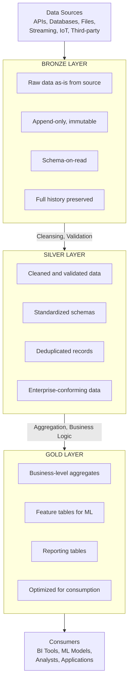
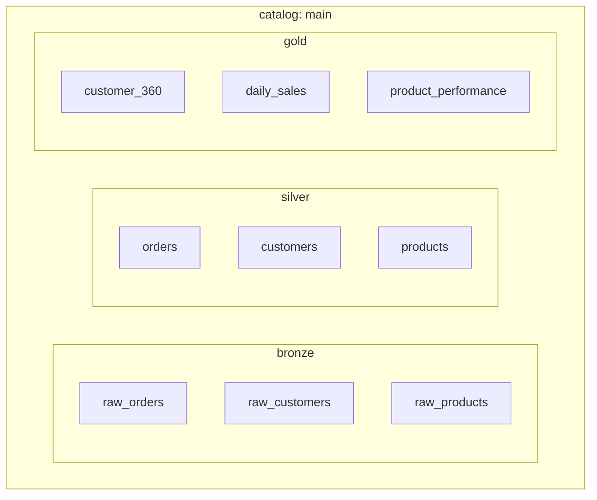

# Medallion Architecture

The Medallion Architecture (also called Multi-Hop Architecture) is a data design pattern used to organize data in a lakehouse. It progressively refines data quality through three layers: Bronze, Silver, and Gold.

## Overview



## Layer Details

### Bronze Layer (Raw)

The Bronze layer stores raw data exactly as received from source systems.

**Characteristics:**

- Raw, unprocessed data
- Append-only writes
- Preserves complete history
- Minimal transformations (maybe add metadata)
- Schema-on-read approach

**Common Additions:**

- Ingestion timestamp
- Source system identifier
- File name/path
- Processing metadata

```python
# Example: Ingest raw data to Bronze
raw_df = spark.read.json("/mnt/landing/orders/")

bronze_df = raw_df.withColumn("_ingestion_timestamp", current_timestamp()) \
                  .withColumn("_source_file", input_file_name())

bronze_df.write.format("delta") \
    .mode("append") \
    .save("/mnt/bronze/orders")
```

```sql
-- SQL: Create Bronze table
CREATE TABLE bronze.orders (
  raw_data STRING,
  _ingestion_timestamp TIMESTAMP,
  _source_file STRING
)
USING DELTA
LOCATION '/mnt/bronze/orders';
```

### Silver Layer (Cleansed)

The Silver layer contains cleansed, validated, and deduplicated data.

**Characteristics:**

- Data quality enforcement
- Schema enforcement
- Deduplication
- Data type casting
- Standardized formats
- Null handling
- Business key identification

**Common Transformations:**

- Remove duplicates
- Cast data types
- Standardize column names
- Apply data quality rules
- Parse nested structures

```python
# Example: Transform Bronze to Silver
bronze_df = spark.read.format("delta").load("/mnt/bronze/orders")

silver_df = bronze_df \
    .dropDuplicates(["order_id"]) \
    .withColumn("order_date", to_date("order_date_str", "yyyy-MM-dd")) \
    .withColumn("amount", col("amount").cast("decimal(10,2)")) \
    .filter(col("order_id").isNotNull()) \
    .select(
        "order_id",
        "customer_id",
        "order_date",
        "amount",
        "status",
        "_ingestion_timestamp"
    )

silver_df.write.format("delta") \
    .mode("overwrite") \
    .option("mergeSchema", "true") \
    .save("/mnt/silver/orders")
```

```sql
-- SQL: MERGE into Silver
MERGE INTO silver.orders AS target
USING (
  SELECT DISTINCT
    order_id,
    customer_id,
    CAST(order_date AS DATE) AS order_date,
    CAST(amount AS DECIMAL(10,2)) AS amount,
    status
  FROM bronze.orders
  WHERE order_id IS NOT NULL
) AS source
ON target.order_id = source.order_id
WHEN MATCHED THEN UPDATE SET *
WHEN NOT MATCHED THEN INSERT *;
```

### Gold Layer (Curated)

The Gold layer contains business-ready, aggregated data optimized for consumption.

**Characteristics:**

- Business-level aggregations
- Denormalized for query performance
- Conforms to business definitions
- Optimized for specific use cases
- Feature tables for ML

**Common Patterns:**

- Summary tables
- Fact/Dimension models
- Feature stores
- KPI tables

```python
# Example: Create Gold aggregation
silver_orders = spark.read.format("delta").load("/mnt/silver/orders")
silver_customers = spark.read.format("delta").load("/mnt/silver/customers")

gold_customer_metrics = silver_orders \
    .groupBy("customer_id") \
    .agg(
        count("order_id").alias("total_orders"),
        sum("amount").alias("total_spend"),
        avg("amount").alias("avg_order_value"),
        max("order_date").alias("last_order_date")
    ) \
    .join(silver_customers, "customer_id") \
    .select(
        "customer_id",
        "customer_name",
        "total_orders",
        "total_spend",
        "avg_order_value",
        "last_order_date"
    )

gold_customer_metrics.write.format("delta") \
    .mode("overwrite") \
    .save("/mnt/gold/customer_metrics")
```

```sql
-- SQL: Create Gold aggregate table
CREATE OR REPLACE TABLE gold.daily_sales_summary AS
SELECT
  order_date,
  COUNT(DISTINCT customer_id) AS unique_customers,
  COUNT(order_id) AS total_orders,
  SUM(amount) AS total_revenue,
  AVG(amount) AS avg_order_value
FROM silver.orders
GROUP BY order_date;
```

## Layer Comparison

| Aspect           | Bronze            | Silver                    | Gold                       |
| ---------------- | ----------------- | ------------------------- | -------------------------- |
| **Data Quality** | Raw, as-is        | Cleansed, validated       | Aggregated, business-ready |
| **Schema**       | Schema-on-read    | Schema-on-write           | Denormalized               |
| **Updates**      | Append-only       | MERGE/Upsert              | Rebuild/Incremental        |
| **Consumers**    | Data engineers    | Analysts, data scientists | Business users, BI tools   |
| **Retention**    | Long-term archive | Medium-term               | Query-optimized            |
| **Performance**  | Not optimized     | Optimized for joins       | Optimized for queries      |

## Naming Conventions

### Database/Schema Naming

```text
bronze_<source>      → bronze_salesforce, bronze_sap
silver_<domain>      → silver_sales, silver_customers
gold_<use_case>      → gold_analytics, gold_ml_features
```

### Table Naming

```text
bronze.<source>_<entity>      → bronze.salesforce_accounts
silver.<domain>_<entity>      → silver.sales_orders
gold.<domain>_<aggregate>     → gold.sales_daily_summary
```

## Unity Catalog Structure



## Best Practices

### Bronze Layer

1. Never modify raw data
2. Add metadata columns (_ingestion_timestamp, _source_file)
3. Use Auto Loader for efficient file ingestion
4. Partition by ingestion date for manageability

### Silver Layer

1. Define clear data quality rules
2. Implement idempotent processing
3. Track data lineage
4. Use MERGE for incremental updates

### Gold Layer

1. Design for specific business questions
2. Pre-compute expensive aggregations
3. Optimize with Z-ordering on filter columns
4. Document business logic and definitions

## Use Cases

| Layer  | Use Case            | Example                          |
| ------ | ------------------- | -------------------------------- |
| Bronze | Audit/Compliance    | Retain all raw data for 7 years  |
| Bronze | Replay/Reprocessing | Re-run pipeline after bug fix    |
| Silver | Ad-hoc Analysis     | Analysts query clean data        |
| Silver | ML Training         | Data scientists prepare features |
| Gold   | Executive Dashboard | Real-time KPI reporting          |
| Gold   | ML Serving          | Low-latency feature lookup       |

## Common Issues

| Issue                    | Cause               | Solution                                         |
| ------------------------ | ------------------- | ------------------------------------------------ |
| Bronze growing too large | No retention policy | Implement VACUUM, archive old data               |
| Silver duplicates        | Missing deduplication| Add MERGE or dropDuplicates logic               |
| Gold stale data          | Batch refresh only  | Implement incremental refresh or streaming       |
| Schema drift             | Source changes      | Use Auto Loader schema evolution, add validation |

## Related Topics

- [Delta Lake Basics](delta-lake-basics.md)
- [Unity Catalog Basics](unity-catalog-basics.md)
- [Data Processing](../../certifications/data-engineer-professional/01-data-processing/README.md)

## Official Documentation

- [Databricks Medallion Architecture](https://docs.databricks.com/lakehouse/medallion.html)
- [What is a Lakehouse?](https://docs.databricks.com/lakehouse/index.html)
