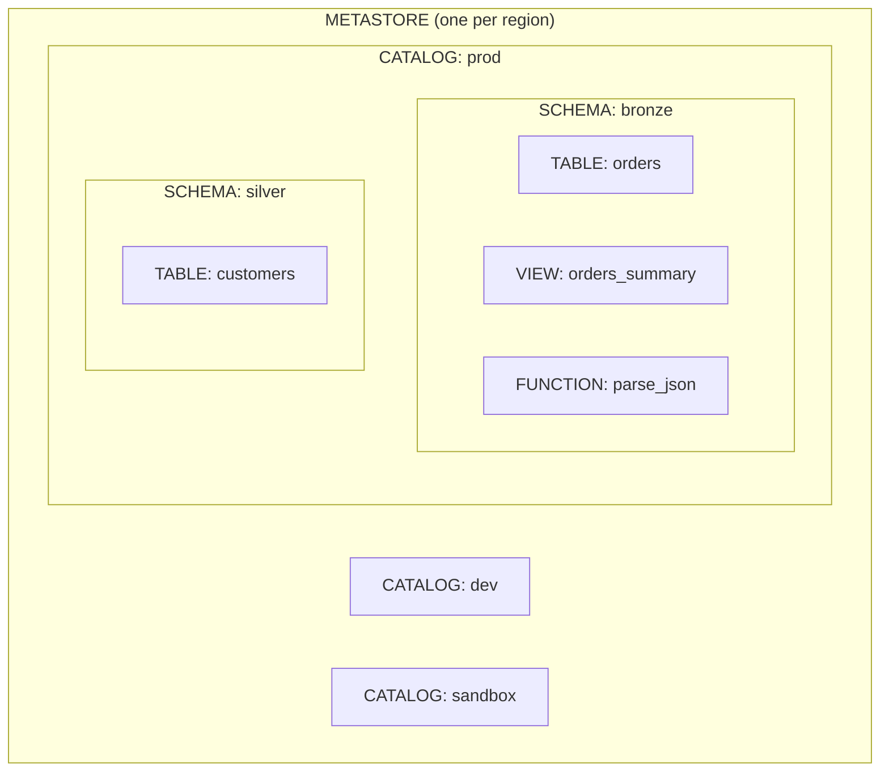
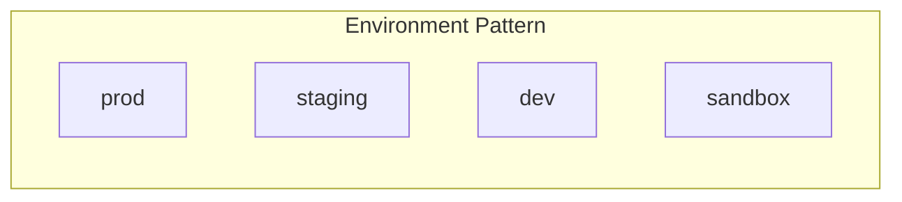
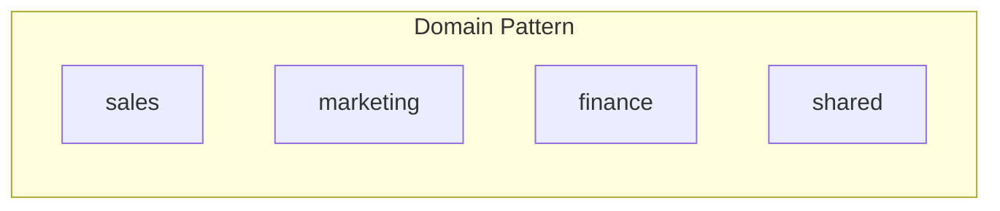

# Unity Catalog Basics

Unity Catalog is Databricks' unified governance solution for data and AI assets. It provides centralized access control, auditing, lineage, and data discovery across all workspaces.

## Overview

Unity Catalog provides:

- **Unified Governance** - Single place to manage permissions for all data assets
- **Data Discovery** - Search and browse data across workspaces
- **Audit Logging** - Track who accessed what data and when
- **Data Lineage** - Visualize data flow from source to consumption
- **Centralized Access Control** - Fine-grained permissions at any level

## Three-Level Namespace

Unity Catalog uses a three-level namespace: **Catalog → Schema → Object**



### Naming Convention

```sql
-- Full three-level name
catalog.schema.table

-- Examples
prod.bronze.raw_orders
dev.silver.customers
main.gold.daily_sales
```

## Key Concepts

### Metastore

The top-level container for all data assets. Typically one per cloud region.

- Contains catalogs, storage credentials, external locations
- Links to cloud storage for managed tables
- Attached to Databricks workspaces

### Catalog

A grouping of schemas (databases). Common patterns:

| Pattern | Example Catalogs |
|---------|------------------|
| Environment | `prod`, `dev`, `staging` |
| Domain | `sales`, `marketing`, `finance` |
| Team | `data_engineering`, `data_science` |

```sql
-- Create a catalog
CREATE CATALOG IF NOT EXISTS prod;

-- List catalogs
SHOW CATALOGS;

-- Use a catalog
USE CATALOG prod;
```

### Schema (Database)

A grouping of tables, views, and functions.

```sql
-- Create a schema
CREATE SCHEMA IF NOT EXISTS prod.bronze;

-- List schemas
SHOW SCHEMAS IN prod;

-- Use a schema
USE SCHEMA prod.bronze;
-- or
USE prod.bronze;
```

### Tables

#### Managed Tables

- Unity Catalog manages both metadata and data files
- Data stored in metastore's managed storage location
- Dropping the table deletes the data

```sql
-- Create managed table
CREATE TABLE prod.silver.customers (
  customer_id INT,
  name STRING,
  email STRING
);
```

#### External Tables

- Unity Catalog manages only metadata
- Data stored in external location you specify
- Dropping the table keeps the data

```sql
-- Create external table
CREATE TABLE prod.bronze.raw_orders
LOCATION 's3://my-bucket/raw/orders/'
AS SELECT * FROM json.`s3://my-bucket/landing/orders/`;
```

### Views

```sql
-- Standard view
CREATE VIEW prod.gold.active_customers AS
SELECT * FROM prod.silver.customers
WHERE status = 'active';

-- Materialized view (for SQL warehouses)
CREATE MATERIALIZED VIEW prod.gold.customer_summary AS
SELECT customer_id, COUNT(*) as order_count
FROM prod.silver.orders
GROUP BY customer_id;
```

### Functions

```sql
-- Create a function
CREATE FUNCTION prod.common.mask_email(email STRING)
RETURNS STRING
RETURN CONCAT(LEFT(email, 2), '****@', SPLIT(email, '@')[1]);

-- Use the function
SELECT prod.common.mask_email(email) FROM prod.silver.customers;
```

## Access Control

### Principals

| Principal Type | Description |
|----------------|-------------|
| User | Individual user account |
| Group | Collection of users |
| Service Principal | Application identity |

### Privileges

| Privilege | Description |
|-----------|-------------|
| `USE CATALOG` | Access catalog |
| `USE SCHEMA` | Access schema |
| `SELECT` | Read table/view data |
| `MODIFY` | Insert, update, delete data |
| `CREATE TABLE` | Create tables in schema |
| `CREATE SCHEMA` | Create schemas in catalog |
| `ALL PRIVILEGES` | All available privileges |

### Granting Permissions

```sql
-- Grant catalog access
GRANT USE CATALOG ON CATALOG prod TO `data_analysts`;

-- Grant schema access
GRANT USE SCHEMA ON SCHEMA prod.gold TO `data_analysts`;

-- Grant table access
GRANT SELECT ON TABLE prod.gold.daily_sales TO `data_analysts`;

-- Grant to all tables in schema
GRANT SELECT ON SCHEMA prod.gold TO `data_analysts`;

-- Revoke access
REVOKE SELECT ON TABLE prod.gold.daily_sales FROM `data_analysts`;

-- Show grants
SHOW GRANTS ON TABLE prod.gold.daily_sales;
```

### Ownership

Every securable object has an owner with full control.

```sql
-- Transfer ownership
ALTER TABLE prod.silver.customers
SET OWNER TO `data_engineering`;

-- Check ownership
DESCRIBE TABLE EXTENDED prod.silver.customers;
```

## External Locations and Credentials

### Storage Credentials

Manage authentication to cloud storage.

```sql
-- Create storage credential (admin only)
CREATE STORAGE CREDENTIAL my_s3_cred
WITH (
  AWS_IAM_ROLE = 'arn:aws:iam::123456789:role/databricks-access'
);
```

### External Locations

Map cloud storage paths to Unity Catalog.

```sql
-- Create external location
CREATE EXTERNAL LOCATION my_external_loc
URL 's3://my-bucket/external-data/'
WITH (STORAGE CREDENTIAL my_s3_cred);

-- Grant access
GRANT READ FILES ON EXTERNAL LOCATION my_external_loc TO `data_engineers`;
```

## Data Lineage

Unity Catalog automatically tracks lineage:

- Table-to-table dependencies
- Column-level lineage
- Notebook and job relationships

View lineage in the Databricks UI:

1. Navigate to a table in the Catalog Explorer
2. Click the "Lineage" tab
3. See upstream (sources) and downstream (consumers)

## Data Discovery

### Search

```sql
-- Search for tables (UI feature, or use information_schema)
SELECT *
FROM system.information_schema.tables
WHERE table_name LIKE '%customer%';
```

### Tags and Comments

```sql
-- Add table comment
COMMENT ON TABLE prod.silver.customers IS 'Customer master data from CRM';

-- Add column comment
ALTER TABLE prod.silver.customers
ALTER COLUMN email COMMENT 'Customer email address, PII';

-- Add tags (for classification)
ALTER TABLE prod.silver.customers
SET TAGS ('pii' = 'true', 'owner' = 'data-team');
```

## Common Patterns

### Environment Isolation



### Data Mesh



## Use Cases

| Use Case | How Unity Catalog Helps |
|----------|------------------------|
| Compliance (GDPR, CCPA) | Audit logs, access control, data lineage |
| Data Discovery | Search, tags, comments, lineage visualization |
| Multi-team Collaboration | Fine-grained permissions, catalog isolation |
| Data Quality | Lineage tracking, centralized metadata |
| ML Governance | Track models, features, and training data |

## Common Issues

| Issue | Cause | Solution |
|-------|-------|----------|
| `PERMISSION_DENIED` | Missing grants | Grant required privilege to user/group |
| `CATALOG_NOT_FOUND` | Catalog doesn't exist or no access | Check catalog exists, grant USE CATALOG |
| `TABLE_NOT_FOUND` | Wrong namespace or no access | Use full three-level name, check grants |
| External table read fails | Missing external location access | Grant READ FILES on external location |

## Migration from Hive Metastore

```sql
-- Upgrade table from Hive metastore to Unity Catalog
CREATE TABLE prod.silver.customers
AS SELECT * FROM hive_metastore.default.customers;

-- Or use SYNC to keep in sync during migration
```

## Related Topics

- [Delta Lake Basics](delta-lake-basics.md)
- [Databricks Workspace](databricks-workspace.md)
- [Security and Governance](../../certifications/data-engineer-professional/04-security-governance/README.md)

## Official Documentation

- [Unity Catalog Documentation](https://docs.databricks.com/data-governance/unity-catalog/index.html)
- [Unity Catalog Best Practices](https://docs.databricks.com/data-governance/unity-catalog/best-practices.html)
- [Privileges and Securable Objects](https://docs.databricks.com/data-governance/unity-catalog/manage-privileges/index.html)
