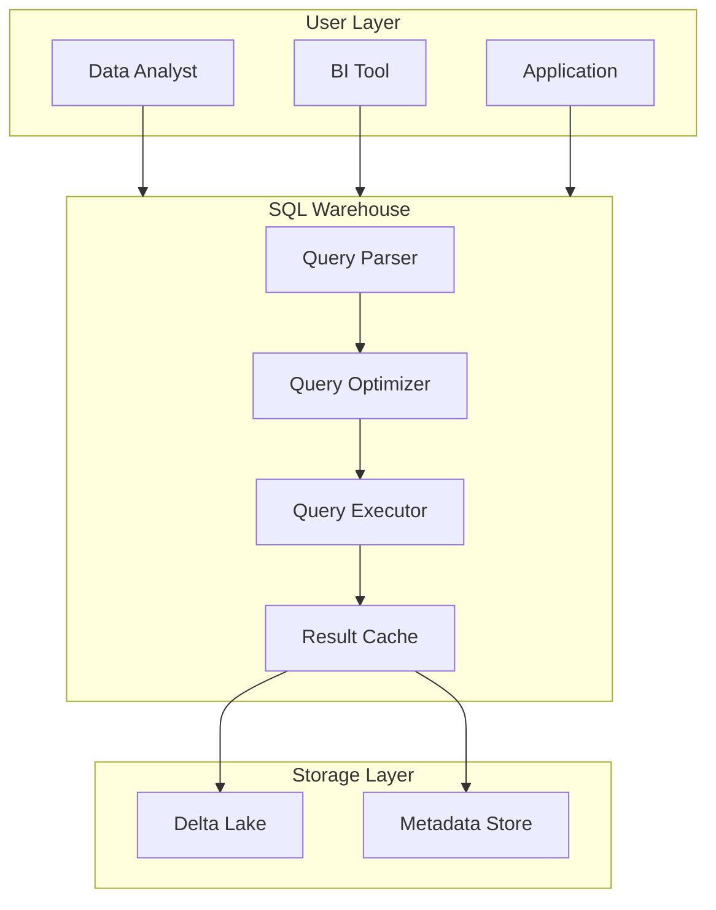
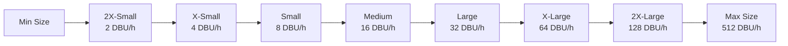
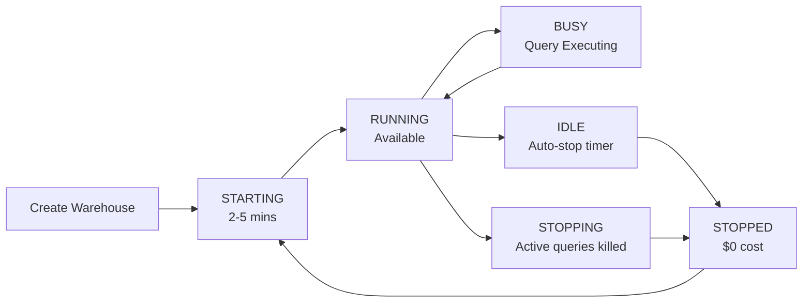

# SQL Warehouses

## Overview

Databricks SQL provides SQL warehouses (formerly SQL endpoints) as managed, serverless compute resources optimized for SQL analytics. These are purpose-built for running SQL queries with enterprise-grade reliability, security, and performance.

## SQL Warehouse Architecture



## SQL Warehouse Types

Databricks offers three SQL warehouse types optimized for different use cases:

### **Pro Warehouses**

- **Best for**: Production analytics workloads
- **Compute**: On-demand, scales automatically
- **Features**:
  - Serverless scaling up to hundreds of nodes
  - Spot instances for cost optimization
  - Shared queues for fair resource allocation
- **Cost model**: Pay per DBU (Databricks Unit) consumed
- **Performance**: Best for unpredictable, variable workloads
- **Use cases**: Dashboard refresh, ad-hoc queries, batch jobs

```sql
-- Pro warehouse is ideal for mixed workloads
SELECT COUNT(*), customer_segment
FROM sales
GROUP BY customer_segment;
```

### **Classic Warehouses (Legacy)**

- **Deprecated in favor of Pro**
- Still available for legacy systems
- Slower startup time
- Recommend migration to Pro

### **Serverless SQL Warehouses**

- **Best for**: Predictable, consistent workloads
- **Setup**: Fully managed, no configuration needed
- **Scaling**: Automatic based on query load
- **Pricing**: Simplified per-query billing
- **Performance**: Optimized for common query patterns
- **Use cases**: Real-time dashboards, frequent queries

## SQL Warehouse Configuration

### Size and Auto-scaling



| Size | CPU Cores | Memory | DBU/hour | Best For |
|------|-----------|--------|----------|----------|
| 2X-Small | 8 | 16 GB | 2 | Light queries, low concurrency |
| X-Small | 16 | 32 GB | 4 | Small to medium queries |
| Small | 32 | 64 GB | 8 | Standard analytics |
| Medium | 64 | 128 GB | 16 | Complex joins, aggregations |
| Large | 128 | 256 GB | 32 | Large datasets, concurrency |
| X-Large | 256 | 512 GB | 64 | Enterprise workloads |
| 2X-Large | 512 | 1024 GB | 128 | Massive parallel processing |

### Important Configuration Parameters

```yaml
# Auto-scaling Settings

min_num_clusters: 1        # Minimum instances to keep running
max_num_clusters: 10       # Maximum instances to scale to
auto_stop_mins: 20         # Minutes before shutdown

# Performance Settings

enable_spot_instances: true        # Cost optimization with spot VMs
enable_result_cache: true          # Cache query results
enable_schema_evolution: true      # Allow schema changes

# Concurrency Settings

sql_max_connections: 100           # Max concurrent connections
query_queue_timeout_mins: 30       # Wait time in queue
```

## DBU Consumption Model

**DBU (Databricks Unit)**: Pricing metric = 0.4 AWS vCPU-hours or GCP vCPU-hours

### Calculation Example

```python
# DBU Cost Calculation

warehouse_size_dbu_per_hour = 16      # Medium warehouse
hours_run = 8                          # 8 hours
total_dbu = warehouse_size_dbu_per_hour * hours_run

# total_dbu = 128 DBUs

dbu_cost = total_dbu * 0.40           # ~$0.40/DBU average
# Cost = 128 * 0.40 = $51.20

```

### Cost Optimization Strategies

1. **Right-size your warehouse**: Start small, monitor usage, scale gradually
2. **Use auto-scaling**: Let Databricks scale to demand, pay only for what you use
3. **Enable spot instances**: Up to 70% cost savings with spot VMs
4. **Set auto-stop**: Pause warehouses during off-hours automatically
5. **Share warehouses**: Multiple teams on one warehouse reduces per-team cost
6. **Use result caching**: Repeat queries return cached results instantly

## SQL Warehouse Lifecycle



### State Descriptions

| State | Cost | Action | Duration |
|-------|------|--------|----------|
| **RUNNING** | Yes | Accepting queries | Ongoing |
| **IDLE** | Yes | No queries, countdown to stop | Until auto-stop timeout |
| **STOPPED** | No | No cost, can restart | Indefinite |
| **STARTING** | Limited | Initialization, queries queued | 2-5 minutes |
| **STOPPING** | No | Graceful shutdown initiated | 1-2 minutes |

## Query Execution & Performance

### Query Processing Pipeline

```text
SQL Query (Text)
    ↓
Parsing (Check syntax)
    ↓
Semantic Analysis (Resolve tables, columns)
    ↓
Logical Planning (Build query tree)
    ↓
Query Optimization (Rewrite for efficiency)
    ↓
Physical Planning (Execute strategy)
    ↓
Execution (Run on distributed cluster)
    ↓
Results (Return to client)
```

### Query Timeout and Concurrency

```sql
-- Set query timeout (5 minutes)
SET statement_timeout = 300000;  -- milliseconds

-- Check active queries
SELECT * FROM system.query_history
WHERE query_start_time > CURRENT_TIMESTAMP - INTERVAL 1 HOUR
ORDER BY query_start_time DESC;
```

## Result Caching

Databricks automatically caches query results for 24 hours:

```sql
-- This query result is cached
SELECT COUNT(*) FROM sales WHERE year = 2024;

-- Exact same query uses cache (returned instantly)
SELECT COUNT(*) FROM sales WHERE year = 2024;

-- Different query or different year - no cache
SELECT COUNT(*) FROM sales WHERE year = 2025;
```

### Cache Invalidation

Cache is invalidated when:

- Underlying table data changes (INSERT, UPDATE, DELETE, MERGE)
- Table schema changes
- Table is replaced or recreated
- 24-hour TTL expires

## SQL Warehouse Monitoring

### Key Metrics to Track

| Metric | What It Measures | Healthy Range | Action If High |
|--------|------------------|---------------|-----------------|
| **Query Latency** | Time from submission to completion | < 30s for dashboards | Check query plan, add indexes |
| **Concurrency** | Queries running simultaneously | 20-50 queries | Increase warehouse size |
| **Queue Wait Time** | Time query waits before execution | < 5 seconds | Add warehouse capacity |
| **Warehouse Utilization** | % time warehouse is busy | 60-80% | Right-size or consolidate |
| **Cache Hit Rate** | % of queries using cached results | > 40% for dashboards | Optimize caching strategy |

### Monitoring via Databricks UI

```sql
-- Query performance history
SELECT
    query_id,
    user_name,
    query_text,
    execution_time_ms,
    rows_produced,
    query_start_time
FROM system.query_history
WHERE warehouse_id = 'abc123'
ORDER BY query_start_time DESC
LIMIT 100;
```

## SQL Warehouse Best Practices

### **Right-sizing for Your Workload**

```sql
-- Start with Small warehouse for analytics
-- Monitor query performance and scale up as needed
-- Use Small → Medium → Large progression
```

### **Query Optimization**

```sql
-- ❌ Inefficient - full table scan
SELECT * FROM large_table WHERE col IS NOT NULL;

-- ✅ Efficient - column projection and predicate pushdown
SELECT id, name, amount
FROM large_table
WHERE status = 'active' AND date >= '2024-01-01';
```

### **Use Appropriate Data Types**

```sql
-- ❌ Storage waste - string instead of integer
CREATE TABLE users (id STRING, name STRING, age STRING);

-- ✅ Appropriate types
CREATE TABLE users (id INT, name STRING, age INT);
```

### **Partition Large Tables**

```sql
-- Partition by date for faster filtering
CREATE TABLE sales (
    id INT,
    amount DECIMAL(10,2),
    sale_date DATE
)
PARTITIONED BY (sale_date);

-- Query only relevant partitions
SELECT SUM(amount)
FROM sales
WHERE sale_date >= '2024-01-01';  -- Fast!
```

### **Schedule Peak Workloads**

- Run heavy analytical jobs during off-peak hours
- Dashboard refreshes during business hours (smaller warehouse)
- Batch jobs overnight (larger warehouse, cost-optimized)

### **Use Multiple Warehouses**

```yaml
# Example warehouse strategy

dashboards:
  size: Small
  purpose: Interactive dashboards
  cost: Low

batch_jobs:
  size: Large
  purpose: Heavy analytical processing
  cost: Higher but time-limited

testing:
  size: 2X-Small
  purpose: Development and testing
  cost: Minimal
```

## Use Cases

- **Large Scale Transformations**: Leveraging Spark SQL distributed execution semantics to transform multi-terabyte datasets efficiently.
- **Cost Management**: Right-sizing SQL warehouses and configuring auto-stop to control DBU spend while maintaining query performance for dashboards and ad-hoc analysis.

## Common Issues & Errors

### OOM Errors

**Scenario:** Data skew causes an executor to run out of memory.
**Fix:** Use Adaptive Query Execution (AQE) and review joining logic.

### Query Timeout on Large Datasets

**Scenario:** Queries on unpartitioned large tables time out on small SQL warehouses.
**Fix:** Scale up the warehouse size or add `WHERE` filters to reduce data scanned. Use `EXPLAIN` to check scan size before running.

## Exam Tips

- Know the three warehouse types (Pro, Classic/legacy, Serverless) and when to use each
- Understand DBU cost calculations: warehouse size (DBU/h) multiplied by hours run
- Remember result cache duration is 24 hours and is invalidated by data changes or schema updates
- Scaling mid-query does not affect running queries; only new queries use the scaled size

## Key Takeaways

- **SQL Warehouses**: Serverless, managed compute for SQL analytics
- **Three types**: Pro (default), Classic (legacy), Serverless
- **Auto-scaling**: Automatically adjusts cluster size 2-512 DBUs
- **DBU pricing**: Consumption-based, ~$0.40 per DBU (AWS/GCP)
- **Result caching**: 24-hour cache for identical queries
- **Concurrency**: Handles multiple queries with fair queuing
- **Auto-stop**: Automatically stops warehouses to save costs
- **Monitoring**: Use `system.query_history` for performance insights
- **Performance**: Spot instances, query optimization, right-sizing are key

## Related Topics

- [SQL Essentials](../../../shared/fundamentals/sql-essentials.md) - Core SQL concepts for Databricks
- [Spark Fundamentals](../../../shared/fundamentals/spark-fundamentals.md) - Understanding the compute engine behind SQL warehouses
- [Performance Optimization Cheat Sheet](../../../shared/cheat-sheets/performance-optimization.md) - Quick reference for tuning queries

## Official Documentation

- [Databricks SQL Warehouses](https://docs.databricks.com/sql/admin/sql-endpoints.html)
- [SQL Warehouse Types](https://docs.databricks.com/sql/admin/warehouse-type.html)

---

**[↑ Back to Databricks SQL](./README.md) | [Next: Query Editor & Execution](./02-query-editor.md) →**
