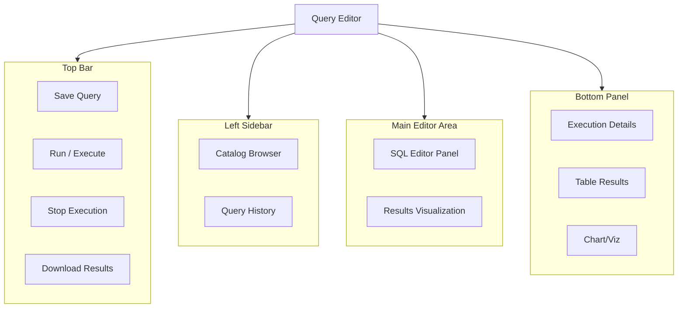
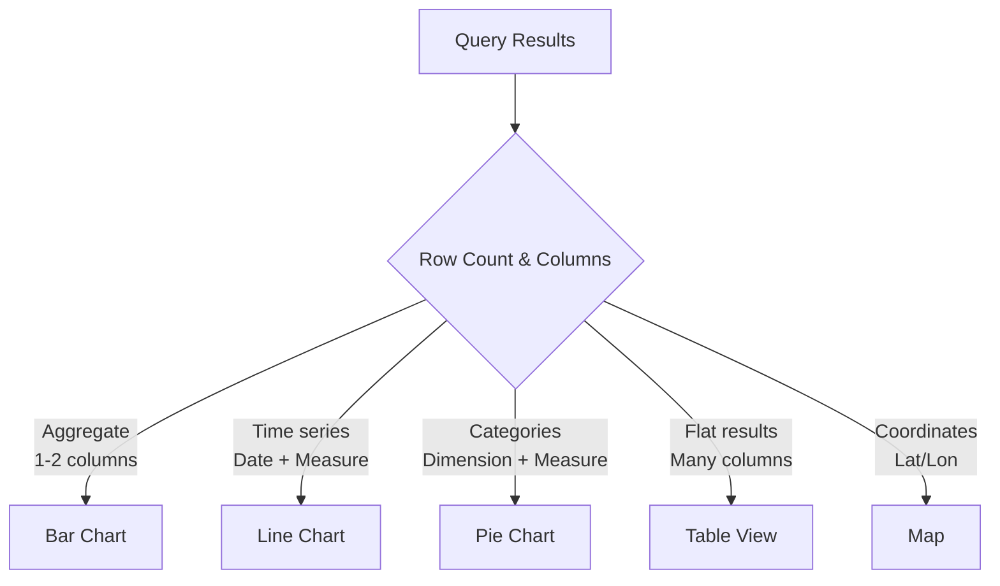

# Query Editor & Execution

## Overview

The Databricks SQL Query Editor is a web-based IDE for writing, executing, and visualizing SQL queries. It provides syntax highlighting, autocomplete, result visualization, and performance insights.

## Query Editor Interface



## Writing Queries

### Editor Features

**Syntax Highlighting**: Automatic color-coding for SQL keywords

```sql
SELECT      -- Blue (keyword)
    id,     -- White (identifier)
    name,   -- White (identifier)
    100     -- Green (number)
FROM users;
```

**Autocomplete**: Type Ctrl+Space for suggestions

```sql
SELECT * FROM sales WHERE [Ctrl+Space]
-- Suggests: date_created, status, amount, customer_id, etc.
```

**Query Templates**: Pre-built patterns for common tasks

### Multi-statement Editor

Execute multiple SQL statements in sequence:

```sql
-- Statement 1: Create a temporary view
CREATE TEMPORARY VIEW active_users AS
SELECT * FROM users WHERE status = 'active';

-- Statement 2: Query the view
SELECT COUNT(*) as active_count FROM active_users;

-- Statement 3: Clean up (optional)
DROP VIEW active_users;
```

### Comments

```sql
-- Single-line comment
/*
   Multi-line comment
   Can span multiple lines
   Useful for documentation
*/

SELECT
    id,           -- Customer ID
    name,         -- Full name
    email         /* Email address
                     Primary contact */
FROM customers;
```

## Query Execution

### Running Queries

1. **Execute Full Query**: Ctrl+Enter or Cmd+Enter
2. **Execute Selected Text**: Select code block + Ctrl+Enter
3. **Execute Line**: Cursor on line + Ctrl+Enter
4. **Stop Execution**: Click Stop button or Ctrl+Alt+C

### Execution Flow

```text
User submits query
    ↓
Query sent to warehouse
    ↓
Parser checks syntax
    ↓
Optimizer creates execution plan
    ↓
Executor runs on cluster
    ↓
Results collected
    ↓
Display in UI / Cache
```

### Execution Information

```sql
-- View query execution details
SELECT * FROM system.query_history
WHERE query_id = 'abc123'
LIMIT 1;

-- Returns: user_name, warehouse_id, execution_time_ms,
--          rows_produced, query_start_time, query_end_time
```

## Parameters in Queries

### Using Query Parameters

Query parameters allow dynamic queries without editing code:

```sql
-- Define parameter with syntax: {{ parameter_name }}
SELECT *
FROM sales
WHERE region = '{{ region }}'
AND date >= '{{ start_date }}';
```

### Parameter Types

| Type | Example | Use Case |
|------|---------|----------|
| **Text** | `{{ customer_name }}` | String values |
| **Number** | `{{ min_amount }}` | Numeric filtering |
| **Date** | `{{ selected_date }}` | Time-based queries |
| **List** | `{{ status }}` | Multiple choice from dropdown |

### Parameter in Dashboard Context

```sql
-- When embedded in dashboard, users select values
SELECT
    customer_id,
    SUM(amount) as total_sales
FROM sales
WHERE region = '{{ region }}'      -- User selects region
AND year = {{ year }}              -- User selects year
GROUP BY customer_id
ORDER BY total_sales DESC
LIMIT {{ top_n }};                 -- User selects top N
```

## Result Visualization

### Auto-generated Visualizations

Databricks automatically suggests visualizations based on result shape:



### Chart Configuration

```yaml
Table Results Tab:
  Display: Raw SQL results in table format
  Sorting: Click column headers
  Filtering: Built-in quick filters
  Export: Download as CSV/JSON

Visualization Tab:
  Chart Type: Bar, Line, Area, Pie, etc.
  Aggregation: Automatic or manual
  Grouping: X-axis, Y-axis
  Formatting: Colors, labels, legend
```

### Customizing Visualizations

```sql
-- Pie chart: category distribution
SELECT category, COUNT(*) as count
FROM products
GROUP BY category;

-- Line chart: trend over time
SELECT
    DATE_TRUNC('day', created_at) as day,
    COUNT(*) as daily_count
FROM transactions
GROUP BY DATE_TRUNC('day', created_at)
ORDER BY day;

-- Scatter plot: correlation analysis
SELECT
    age,
    income,
    purchase_amount
FROM customers;
```

## Saving and Sharing Queries

### Save Query

```text
File → Save Query
Name: "Q1 Sales Analysis by Region"
Folder: /Queries/Analytics/
```

### Query Metadata

```text
Query Name: Q1 Sales Analysis by Region
Description: Analyzes regional sales performance YoY
Last Modified: Feb 20, 2024
Author: analyst@company.com
Warehouse: prod_warehouse
```

### Sharing Queries

```yaml
Access Levels:
  Owner: Full edit/delete access
  Editor: Can modify and run
  Viewer: Can view and run only

Share With:
  - Individual users
  - Groups
  - Teams
  - Everyone (organization-wide)
```

## Query History

### Accessing Query History

Navigation: SQL Editor → History sidebar

```sql
-- Query history stored in system table
SELECT
    query_id,
    user_name,
    query_text,
    statement_type,      -- SELECT, INSERT, UPDATE, etc.
    execution_time_ms,
    rows_produced,
    query_status,        -- SUCCESS, FAILED, CANCELLED
    error_message,
    warehouse_id,
    query_start_time,
    query_end_time
FROM system.query_history
WHERE query_start_time > CURRENT_TIMESTAMP - INTERVAL 7 DAYS
ORDER BY query_start_time DESC;
```

### API Access to Query History

```python
# Python: Fetch query history programmatically

from databricks.sql import connect

conn = connect(
    host="dbc-abc123.cloud.databricks.com",
    http_path="/sql/1.0/warehouses/abc123",
    auth_type="pat",
    token="dapi..."
)

cursor = conn.cursor()
cursor.execute("""
SELECT query_id, query_text, execution_time_ms
FROM system.query_history
LIMIT 10
""")

for row in cursor.fetchall():
    print(row)
```

## Performance Insights

### Query Metrics

**Execution Time (ms)**: Total time from submission to completion

```text
Parse Time:        5 ms  (syntax checking)
Planning Time:     20 ms (optimization)
Execution Time:    450 ms (actual computation)
Total:             475 ms
```

### Optimization Suggestions

```sql
-- Query plan analysis
EXPLAIN SELECT * FROM sales WHERE status = 'active';

-- Output:
--   Filter [status#1 = 'active']
--   └─ Scan parquet [id#0, status#1, amount#2]
--      PushedFilters: [Status = 'active']
--      Metrics: 150 rows, 2.3 MB
```

### Performance Tips

| Issue | Cause | Solution |
|-------|-------|----------|
| Slow query | Full table scan | Add WHERE clause filter |
| Slow join | No index on join key | Ensure proper indexing |
| OOM error | Too much data in memory | Add LIMIT, partition, sample |
| Timeout | Query too complex | Break into steps, materialize intermediate |

## Notebook vs Query Editor

### Query Editor

- **Best for**: Ad-hoc SQL queries, quick analysis
- **Interface**: Web-based, SQL-focused
- **Results**: Visualizations, charts
- **Sharing**: Shareable query links
- **Collaboration**: Comments on queries

```text
Query Editor
├─ Single file = SQL queries
├─ Auto-visualization
├─ Quick execution
└─ Results management
```

### SQL Notebook

- **Best for**: Complex workflows, documentation
- **Support**: SQL + Python cells
- **Control**: More granular, step-by-step
- **Versioning**: Git integration possible
- **Format**: Supports Markdown cells

```text
SQL Notebook
├─ Multiple cells
├─ SQL + Markdown + Python
├─ Rich documentation
└─ Version history
```

## Keyboard Shortcuts

| Shortcut | Action | Platform |
|----------|--------|----------|
| Ctrl+Enter / Cmd+Enter | Execute query | Common |
| Ctrl+Alt+C | Cancel query | Windows/Linux |
| Cmd+Alt+C | Cancel query | macOS |
| Ctrl+Space | Autocomplete | Common |
| Ctrl+/ | Toggle comment | Common |
| Ctrl+H | Show shortcut help | Common |
| Ctrl+S / Cmd+S | Save query | Common |

## API-based Query Execution

### Python: SqlAlchemy

```python
from sqlalchemy import create_engine, text

engine = create_engine(
    "databricks:///?http_path=/sql/1.0/warehouses/abc123&"
    "catalog=main&schema=analytics"
)

with engine.connect() as conn:
    result = conn.execute(text("""
        SELECT * FROM sales
        WHERE amount > :min_amount
    """), min_amount=1000)

    for row in result:
        print(row)
```

### REST API

```bash
# Execute SQL query via REST API

curl -X POST \
  https://dbc-abc123.cloud.databricks.com/api/2.0/sql/statements \
  -H "Authorization: Bearer dapi..." \
  -d '{
    "warehouse_id": "abc123",
    "statement": "SELECT COUNT(*) FROM sales"
  }'

# Response includes execution_id for polling
# {"statement_id": "xyz789", "state": "RUNNING", ...}

```

## Use Cases

- **Ad-hoc Data Exploration**: Analysts use the query editor to quickly explore datasets, test hypotheses, and prototype queries before embedding them in dashboards.
- **Parameterized Reporting**: Building reusable queries with `{{ parameters }}` that non-technical stakeholders can filter without modifying SQL code.

## Common Issues & Errors

### Query Results Truncated

**Scenario:** Query editor shows partial results for large result sets.
**Fix:** The editor limits displayed rows (default 1000). Use `LIMIT` to control output or export full results to a file.

## Exam Tips

- Know the parameter syntax: double curly braces `{{ parameter_name }}`
- Understand that Ctrl+Enter (Cmd+Enter on macOS) executes the full query or selected text
- Result caching lasts 24 hours and is invalidated when underlying data changes
- Query history is stored in `system.query_history` and is queryable via SQL

## Key Takeaways

- **Query Editor**: Web IDE for SQL development with visualization
- **Parameters**: Dynamic queries using `{{ parameter_name }}` syntax
- **Autocomplete**: Suggestions for tables, columns, functions
- **Execution**: Ctrl+Enter runs query, results auto-visualized
- **Query History**: Stored in `system.query_history` table
- **Visualization**: Auto-suggested based on result shape (table, chart, etc.)
- **Sharing**: Queries shareable with fine-grained access controls
- **API**: Programmable via Python SqlAlchemy, REST API, or CLI

## Related Topics

- [SQL Essentials](../../../shared/fundamentals/sql-essentials.md) - Core SQL concepts used in the query editor
- [SQL Functions Cheat Sheet](../../../shared/cheat-sheets/sql-functions.md) - Quick reference for common SQL functions
- [Query Parameters & Dynamic Queries](../05-analytics-applications/01-parameters-queries.md) - Deep dive into parameterized queries

## Official Documentation

- [Databricks SQL Query Editor](https://docs.databricks.com/sql/user/queries/index.html)
- [Query Parameters](https://docs.databricks.com/sql/user/queries/query-parameters.html)

---

**[← Previous: SQL Warehouses](./01-sql-warehouses.md) | [↑ Back to Databricks SQL](./README.md) | [Next: Connections & Integrations](./03-connections.md) →**
