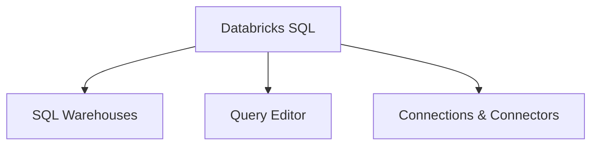

# Databricks SQL (22% of Exam)

Understanding Databricks SQL warehouses and query execution.

## Topics Overview

## Section Contents

| File | Topic | Priority |
| :--- | :--- | :--- |
| [01-sql-warehouses.md](01-sql-warehouses.md) | Warehouse types, configuration, pricing | High |
| [02-query-editor.md](02-query-editor.md) | Query editor interface, execution | High |
| [03-connections.md](03-connections.md) | Connections and integrations | Medium |

---

**[← Back to Certification](../README.md)**
