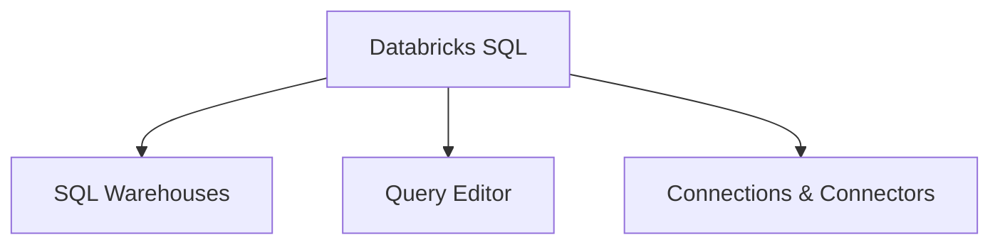

# Databricks SQL (22% of Exam)

Understanding Databricks SQL warehouses and query execution.

## Topics Overview

## Section Contents

| File | Topic | Priority |
| :--- | :--- | :--- |
| [01-sql-warehouses.md](01-sql-warehouses.md) | Warehouse types, configuration, pricing | High |
| [02-query-editor.md](02-query-editor.md) | Query editor interface, execution | High |
| [03-connections.md](03-connections.md) | Connections and integrations | Medium |

## Key Concepts

| Concept | Definition |
|:---|:---|
| **SQL Warehouse** | Compute resource for running SQL queries in Databricks; available as Classic, Pro, or Serverless |
| **Serverless SQL Warehouse** | Fully managed compute — no configuration needed, instant start, automatic scaling |
| **Query Editor** | Browser-based interface for writing and running SQL queries, with autocomplete and results visualization |
| **Query History** | Record of all executed queries with execution time, status, and resource usage |
| **Connections** | Integration points that allow external BI tools (Tableau, Power BI) to connect to Databricks SQL |
| **JDBC/ODBC** | Standard database connectivity protocols used by external tools to connect to SQL warehouses |

## Related Resources

- [SQL Essentials](../../../shared/fundamentals/sql-essentials.md)
- [Unity Catalog Basics](../../../shared/fundamentals/unity-catalog-basics.md)
- [SQL Functions Cheat Sheet](../../../shared/cheat-sheets/sql-functions.md)
- [DESCRIBE & SHOW Commands](../../../shared/cheat-sheets/describe-show-commands.md)

---

**[← Back to Certification](../README.md)**
