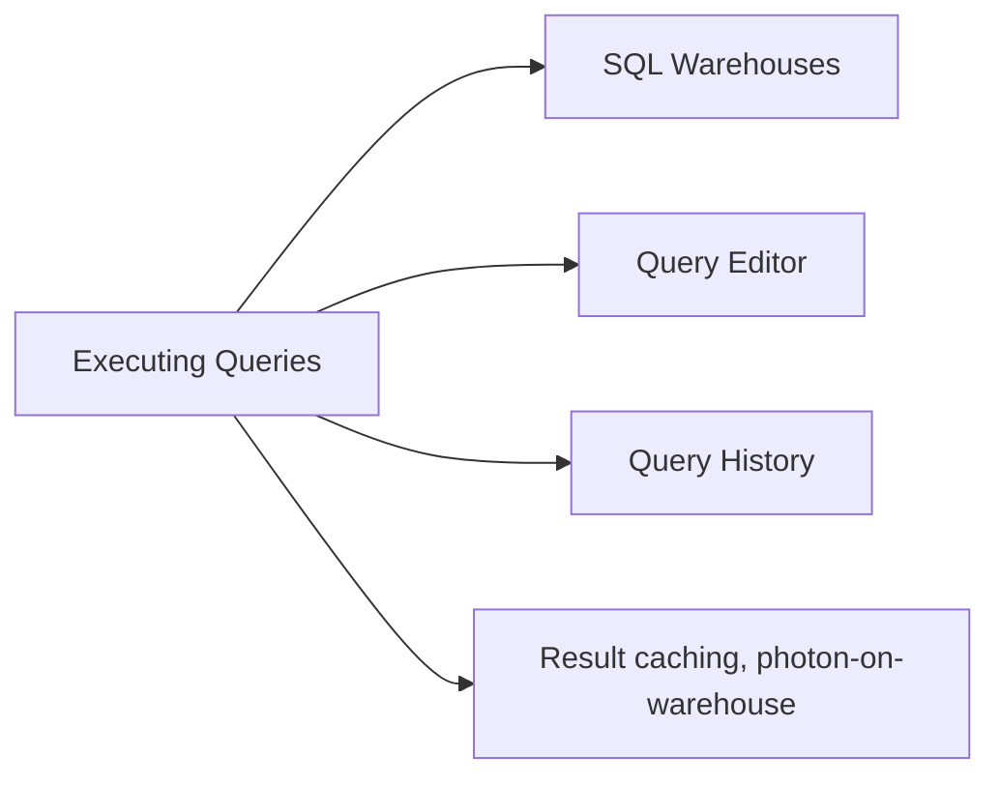

# Executing Queries Using Databricks SQL and Warehouses (20 % of Exam)

The largest domain in the October 2025 blueprint. Covers SQL Warehouses (Pro / Serverless / Classic), the query editor, query history, query optimisation hints, and the runtime environment that analysts work in.

## Topics Overview

## Section Contents

| File | Topic | Priority |
| :--- | :--- | :--- |
| [01-sql-warehouses.md](./01-sql-warehouses.md) | SQL Warehouse sizes, Pro vs Serverless vs Classic, autoscaling | High |
| [02-query-editor.md](./02-query-editor.md) | Query editor UX, snippets, run-as identity, sharing | High |

## Key Concepts

| Concept | Why it matters |
| :--- | :--- |
| **Serverless SQL Warehouse** | Starts in seconds, scales transparently, Photon-on by default — the modern default for new workloads |
| **Pro vs Classic** | Pro adds Photon, Predictive I/O, materialised views; Classic is the legacy single-cluster option |
| **Query result caching** | Per-warehouse cache; identical queries return instantly until the underlying data changes |
| **Query history** | Per-warehouse and per-workspace view of every query — used for performance analysis |
| **Run-as identity** | A query runs under the executor's UC identity by default; shared queries respect the viewer's permissions |

## Related Resources

- [Databricks SQL documentation](https://docs.databricks.com/en/sql/index.html)
- [SQL Warehouses cheat sheet (shared)](../../../shared/cheat-sheets/sql-functions.md)

---

**[↑ Back to Data Analyst Associate](../README.md) | [Next: Creating Dashboards and Visualizations →](../02-creating-dashboards-and-visualizations/README.md)** *(first domain — no previous)*
