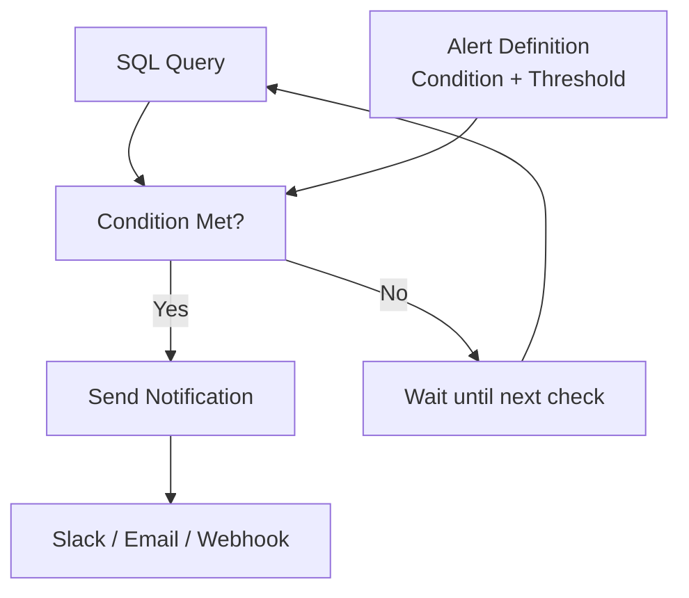

# Alerts & Scheduling

## Overview

Alerts notify stakeholders when data meets specific conditions. Scheduling automates query execution and report distribution. Together, they enable proactive monitoring and timely decision-making.

## Alerts Architecture



## Creating Alerts

### Alert Types

```yaml
Alert Conditions:
  Threshold: Value crosses limit (e.g., > 1000)
  Change: Value changes by % (e.g., ↓10% from baseline)
  Anomaly: Statistical outlier detection
  Comparison: Compares to previous period

Evaluation Frequency:
  Every 5 minutes: Real-time alerts
  Hourly: Standard monitoring
  Daily: Batch/overnight checks
  Weekly: Trend analysis
```

### Basic Alert Setup

```sql
-- Query that triggers alert
SELECT COUNT(*) as failed_transactions
FROM transactions
WHERE status = 'failed'
AND created_at >= CURRENT_TIMESTAMP - INTERVAL 1 HOUR;

-- Alert Configuration:
-- Alert name: "High Failed Transaction Rate"
-- Condition: Result > 100
-- Frequency: Every 5 minutes
-- Action: Send to Slack channel #alerts
```

### Alert Templates

**Template 1: Threshold Alert**

```sql
-- Send alert if daily revenue < $100k
SELECT SUM(amount) as daily_revenue
FROM orders
WHERE order_date = CURRENT_DATE
AND status = 'completed';

-- Alert: IF daily_revenue < 100000 THEN notify
```

**Template 2: Anomaly Detection**

```sql
-- Alert on unusual customer acquisition
SELECT
    COUNT(*) as new_signups,
    AVG(signup_count) OVER (
        ORDER BY signup_date
        ROWS BETWEEN 30 PRECEDING AND 1 PRECEDING
    ) as avg_30d_baseline,
    STDDEV(signup_count) OVER (
        ORDER BY signup_date
        ROWS BETWEEN 30 PRECEDING AND 1 PRECEDING
    ) as stddev_30d
FROM daily_signups
ORDER BY signup_date DESC
LIMIT 1;

-- Alert logic: IF new_signups > avg_30d_baseline + 3*stddev THEN alert
```

**Template 3: Comparison Alert**

```sql
-- Compare to previous day
SELECT
    today_revenue,
    yesterday_revenue,
    ROUND((today_revenue - yesterday_revenue) * 100.0 / yesterday_revenue, 2) as pct_change
FROM (
    SELECT
        SUM(CASE WHEN order_date = CURRENT_DATE THEN amount ELSE 0 END) as today_revenue,
        SUM(CASE WHEN order_date = CURRENT_DATE - 1 THEN amount ELSE 0 END) as yesterday_revenue
    FROM orders
);

-- Alert: IF pct_change < -10% (>10% drop) THEN notify
```

## Alert Destinations

### Slack Integration

```yaml
Slack Alert Setup:
  1. Create Slack Workspace & Channel
     Channel: #databricks-alerts

  2. Create Webhook URL
     URL: https://hooks.slack.com/services/T00000000/B00000000/XXXXXXXXXXXX

  3. Configure Alert
     Destination: Slack Webhook
     Channel: #databricks-alerts
     Message: "Revenue alert: ${result} < $100k"
     Include: Query, timestamp, action link
```

**Slack Message Example:**

```text
⚠️ ALERT: High Failed Transactions
━━━━━━━━━━━━━━━━━━━━━━━━━━━━
Failed transactions (last hour): 156
Threshold: 100
Status: CRITICAL 🔴

Query: Failed Transaction Count
Last check: 2024-02-20 14:35 UTC

[View Dashboard] [Investigate] [Acknowledge]
```

### Email Alerts

```yaml
Email Configuration:
  Recipients:
    - operations@company.com
    - manager@company.com

  Subject: "[ALERT] Revenue Below Target"

  Body Template:
    Headline: Alert name and severity
    Details: Current value vs threshold
    Context: Historical comparison
    Action: Link to dashboard/query
    Timestamp: When detected
```

### Webhook (Custom Integration)

```yaml
Webhook Alert:
  URL: https://api.company.com/alerts/receive
  Method: POST
  Payload:
    {
      "alert_name": "Revenue Alert",
      "threshold": 100000,
      "current_value": 85000,
      "status": "critical",
      "timestamp": "2024-02-20T14:35:00Z"
    }

  Webhook Handler Options:
    - PagerDuty (incident management)
    - Jira (issue creation)
    - ServiceNow (ticketing)
    - Custom APIs
```

## Alert Management

### Managing Active Alerts

```yaml
Alert Dashboard:
  View:
    Status: Active, Muted, Disabled
    Frequency: Check interval
    Last Triggered: Timestamp
    Next Check: When alert runs again

  Actions:
    Edit: Change condition, threshold, message
    Test: Send test notification immediately
    Mute: Suppress for 1hr / 1 day / 1 week
    Disable: Turn off temporarily
    Delete: Remove alert permanently
```

### Alert Fatigue Prevention

```yaml
Best Practices:
  ✅ Set realistic thresholds (avoid false positives)
  ✅ Use dynamic baselines (not fixed values)
  ✅ Group related alerts (one notification)
  ✅ Escalate severity (warn → critical → page)
  ✅ Auto-resolve when condition clears

  ❌ Avoid:
    Too many alerts (notification fatigue)
    Static thresholds (don't adapt)
    No context (what action to take?)
    Always-on alerts (alerts to alerts)
```

### Alert History & Logging

```sql
-- Query alert history
SELECT
    alert_name,
    trigger_timestamp,
    alert_value,
    threshold,
    status,
    recipient,
    action_taken
FROM system.alert_history
WHERE trigger_timestamp >= CURRENT_TIMESTAMP - INTERVAL 30 DAYS
ORDER BY trigger_timestamp DESC;
```

## Query Scheduling

### Scheduled Query Execution

```yaml
Schedule Query:
  Query: "SELECT * FROM daily_summary"

  Frequency:
    Type: Cron expression
    Example: "0 8 * * MON" (Every Monday at 8 AM)

  Timezone: America/New_York

  On Complete:
    - Send results to email
    - Update materialized view
    - Trigger downstream job
    - No action (run only)
```

### Scheduling Patterns

**Daily Report**

```yaml
Schedule: "0 9 * * *"  # Every day at 9 AM
Query: Daily sales summary
Action: Email to executives
```

**Weekly Analysis**

```yaml
Schedule: "0 8 * * 1"  # Every Monday at 8 AM
Query: Weekly trends & anomalies
Action: Save to table / Email
```

**Monthly Refresh**

```yaml
Schedule: "0 0 1 * *"  # First day of month
Query: Month-end close procedures
Action: Update reporting tables
```

**Hourly Monitoring**

```yaml
Schedule: "0 * * * *"  # Every hour
Query: System health check
Action: Alert if issues detected
```

## Materialized Views (Scheduled Computation)

### Create Materialized View

```sql
-- Define aggregation to refresh periodically
CREATE MATERIALIZED VIEW daily_sales AS
SELECT
    DATE_TRUNC('day', order_date) as order_day,
    region,
    COUNT(*) as orders,
    SUM(amount) as revenue,
    AVG(amount) as avg_order_value
FROM orders
GROUP BY DATE_TRUNC('day', order_date), region;

-- Enable periodic refresh
ALTER MATERIALIZED VIEW daily_sales
SET TBLPROPERTIES (
    'materialized_view_refresh_schedule' = '0 0 * * *'  -- Daily at midnight
);
```

### Refresh Materialized View

```sql
-- Manual refresh
REFRESH MATERIALIZED VIEW daily_sales;

-- Query materialized view (fast!)
SELECT * FROM daily_sales
WHERE order_day >= CURRENT_DATE - 30;

-- Materialized views are pre-computed, so queries are instant
-- vs re-computing from raw data every time
```

## Scheduled Report Distribution

### Schedule Query Results Export

```yaml
Query: Monthly Revenue Report

Schedule: "0 1 1 * *"  (1st day of month at 1 AM)

Export Options:
  Format: CSV, Excel, JSON, PDF
  Destination:
    - Email to: sales-team@company.com
    - Save to: S3 bucket / Azure storage
    - Post to: Slack channel #reports

Filename: "Monthly_Revenue_{{ date }}.csv"

Recipients:
  To: team@company.com, manager@company.com
  CC: analytics@company.com
  Subject: "{{ report_name }} - {{ date }}"
```

### Create Scheduled Job

```sql
-- Using Databricks Jobs API
-- Query gets executed on schedule

Query:
  SELECT
      DATE_TRUNC('month', order_date) as month,
      region,
      SUM(amount) as revenue,
      COUNT(*) as orders
  FROM orders
  GROUP BY DATE_TRUNC('month', order_date), region
  ORDER BY month DESC, revenue DESC;

Schedule: Monthly

Export:
  Format: CSV
  Destination: S3 bucket for archive
  Email: Results to stakeholders
```

## Alert + Scheduling Workflows

### Combined Alert + Report Workflow

```yaml
Workflow: Weekly Performance Review

  1. Schedule Query (Every Monday 7 AM)
     - Run weekly sales analysis
     - Save results to table
     - Export to CSV

  2. Generate Report
     - Create dashboard view
     - Apply formatting
     - Add commentary

  3. Check Conditions (Alert)
     - IF revenue < $1M THEN alert
     - IF trend down > 5% THEN warning

  4. Distribute
     - Email report to executives
     - Post alert to Slack if triggered
     - Archive results
```

### Escalation Alert Chain

```yaml
Alert Escalation:
  Severity Levels:
    Info: Log only (no notification)
    Warning: Email daily summary
    Critical: Immediate Slack/SMS
    Emergency: Page on-call engineer

  Resolution:
    ✅ Condition clears (auto-resolve)
    ✅ Manual acknowledgement
    ✅ Escalate if not acknowledged (15 min)
```

## Use Cases

- **Revenue Threshold Monitoring**: Setting an alert to notify the sales team via Slack when daily revenue drops below a target amount.
- **Automated Report Distribution**: Scheduling a weekly summary query to run every Monday and emailing the results as a CSV attachment to stakeholders.

## Common Issues & Errors

### Alert Never Triggers

**Scenario:** Alert condition is met in the data but no notification is sent.
**Fix:** Alerts require a scheduled refresh to evaluate the query. Ensure the alert's query has an active refresh schedule and the threshold condition matches the actual column value.

## Exam Tips

- Alerts can check conditions as frequently as every 5 minutes; frequency is configurable
- Slack and PagerDuty are best for real-time operational alerts; email is better for periodic reports
- Materialized views keep data pre-computed and indexed, making queries instant compared to scheduled queries
- Prevent alert fatigue by using realistic thresholds, dynamic baselines, and severity escalation

## Key Takeaways

- **Alert**: Monitors query results against condition, sends notification
- **Threshold alert**: Triggers when value crosses limit
- **Anomaly alert**: Statistical outlier detection
- **Destinations**: Slack, email, webhook custom integrations
- **Scheduling**: Cron expressions for frequencies
- **Materialized view**: Pre-computed table with auto-refresh
- **Query export**: Schedule results distribution
- **Alert fatigue**: Balance alerting to prevent notification overload
- **Workflow**: Combine scheduling + alerts for monitoring

## Related Topics

- [Dashboards & Dashboard Design](./01-dashboards.md) - Dashboards that consume alert-driven data
- [Visualizations & Chart Types](./02-visualizations.md) - Visualizing alert thresholds and trends
- [SQL Essentials](../../../shared/fundamentals/sql-essentials.md) - Writing queries that power alerts and scheduled reports

## Official Documentation

- [Databricks SQL Alerts](https://docs.databricks.com/sql/user/alerts/index.html)
- [Query Scheduling](https://docs.databricks.com/sql/user/queries/schedule-query.html)

---

**[← Previous: Visualizations & Chart Types](./02-visualizations.md) | [↑ Back to Dashboards & Visualization](./README.md)**
