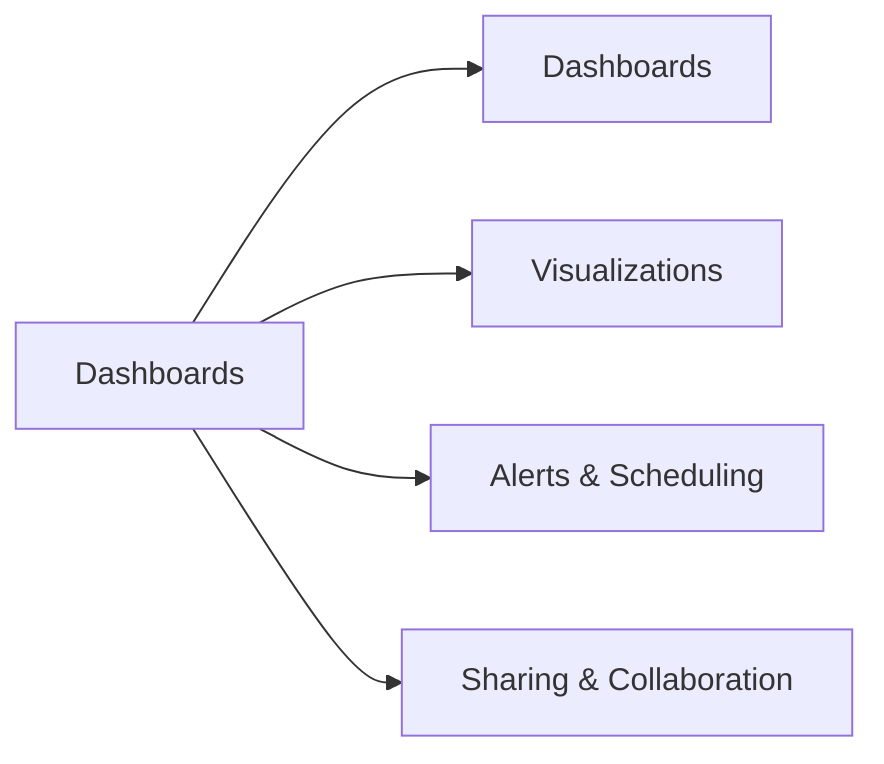

# Creating Dashboards and Visualizations (16 % of Exam)

AI/BI Dashboards, visualisation types, parameters, alerts, scheduling, and sharing patterns. The second-largest domain in the October 2025 blueprint.

## Topics Overview

## Section Contents

| File | Topic | Priority |
| :--- | :--- | :--- |
| [01-dashboards.md](./01-dashboards.md) | AI/BI Dashboards anatomy, datasets, filters | High |
| [02-visualizations.md](./02-visualizations.md) | Chart types, configuration, when to use which | High |
| [03-alerts-scheduling.md](./03-alerts-scheduling.md) | SQL alerts, dashboard schedules, subscriptions | High |
| [04-sharing-collaboration.md](./04-sharing-collaboration.md) | Workspace permissions, public dashboards, collaboration | Medium |

## Key Concepts to Master

| Concept | Why it matters |
| :--- | :--- |
| **AI/BI Dashboards** | The current dashboarding product (replaces legacy "Databricks SQL Dashboards") |
| **Dataset vs widget** | A dataset is a SQL query result; widgets are charts/tables bound to a dataset |
| **Subscribed schedules** | Dashboards refresh on a cron; subscribers receive snapshot emails |
| **Alerts on query results** | Trigger an email/webhook when a query result crosses a threshold |
| **Run-as for shared dashboards** | Choose whether viewers see the dashboard run-as the owner (single warehouse) or as themselves (their permissions, their warehouse) |

## Related Resources

- [AI/BI Dashboards documentation](https://docs.databricks.com/en/dashboards/index.html)
- [SQL alerts documentation](https://docs.databricks.com/en/sql/user/alerts/index.html)

---

**[← Previous: Executing Queries](../01-executing-queries-databricks-sql-warehouses/README.md) | [↑ Back to Data Analyst Associate](../README.md) | [Next: Analyzing Queries →](../03-analyzing-queries/README.md)**
