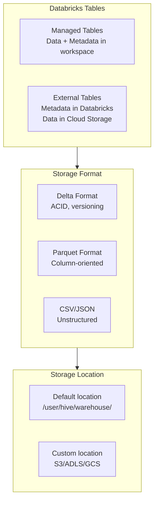

# Tables & Schemas

## Overview

Tables are the fundamental storage units in Databricks SQL for organizing and accessing data. Schemas provide logical organization of tables, while Delta provides ACID compliance and performance optimization.

## Table Types Architecture



## Table Types

### Managed Tables

**Definition**: Databricks manages both data and metadata

```sql
-- Create managed table
CREATE TABLE sales (
    id INT,
    customer_name STRING,
    amount DECIMAL(10, 2),
    sale_date DATE
)
USING DELTA;

-- Data stored in: /user/hive/warehouse/sales/
-- Metadata stored in: Hive metastore
```

**Characteristics:**

| Aspect | Managed Table |
|--------|---|
| **Data Location** | Workspace managed location |
| **Metadata** | Databricks metastore |
| **Drop behavior** | Deletes data + metadata |
| **Best for** | Production tables, sensitive data |
| **Cost** | Includes storage charges |
| **Performance** | Optimized, native Delta format |

**Example workflow:**

```sql
-- 1. Create managed table
CREATE TABLE customers (
    id INT,
    name STRING,
    email STRING
)
USING DELTA;

-- 2. Insert data
INSERT INTO customers VALUES (1, 'Alice', 'alice@example.com');

-- 3. Query
SELECT * FROM customers;

-- 4. Drop (removes both data and metadata)
DROP TABLE customers;
-- Data is permanently deleted from workspace location
```

### External Tables

**Definition**: Databricks stores only metadata; data lives in external cloud storage

```sql
-- Create external table pointing to S3 bucket
CREATE TABLE external_sales (
    id INT,
    customer_name STRING,
    amount DECIMAL(10, 2)
)
USING PARQUET
LOCATION 's3://my-bucket/sales-data/';

-- Metadata stored in: Databricks metastore
-- Data stored in: s3://my-bucket/sales-data/
```

**Characteristics:**

| Aspect | External Table |
|--------|---|
| **Data Location** | Cloud storage (S3, ADLS, GCS) |
| **Metadata** | Databricks metastore |
| **Drop behavior** | Deletes metadata only, data persists |
| **Best for** | Data lakes, staging areas |
| **Cost** | Storage charged by cloud provider |
| **Performance** | Depends on storage format |

**Create from existing data:**

```sql
-- Register existing Parquet files as table
CREATE EXTERNAL TABLE marketing_data (
    campaign_id INT,
    impressions INT,
    clicks INT,
    conversion_rate DOUBLE
)
USING PARQUET
LOCATION '/mnt/data/marketing/campaigns/';
```

### Temporary Tables

**Definition**: Session-scoped tables that exist only during the current connection

```sql
-- Create temporary table
CREATE TEMPORARY TABLE temp_sales AS
SELECT
    id,
    customer_name,
    amount,
    amount * 1.1 as amount_with_tax
FROM sales
WHERE sale_date >= CURRENT_DATE - INTERVAL 30 DAY;

-- Use in queries
SELECT AVG(amount_with_tax) FROM temp_sales;

-- Automatically dropped when session ends
-- Can also explicitly drop
DROP TABLE temp_sales;
```

**Use cases:**

- Intermediate results in multi-step queries
- Avoid materializing large intermediate datasets
- Testing queries
- User-session-specific aggregations

## Schema Design

### Creating Schemas

```sql
-- Create schema in default catalog
CREATE SCHEMA sales_analytics
COMMENT 'Analytics tables for sales data';

-- Create schema in specific catalog (Unity Catalog)
CREATE SCHEMA main.finance.reports
COMMENT 'Financial reporting tables';

-- Create schema with properties
CREATE SCHEMA prod_data
WITH DBPROPERTIES (
    owner = 'data-eng',
    environment = 'production',
    pii_level = 'high'
);
```

### Schema Organization Patterns

**Pattern 1: By Business Domain**

```text
hive
├── sales/
│   ├── transactions
│   ├── customers
│   └── orders
├── marketing/
│   ├── campaigns
│   ├── leads
│   └── segments
└── finance/
    ├── budgets
    ├── actuals
    └── forecasts
```

**Pattern 2: By Layer (Medallion)**

```text
warehouse
├── bronze/
│   ├── raw_events
│   ├── raw_transactions
│   └── raw_users
├── silver/
│   ├── cleaned_events
│   ├── cleaned_transactions
│   └── dim_users
└── gold/
    ├── sales_summary
    ├── customer_segments
    └── monthly_revenue
```

**Pattern 3: By Team/Ownership**

```text
analytics
├── sales_team/
│   ├── weekly_reports
│   └── dashboards
├── marketing_team/
│   ├── campaign_metrics
│   └── segment_analysis
└── shared/
    ├── dim_date
    └── dim_customer
```

### Schema Properties

```sql
-- View schema details
DESCRIBE SCHEMA sales_analytics;
-- Output: Namespace, Type, Properties

-- View tables in schema
SHOW TABLES IN sales_analytics;

-- View table structure
DESCRIBE TABLE sales_analytics.transactions;
-- Output: Column names, types, nullable, comments
```

## Table Design Best Practices

### Data Types

```sql
-- ❌ Inefficient - using strings for everything
CREATE TABLE events (
    id STRING,
    event_type STRING,
    event_value STRING,
    event_timestamp STRING
);

-- ✅ Efficient - appropriate data types
CREATE TABLE events (
    id INT,                          -- Integer for IDs
    event_type STRING,               -- String for categories
    event_value DECIMAL(10, 2),      -- Decimal for money
    event_timestamp TIMESTAMP         -- Timestamp for dates
);
```

**Type Selection Table:**

| Data | Type | Reason |
|------|------|--------|
| Unique IDs | INT / BIGINT | Faster comparisons, less storage |
| Amounts/Money | DECIMAL(10,2) | Exact precision |
| Percentages | DOUBLE | Floating point ok |
| Dates | DATE | Compact, time arithmetic |
| Timestamps | TIMESTAMP | Precise timing |
| Categories | STRING + ENUM | Can be optimized |
| Binary data | BINARY | Native support |

### Partitioning Strategy

```sql
-- Partition by date (useful for time-series data)
CREATE TABLE sales_partitioned (
    id INT,
    customer_name STRING,
    amount DECIMAL(10, 2),
    transaction_date DATE
)
USING DELTA
PARTITIONED BY (transaction_date);

-- Insert data (automatically partitions)
INSERT INTO sales_partitioned
VALUES (1, 'Alice', 100.50, '2024-01-15');

-- Query specific partition (faster)
SELECT * FROM sales_partitioned
WHERE transaction_date = '2024-01-15';
-- Scans only 2024-01-15 partition
```

**Partitioning benefits:**

- Faster queries on large tables
- Parallel processing
- Better data management
- Easier retention policies

### Column Comments

```sql
CREATE TABLE customers (
    id INT COMMENT 'Unique customer identifier',
    name STRING COMMENT 'Full customer name',
    email STRING COMMENT 'Primary contact email',
    created_at TIMESTAMP COMMENT 'Account creation date',
    status STRING COMMENT 'Active, inactive, suspended'
)
USING DELTA
COMMENT 'Master customer dimension table';

-- View comments
DESCRIBE EXTENDED customers;
```

## Delta Tables

Delta is the default table format in Databricks, providing ACID transactions.

### Creating Delta Tables

```sql
-- Explicit Delta format
CREATE TABLE delta_orders (
    id INT,
    amount DECIMAL(10, 2)
)
USING DELTA
LOCATION '/mnt/data/delta/orders';

-- Shorthand (USING DELTA is optional)
CREATE TABLE delta_orders (
    id INT,
    amount DECIMAL(10, 2)
);
```

### Delta Features

```sql
-- 1. ACID Transactions
BEGIN TRANSACTION;
  INSERT INTO orders VALUES (1, 100);
  INSERT INTO orders VALUES (2, 200);
COMMIT;

-- 2. DML Operations
UPDATE orders SET amount = amount * 1.1
WHERE id = 1;

DELETE FROM orders WHERE id > 1000;

MERGE INTO target t
USING source s
ON t.id = s.id
WHEN MATCHED THEN UPDATE SET *
WHEN NOT MATCHED THEN INSERT *;

-- 3. Time Travel
SELECT * FROM orders VERSION AS OF 5;
SELECT * FROM orders TIMESTAMP AS OF '2024-01-15';

-- 4. Schema Evolution
SET spark.databricks.delta.schema.autoMerge.enabled = true;
INSERT INTO orders (id, amount, discount)
VALUES (3, 150, 0.1);  -- New column automatically added
```

## Converting Between Table Types

### Parquet to Delta

```sql
-- Method 1: Copy to Delta table
CREATE TABLE delta_sales AS
SELECT * FROM parquet_sales;

-- Method 2: In-place conversion
CONVERT TO DELTA parquet_sales;

-- Verify conversion
DESCRIBE EXTENDED delta_sales;
-- Should show "Provider: delta"
```

### External to Managed

```sql
-- External table
CREATE EXTERNAL TABLE ext_data (...)
LOCATION 's3://bucket/data';

-- Convert to managed (copies data)
CREATE TABLE managed_data AS
SELECT * FROM ext_data;

-- Original external table can be dropped
DROP TABLE ext_data;
```

## Performance Considerations

### Table Size vs Query Speed

```sql
-- ❌ Poor - full table scan
SELECT * FROM large_table WHERE status = 'active';

-- ✅ Better - with predicate
SELECT * FROM large_table
WHERE status = 'active' AND date >= CURRENT_DATE - 7;

-- ✅ Best - partitioned + predicate
SELECT * FROM partitioned_table
WHERE partition_date >= CURRENT_DATE - 7
AND status = 'active';
```

### Optimization Table

| Issue | Solution |
|-------|----------|
| Slow query | Partition table, add WHERE clause |
| Large table | Partition by date, archive old data |
| Many columns | Project needed columns only |
| Duplicates | Add primary key constraint (when possible) |

## Use Cases

- **Organizing Analytical Data**: Creating schemas by business domain (sales, marketing, finance) so analysts can discover and query tables using predictable naming conventions.
- **Managed vs External Tables**: Using managed tables for production analytics and external tables for staging data from cloud storage before transformation.

## Common Issues & Errors

### Table Not Found After Creation

**Scenario:** `CREATE TABLE` succeeds but `SELECT` fails with table not found.
**Fix:** Ensure you are using the correct three-level namespace (`catalog.schema.table`) and have `USE CATALOG` and `USE SCHEMA` set.

## Exam Tips

- Dropping a managed table deletes both data and metadata; dropping an external table deletes only metadata
- Delta is the default table format and supports ACID transactions, time travel, and schema evolution
- Partition large tables by date columns for faster time-based queries
- Temporary tables are session-scoped and automatically dropped when the session ends

## Key Takeaways

- **Managed tables**: Databricks manages data and metadata; drop removes all
- **External tables**: Databricks manages metadata; data stays in cloud storage
- **Delta format**: Default, ACID-compliant, supports time travel
- **Schemas**: Logical containers for tables, organize by domain/layer/owner
- **Partitioning**: Split large tables by column (usually date)
- **Data types**: Choose appropriate types for storage efficiency
- **Temporary tables**: Session-scoped, useful for intermediate results

## Related Topics

- [Delta Lake Basics](../../../shared/fundamentals/delta-lake-basics.md) - Core Delta Lake concepts and ACID transactions
- [Delta Lake Commands Cheat Sheet](../../../shared/cheat-sheets/delta-lake-commands.md) - Quick reference for Delta table operations
- [Medallion Architecture](../../../shared/fundamentals/medallion-architecture.md) - Schema organization patterns (bronze/silver/gold)

## Official Documentation

- [Databricks Tables](https://docs.databricks.com/sql/language-manual/sql-ref-tables.html)
- [Delta Lake Overview](https://docs.databricks.com/delta/index.html)

---

**[↑ Back to Data Management in Databricks](./README.md) | [Next: Unity Catalog](./02-unity-catalog.md) →**
