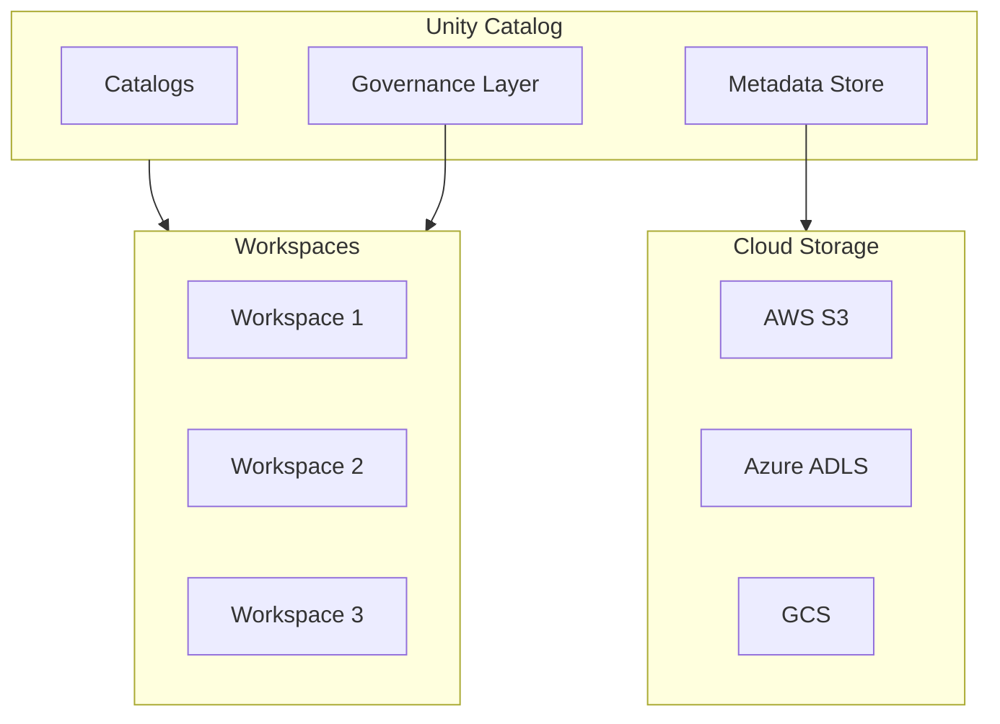

# Unity Catalog

## Overview

Unity Catalog is Databricks' centralized governance solution that provides a three-level namespace for organizing data across workspaces, with fine-grained access control and data lineage tracking.

## Unity Catalog Architecture



## Three-Level Namespace

Unity Catalog introduces a three-level hierarchy: **Catalog > Schema > Table**

```yaml
Catalog: main              # Level 1 - Organization
  ├─ Schema: sales         # Level 2 - Domain/Department
  │  ├─ Table: orders      # Level 3 - Actual table
  │  ├─ Table: customers
  │  └─ View: monthly_revenue
  ├─ Schema: finance
  │  ├─ Table: budgets
  │  └─ Table: actuals
  └─ Schema: shared
     └─ Table: dim_date

Catalog: analytics
  ├─ Schema: reports
  │  └─ View: executive_dashboard
  └─ Schema: experiments
```

### Before Unity Catalog (Legacy)

**Single workspace silo:**

```text
hive.schema.table
```

All data isolated per workspace, no cross-workspace visibility.

### After Unity Catalog (Modern)

**Multi-workspace federation:**

```text
catalog.schema.table
```

Example: `main.sales.orders` is accessible across all workspaces.

## Creating and Managing Catalogs

### Create a Catalog

```sql
-- Create a new catalog
CREATE CATALOG production;

-- Create with properties
CREATE CATALOG analytics
COMMENT 'Analytics and reporting catalog'
WITH DBPROPERTIES (
    owner = 'analytics_team',
    environment = 'production',
    pii_data = 'false'
);

-- View catalogs
SHOW CATALOGS;
-- Output: production, analytics, main (default)
```

### Set Default Catalog

```sql
-- Current connection
USE CATALOG production;

-- This affects table lookup
CREATE TABLE my_table (...);
-- Creates: production.default.my_table

SELECT * FROM my_table;
-- Queries: production.default.my_table
```

## Catalog Organization Patterns

### Pattern 1: By Environment

```text
dev
├── schema: raw
├── schema: analytics
└── schema: testing

staging
├── schema: raw
├── schema: validated
└── schema: mirror

production
├── schema: bronze
├── schema: silver
└── schema: gold
```

### Pattern 2: By Business Domain

```text
main
├── sales: orders, customers, revenue
├── marketing: campaigns, leads, segments
├── finance: budgets, actuals, forecasts
└── operations: employees, assets, events
```

### Pattern 3: Hybrid (Environment + Domain)

```text
prod_analytics
├── sales_gold: final_orders, customer_segments
├── marketing_gold: campaign_results, roi
└── shared_dim: dim_date, dim_customer

dev_analytics
├── sales_dev: test_orders, experiment_segments
└── marketing_dev: test_campaigns
```

## Data Objects in Unity Catalog

### Tables

```sql
-- Create managed table in catalog
CREATE TABLE production.sales.orders (
    order_id INT,
    customer_id INT,
    amount DECIMAL(10, 2)
)
USING DELTA;

-- Fully qualified table name
SELECT * FROM production.sales.orders;

-- Using default catalog
USE CATALOG production;
SELECT * FROM sales.orders;  -- Shorter form
```

### Views

```sql
-- Create view (logical table)
CREATE VIEW production.sales.monthly_summary AS
SELECT
    DATE_TRUNC('month', order_date) as month,
    COUNT(*) as order_count,
    SUM(amount) as total_amount
FROM production.sales.orders
GROUP BY DATE_TRUNC('month', order_date);

-- Query view
SELECT * FROM production.sales.monthly_summary;
```

### External Location

For data stored outside Databricks:

```sql
-- Create external location
CREATE EXTERNAL LOCATION s3_data_lake
URL 's3://company-data-lake/analytics'
WITH (CREDENTIAL storage_credential_name);

-- Create external table using location
CREATE EXTERNAL TABLE production.raw.events
USING PARQUET
LOCATION 's3://company-data-lake/analytics/events/';
```

### Volumes

New storage abstraction in Unity Catalog for non-tabular data:

```sql
-- Create volume
CREATE VOLUME production.shared.data_files;

-- Use volume for files
/Volumes/production/shared/data_files/backup.csv

-- Mount in Python
dbutils.fs.ls("/Volumes/production/shared/data_files")
```

## Fully Qualified Names

### Namespace Resolution

```sql
-- Explicit three-level reference (always works)
SELECT * FROM catalog_name.schema_name.table_name;
SELECT * FROM production.sales.orders;

-- With default catalog set
USE CATALOG production;
SELECT * FROM sales.orders;

-- With default catalog and schema
USE CATALOG production;
USE SCHEMA sales;
SELECT * FROM orders;

-- But still need full path for other catalogs
SELECT * FROM analytics.reports.summary;
```

## Unity Catalog Governance

### Permissions & Access Control

```sql
-- Grant permissions (owner only)
GRANT SELECT ON CATALOG production TO `analyst@company.com`;

GRANT ALL PRIVILEGES ON SCHEMA production.sales
TO `sales_team@company.com`;

GRANT SELECT, MODIFY ON TABLE production.sales.orders
TO `data_engineer@company.com`;
```

### Permission Hierarchy

```text
Workspace (highest)
├── Catalog
│   ├── Schema
│   │   ├── Table
│   │   ├── View
│   │   └── Volume
│   └── External Location
└── Function
```

**Permission inheritance**: Catalog permissions flow to schemas and tables

```sql
-- All catalogs and objects
SHOW DATABASES;

-- Specific catalog
SHOW SCHEMAS IN production;

-- Specific schema
SHOW TABLES IN production.sales;

-- Object details
DESCRIBE TABLE production.sales.orders;
```

## Data Lineage & Auditing

### Track Data Origin

```sql
-- View table lineage
SELECT * FROM system.table_lineage
WHERE table_catalog = 'production'
AND table_schema = 'sales';

-- Shows upstream dependencies (what tables feed this table)
-- Shows downstream dependencies (what consumes this table)
```

### Audit Logs

```sql
-- View who accessed what
SELECT
    user_name,
    action,
    entity_type,
    entity_name,
    timestamp
FROM system.audit_logs
WHERE catalog_name = 'production'
AND timestamp >= CURRENT_TIMESTAMP - INTERVAL 7 DAYS
ORDER BY timestamp DESC;
```

## Migration to Unity Catalog

### Strategy

```yaml
Phase 1: Enable Unity Catalog
  - Set up catalog instance
  - Create external locations for data
  - Create credential objects

Phase 2: Create Catalog Structure
  - Design catalog/schema hierarchy
  - Create catalogs
  - Create schemas
  - Set permissions

Phase 3: Migrate Tables
  - Identify tables to migrate
  - Convert to Delta if needed
  - Register in catalogs
  - Test access

Phase 4: Update Applications
  - Update query paths (3-level names)
  - Test with new credentials
  - Gradual rollout by workload
```

### Migration Example

```sql
-- Legacy: hive.default.sales
CREATE TABLE hive.default.sales AS
SELECT * FROM old_warehouse.sales;

-- New: production.sales.sales
USE CATALOG production;
USE SCHEMA sales;

CREATE TABLE orders AS
SELECT * FROM hive.default.sales  -- Source old location
WHERE sale_date >= '2020-01-01';

-- Verify data integrity
SELECT COUNT(*) FROM production.sales.orders;
SELECT COUNT(*) FROM hive.default.sales;
```

## Cross-workspace Collaboration

### Share Data Across Workspaces

```sql
-- In workspace 1
CREATE VIEW production.shared.customer_gold AS
SELECT * FROM production.sales.customers
WHERE status = 'active';

-- In workspace 2 (same account)
SELECT * FROM production.shared.customer_gold;
-- Access shared data from different workspace!
```

## Best Practices

### Naming Conventions

```sql
-- Clear, consistent names
prod_analytics.bronze.raw_events
prod_analytics.silver.cleaned_events
prod_analytics.gold.event_summary

-- Not: prod_analytics.schema_1.tbl_123
```

### Documentation

```sql
-- Add descriptions at all levels
CREATE CATALOG production
COMMENT 'Production data and analytics catalog';

CREATE SCHEMA production.sales
COMMENT 'Sales department tables (orders, customers, revenue)';

CREATE TABLE production.sales.orders (
    order_id INT COMMENT 'Unique order identifier',
    customer_id INT COMMENT 'FK to customers table',
    amount DECIMAL(10, 2) COMMENT 'Order total in USD'
);
```

### Access Control

```sql
-- Principle of least privilege
GRANT SELECT ON CATALOG production TO `analyst@company.com`;
-- Only read access, specific catalog

GRANT SELECT, MODIFY ON TABLE production.sales.orders
TO `engineer@company.com`;
-- Modify only needed table, not entire catalog
```

### Version Control

```sql
-- Track catalog schema in version control
-- Save DDL scripts: schemas/production/sales/create_tables.sql
-- Enables reproducibility and disaster recovery
```

## Use Cases

- **Cross-workspace Data Sharing**: Making curated gold tables accessible to analysts across multiple Databricks workspaces without duplicating data.
- **Centralized Governance**: Enforcing consistent access control policies across all catalogs so data owners can manage who sees what from a single place.

## Common Issues & Errors

### Cannot Browse Catalog Objects

**Scenario:** User cannot see tables in Data Explorer despite having SELECT permission.
**Fix:** User also needs `USE CATALOG` on the catalog and `USE SCHEMA` on the schema -- these are required for browsing.

## Exam Tips

- The three-level namespace is catalog.schema.table (e.g., `main.sales.orders`)
- The default catalog is `main`; override with `USE CATALOG`
- Unity Catalog uses RBAC with hierarchical inheritance (catalog permissions flow to schemas and tables)
- Tables can be shared across workspaces within the same Databricks account

## Key Takeaways

- **Three-level namespace**: catalog.schema.table (vs. hive.schema.table)
- **Multi-workspace**: Data visible across workspaces with Unity Catalog
- **Governance**: Centralized access control, lineage, audit logs
- **Default catalog**: `main` is default; can be overridden with USE CATALOG
- **External locations**: Cloud storage integration with credentials
- **Volumes**: For non-tabular data files
- **Permissions**: Hierarchical, inherited from catalog to tables
- **Lineage**: Track data dependencies and origins

## Related Topics

- [Unity Catalog Basics](../../../shared/fundamentals/unity-catalog-basics.md) - Shared fundamentals for Unity Catalog across certifications
- [Unity Catalog Quick Reference](../../../shared/cheat-sheets/unity-catalog-quick-ref.md) - Quick reference for UC commands and permissions
- [Access Control & Security](./03-access-control.md) - Deep dive into permissions and RBAC

## Official Documentation

- [Unity Catalog Overview](https://docs.databricks.com/data-governance/unity-catalog/index.html)
- [Unity Catalog Best Practices](https://docs.databricks.com/data-governance/unity-catalog/best-practices.html)

---

**[← Previous: Tables & Schemas](./01-tables-schemas.md) | [↑ Back to Data Management in Databricks](./README.md) | [Next: Access Control & Security](./03-access-control.md) →**
