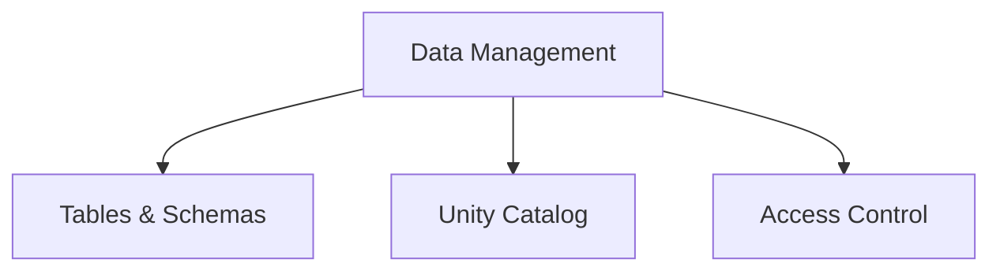

# Data Management (20% of Exam)

Managing data in the Databricks lakehouse platform, including table creation, schema organization, and governance through Unity Catalog.

## Topics Overview

## Section Contents

| File | Topic | Priority |
| :--- | :--- | :--- |
| [01-tables-schemas.md](01-tables-schemas.md) | Table types, schema design, best practices | High |
| [02-unity-catalog.md](02-unity-catalog.md) | Catalog structure, objects, metadata | High |
| [03-access-control.md](03-access-control.md) | Permissions, security, governance | High |

## Key Concepts

- **Tables**: Managed vs external tables, data storage options
- **Schemas**: Logical database organization
- **Unity Catalog**: Unified governance across workspaces
- **Access Control**: Role-based permissions (RBAC)

## Related Resources

- [Delta Lake Basics](../../../shared/fundamentals/delta-lake-basics.md)
- [Unity Catalog Quick Reference](../../../shared/cheat-sheets/unity-catalog-quick-ref.md)

## Next Steps

Proceed to [03-SQL Queries](../03-sql-queries/README.md) to learn advanced query techniques on managed data.

---

**[← Back to Certification](../README.md)**
