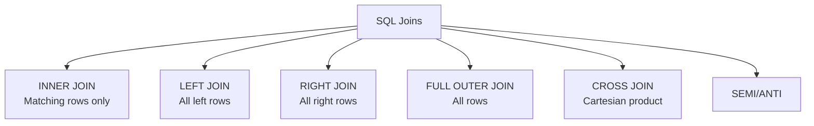

# Joins & Multi-table Operations

## Overview

Joins combine data from multiple tables by matching values on key columns. Mastering different join types is critical for complex analytics queries in Databricks SQL.

## Join Types



## INNER JOIN

Returns only rows with matching values in both tables:

```sql
-- Basic INNER JOIN
SELECT
    o.order_id,
    o.amount,
    c.customer_name,
    c.email
FROM orders o
INNER JOIN customers c ON o.customer_id = c.customer_id;

-- Implicit INNER JOIN (WHERE clause)
SELECT
    o.order_id,
    c.customer_name
FROM orders o, customers c
WHERE o.customer_id = c.customer_id;
```

**Visual:**

```text
Orders:           Customers:           Result:
1 → Alice         1 Alice              1 → Alice
2 → Bob           2 Bob                2 → Bob
3 → Charlie
4 → (null)
                  INNER JOIN keeps only matching rows
```

**Performance considerations:**

- Fastest join type
- Filters out unmatched rows immediately
- Good for removing orphaned records

## LEFT JOIN (LEFT OUTER JOIN)

Returns all rows from left table, matching right table rows when available:

```sql
-- LEFT JOIN keeps all customers, even if no orders
SELECT
    c.customer_id,
    c.customer_name,
    COUNT(o.order_id) as order_count,
    COALESCE(SUM(o.amount), 0) as total_spent
FROM customers c
LEFT JOIN orders o ON c.customer_id = o.customer_id
GROUP BY c.customer_id, c.customer_name;

-- Find customers with no orders
SELECT
    c.customer_name
FROM customers c
LEFT JOIN orders o ON c.customer_id = o.customer_id
WHERE o.order_id IS NULL;  -- NULL indicates no match
```

**Visual:**

```text
Customers:        Orders:              Result:
1 Alice    →      1 → $100             1 Alice → $100
2 Bob      →      2 → $200             2 Bob → $200
3 Charlie  →      (none)               3 Charlie → NULL
4 Diana    →                           4 Diana → NULL
                  LEFT JOIN keeps all customers
```

## RIGHT JOIN (RIGHT OUTER JOIN)

Returns all rows from right table, matching left table rows when available:

```sql
-- RIGHT JOIN (less common than LEFT)
SELECT
    e.employee_name,
    d.department_name
FROM employees e
RIGHT JOIN departments d ON e.dept_id = d.dept_id;

-- Equivalent using LEFT (preferred):
SELECT
    e.employee_name,
    d.department_name
FROM departments d
LEFT JOIN employees e ON e.dept_id = d.dept_id;
```

**Modern SQL best practice:**

- RIGHT JOIN rarely used
- Rewrite as LEFT JOIN by swapping table order
- More readable and consistent

## FULL OUTER JOIN

Returns all rows from both tables, with NULLs where no matches:

```sql
-- FULL OUTER JOIN - all customers and all orders
SELECT
    c.customer_id,
    c.customer_name,
    o.order_id,
    o.amount
FROM customers c
FULL OUTER JOIN orders o ON c.customer_id = o.customer_id
ORDER BY c.customer_id;

-- Find unmatched records (either side)
SELECT
    c.customer_id,
    o.order_id
FROM customers c
FULL OUTER JOIN orders o ON c.customer_id = o.customer_id
WHERE c.customer_id IS NULL OR o.order_id IS NULL;
```

**Visual:**

```text
Customers:        Orders:              Result:
1 Alice    →      1 → $100             1 Alice → $100
2 Bob      →      2 → $200             2 Bob → $200
3 Charlie  →      3 → $150             3 Charlie → $150
4 Diana           5 → $300             4 Diana → NULL
                                       NULL → 5 $300
```

## CROSS JOIN

Cartesian product - every row from left joined with every row from right:

```sql
-- CROSS JOIN (all combinations)
SELECT
    c.color,
    s.size
FROM colors c
CROSS JOIN sizes s;

-- Equivalent syntax
SELECT
    c.color,
    s.size
FROM colors c, sizes s;

-- Data:
-- colors: red, blue, green (3 rows)
-- sizes: S, M, L, XL (4 rows)
-- Result: 3 × 4 = 12 rows
--
-- red/S, red/M, red/L, red/XL,
-- blue/S, blue/M, blue/L, blue/XL,
-- green/S, green/M, green/L, green/XL
```

**Use cases:**

- Product combinations (e.g., colors × sizes)
- Date range generation
- Generate all possibilities

```sql
-- Generate all dates in range
SELECT d.*, p.*
FROM (SELECT DATE('2024-01-01') + INTERVAL (n) DAY as date_value
      FROM RANGE(365)) d
CROSS JOIN products p;
```

## SEMI JOIN & ANTI JOIN

### SEMI JOIN

Returns rows from left table where match exists in right table (but excludes right columns):

```sql
-- Find customers with at least one order
SELECT DISTINCT c.customer_id, c.customer_name
FROM customers c
SEMI JOIN orders o ON c.customer_id = o.customer_id;

-- Equivalent using IN
SELECT DISTINCT customer_id, customer_name
FROM customers
WHERE customer_id IN (SELECT DISTINCT customer_id FROM orders);

-- Equivalent using EXISTS
SELECT c.customer_id, c.customer_name
FROM customers c
WHERE EXISTS (
    SELECT 1 FROM orders o
    WHERE o.customer_id = c.customer_id
);
```

**Performance:** SEMI JOIN is optimized for this use case, often faster than IN/EXISTS

### ANTI JOIN

Returns rows from left table where NO match exists in right table:

```sql
-- Find customers with NO orders
SELECT DISTINCT c.customer_id, c.customer_name
FROM customers c
ANTI JOIN orders o ON c.customer_id = o.customer_id;

-- Equivalent using NOT IN
SELECT DISTINCT customer_id, customer_name
FROM customers
WHERE customer_id NOT IN (SELECT DISTINCT customer_id FROM orders);

-- Equivalent using NOT EXISTS
SELECT c.customer_id, c.customer_name
FROM customers c
WHERE NOT EXISTS (
    SELECT 1 FROM orders o
    WHERE o.customer_id = c.customer_id
);
```

## Multi-table Joins

### Three-table Join

```sql
-- Orders → Customers → Invoices
SELECT
    o.order_id,
    c.customer_name,
    i.invoice_num,
    i.invoice_amount
FROM orders o
JOIN customers c ON o.customer_id = c.customer_id
JOIN invoices i ON o.order_id = i.order_id
WHERE o.order_date >= CURRENT_DATE - 30;

-- Execution is left-to-right:
-- 1. orders JOIN customers
-- 2. Result JOIN invoices
```

### Join Chain with Multiple Conditions

```sql
-- Complex join with multiple conditions
SELECT
    e.employee_id,
    e.employee_name,
    d.department_name,
    s.salary_level,
    b.bonus_pct
FROM employees e
JOIN departments d
    ON e.dept_id = d.dept_id
    AND d.status = 'active'
JOIN salary_bands s
    ON e.salary_level_id = s.level_id
LEFT JOIN bonuses b
    ON e.employee_id = b.employee_id
    AND b.year = YEAR(CURRENT_DATE);
```

## Join Conditions

### Single Column Join

```sql
-- Simple key match
SELECT *
FROM orders o
JOIN customers c ON o.customer_id = c.customer_id;
```

### Multi-column Join (Composite Key)

```sql
-- Multiple columns (e.g., company + employee)
SELECT *
FROM employment_history eh
JOIN salary_history sh ON
    eh.company_id = sh.company_id
    AND eh.employee_id = sh.employee_id;
```

### Join on Expression

```sql
-- Join on calculated values
SELECT *
FROM events e
JOIN sessions s ON
    e.user_id = s.user_id
    AND e.timestamp >= s.session_start
    AND e.timestamp <= s.session_end;

-- Join on range
SELECT *
FROM orders o
JOIN shipping_zones sz ON
    o.delivery_zip BETWEEN sz.min_zip AND sz.max_zip;
```

## Join Performance Optimization

### Index Strategy

```sql
-- Create indexes on join columns (where supported)
CREATE INDEX idx_orders_customer ON orders(customer_id);
CREATE INDEX idx_customers_id ON customers(customer_id);

-- Verify join uses indexes
EXPLAIN SELECT * FROM orders o
JOIN customers c ON o.customer_id = c.customer_id;
```

### Execution Plan

```text
-- Output from EXPLAIN:
Join [customer_id#1 = customer_id#100]
├─ Scan Delta [orders]
│  └─ PushedFilters: None
└─ Scan Delta [customers]
   └─ PushedFilters: None

-- Optimization tips:
-- 1. Filter before join: WHERE clauses before JOIN
-- 2. Project columns: SELECT only needed columns
-- 3. Join on primary keys: More optimizable
```

### Join Order Matters

```sql
-- ❌ Inefficient - large table first
SELECT *
FROM huge_transactions t
JOIN small_reference r ON t.id = r.id
WHERE t.status = 'completed';

-- ✅ Better - filter before join
SELECT *
FROM huge_transactions t
WHERE t.status = 'completed'  -- Reduce size first
JOIN small_reference r ON t.id = r.id;  -- Then join
```

## Common Join Patterns

### Find Unmatched Records

```sql
-- Customers with no orders
SELECT c.*
FROM customers c
LEFT JOIN orders o ON c.customer_id = o.customer_id
WHERE o.order_id IS NULL;
```

### Deduplication with Join

```sql
-- Keep only latest record per customer
SELECT o1.*
FROM orders o1
JOIN (
    SELECT customer_id, MAX(order_date) as latest_date
    FROM orders
    GROUP BY customer_id
) latest ON o1.customer_id = latest.customer_id
    AND o1.order_date = latest.latest_date;
```

### Data Reconciliation

```sql
-- Compare two datasets
SELECT
    COALESCE(s.id, t.id) as id,
    CASE
        WHEN s.id IS NULL THEN 'In Target Only'
        WHEN t.id IS NULL THEN 'In Source Only'
        WHEN s.amount != t.amount THEN 'Amount Mismatch'
        ELSE 'Match'
    END as status
FROM source s
FULL OUTER JOIN target t ON s.id = t.id;
```

## Use Cases

- **Large Scale Transformations**: Leveraging Spark SQL distributed execution semantics to transform multi-terabyte datasets efficiently.
- **Data Reconciliation**: Using FULL OUTER JOIN to compare source and target datasets and identify mismatches, missing records, or duplicates.

## Common Issues & Errors

### OOM Errors

**Scenario:** Data skew causes an executor to run out of memory.
**Fix:** Use Adaptive Query Execution (AQE) and review joining logic.

### Unexpected Row Duplication After JOIN

**Scenario:** A LEFT JOIN produces more rows than the left table.
**Fix:** The right table has duplicate keys. Use `SELECT DISTINCT` on the join key or aggregate before joining to ensure one-to-one cardinality.

## Exam Tips

- To find records with no match (e.g., customers with no orders), use LEFT JOIN with `WHERE key IS NULL`
- CROSS JOIN produces a Cartesian product: row count = left rows multiplied by right rows
- SEMI JOIN is often more optimized than IN or EXISTS for existence checks
- Always filter rows before joining for better performance (WHERE before JOIN)

## Key Takeaways

- **INNER JOIN**: Only matching rows from both tables
- **LEFT JOIN**: All left rows + matching right rows
- **FULL OUTER JOIN**: All rows from both tables (left + right)
- **CROSS JOIN**: Cartesian product (every combo)
- **SEMI/ANTI**: Existence checks without adding columns
- **Multi-table**: Can chain multiple joins
- **Join condition**: Can use expressions, ranges, multiple columns
- **Order matters**: Filter before join for performance
- **NULL handling**: IS NULL checks for unmatched rows

## Related Topics

- [SQL Essentials](../../../shared/fundamentals/sql-essentials.md) - Core SQL concepts including join fundamentals
- [SQL Functions Cheat Sheet](../../../shared/cheat-sheets/sql-functions.md) - Quick reference for functions used in join conditions
- [Window Functions](../../../shared/code-examples/sql/window_functions.md) - Advanced SQL patterns often combined with joins

## Official Documentation

- [Databricks SQL JOIN Syntax](https://docs.databricks.com/sql/language-manual/sql-ref-syntax-qry-select-join.html)
- [Query Performance Tuning](https://docs.databricks.com/sql/admin/query-tuning.html)

---

**[↑ Back to Advanced SQL Queries](./README.md) | [Next: Aggregations & Grouping](./02-aggregations-grouping.md) →**
