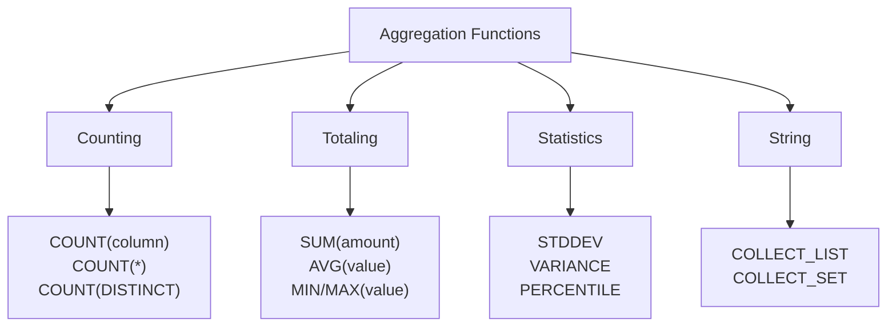

# Aggregations & Grouping

## Overview

Aggregations condense multiple rows into summary statistics. GROUP BY enables aggregating by categories, enabling analytics like "revenue by region" or "count of orders by status."

## Aggregation Functions



### COUNT Functions

```sql
-- COUNT(*): Count all rows including NULLs
SELECT COUNT(*) FROM orders;
-- Result: 1,000,000 (all rows)

-- COUNT(column): Count non-NULL values
SELECT COUNT(customer_id) FROM orders;
-- Result: 999,500 (if 500 NULLs)

-- COUNT(DISTINCT): Unique values
SELECT COUNT(DISTINCT customer_id) FROM orders;
-- Result: 50,000 unique customers

-- Comparison
SELECT
    COUNT(*) as total_rows,
    COUNT(customer_id) as rows_with_customer,
    COUNT(DISTINCT customer_id) as unique_customers
FROM orders;
```

### SUM and AVG

```sql
-- Totals and averages
SELECT
    SUM(amount) as total_revenue,
    AVG(amount) as avg_order_value,
    MIN(amount) as smallest_order,
    MAX(amount) as largest_order
FROM orders;

-- By category
SELECT
    category,
    COUNT(*) as order_count,
    SUM(amount) as total_revenue,
    AVG(amount) as avg_order_value
FROM orders
GROUP BY category;
```

### String Aggregation

```sql
-- Collect values into array (Spark SQL)
SELECT
    customer_id,
    COLLECT_LIST(product_name) as products_purchased,
    COLLECT_SET(category) as categories  -- Unique values
FROM orders
GROUP BY customer_id;

-- Example output:
-- customer_id=1:
--   products: ["Widget", "Gadget", "Widget"]
--   categories: ["Electronics", "Hardware"]
```

### Statistical Functions

```sql
-- Standard deviation and variance
SELECT
    STDDEV(price) as price_stddev,
    VARIANCE(price) as price_variance,
    PERCENTILE(price, 0.5) as median_price,  -- 50th percentile
    PERCENTILE(price, 0.95) as p95_price     -- 95th percentile
FROM products;
```

## GROUP BY Basics

### Simple Grouping

```sql
-- Group by one column
SELECT
    region,
    COUNT(*) as order_count,
    SUM(amount) as total_revenue
FROM orders
GROUP BY region;

-- Result table:
-- region        | order_count | total_revenue
-- North         | 250,000     | $12,500,000
-- South         | 180,000     | $9,000,000
-- East          | 350,000     | $17,500,000
-- West          | 220,000     | $11,000,000
```

### Multiple GROUP BY Columns

```sql
-- Group by multiple dimensions
SELECT
    region,
    category,
    YEAR(order_date) as year,
    COUNT(*) as orders,
    SUM(amount) as revenue,
    AVG(amount) as avg_order_value
FROM orders
GROUP BY region, category, YEAR(order_date)
ORDER BY revenue DESC;

-- Enables analysis like:
-- North / Electronics / 2024: 50,000 orders, $5M revenue
-- North / Electronics / 2023: 45,000 orders, $4.5M revenue
```

### GROUP BY with HAVING

```sql
-- Filter aggregates with HAVING (not WHERE)
SELECT
    category,
    COUNT(*) as order_count,
    SUM(amount) as total_revenue
FROM orders
GROUP BY category
HAVING COUNT(*) > 100 AND SUM(amount) > 1000000;

-- Difference:
-- WHERE: Filters rows BEFORE grouping
-- HAVING: Filters groups AFTER grouping
```

### WHERE vs HAVING

```sql
-- Correct: WHERE before GROUP BY
SELECT
    region,
    COUNT(*) as orders
FROM orders
WHERE status = 'completed'  -- Filter rows first
GROUP BY region
HAVING COUNT(*) > 100;      -- Filter groups

-- ❌ Wrong: Using WHERE to filter aggregates
-- This won't work:
-- WHERE COUNT(*) > 100  ← Error! Can't use agg in WHERE

-- ✅ Correct: Use HAVING for aggregates
-- HAVING COUNT(*) > 100
```

## Advanced Grouping

### GROUP BY ALL (Shorthand)

```sql
-- PostgreSQL/Databricks: GROUP BY ALL
SELECT
    region,
    category,
    status,
    COUNT(*) as orders,
    SUM(amount) as revenue
FROM orders
GROUP BY ALL;
-- Groups by every column in SELECT (except aggregates)

-- Equivalent to:
-- GROUP BY region, category, status
```

### ROLLUP (Hierarchical Totals)

```sql
-- ROLLUP creates hierarchy: Year > Quarter > Month
SELECT
    YEAR(order_date) as year,
    QUARTER(order_date) as quarter,
    MONTH(order_date) as month,
    COUNT(*) as orders,
    SUM(amount) as revenue
FROM orders
GROUP BY ROLLUP(
    YEAR(order_date),
    QUARTER(order_date),
    MONTH(order_date)
)
ORDER BY year DESC, quarter DESC, month DESC;

-- Result rows:
-- 2024, Q1, 1: 50,000 orders, $2.5M
-- 2024, Q1, 2: 55,000 orders, $2.75M
-- 2024, Q1, NULL: 105,000 orders, $5.25M (Q1 subtotal)
-- 2024, NULL, NULL: 250,000 orders, $12.5M (2024 total)
-- NULL, NULL, NULL: 1,000,000 orders, $50M (grand total)
```

### CUBE (All Combinations)

```sql
-- CUBE creates all combinations of grouping columns
SELECT
    region,
    category,
    status,
    COUNT(*) as orders,
    SUM(amount) as revenue
FROM orders
GROUP BY CUBE(region, category, status)
ORDER BY region, category, status;

-- Generates subtotals for:
-- region only
-- category only
-- status only
-- region + category
-- region + status
-- category + status
-- region + category + status
-- GRAND TOTAL

-- 3 dimensions = 2^3 = 8 aggregation levels
```

### GROUPING_ID Function

```sql
-- Identify which rows are subtotals
SELECT
    region,
    category,
    COUNT(*) as orders,
    SUM(amount) as revenue,
    GROUPING_ID(region, category) as grouping
FROM orders
GROUP BY ROLLUP(region, category);

-- GROUPING_ID output:
-- 0: Both dimensions specified (detail rows)
-- 1: Region subtotal (category is NULL)
-- 2: Category subtotal (region is NULL)
-- 3: Grand total (both NULL)

-- Filter to show only subtotals
WHERE GROUPING_ID(region, category) > 0;
```

## Filter Order Matters

### Query Execution Order

```text
1. FROM   - Get base table
2. WHERE  - Filter rows
3. GROUP BY - Aggregate
4. HAVING - Filter aggregates
5. SELECT - Project columns
6. ORDER BY - Sort
7. LIMIT - Return top N
```

### Example: Correct Order

```sql
-- ✅ Correct
SELECT
    region,
    SUM(amount) as revenue
FROM orders
WHERE status = 'completed'      -- 2. Filter rows
GROUP BY region                 -- 3. Group
HAVING SUM(amount) > 1000000    -- 4. Filter groups
ORDER BY revenue DESC           -- 6. Sort
LIMIT 10;                       -- 7. Limit

-- ❌ Wrong - HAVING with unfiltered data
SELECT
    region,
    SUM(amount) as revenue
FROM orders
GROUP BY region                      -- 3. Group ALL rows
HAVING status = 'completed'          -- Error: Use WHERE!
ORDER BY revenue DESC;
```

## Common Aggregation Patterns

### Top N per Group

```sql
-- Top 3 customers by spending in each region
WITH ranked_customers AS (
    SELECT
        region,
        customer_id,
        SUM(amount) as total_spent,
        ROW_NUMBER() OVER (PARTITION BY region ORDER BY SUM(amount) DESC) as rank
    FROM orders
    GROUP BY region, customer_id
)
SELECT *
FROM ranked_customers
WHERE rank <= 3;
```

### Cohort Analysis

```sql
-- Group by signup month, track retention
SELECT
    DATE_TRUNC('month', signup_date) as cohort,
    COUNT(DISTINCT user_id) as signups,
    COUNT(DISTINCT CASE WHEN last_active >= DATE_ADD(signup_date, 7) THEN user_id END) as active_day7,
    COUNT(DISTINCT CASE WHEN last_active >= DATE_ADD(signup_date, 30) THEN user_id END) as active_day30
FROM users
GROUP BY DATE_TRUNC('month', signup_date)
ORDER BY cohort;
```

### Running Totals with GROUP BY

```sql
-- Cumulative revenue by month
SELECT
    DATE_TRUNC('month', order_date) as month,
    SUM(amount) as monthly_revenue,
    SUM(SUM(amount)) OVER (
        ORDER BY DATE_TRUNC('month', order_date)
    ) as cumulative_revenue
FROM orders
GROUP BY DATE_TRUNC('month', order_date)
ORDER BY month;
```

## NULL Handling in Aggregations

### NULL in Aggregates

```sql
-- NULLs are ignored in aggregates
SELECT
    COUNT(*) as total_rows,         -- 100 (includes NULLs)
    COUNT(phone) as phone_count,    -- 95 (excludes NULLs)
    AVG(age) as avg_age             -- 35.2 (excludes NULLs)
FROM users;

-- Handle NULLs in aggregates
SELECT
    COUNT(CASE WHEN phone IS NOT NULL THEN 1 END) as with_phone,
    COUNT(CASE WHEN phone IS NULL THEN 1 END) as without_phone
FROM users;
```

### NULL in GROUP BY

```sql
-- NULL by itself is a group
SELECT
    region,
    COUNT(*) as orders
FROM orders
GROUP BY region;

-- Result includes:
-- North: 250,000
-- South: 180,000
-- NULL: 5,000 (records with no region)
```

## Performance Optimization

### Pre-aggregate Before Join

```sql
-- ❌ Slow - join then aggregate
SELECT
    c.region,
    COUNT(o.order_id) as orders
FROM customers c
JOIN orders o ON c.customer_id = o.customer_id
GROUP BY c.region;

-- ✅ Fast - aggregate then join
WITH order_counts AS (
    SELECT customer_id, COUNT(*) as order_count
    FROM orders
    GROUP BY customer_id
)
SELECT
    c.region,
    SUM(oc.order_count) as orders
FROM customers c
LEFT JOIN order_counts oc ON c.customer_id = oc.customer_id
GROUP BY c.region;
```

## Use Cases

- **Executive KPI Reporting**: Summarizing revenue, order counts, and averages by region, category, or time period for dashboard widgets and scheduled reports.
- **Cohort and Retention Analysis**: Grouping users by signup month and tracking activity over time to measure retention and identify churn patterns.

## Common Issues & Errors

### Column Not in GROUP BY Error

**Scenario:** `SELECT name, SUM(sales)` fails because `name` is not in the GROUP BY clause.
**Fix:** Every non-aggregated column in SELECT must appear in GROUP BY. Add the column to GROUP BY or wrap it in an aggregate function.

## Exam Tips

- COUNT(*) counts all rows including NULLs; COUNT(column) excludes NULLs; COUNT(DISTINCT column) counts unique non-NULL values
- Aggregates cannot be used in WHERE; use HAVING to filter on aggregate results
- Know the query execution order: FROM, WHERE, GROUP BY, HAVING, SELECT, ORDER BY, LIMIT
- ROLLUP produces hierarchical subtotals and a grand total; CUBE produces all dimension combinations

## Key Takeaways

- **COUNT(*)**: All rows; **COUNT(col)**: Non-NULL; **COUNT(DISTINCT)**: Unique
- **GROUP BY**: Aggregates rows by specified column(s)
- **HAVING**: Filters aggregates (used AFTER GROUP BY)
- **WHERE**: Filters rows (used BEFORE GROUP BY)
- **ROLLUP**: Hierarchical subtotals
- **CUBE**: All dimension combinations
- **NULL handling**: NULLs ignored in aggregates, NULL is its own group
- **Order matters**: FROM → WHERE → GROUP BY → HAVING → SELECT

## Related Topics

- [SQL Essentials](../../../shared/fundamentals/sql-essentials.md) - Foundational SQL concepts including GROUP BY
- [SQL Functions Cheat Sheet](../../../shared/cheat-sheets/sql-functions.md) - Quick reference for aggregate and scalar functions
- [CTE Patterns](../../../shared/code-examples/sql/cte_patterns.md) - Common Table Expression patterns used with aggregations

## Official Documentation

- [Databricks SQL GROUP BY](https://docs.databricks.com/sql/language-manual/sql-ref-syntax-qry-select-groupby.html)
- [Aggregate Functions](https://docs.databricks.com/sql/language-manual/sql-ref-functions-builtin.html#aggregate-functions)

---

**[← Previous: Joins & Multi-table Operations](./01-joins.md) | [↑ Back to Advanced SQL Queries](./README.md) | [Next: Window Functions & Analytics](./03-window-functions.md) →**
