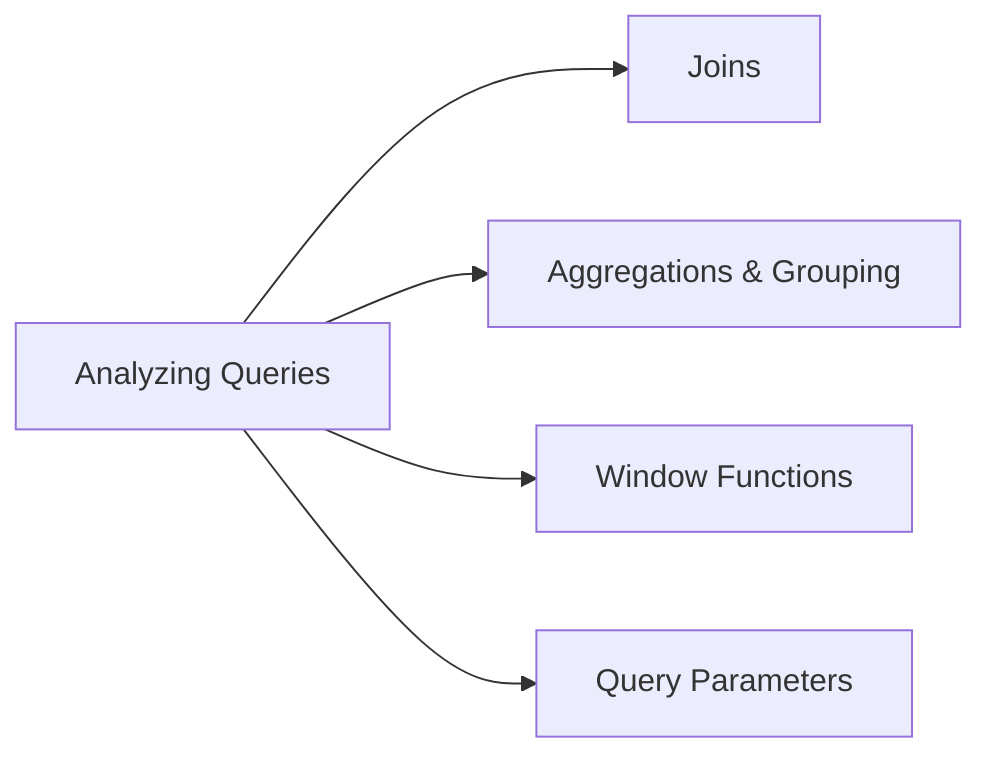

# Analyzing Queries (15 % of Exam)

The SQL analytics depth domain — joins, aggregations, window functions, query parameters, common patterns for ad-hoc analysis on Delta tables.

## Topics Overview

## Section Contents

| File | Topic | Priority |
| :--- | :--- | :--- |
| [01-joins.md](./01-joins.md) | Inner / outer / cross / semi / anti joins, broadcast hints | High |
| [02-aggregations-grouping.md](./02-aggregations-grouping.md) | `GROUP BY`, `GROUPING SETS`, `ROLLUP`, `CUBE`, `HAVING` | High |
| [03-window-functions.md](./03-window-functions.md) | `OVER`, `PARTITION BY`, `ORDER BY`, frame clauses, ranking | High |
| [04-parameters-queries.md](./04-parameters-queries.md) | Parameterised queries in DBSQL, default values, type safety | Medium |

## Key Concepts to Master

| Concept | Why it matters |
| :--- | :--- |
| **Semi vs anti joins** | Semi keeps rows from the left that match the right; anti keeps rows that don't match |
| **Window frames** | `ROWS BETWEEN` vs `RANGE BETWEEN` — controls which rows feed into the aggregate |
| **Ranking functions** | `ROW_NUMBER`, `RANK`, `DENSE_RANK` — `ROW_NUMBER` is unique per partition; ranks can tie |
| **Parameter binding** | DBSQL parameters bind type-safely; SQL injection is not possible through the param channel |
| **`GROUPING SETS`** | Multiple grouping aggregates in a single query — faster than UNION-ing several `GROUP BY`s |

## Related Resources

- [SQL functions cheat sheet (shared)](../../../shared/cheat-sheets/sql-functions.md)
- [Window functions code examples (shared)](../../../shared/code-examples/sql/window_functions.md)
- [CTE patterns code examples (shared)](../../../shared/code-examples/sql/cte_patterns.md)

---

**[← Previous: Creating Dashboards](../02-creating-dashboards-and-visualizations/README.md) | [↑ Back to Data Analyst Associate](../README.md) | [Next: Developing AI/BI Genie Spaces →](../04-developing-sharing-maintaining-genie-spaces/README.md)**
