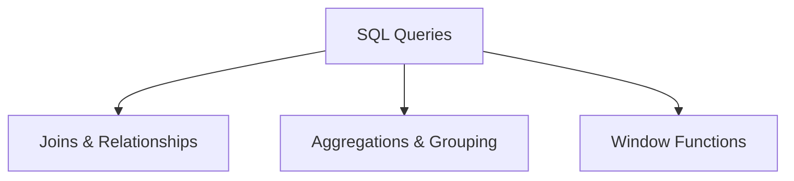

# SQL Queries (29% of Exam)

Master advanced SQL query techniques in Databricks SQL, including complex joins, aggregations, and analytical window functions.

## Topics Overview

## Section Contents

| File | Topic | Priority |
| :--- | :--- | :--- |
| [01-joins.md](01-joins.md) | Inner, outer, cross joins, multi-table operations | High |
| [02-aggregations-grouping.md](02-aggregations-grouping.md) | GROUP BY, HAVING, aggregate functions | High |
| [03-window-functions.md](03-window-functions.md) | ROW_NUMBER, RANK, LAG, LEAD, running totals | High |

## Key Concepts

- **Joins**: Multiple join types and performance considerations
- **Aggregations**: GROUP BY, HAVING, CUBE, ROLLUP
- **Window Functions**: Analytical functions for ranking and trending
- **Query Optimization**: Index usage and execution plans

## Related Resources

- [SQL Functions Quick Reference](../../../shared/cheat-sheets/sql-functions.md)
- [Performance Optimization](../../../shared/appendix/performance-troubleshooting.md)

## Next Steps

Proceed to [04-Dashboards & Visualization](../04-dashboards-visualization/README.md) to learn how to visualize query results.

---

**[← Back to Certification](../README.md)**
