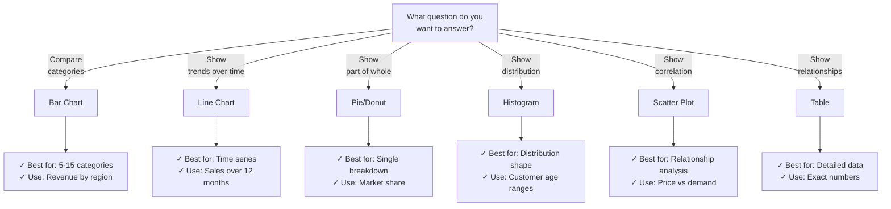

# Visualizations & Chart Types

## Overview

Different visualization types communicate data in different ways. Choosing the right chart type is critical for effective data storytelling.

## Chart Selection Guide



## Core Chart Types

### Bar Chart

**Purpose**: Compare values across categories

```sql
-- Revenue by region
SELECT region, SUM(amount) as revenue
FROM orders
GROUP BY region
ORDER BY revenue DESC;
```

**Visualization Settings:**

```yaml
Type: Column Chart (vertical bars)
X-axis: region (categorical)
Y-axis: revenue (quantitative)
Sort: Descending
Colors: Single color or gradient
Show Values: On bars or hover
Stacked: No (comparison)
```

**Variants:**

```text
Vertical Column Chart: Good for limited categories
Horizontal Bar Chart: Better for long labels (>20 chars)
Stacked Bar: Show totals + breakdown
Clustered Bar: Compare multiple series
```

**Best Practices:**

- ✅ Limit to 5-15 categories (more = uses table)
- ✅ Sort by value (makes patterns obvious)
- ✅ Use same scale on Y-axis
- ❌ 3D effects (distorts perception)

### Line Chart

**Purpose**: Show trends over time

```sql
-- Weekly revenue trend
SELECT
    DATE_TRUNC('week', order_date) as week,
    SUM(amount) as revenue
FROM orders
GROUP BY DATE_TRUNC('week', order_date)
ORDER BY week;
```

**Visualization Settings:**

```yaml
Type: Line Chart
X-axis: week (time)
Y-axis: revenue (quantitative)
Line Style: Solid
Markers: Dots at data points
Zoom: Enable for time-series
Multiple Series: Support for overlays
Forecast: Optional trend line
```

**Best Practices:**

- ✅ Use for sequential, time-ordered data
- ✅ Multiple series for comparison (2-4 lines)
- ✅ Add trend line for forecast
- ✅ Enable zoom for detailed inspection
- ❌ More than 4 lines = unreadable

### Pie Chart

**Purpose**: Show part-to-whole relationships (market share, composition)

```sql
-- Market share by company
SELECT
    company_name,
    COUNT(*) as orders,
    ROUND(COUNT(*) * 100.0 / SUM(COUNT(*)) OVER (), 2) as market_share_pct
FROM orders
GROUP BY company_name
ORDER BY orders DESC;
```

**Visualization Settings:**

```yaml
Type: Pie Chart
Values: orders
Labels: company_name + market_share_pct
Colors: Distinct colors or palette
Donut Style: Optional center cutout
Legend: Show company names
```

**When to Use:**

- ✅ 3-5 slices only
- ✅ Show composition (80% red, 20% blue)
- ✅ Part-of-whole relationships

**When to Avoid:**

- ❌ >5 slices (comparison hard)
- ❌ Comparing values (use bar instead)
- ❌ Precise values (label with %)

### Scatter Plot

**Purpose**: Show relationship/correlation between two variables

```sql
-- Price vs revenue correlation
SELECT
    price,
    revenue_generated
FROM products
WHERE category = 'electronics'
ORDER BY price;
```

**Visualization Settings:**

```yaml
Type: Scatter Plot
X-axis: price
Y-axis: revenue_generated
Bubble Size: Optional third metric
Color: Optional category
Trend Line: Linear regression fit
Correlation Coefficient: Show R²
```

**Interpretation:**

```text
Scatter Pattern Analysis:
  Tight cluster along diagonal: Strong positive correlation
  Inverse diagonal: Strong negative correlation
  Random scatter: No correlation

R² Value:
  0.9-1.0: Very strong correlation
  0.7-0.9: Strong correlation
  0.3-0.7: Moderate correlation
  <0.3: Weak or no correlation
```

### Area Chart

**Purpose**: Show cumulative totals over time

```sql
-- Stacked area: Revenue trend by region
SELECT
    DATE_TRUNC('month', order_date) as month,
    region,
    SUM(amount) as revenue
FROM orders
GROUP BY month, region
ORDER BY month, region;
```

**Visualization Settings:**

```yaml
Type: Stacked Area Chart
X-axis: month (time)
Y-axis: revenue (quantitative)
Series: Separate area per region
Legend: Region names with colors
Stack: Stacked (cumulative) or grouped
Fill: Semi-transparent for visibility
```

**Use Cases:**

- ✅ Cumulative growth (total + breakdown)
- ✅ Resource allocation over time
- ✅ Portfolio composition changes

### Gauge / Number Chart

**Purpose**: Display single KPI with context

```sql
-- Current month performance vs target
SELECT
    SUM(amount) as current_revenue,
    1000000 as monthly_target
FROM orders
WHERE month = MONTH(CURRENT_DATE);
```

**Gauge Configuration:**

```yaml
Type: Gauge Chart
Min Value: 0
Max Value: 1000000 (target)
Current Value: 625000 (actual)
Thresholds:
  Red: 0-499999 (< 50%)
  Yellow: 500000-799999 (50-80%)
  Green: 800000-1000000 (80-100%)
Show: Percentage (62.5%)
```

### Table

**Purpose**: Show detailed data with ability to sort/filter

```sql
-- Detailed customer orders
SELECT
    order_id,
    customer_name,
    order_date,
    amount,
    status
FROM orders
ORDER BY order_date DESC
LIMIT 1000;
```

**Table Configuration:**

```yaml
Type: Table View
Columns:
  - order_id (number, right-align)
  - customer_name (text, left-align)
  - order_date (date, center)
  - amount (currency, formatted $)
  - status (text, color-coded)
Sorting: User-clickable headers
Filtering: Quick filter per column
Pagination: 25 rows per page
Export: CSV, JSON download
```

**When to Use:**

- ✅ Show exact values (not estimates)
- ✅ Large datasets (>15 data points)
- ✅ Multiple dimensions/attributes
- ✅ User wants to explore

## Chart Formatting

### Colors

```yaml
Color Strategies:
  Sequential: Light to dark (single hue)
    Use: Sales amounts, intensity

  Diverging: Blue-White-Red (two hues)
    Use: Positive/negative, above/below target

  Categorical: Distinct colors
    Use: Regions, departments, categories

Best Practices:
  - Use 3-7 colors max
  - Colorblind-friendly: Blue, orange, green
  - Avoid: Red-green combo alone
  - Use ColorBrewer for palettes
```

### Labels & Legends

```yaml
Labels:
  On Chart: Values directly on bars/points
  Hover: Tooltip with detailed info
  Axis: Clear titles (e.g., "Revenue ($)")
  Legend: Category descriptions (right/bottom)

Good Practice:
  - Descriptive axis titles
  - Format values: $100K not $100000
  - Include units: "Hours" not bare numbers
```

### Data Formatting

```sql
-- Format values for display
SELECT
    region,
    ROUND(SUM(amount), 2) as revenue,
    ROUND(COUNT(*) / 1000.0, 1) as orders_k,
    ROUND(COUNT(*) * 100.0 / SUM(COUNT(*)) OVER (), 1) as share_pct
FROM orders
GROUP BY region;

-- Formatted output:
-- region | revenue   | orders_k | share_pct
-- North  | $2500000  | 123.5    | 25.0%
```

## Multi-series Visualizations

### Combining Charts

```sql
-- Revenue and order count on one chart
SELECT
    DATE_TRUNC('week', order_date) as week,
    SUM(amount) as revenue,
    COUNT(*) as order_count
FROM orders
GROUP BY DATE_TRUNC('week', order_date)
ORDER BY week;
```

**Dual Axis Configuration:**

```yaml
Chart Type: Combination Chart
Primary Y-axis: revenue ($, bar)
Secondary Y-axis: order_count (units, line)
X-axis: week (time)
Display: Both metrics visible
Scale: Independent axes for clarity
```

### Side-by-side Comparison

```sql
-- Compare two time periods
SELECT
    DATE_TRUNC('week', order_date) as week,
    'Current Year' as period,
    SUM(amount) as revenue
FROM orders
WHERE YEAR(order_date) = 2024

UNION ALL

SELECT
    DATE_TRUNC('week', order_date) as week,
    'Prior Year' as period,
    SUM(amount) as revenue
FROM orders
WHERE YEAR(order_date) = 2023;
```

## Visualization Best Practices

### Data Integrity

```yaml
✅ Do:
  1. Show data aggregation details in tooltip
  2. Include data collection date/time
  3. Note any data limitations
  4. Round appropriately (no false precision)

❌ Don't:
  1. Hide underlying data
  2. Use confusing aggregations
  3. Misalign scales
  4. Use 3D or non-standard projections
```

### Accessibility

```yaml
Colorblind-safe palette:
  - Blue (ok for all)
  - Orange (ok for all)
  - Red (avoid for red-green colorblind)

Text:
  - Use font size >= 12pt
  - Use sufficient contrast (4.5:1 ratio)
  - Avoid small text in legend

Alternative:
  - Provide data table option
  - Include text description
```

## Use Cases

- **Sales Trend Analysis**: Using line charts to show revenue over time with multiple series for year-over-year comparison.
- **Market Share Breakdown**: Using pie or donut charts (with 3-5 slices) to communicate composition at a glance in executive presentations.

## Common Issues & Errors

### Chart Not Rendering Correctly

**Scenario:** A bar chart shows only one bar despite multiple categories in the data.
**Fix:** Verify the X-axis column is categorical (not a single aggregated value). Check column mappings in the visualization editor.

## Exam Tips

1. **Chart selection** - Bar chart for category comparison, line chart for trends over time, scatter for correlation
2. **Pie chart limit** - Best for 5 or fewer slices; more categories become hard to read
3. **Histogram vs bar chart** - Histogram shows distribution of a single numeric variable; bar chart compares categories
4. **Scatter plot R²** - R² close to 1 means strong linear relationship; close to 0 means weak or no relationship
5. **Dual-axis charts** - Use when comparing two metrics with different scales (e.g., revenue and count)
6. **Color usage** - Use sequential palettes for continuous data, categorical palettes for distinct groups
7. **Aggregation matters** - Always verify the aggregation method (SUM, AVG, COUNT) matches the question intent
8. **Table vs chart** - Use tables when exact values matter; use charts when patterns or trends matter
9. **Formatting** - Labels, axis titles, and legends are essential for exam questions about readability
10. **Time series** - Line charts require a properly ordered time axis; bar charts can misrepresent time sequences

## Key Takeaways

- **Bar chart**: Compare categories
- **Line chart**: Trend over time
- **Pie chart**: Part-of-whole (3-5 slices only)
- **Scatter plot**: Correlation analysis
- **Area chart**: Cumulative/stacked over time
- **Gauge**: Single KPI with context
- **Table**: Detailed data exploration
- **Colors**: Sequential, diverging, categorical strategies
- **Formatting**: Axes labels, number formats, legends
- **Multi-series**: Dual axes, side-by-side comparisons

## Related Topics

- [Dashboards & Dashboard Design](./01-dashboards.md) - Building dashboards with visualizations
- [Alerts & Scheduling](./03-alerts-scheduling.md) - Triggering alerts from query results
- [SQL Query Optimization](../03-sql-queries/README.md) - Writing efficient queries for charts

## Official Documentation

- [Databricks Visualizations](https://docs.databricks.com/sql/user/visualizations/index.html)
- [Visualization Types](https://docs.databricks.com/sql/user/visualizations/visualization-types.html)
- [Databricks SQL Dashboards](https://docs.databricks.com/sql/user/dashboards/index.html)

---

**[← Previous: Dashboards & Dashboard Design](./01-dashboards.md) | [↑ Back to Dashboards & Visualization](./README.md) | [Next: Alerts & Scheduling](./03-alerts-scheduling.md) →**
