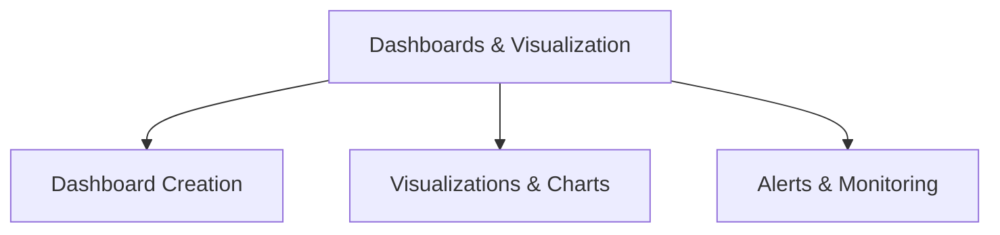

# Dashboards & Visualization (18% of Exam)

Create interactive dashboards and visualizations in Databricks SQL to communicate data insights effectively.

## Topics Overview

## Section Contents

| File | Topic | Priority |
| :--- | :--- | :--- |
| [01-dashboards.md](01-dashboards.md) | Dashboard design, layout, interactivity | High |
| [02-visualizations.md](02-visualizations.md) | Chart types, formatting, best practices | High |
| [03-alerts-scheduling.md](03-alerts-scheduling.md) | Alerts, webhooks, scheduled queries | Medium |

## Key Concepts

- **Dashboards**: Layout, widget arrangement, refresh settings
- **Visualizations**: Chart types, drill-down capabilities, formatting
- **Interactivity**: Parameters, filters, drill-through
- **Alerts**: Notification triggers, thresholds, integrations

## Related Resources

- [Dashboards & Visualization Documentation](https://docs.databricks.com/en/sql/user/dashboards/index.html)
- [Alert Configuration Guide](https://docs.databricks.com/en/sql/user/alerts/index.html)

## Next Steps

Proceed to [05-Analytics Applications](../05-analytics-applications/README.md) to learn about advanced analytics sharing and collaboration.

---

**[← Back to Certification](../README.md)**
