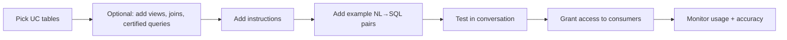

# AI/BI Genie Spaces Overview

## Overview

An **AI/BI Genie Space** is a curated natural-language analytics surface over a defined set of Unity Catalog tables. The data team creates a space, picks the tables and views Genie can use, optionally adds instructions and example queries, and then business users ask questions in plain English. Genie writes the SQL, runs it against a SQL Warehouse, and returns answers (with tables, charts, and prose).

> [!abstract]
>
> - **Genie Space** = scoped UC tables + optional instructions + optional example queries + optional trusted assets
> - Built on top of **Mosaic AI** model serving — Genie generates SQL, doesn't ship the data to the model
> - Honours UC permissions: a user only sees rows their UC identity is allowed to see (row filters and column masks apply)
> - Conversational: follow-up questions inherit the prior turn's context
> - Audit log records every Genie query, including the generated SQL

> [!tip] What the Exam Tests
>
> - The lifecycle: create space → pick tables → curate (instructions, examples, trusted assets) → share → monitor
> - That **Genie respects UC permissions** (no data leakage to users without grants)
> - Where a Genie answer comes from: generated SQL run on a SQL Warehouse, NOT the model "reasoning over rows"
> - The difference between **instructions** (free-text guidance) and **example queries** (few-shot SQL exemplars)
> - That Genie is **per-Workspace** and requires a backing SQL Warehouse

---

## How a Genie Space gets built

## Genie respects Unity Catalog permissions

Genie cannot bypass UC. If a user lacks `SELECT` on a column, Genie won't surface it. If a row filter excludes a row, Genie's generated SQL will too — because Genie just *writes* the SQL; UC enforces it on execution.

## Use Cases

- **Self-serve dashboards** — give a Genie Space to a department; their analysts ask questions instead of waiting for ticketed dashboard requests
- **Onboarding new analysts** — Genie Space's example queries act as a living tutorial
- **Ad-hoc exploration** — quick what-if questions where building a chart isn't worth it
- **Augmenting AI/BI Dashboards** — embed a Genie space as a "ask anything" widget alongside curated visuals

## Common Issues & Errors

- **Vague instructions** lead to inconsistent SQL — be specific ("active customers = `status='ACTIVE'` and `deleted_at IS NULL`")
- **Too many tables in one space** dilutes the model's context — split by domain
- **Missing example queries** for common patterns — Genie may guess incorrectly without exemplars
- **Permission mismatch** between curator and consumer — test the space as a typical user, not the owner

## Exam Tips

> [!tip]
>
> - Genie respects UC permissions — this is the #1 trap on the exam.
> - Genie generates SQL → runs on a SQL Warehouse → returns results. Not "the model reads the data."
> - Instructions and example queries are both *optional but recommended* for accuracy.

## Key Takeaways

- A Genie Space = scoped tables + curation, sitting on top of UC and a SQL Warehouse
- Permissions are enforced by UC, not by Genie
- Generated SQL is auditable
- Curation (instructions + examples) is how you improve accuracy

## Related Topics

- [Tuning Genie Spaces](./02-tuning-genie-spaces.md)
- [Unity Catalog (platform domain)](../05-understanding-databricks-platform/01-unity-catalog.md)
- [Securing Data](../07-securing-data/01-access-control.md)
- [Creating Dashboards](../02-creating-dashboards-and-visualizations/README.md) — Genie can be embedded as a widget alongside curated dashboard visuals

## Official Documentation

- [AI/BI Genie overview](https://docs.databricks.com/en/genie/index.html)
- [Create a Genie space](https://docs.databricks.com/en/genie/create-genie-space.html)
- [Genie best practices](https://docs.databricks.com/en/genie/best-practices.html)

---

**[↑ Back to AI/BI Genie Spaces](./README.md) | [Next: Tuning Genie Spaces →](./02-tuning-genie-spaces.md)**
