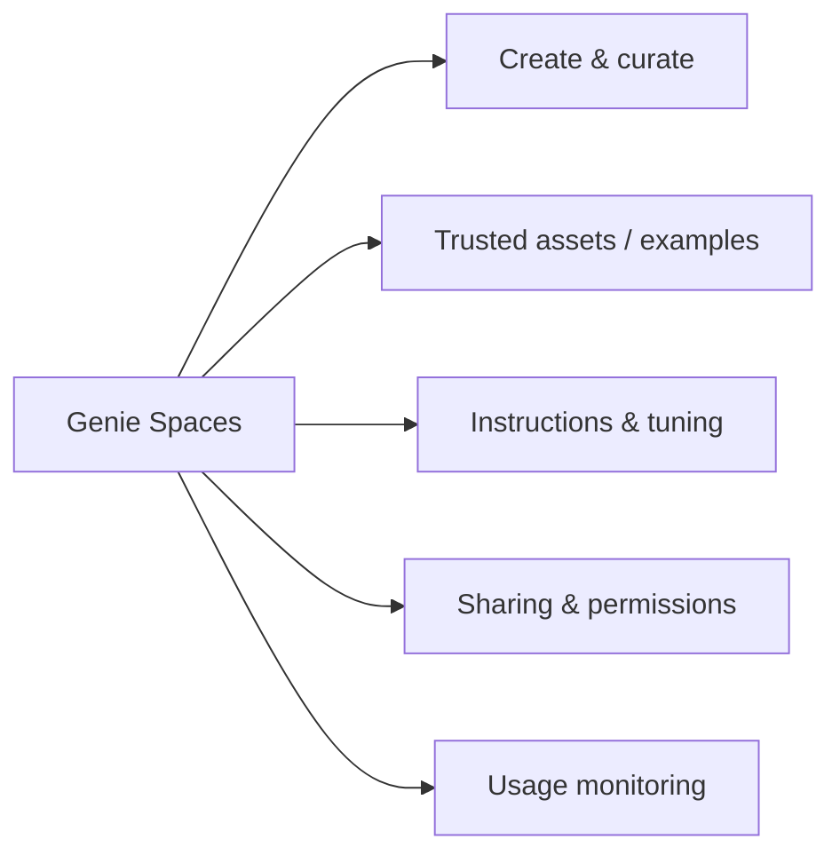

# Developing, Sharing, and Maintaining AI/BI Genie Spaces (12 % of Exam)

> [!important]
> **New in the October 2025 blueprint.** AI/BI Genie Spaces is the natural-language analytics surface that sits on top of Unity Catalog. Analysts curate a Genie Space over a set of UC tables; business users ask questions in plain language and Genie generates SQL, runs it against a SQL Warehouse, and returns charts and text.

## Topics Overview

## Section Contents

| File | Topic | Priority |
| :--- | :--- | :--- |
| [01-genie-spaces-overview.md](./01-genie-spaces-overview.md) | What a Genie Space is, how it builds context from UC tables | High |
| [02-tuning-genie-spaces.md](./02-tuning-genie-spaces.md) | Instructions, example queries, trusted assets, certified queries | High |

## Key Concepts

| Concept | Why it matters |
| :--- | :--- |
| **Genie Space** | A curated set of UC tables + instructions + example queries that Genie uses to translate natural language into SQL |
| **Trusted asset** | A query or function explicitly approved as a building block Genie can call |
| **Instructions** | Plain-English guidance that constrains Genie's interpretations (e.g., "Always filter on `is_active = true`") |
| **Sample queries** | Few-shot examples that improve translation accuracy for the space's vocabulary |
| **Permissions** | Genie respects UC table-, row-, and column-level access — a user only sees rows their UC identity is allowed to see |
| **Conversational follow-up** | Genie maintains conversation context within a session for refining questions |

## Related Resources

- [AI/BI Genie documentation (official)](https://docs.databricks.com/en/genie/index.html)
- [Unity Catalog Basics (shared)](../../../shared/fundamentals/unity-catalog-basics.md)
- [Unity Catalog cheat sheet (shared)](../../../shared/cheat-sheets/unity-catalog-quick-ref.md)

> [!note]
> The two topic files in this domain are deliberately concise overviews — Genie Spaces is a young feature and the docs are the authoritative source. Watch the [AI/BI documentation](https://docs.databricks.com/en/genie/index.html) for updates.

---

**[← Previous: Analyzing Queries](../03-analyzing-queries/README.md) | [↑ Back to Data Analyst Associate](../README.md) | [Next: Understanding Databricks Platform →](../05-understanding-databricks-platform/README.md)**
