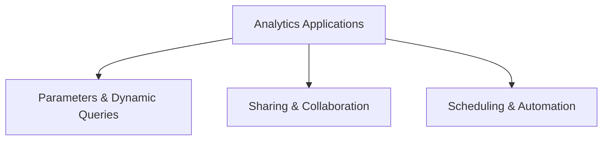

# Analytics Applications (11% of Exam)

Build interactive analytics applications with parameters, scheduling, and sharing capabilities for collaboration.

## Topics Overview

## Section Contents

| File | Topic | Priority |
| :--- | :--- | :--- |
| [01-parameters-queries.md](01-parameters-queries.md) | Query parameters, dynamic SQL, filtering | High |
| [02-sharing-collaboration.md](02-sharing-collaboration.md) | Dashboard sharing, permissions, collaboration | Medium |

## Key Concepts

- **Parameters**: Dynamic query execution with user inputs
- **Query Templates**: Reusable query patterns
- **Sharing**: Permission levels, audience management
- **Scheduling**: Automated query execution, refresh intervals

## Related Resources

- [Query Parameters Documentation](https://docs.databricks.com/en/sql/user/query-parameters.html)
- [Sharing & Collaboration Guide](https://docs.databricks.com/en/sql/user/dashboards/sharing.html)

## Next Steps

Proceed to [Practice Questions](../resources/practice-questions/README.md) to test your knowledge.

---

**[← Back to Certification](../README.md)**
