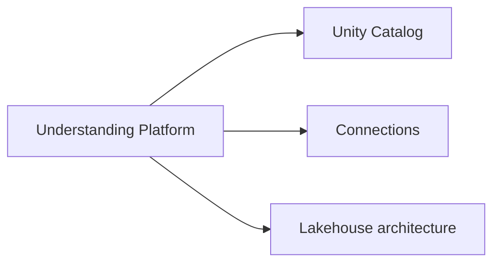

# Understanding Databricks Data Intelligence Platform (11 % of Exam)

What the lakehouse is, how Unity Catalog organises data, and how analysts connect to the platform from external tools (BI, JDBC, ODBC, Power BI, Tableau).

## Topics Overview

## Section Contents

| File | Topic | Priority |
| :--- | :--- | :--- |
| [01-unity-catalog.md](./01-unity-catalog.md) | UC architecture for analysts: three-level namespace, catalogs, schemas, tables | High |
| [02-connections.md](./02-connections.md) | JDBC / ODBC / Power BI / Tableau connection setup, OAuth + PAT auth | High |

## Key Concepts

| Concept | Why it matters |
| :--- | :--- |
| **Three-level namespace** | `catalog.schema.object` — every UC object addressed this way |
| **Catalog vs metastore** | A workspace is bound to one metastore; many catalogs live in the metastore |
| **Data Intelligence Platform** | Databricks' current product positioning — lakehouse + AI/BI + Mosaic AI in one |
| **Connection options for BI tools** | OAuth for human users; PAT or service-principal OAuth for service accounts |
| **Personal SQL Warehouse vs shared** | Personal warehouses (small, on-demand) for ad-hoc analysis; shared serverless for dashboards |

## Related Resources

- [Unity Catalog Basics (shared)](../../../shared/fundamentals/unity-catalog-basics.md)
- [Unity Catalog cheat sheet (shared)](../../../shared/cheat-sheets/unity-catalog-quick-ref.md)
- [Platform Architecture (shared)](../../../shared/fundamentals/platform-architecture.md)
- [Databricks SQL connections docs](https://docs.databricks.com/en/integrations/index.html)

---

**[← Previous: Developing AI/BI Genie Spaces](../04-developing-sharing-maintaining-genie-spaces/README.md) | [↑ Back to Data Analyst Associate](../README.md) | [Next: Managing Data →](../06-managing-data/README.md)**
