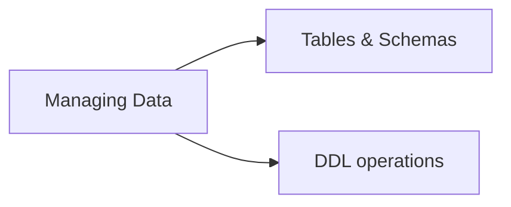

# Managing Data (8 % of Exam)

Creating and managing tables and schemas in Unity Catalog from the analyst's perspective. Managed vs external tables, common DDL, and the lifecycle of a query-able dataset.

## Topics Overview

## Section Contents

| File | Topic | Priority |
| :--- | :--- | :--- |
| [01-tables-schemas.md](./01-tables-schemas.md) | `CREATE / ALTER / DROP` tables and schemas; managed vs external | High |

## Key Concepts to Master

| Concept | Why it matters |
| :--- | :--- |
| **Managed vs external tables** | Managed = UC owns the storage; external = UC owns metadata, you own storage |
| **`CREATE OR REPLACE TABLE`** | Atomically replace a Delta table's contents while preserving history |
| **`CREATE TABLE AS SELECT` (CTAS)** | Materialise a query result as a new Delta table |
| **`ALTER TABLE` operations** | Rename columns, change types (limited), add comments, set properties |
| **Drop semantics** | `DROP TABLE` on managed = deletes data; on external = deletes only metadata |

## Related Resources

- [Delta Lake cheat sheet (shared)](../../../shared/cheat-sheets/delta-lake-commands.md)
- [Unity Catalog cheat sheet (shared)](../../../shared/cheat-sheets/unity-catalog-quick-ref.md)

---

**[← Previous: Understanding Databricks Platform](../05-understanding-databricks-platform/README.md) | [↑ Back to Data Analyst Associate](../README.md) | [Next: Securing Data →](../07-securing-data/README.md)**
