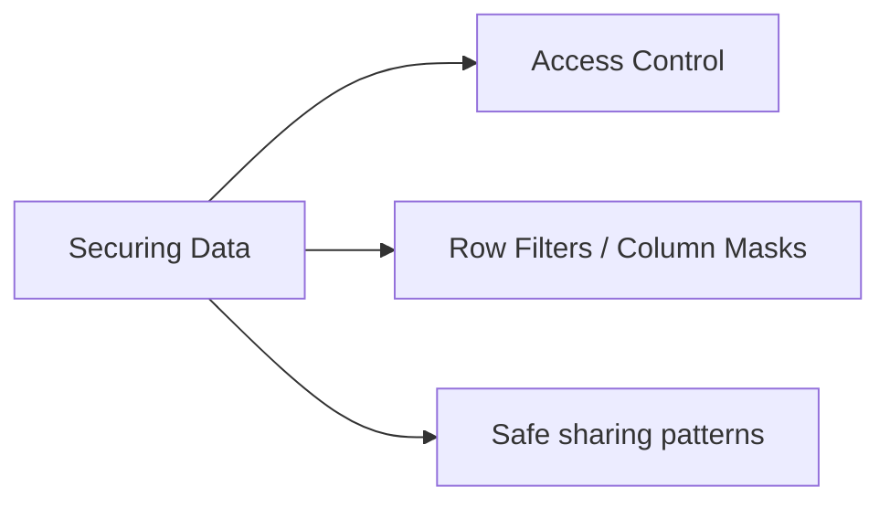

# Securing Data (8 % of Exam)

Row- and column-level security, access control, and the UC governance controls analysts need to know to share data safely.

## Topics Overview

## Section Contents

| File | Topic | Priority |
| :--- | :--- | :--- |
| [01-access-control.md](./01-access-control.md) | GRANT / REVOKE, ownership, row filters, column masks | High |

## Key Concepts to Master

| Concept | Why it matters |
| :--- | :--- |
| **GRANT vs OWNER** | Owners can grant; non-owners can only consume what's been granted |
| **Row filter** | A SQL function that returns true/false per row — UC enforces it on every query |
| **Column mask** | A SQL function applied per column — returns the original value or a masked one |
| **DENY** | Overrides GRANT — used to enforce hard restrictions (e.g., "no exec staff sees salaries") |
| **Privilege hierarchy** | Catalog-level grants cascade to schemas; schema-level grants cascade to tables |

## Related Resources

- [Unity Catalog cheat sheet (shared)](../../../shared/cheat-sheets/unity-catalog-quick-ref.md)
- [Row filters and column masks documentation](https://docs.databricks.com/en/data-governance/unity-catalog/row-and-column-filters.html)

---

**[← Previous: Managing Data](../06-managing-data/README.md) | [↑ Back to Data Analyst Associate](../README.md) | [Next: Importing Data →](../08-importing-data/README.md)**
