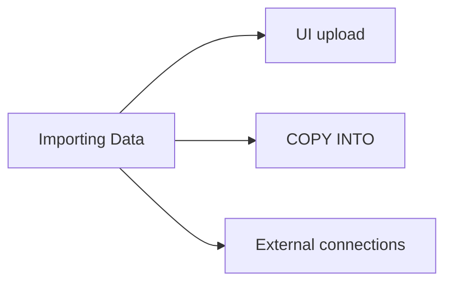

# Importing Data (5 % of Exam)

The analyst-level paths for getting data into Databricks: file upload through the UI, `COPY INTO` for repeatable bulk loads, and the basic patterns for ingesting from external sources.

## Topics Overview

## Section Contents

| File | Topic | Priority |
| :--- | :--- | :--- |
| [01-importing-data-overview.md](./01-importing-data-overview.md) | UI file upload, `COPY INTO`, simple external-source patterns | High |

## Key Concepts to Master

| Concept | Why it matters |
| :--- | :--- |
| **UI file upload** | "Create Table" wizard supports CSV / TSV / JSON / Parquet / Avro / Delta — fastest path to a one-off table |
| **`COPY INTO`** | Idempotent bulk load — tracks processed files in the target table's history; re-runs skip already-loaded files |
| **Lakehouse Federation** | Read external databases without copying — see the DE Pro `10-data-sharing-and-federation` section for depth |
| **Auto Loader** | For continuous file ingestion — see the DE Associate `02-etl-spark-sql` and DE Pro `07-data-ingestion-and-acquisition` sections |
| **Schema inference vs declaration** | UI infers; production loads should declare the schema for stability |

## Related Resources

- [`COPY INTO` documentation](https://docs.databricks.com/en/sql/language-manual/delta-copy-into.html)
- [Auto Loader documentation](https://docs.databricks.com/en/ingestion/auto-loader/index.html)
- [Lakehouse Federation (DE Pro)](../../data-engineer-professional/10-data-sharing-and-federation/02-lakehouse-federation.md)

> [!note]
> The Data Analyst exam stays at the analyst level for importing — it tests the *what* and *when* of each path, not the deep configuration. For production-grade ingestion, look to the DE Associate / DE Pro guides.

---

**[← Previous: Securing Data](../07-securing-data/README.md) | [↑ Back to Data Analyst Associate](../README.md) | [Next: Data Modeling with Databricks SQL →](../09-data-modeling-with-databricks-sql/README.md)**
