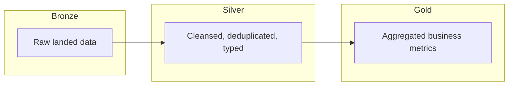
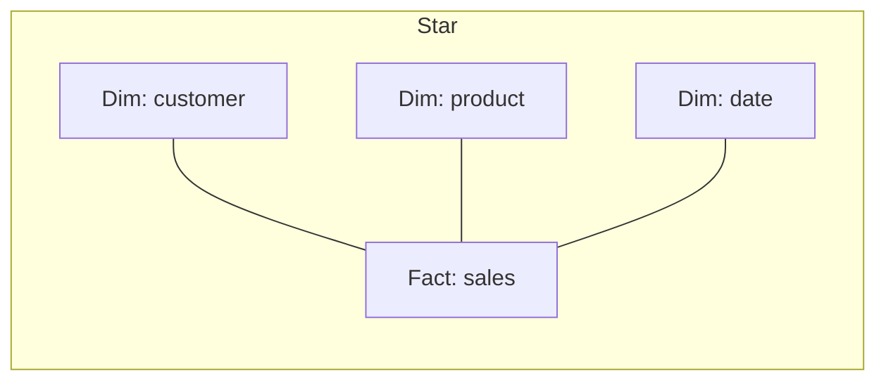
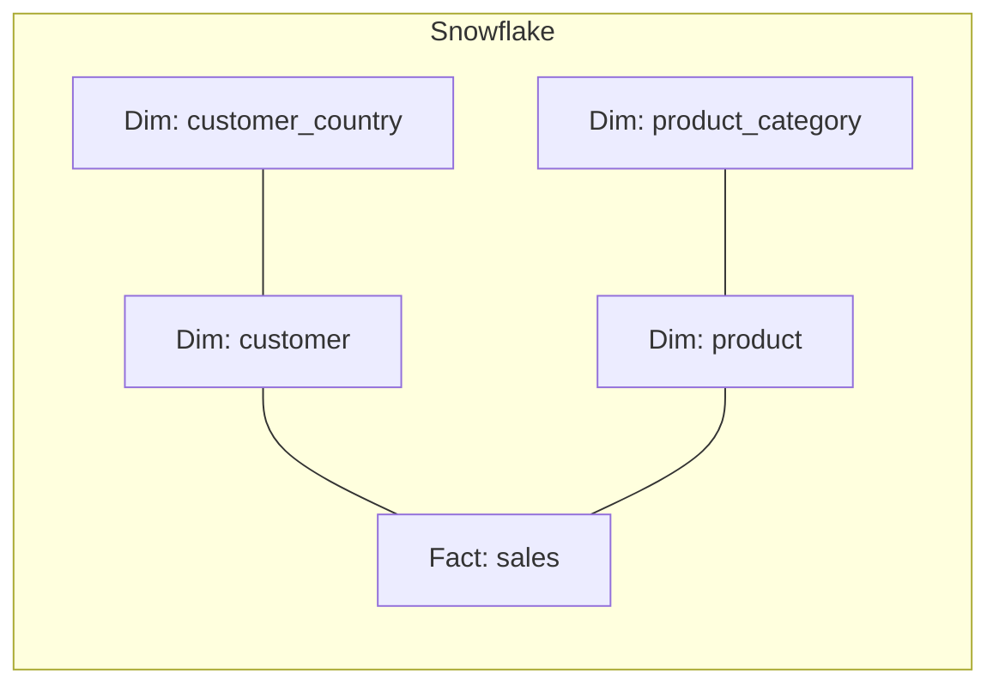

# Data Modeling with Databricks SQL Overview

## Overview

Analyst-level data modelling vocabulary: the **medallion architecture**, **dimensional modelling** (star and snowflake), and the two table-shaped abstractions analysts reach for — **standard views** and **materialised views**. Knowing when to use which is the heart of the 5 % domain.

> [!abstract]
>
> - **Medallion** — Bronze (raw) → Silver (cleansed) → Gold (aggregated). Analysts mostly query Gold
> - **Star schema** — central fact table + dimension tables; the BI default
> - **Snowflake schema** — star with normalised dimensions
> - **View** — saved query; runs on read; no storage cost
> - **Materialised view** — pre-computed result; refreshes on schedule or trigger; trades storage for read speed

> [!tip] What the Exam Tests
>
> - The medallion vocabulary and what each layer typically contains
> - Star vs snowflake — when to prefer each
> - View vs materialised view trade-off (compute on read vs storage + scheduled refresh)
> - That **Gold** tables are usually what analysts query, not Bronze

---

## Medallion architecture (analyst lens)



- **Bronze** — analysts rarely query directly; raw, schema-on-read, append-only
- **Silver** — cleansed, deduplicated, typed; ad-hoc exploration happens here
- **Gold** — aggregated business metrics; powers dashboards and the most common analyst queries

## Star vs snowflake





| Aspect | Star | Snowflake |
| :--- | :--- | :--- |
| Joins per query | Few (one per dimension) | Many (one per normalised level) |
| Storage | Dimensions duplicated | Dimensions normalised |
| Maintenance | Easier | More flexible |
| Query speed | Faster (fewer joins) | Slower (more joins) |
| Default for BI | ✓ | When normalisation is critical |

## View vs materialised view

| Aspect | Standard view | Materialised view |
| :--- | :--- | :--- |
| **Storage** | None — query stored, runs on read | Result stored as Delta data |
| **Read cost** | Re-executes every read | Reads the materialised result (fast) |
| **Freshness** | Always current | Refreshed on schedule, trigger, or `REFRESH MATERIALIZED VIEW` |
| **When to use** | Lightweight aliasing, security wrapper, dynamic filters | Expensive aggregates, dashboards, frequently re-read queries |
| **Cost trade-off** | Compute every read | Storage + scheduled compute |

```sql
-- Standard view
CREATE OR REPLACE VIEW main.gold.active_customers AS
SELECT * FROM main.silver.customers WHERE status = 'ACTIVE';

-- Materialised view (refresh manually or on a schedule)
CREATE OR REPLACE MATERIALIZED VIEW main.gold.monthly_revenue AS
SELECT date_trunc('month', order_date) AS month,
       SUM(total) AS revenue
FROM main.silver.orders
GROUP BY 1;
```

## Use Cases

- **Dashboard backing tables** → Gold layer + materialised views
- **Cross-system reporting** → Gold star schema with curated metrics
- **Ad-hoc exploration** → Silver layer with standard views for filters
- **Frequently re-aggregated reports** → materialised view to amortise compute

## Common Issues & Errors

- **Querying Bronze directly** for dashboards — slow, brittle, often missing cleaning
- **Stale materialised views** — set a refresh schedule that matches business freshness needs
- **Overusing snowflake** — extra joins for marginal normalisation benefit
- **Renaming a column referenced by views** — views may break silently until queried

## Exam Tips

> [!tip]
>
> - Analysts default to **Gold**. Bronze and Silver are usually engineer-touched.
> - Star wins for BI by default; snowflake only when normalisation matters.
> - **View = compute on read; MV = storage + scheduled compute**. Pick based on read frequency vs freshness need.
> - **`CREATE STREAMING TABLE`** (in Lakeflow Declarative Pipelines) is engineer-scope, but recognise it as a third option that combines streaming ingestion with materialised semantics.

## Key Takeaways

- Medallion = Bronze / Silver / Gold quality layering
- Star = BI default; snowflake = normalised dimensions
- View = no storage, slow read; MV = storage, fast read
- Analysts mostly query Gold

## Related Topics

- [Managing Data](../06-managing-data/01-tables-schemas.md)
- [Medallion Architecture (shared)](../../../shared/fundamentals/medallion-architecture.md)

## Official Documentation

- [`CREATE VIEW`](https://docs.databricks.com/en/sql/language-manual/sql-ref-syntax-ddl-create-view.html)
- [`CREATE MATERIALIZED VIEW`](https://docs.databricks.com/en/sql/language-manual/sql-ref-syntax-ddl-create-materialized-view.html)
- [Medallion architecture](https://docs.databricks.com/en/lakehouse/medallion.html)

---

**[↑ Back to Data Modeling with Databricks SQL](./README.md)**
