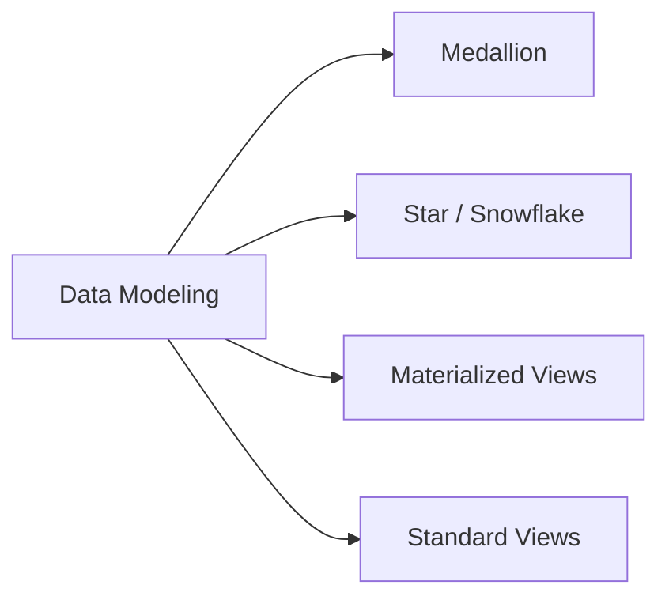

# Data Modeling with Databricks SQL (5 % of Exam)

The analyst-level data-modelling vocabulary: medallion architecture, dimensional modelling (star / snowflake), materialised views, and views as a tool for shaping data without owning the pipeline.

## Topics Overview

## Section Contents

| File | Topic | Priority |
| :--- | :--- | :--- |
| [01-data-modeling-overview.md](./01-data-modeling-overview.md) | Medallion architecture, dimensional modelling vocabulary, when to use views vs MVs | High |

## Key Concepts

| Concept | Why it matters |
| :--- | :--- |
| **Medallion (Bronze / Silver / Gold)** | Multi-hop layering — analysts typically query Gold |
| **Star schema** | Central fact table + dimension tables; the analyst-friendly canonical shape |
| **Snowflake schema** | Star with normalised dimension tables — more joins, more flexibility |
| **Standard view** | Lightweight saved query; runs on read |
| **Materialised view** | Pre-computed result, refreshed on a schedule or on change — costs storage, saves compute on read |
| **Incremental MV refresh** | When the source is Delta and the query is expressible incrementally, Databricks SQL refreshes only the changed rows — cheaper than full recompute |
| **`CREATE STREAMING TABLE` (Lakeflow Declarative Pipelines)** | Refreshing pattern that combines view semantics with Delta-backed storage; for analyst awareness, see DE Pro for depth |

## Related Resources

- [Medallion Architecture (shared)](../../../shared/fundamentals/medallion-architecture.md)
- [SQL functions cheat sheet (shared)](../../../shared/cheat-sheets/sql-functions.md)

---

**[← Previous: Importing Data](../08-importing-data/README.md) | [↑ Back to Data Analyst Associate](../README.md)**
