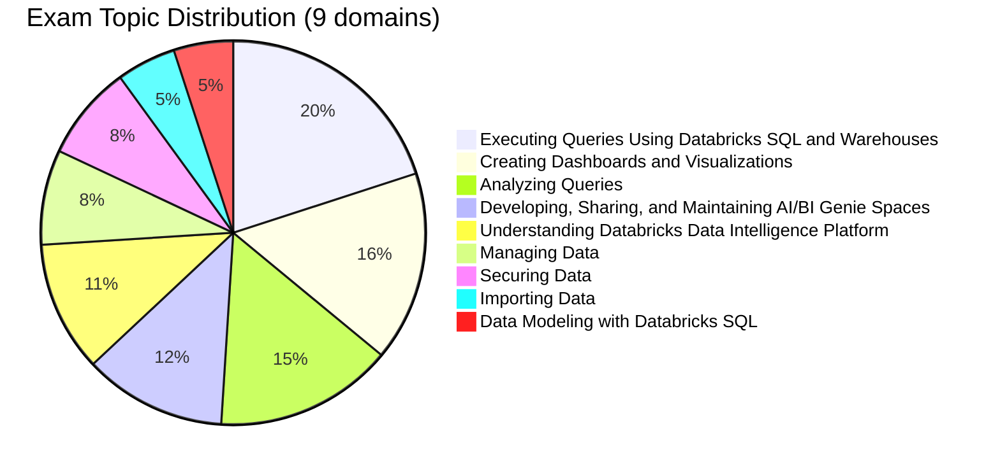

# Databricks Data Analyst Associate

> [!important]
> **What changed in the October 2025 exam guide**
>
> - Restructured from 5 broad sections into **9 explicitly weighted domains**
> - **AI/BI Genie Spaces** is now a first-class domain (12 %) — natural-language analytics on top of Unity Catalog
> - **Securing Data** broken out as its own 8 % domain
> - **Importing Data** and **Data Modeling with Databricks SQL** are now distinct 5 % domains
> - Pass / fail — **the October 2025 exam guide does not publish a numeric passing score**
>
> The official source of truth: [Databricks Certified Data Analyst Associate](https://www.databricks.com/learn/certification/data-analyst-associate). The folder structure in this guide now matches the official 9-domain blueprint 1 : 1.

## Exam Overview

| Detail              | Information                                 |
| ------------------- | ------------------------------------------- |
| **Certification**   | Databricks Certified Data Analyst Associate |
| **Exam guide**      | October 2025                                |
| **Scored questions**| 45 multiple-choice                          |
| **Duration**        | 90 minutes                                  |
| **Result**          | Pass / fail (no numeric threshold in the October 2025 exam guide) |
| **Languages**       | English                                     |
| **Code in stems**   | SQL (ANSI-compliant)                        |
| **Experience**      | 6+ months hands-on with Databricks SQL (recommended) |
| **Recertification** | Every 2 years — see [Renewal Guide](../../shared/appendix/renewal-guide.md) |
| **Cost**            | $200 USD                                    |
| **Delivery**        | Online proctored or test center             |

## Exam Domain Weights (official — October 2025)

| Domain | Weight |
| :--- | :---: |
| Executing Queries Using Databricks SQL and Warehouses | 20 % |
| Creating Dashboards and Visualizations | 16 % |
| Analyzing Queries | 15 % |
| Developing, Sharing, and Maintaining AI/BI Genie Spaces | 12 % |
| Understanding Databricks Data Intelligence Platform | 11 % |
| Managing Data | 8 % |
| Securing Data | 8 % |
| Importing Data | 5 % |
| Data Modeling with Databricks SQL | 5 % |

## Study Topics

The folder structure below matches the October 2025 official 9-domain blueprint. Read in order; each folder's `README.md` has the section contents and key concepts.

| Section                                                                                | Weight | Focus |
| -------------------------------------------------------------------------------------- | :----: | :--- |
| [01 — Executing Queries Using Databricks SQL and Warehouses](./01-executing-queries-databricks-sql-warehouses/README.md) | 20 %   | SQL Warehouses, query editor, run-as identity |
| [02 — Creating Dashboards and Visualizations](./02-creating-dashboards-and-visualizations/README.md) | 16 %   | AI/BI Dashboards, charts, alerts, sharing |
| [03 — Analyzing Queries](./03-analyzing-queries/README.md)                              | 15 %   | Joins, aggregations, window functions, query parameters |
| [04 — Developing, Sharing, and Maintaining AI/BI Genie Spaces](./04-developing-sharing-maintaining-genie-spaces/README.md) | 12 % | Genie Spaces creation, curation, tuning |
| [05 — Understanding Databricks Data Intelligence Platform](./05-understanding-databricks-platform/README.md) | 11 % | Unity Catalog, connections, lakehouse arch |
| [06 — Managing Data](./06-managing-data/README.md)                                     |  8 %   | Tables, schemas, managed vs external |
| [07 — Securing Data](./07-securing-data/README.md)                                     |  8 %   | GRANT/REVOKE, row filters, column masks |
| [08 — Importing Data](./08-importing-data/README.md)                                   |  5 %   | UI upload, `COPY INTO`, Lakehouse Federation |
| [09 — Data Modeling with Databricks SQL](./09-data-modeling-with-databricks-sql/README.md) |  5 %   | Medallion, star/snowflake, views vs MVs |

### Practice & Resources

| Resource                                                        | Description                              |
| --------------------------------------------------------------- | ---------------------------------------- |
| [Practice Questions](./resources/practice-questions/README.md)  | Topic-specific practice questions        |
| [Mock Exam 1](./resources/mock-exam/README.md)                  | Full-length practice exam                |
| [Mock Exam 2](./resources/mock-exam-2/README.md)                | Alternative practice exam                |
| [Exam Tips](./resources/exam-tips.md)                           | Exam strategies and tips                 |
| [Official Links](./resources/official-links.md)                 | Documentation and resources              |

## Interview Preparation

After completing this certification, explore:

- [Interview Prep Resource](../../shared/interview-prep/README.md) - Complement your SQL knowledge with system design and architecture

## Prerequisites

Review these shared fundamentals:

- [SQL Essentials](../../shared/fundamentals/sql-essentials.md)
- [Delta Lake Basics](../../shared/fundamentals/delta-lake-basics.md)
- [Unity Catalog Basics](../../shared/fundamentals/unity-catalog-basics.md)

## Study Progress Tracker

- [ ] Master Databricks SQL interface and warehouses
- [ ] Build dashboards and visualizations
- [ ] Practice complex SQL queries and analysis
- [ ] Build a Genie Space on a UC schema (and tune it)
- [ ] Understand UC + lakehouse vocabulary
- [ ] Manage tables and schemas safely
- [ ] Apply row filters and column masks
- [ ] Practice `COPY INTO` and federation
- [ ] Compare standard vs materialised views

## Official Resources

- [Databricks Certification Page](https://www.databricks.com/learn/certification/data-analyst-associate)
- [Databricks SQL Documentation](https://docs.databricks.com/sql/)
- [AI/BI Genie Documentation](https://docs.databricks.com/en/genie/index.html)
