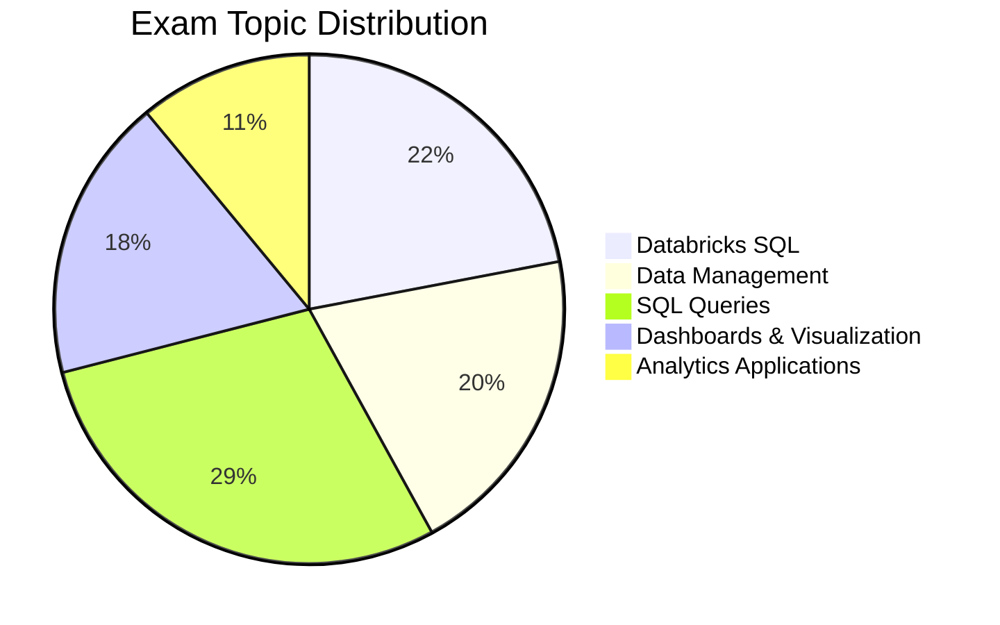

# Databricks Data Analyst Associate

## Exam Overview

| Detail             | Information                                 |
| ------------------ | ------------------------------------------- |
| **Certification**  | Databricks Certified Data Analyst Associate |
| **Questions**      | ~45 multiple-choice                         |
| **Duration**       | 90 minutes                                  |
| **Passing Score**  | 70%                                         |
| **Languages**      | SQL                                         |
| **Experience**     | 6+ months with Databricks SQL               |
| **Recertification**| Every 2 years                               |
| **Cost**           | $200 USD                                    |

## Exam Domain Weights

## Study Topics

### Core Topics (By Exam Weight)

| Section                                                          | Weight | Topics                                      |
| ---------------------------------------------------------------- | ------ | ------------------------------------------- |
| [01-Databricks SQL](01-databricks-sql/README.md)                | 22%    | SQL Warehouses, query editor, execution     |
| [02-Data Management](02-data-management/README.md)              | 20%    | Tables, schemas, Unity Catalog              |
| [03-SQL Queries](03-sql-queries/README.md)                      | 29%    | Joins, aggregations, window functions       |
| [04-Dashboards & Visualization](04-dashboards-visualization/README.md) | 18%    | Dashboards, visualizations, alerts          |
| [05-Analytics Applications](05-analytics-applications/README.md) | 11%    | Parameters, scheduling, sharing             |

### Practice & Resources

| Resource                                                | Description                              |
| ------------------------------------------------------- | ---------------------------------------- |
| [Practice Questions](resources/practice-questions/README.md)    | Topic-specific practice questions        |
| [Mock Exam 1](resources/mock-exam/README.md)                    | Full-length practice exam                |
| [Mock Exam 2](resources/mock-exam-2/README.md)                  | Alternative practice exam                |
| [Exam Tips](resources/exam-tips.md)                    | Exam strategies and tips                 |
| [Official Links](resources/official-links.md)          | Documentation and resources              |

## Interview Preparation

After completing this certification, explore:

- [Interview Prep Resource](../../shared/interview-prep/README.md) - Complement your SQL knowledge with system design and architecture

## Prerequisites

Review these shared fundamentals:

- [SQL Essentials](../../shared/fundamentals/sql-essentials.md)
- [Delta Lake Basics](../../shared/fundamentals/delta-lake-basics.md)
- [Unity Catalog Basics](../../shared/fundamentals/unity-catalog-basics.md)

## Study Progress Tracker

- [ ] Master Databricks SQL interface
- [ ] Understand data management concepts
- [ ] Practice complex SQL queries
- [ ] Build dashboards and visualizations
- [ ] Learn scheduling and alerts

## Official Resources

- [Databricks Certification Page](https://www.databricks.com/learn/certification/data-analyst-associate)
- [Databricks SQL Documentation](https://docs.databricks.com/sql/)
