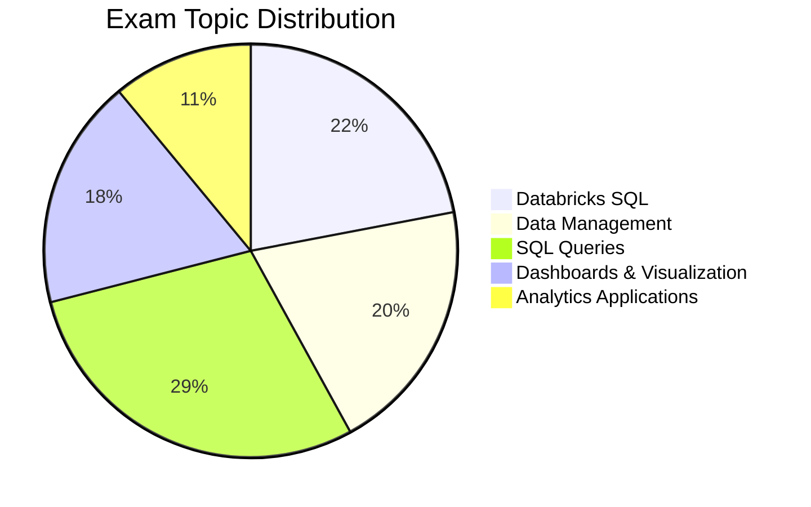

# Databricks Data Analyst Associate

## Exam Overview

| Detail            | Information                                 |
| ----------------- | ------------------------------------------- |
| **Certification** | Databricks Certified Data Analyst Associate |
| **Questions**     | ~45 multiple-choice                         |
| **Duration**      | 90 minutes                                  |
| **Passing Score** | 70%                                         |
| **Languages**     | SQL                                         |
| **Experience**    | 6+ months with Databricks SQL               |
| **Recertification**| Every 2 years                               |
| **Cost**          | $200 USD                                    |

## Exam Domain Weights

## Study Topics

| Section                   | Weight | Topics                                |
| ------------------------- | ------ | ------------------------------------- |
| 01-Databricks SQL         | 22%    | SQL Warehouses, query editor, history |
| 02-Data Management        | 20%    | Tables, schemas, Unity Catalog        |
| 03-SQL Queries            | 29%    | Joins, aggregations, window functions |
| 04-Dashboards             | 18%    | Visualizations, dashboards, alerts    |
| 05-Analytics Applications | 11%    | Parameters, scheduling, sharing       |

## Prerequisites

Review these shared fundamentals:

- [SQL Essentials](../../shared/fundamentals/sql-essentials.md)
- [Delta Lake Basics](../../shared/fundamentals/delta-lake-basics.md)
- [Unity Catalog Basics](../../shared/fundamentals/unity-catalog-basics.md)

## Study Progress Tracker

- [ ] Master Databricks SQL interface
- [ ] Understand data management concepts
- [ ] Practice complex SQL queries
- [ ] Build dashboards and visualizations
- [ ] Learn scheduling and alerts

## Official Resources

- [Databricks Certification Page](https://www.databricks.com/learn/certification/data-analyst-associate)
- [Databricks SQL Documentation](https://docs.databricks.com/sql/)
