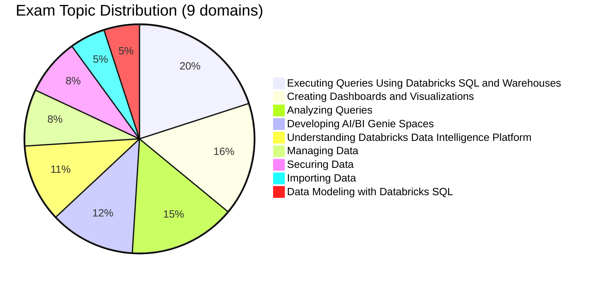

# Databricks Data Analyst Associate

> [!important]
> **What changed in the October 2025 exam guide**
>
> - Restructured from 5 broad sections into **9 explicitly weighted domains**
> - **AI/BI Genie Spaces** is now a first-class domain (12 %) — natural-language analytics on top of Unity Catalog
> - **Securing Data** is broken out as its own 8 % domain
> - Pass / fail — **Databricks no longer publishes a numeric passing score**
>
> The official source of truth: [Databricks Certified Data Analyst Associate](https://www.databricks.com/learn/certification/data-analyst-associate). Topic folders in this guide track the prior structure; reorganisation to surface AI/BI Genie Spaces is on the [guide roadmap](../../README.md#roadmap-for-the-guide-itself).

## Exam Overview

| Detail              | Information                                 |
| ------------------- | ------------------------------------------- |
| **Certification**   | Databricks Certified Data Analyst Associate |
| **Exam guide**      | October 2025                                |
| **Scored questions**| 45 multiple-choice                          |
| **Duration**        | 90 minutes                                  |
| **Result**          | Pass / fail (no published threshold)        |
| **Languages**       | English                                     |
| **Code in stems**   | SQL (ANSI-compliant)                        |
| **Experience**      | 6+ months hands-on with Databricks SQL (recommended) |
| **Recertification** | Every 2 years                               |
| **Cost**            | $200 USD                                    |
| **Delivery**        | Online proctored or test center             |

## Exam Domain Weights (official — October 2025)

| Domain | Weight |
| :--- | :---: |
| Executing Queries Using Databricks SQL and Warehouses | 20 % |
| Creating Dashboards and Visualizations | 16 % |
| Analyzing Queries | 15 % |
| Developing, Sharing, and Maintaining AI/BI Genie Spaces | 12 % |
| Understanding Databricks Data Intelligence Platform | 11 % |
| Managing Data | 8 % |
| Securing Data | 8 % |
| Importing Data | 5 % |
| Data Modeling with Databricks SQL | 5 % |

## Study Topics

The guide's existing topic folders predate the October 2025 9-domain restructure. The table below cross-references which folder covers which official domain(s).

### Topic folders in this guide

| Section                                                              | Covers (official domains) |
| -------------------------------------------------------------------- | ------------------------- |
| [01-Databricks SQL](01-databricks-sql/README.md)                     | Understanding Platform · Executing Queries (SQL Warehouses) |
| [02-Data Management](02-data-management/README.md)                   | Managing Data · Securing Data · Data Modeling |
| [03-SQL Queries](03-sql-queries/README.md)                           | Executing Queries · Analyzing Queries · Importing Data |
| [04-Dashboards & Visualization](04-dashboards-visualization/README.md) | Creating Dashboards and Visualizations |
| [05-Analytics Applications](05-analytics-applications/README.md)     | Developing AI/BI Genie Spaces · scheduling & sharing |

> [!note]
> The **Developing AI/BI Genie Spaces** domain (12 %) is partially covered today inside `05-analytics-applications/`. A dedicated folder for Genie Spaces is planned; in the meantime, the [AI/BI documentation](https://docs.databricks.com/en/genie/index.html) is the authoritative reference.

### Practice & Resources

| Resource                                                        | Description                              |
| --------------------------------------------------------------- | ---------------------------------------- |
| [Practice Questions](resources/practice-questions/README.md)    | Topic-specific practice questions        |
| [Mock Exam 1](resources/mock-exam/README.md)                    | Full-length practice exam                |
| [Mock Exam 2](resources/mock-exam-2/README.md)                  | Alternative practice exam                |
| [Exam Tips](resources/exam-tips.md)                             | Exam strategies and tips                 |
| [Official Links](resources/official-links.md)                   | Documentation and resources              |

## Interview Preparation

After completing this certification, explore:

- [Interview Prep Resource](../../shared/interview-prep/README.md) - Complement your SQL knowledge with system design and architecture

## Prerequisites

Review these shared fundamentals:

- [SQL Essentials](../../shared/fundamentals/sql-essentials.md)
- [Delta Lake Basics](../../shared/fundamentals/delta-lake-basics.md)
- [Unity Catalog Basics](../../shared/fundamentals/unity-catalog-basics.md)

## Study Progress Tracker

- [ ] Master Databricks SQL interface and warehouses
- [ ] Understand data management & security
- [ ] Practice complex SQL queries and analysis
- [ ] Build dashboards and visualizations
- [ ] Learn scheduling, alerts, and sharing
- [ ] Build a Genie Space on a Unity Catalog schema

## Official Resources

- [Databricks Certification Page](https://www.databricks.com/learn/certification/data-analyst-associate)
- [Databricks SQL Documentation](https://docs.databricks.com/sql/)
- [AI/BI Genie Documentation](https://docs.databricks.com/en/genie/index.html)
