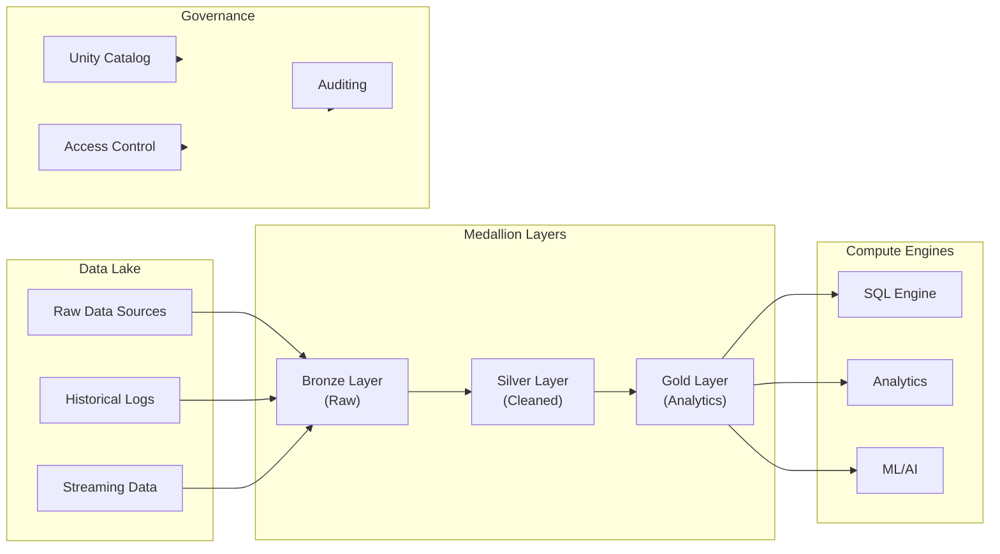
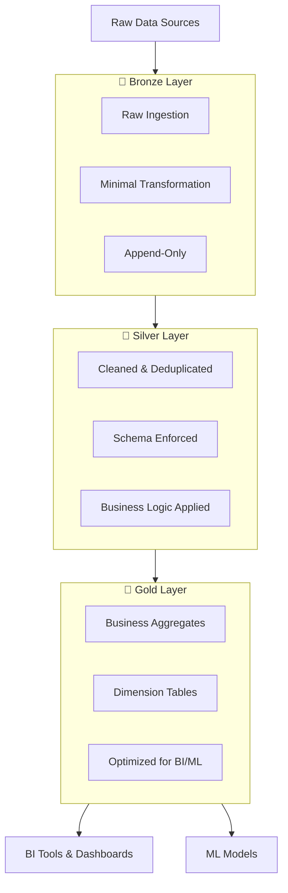

# Lakehouse Architecture

## Overview

The Databricks Lakehouse combines the best of data warehouses and data lakes, enabling analytics, AI, and real-time applications on all your data.

## Lakehouse Architecture



## Data Warehouse vs Data Lake vs Lakehouse

| Aspect | Data Warehouse | Data Lake | Lakehouse |
|--------|---|---|---|
| **Data Format** | Structured only | Any format | Structured + Unstructured |
| **Cost** | High | Low | Low |
| **Speed** | Very fast queries | Slower queries | Fast queries |
| **Governance** | Strong | Weak | Strong |
| **Flexibility** | Fixed schema | Flexible | Both |
| **Use Cases** | BI, Analytics | Data science, ML | All |

## Key Lakehouse Concepts

### **ACID Transactions**

- Ensures data reliability and consistency
- Supports concurrent reads and writes
- Enables rollback and recovery
- Built into Delta Lake format

### **Schema Enforcement & Evolution**

```python
# Schema enforcement prevents bad data

(df.write
    .format("delta")
    .mode("append")
    .save("/mnt/data/table"))

# Schema evolution allows controlled changes

(df.write
    .format("delta")
    .mode("append")
    .option("mergeSchema", "true")
    .save("/mnt/data/table"))
```

### **Data Versioning & Time Travel**

- Access historical versions of data
- Query data "as of" a specific timestamp
- No git, snapshots work like version control

```python
# Time travel query

(spark.read
    .format("delta")
    .option("versionAsOf", 0)
    .load("/mnt/data/table"))

# Or by timestamp

(spark.read
    .format("delta")
    .option("timestampAsOf", "2025-01-15")
    .load("/mnt/data/table"))
```

### **Data Lineage & Audit Logs**

- Track data changes over time
- Who modified data and when
- Support compliance requirements
- Enable data governance

## Delta Lake Foundation

Delta Lake is the open-source storage engine powering the Lakehouse:

- **ACID Compliance**: Multi-version concurrency control (MVCC)
- **Format**: Parquet files + transaction log
- **Reliability**: Handles schema mismatches and data corruption
- **Performance**: Native support for DELETE, UPDATE, MERGE operations

```python
# Create a Delta table

df.write.format("delta").mode("overwrite").save("/mnt/delta/my_table")

# Or convert existing Parquet

from delta.tables import DeltaTable
DeltaTable.convertToDelta(spark, "parquet.`/path/to/data`")
```

## Medallion Architecture (Bronze/Silver/Gold)

A best-practice data organization pattern:



### Bronze Layer

- **Purpose**: Raw ingestion from source systems
- **Schema**: Matches source exactly (may be unstructured)
- **Retention**: Minimal transformation, keep all raw data
- **Quality**: May contain duplicates, nulls, errors
- **Use Case**: Preserve original data for audit trails

### Silver Layer

- **Purpose**: Cleansed, deduplicated analytical hub
- **Schema**: Standardized, enforced
- **Retention**: Remove duplicates, handle nulls
- **Quality**: Conforms to business rules
- **Use Case**: Join source systems, identify dimensions

### Gold Layer

- **Purpose**: Business-ready aggregates for BI/ML
- **Schema**: Optimized for specific use cases
- **Retention**: Only needed for analytics
- **Quality**: Fully validated, high confidence
- **Use Case**: Power dashboards, ML features

## Where Each Layer Lives in Databricks

| Layer | Storage | Format | Access |
|-------|---------|--------|--------|
| **Bronze** | `/mnt/data/bronze/` | Delta | Data Engineers |
| **Silver** | `/mnt/data/silver/` | Delta | Analysts, Engineers |
| **Gold** | `/mnt/data/gold/` or SQL tables | Delta | All users, BI tools |

## Unity Catalog for Governance

Unity Catalog provides a unified governance solution:

- **Catalogs**: Database-like containers for organizing tables
- **Schemas**: Namespaces within catalogs
- **Tables/Volumes**: Data objects with fine-grained access control
- **Column-level security**: Mask sensitive columns by user/role

```python
# Three-level namespace

spark.sql("SELECT * FROM main.default.my_table")

#                        ^    ^       ^
#                  catalog schema  table

```

## Use Cases

1. **Real-Time Analytics**: Stream data through medallion layers, query immediately
2. **Machine Learning**: Reproducible feature sets in Gold layer, time travel for data versioning
3. **Data Warehousing**: Replace traditional EDW with lower cost, more flexibility
4. **Compliance**: Audit trails on all data changes, column-level masking
5. **Data Sharing**: Secure external data sharing without data duplication

## Common Issues & Errors

### Conflicting Data Formats

**Scenario:** Queries fail when mixing Parquet, CSV, and JSON files in the same directory.

**Fix:** Convert all raw data to Delta format early in the medallion pipeline (Bronze layer) so downstream layers always read a consistent format.

### Stale Metadata Cache

**Scenario:** Newly written data is not visible to queries.

**Fix:** Run `REFRESH TABLE <table_name>` or use Delta Lake (which handles metadata automatically) instead of plain Parquet/CSV tables.

## Exam Tips

- Know the three layers of the Medallion Architecture (Bronze, Silver, Gold) and the purpose of each
- Understand the difference between a data warehouse, data lake, and lakehouse — especially around ACID support and schema flexibility
- Remember that Delta Lake is Parquet + transaction log; this enables ACID, time travel, and DML operations
- Be able to identify the Unity Catalog three-level namespace: `catalog.schema.table`

## Key Takeaways

- **Lakehouse combines**: ACID transactions and strong governance of a data warehouse with the low cost and schema flexibility of a data lake
- **Delta Lake**: Powers the Lakehouse — Parquet files plus a transaction log; enables ACID, time travel, and MERGE/UPDATE/DELETE
- **Medallion layers**: Bronze (raw ingestion, append-only) → Silver (cleansed, deduplicated, schema-enforced) → Gold (business aggregates, BI/ML-ready)
- **Schema enforcement**: Default behavior; prevents bad data writes. Enable evolution with `.option("mergeSchema", "true")`
- **Time travel**: Query by version (`versionAsOf`) or timestamp (`timestampAsOf`) — no external tool needed
- **Unity Catalog namespace**: Three levels — `catalog.schema.table`; provides column-level security, lineage, and auditing
- **ACID via MVCC**: Multi-version concurrency control lets concurrent readers and writers operate without locks

## Related Topics

- [Delta Lake Fundamentals](../03-delta-lake/01-delta-lake-fundamentals.md)
- [Unity Catalog Basics](../05-data-governance/01-unity-catalog-basics.md)
- [Medallion Architecture (Shared)](../../../shared/fundamentals/medallion-architecture.md)

## Official Documentation

- [What is a Lakehouse?](https://docs.databricks.com/en/lakehouse/index.html)
- [Delta Lake Documentation](https://docs.databricks.com/en/delta/index.html)

---

**[↑ Back to Databricks Lakehouse Platform](./README.md) | [Next: Databricks Workspace](./02-databricks-workspace.md) →**
