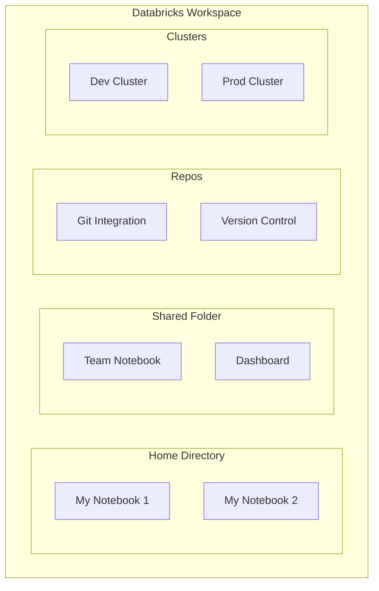
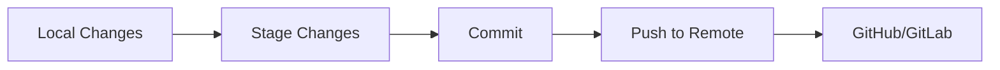

# Databricks Workspace

## Overview

The Databricks workspace is your collaborative environment for developing, testing, and deploying data engineering solutions. It provides unified tools for SQL, Python, R, and Scala development.

## Workspace Architecture



## Workspace Organization

### Directory Structure

| Path | Purpose | Access |
|------|---------|--------|
| `/Users/{email}/` | Personal home directory | Only you |
| `/Shared/` | Team-accessible folder | All workspace users |
| `/Repos/{name}/` | Git-connected repositories | Team with access |
| `/Workplace/` | Legacy shared (deprecated) | All users |

### Best Practices

```text
Workspace Root/
├── /Shared/
│   ├── /datasets/               # Shared data references
│   ├── /dashboards/             # BI dashboards
│   ├── /team-notebooks/         # Collaborative notebooks
│   └── /production-jobs/        # Job definitions
├── /Repos/
│   └── /data-platform/          # Git repo for IaC
└── /Users/
    └── {your-email}/
        ├── /dev/                # Personal development
        ├── /experiments/        # Ad-hoc analysis
        └── /dashboards/         # Personal dashboards
```

## Notebooks

Notebooks are the primary development tool in Databricks.

### Notebook Features

- **Multiple Languages**: SQL, Python, R, Scala in same notebook
- **Magic Commands**: Control notebook behavior
- **Collaborative**: Real-time multi-user editing
- **Version History**: Automatic snapshots of changes (30-day retention)
- **Publishing**: Share as HTML or embed dashboards

### Language Magic Commands

```markdown
%python  # Switch to Python
%sql     # Switch to SQL
%r       # Switch to R
%scala   # Switch to Scala
%md      # Markdown formatting
%sh      # Shell commands
```

### Key Notebook Capabilities

```python
# Display formatted output

display(df)  # Better than df.show()

# Databricks widgets for interactive dashboards

dbutils.widgets.text("param_name", "default_value")
dbutils.widgets.dropdown("env", "dev", ["dev", "prod"])

# Access parameters in code

env = dbutils.widgets.get("env")

# File system operations

dbutils.fs.ls("/mnt/data/")  # List files
dbutils.fs.mv("/path/src", "/path/dst")  # Move files
dbutils.fs.cp("/path/src", "/path/dst", True)  # Copy recursively
```

## Repos (Git Integration)

Repositories enable version control and CI/CD for data engineering code.

### Git Workflow



### Common Operations

```python

# Git clone into Databricks
# UI: Workspace > Repos > Create Repo > GitHub URL

# Common git operations in workspace terminal

git status
git add <file>
git commit -m "message"
git push origin main
git pull origin main
```

### Branching Strategy for Data Engineering

```text
main (production)
├── dev
│   ├── feature/new-pipeline
│   └── feature/optimization
├── staging
└── hotfix/urgent-fix
```

## Clusters

Clusters provide the compute for running notebooks and jobs.

### Cluster Types

| Type | Use Case | Duration |
|------|----------|----------|
| **All-Purpose** | Interactive development | Hours to days |
| **Jobs** | Automated batch/streaming | Minutes to hours |
| **SQL Warehouse** | SQL queries & BI tools | Always on |

### Personal Compute (Single-User Cluster)

```python
# Faster startup for personal

Cluster config:
- Single worker node
- Pre-installed libraries
- Shared with no one
```

### Shared Multi-Workspace Cluster

```python
# For team collaboration

Cluster config:
- Multiple workers
- Shared libraries
- Audit logging enabled
```

## Collaboration Features

### Real-Time Collaboration

```text
Alice opens notebook → Bob opens same notebook
→ Both see cursor positions
→ Edits appear in real-time
→ Auto-merge compatible changes
```

### Comments and Discussion

```markdown
<!-- Inline comments on cells -->
Click on cell → Comments icon → Add comment
@mention team members for notifications
Resolve comments when addressed
```

### Notebook Sharing

- **View-only**: Share link for read access
- **Edit permission**: Grant editing rights
- **Folder sharing**: Permission inheritance

## Administration & Security

### Access Control

```python
Admins can control:
- User & group management
- Workspace features (notebooks, clusters, jobs)
- Data access via UC (Unity Catalog)
- External connectivity
```

### Multi-Factor Authentication (MFA)

```text
Admin console → Security
→ Enforce MFA for all users
→ Support SCIM provisioning
```

### Audit Logs

```python
Workspace Admin Console → Audit log
Captures:
- Who accessed what, when
- Login/logout activities
- Resource creation/deletion
- Settings changes
```

## Common Workspace Tasks

1. **Create a notebook**: `Workspace > Create > Notebook`
2. **Run a notebook**: Press `Run all` or `Ctrl+Alt+Enter`
3. **Export notebook**: Download as DBC, PDF, or HTML
4. **Move notebook**: Drag to folder or use `Move` option
5. **Clone notebook**: Right-click > `Clone`
6. **Publish notebook**: Share as HTML dashboard

## Use Cases

- **Collaborative Notebook Development**: Multiple data engineers work simultaneously in shared notebooks during sprint development, using real-time co-editing and inline comments for code reviews.
- **Git-Integrated CI/CD Pipelines**: Using Repos to connect notebooks to GitHub/GitLab, enabling pull request workflows, branch-based development, and automated testing before promoting code to production.

## Common Issues & Errors

### Configuration Oversights

**Scenario:** The default settings for Databricks Workspace do not scale well with sudden spikes in data volume.
**Fix:** Explicitly define and tune the configuration parameters for Databricks Workspace to handle production-scale workloads.

### Notebook Session Timeout

**Scenario:** A notebook session times out after inactivity, and unsaved work in cells is lost.
**Fix:** Enable autosave in notebook settings and use Repos for version control so that code changes are always committed to Git.

## Exam Tips

- Know the difference between the Home directory (`/Users/{email}/`), Shared folder, and Repos
- Understand magic commands (`%python`, `%sql`, `%md`, etc.) for switching languages within a notebook
- Remember that notebook version history has 30-day retention and is automatic
- Global temporary views use the `global_temp` database and persist across sessions; regular temp views are session-scoped

## Key Takeaways

- **Workspace isolation**: Each workspace is independent
- **Three-level permissions**: Admin, User, Viewer roles
- **Notebook versions**: Automatically saved, 30-day recovery
- **Repos**: Git integration for production code
- **Multi-language support**: SQL + Python in same notebook

## Related Topics

- [Lakehouse Architecture](./01-lakehouse-architecture.md)
- [Compute and Clusters](./03-compute-clusters.md)
- [Databricks Workspace (Shared)](../../../shared/fundamentals/databricks-workspace.md)

## Official Documentation

- [Databricks Workspace Overview](https://docs.databricks.com/en/workspace/index.html)
- [Databricks Notebooks](https://docs.databricks.com/en/notebooks/index.html)

---

**[← Previous: Lakehouse Architecture](./01-lakehouse-architecture.md) | [↑ Back to Databricks Lakehouse Platform](./README.md) | [Next: Compute and Clusters](./03-compute-clusters.md) →**
