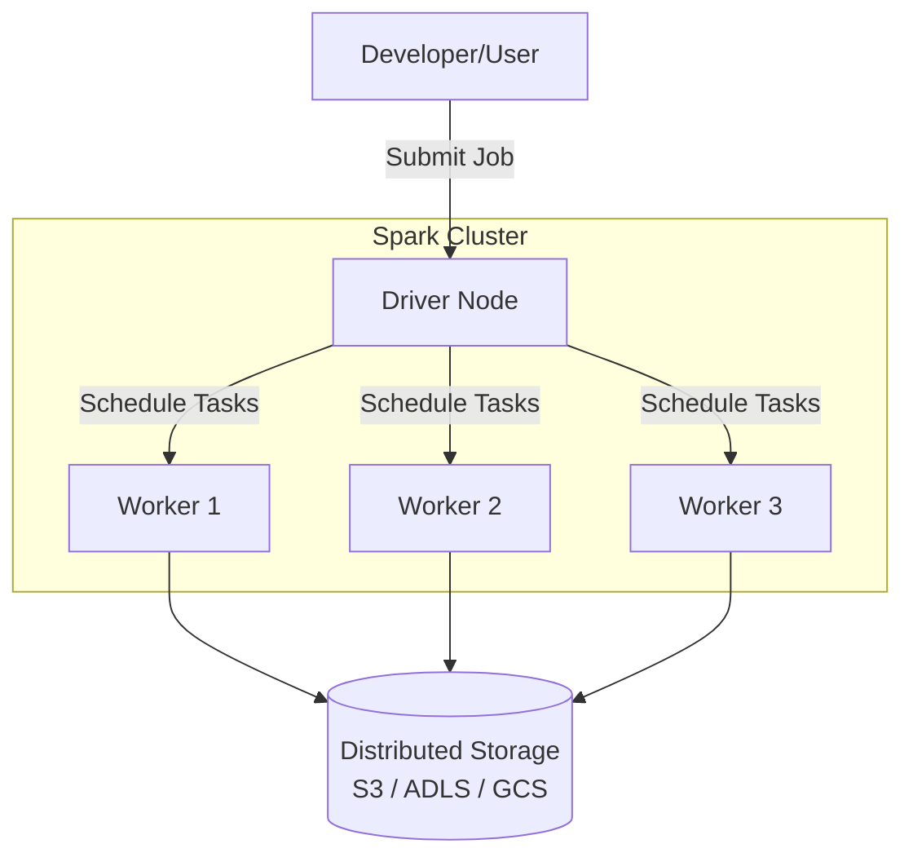
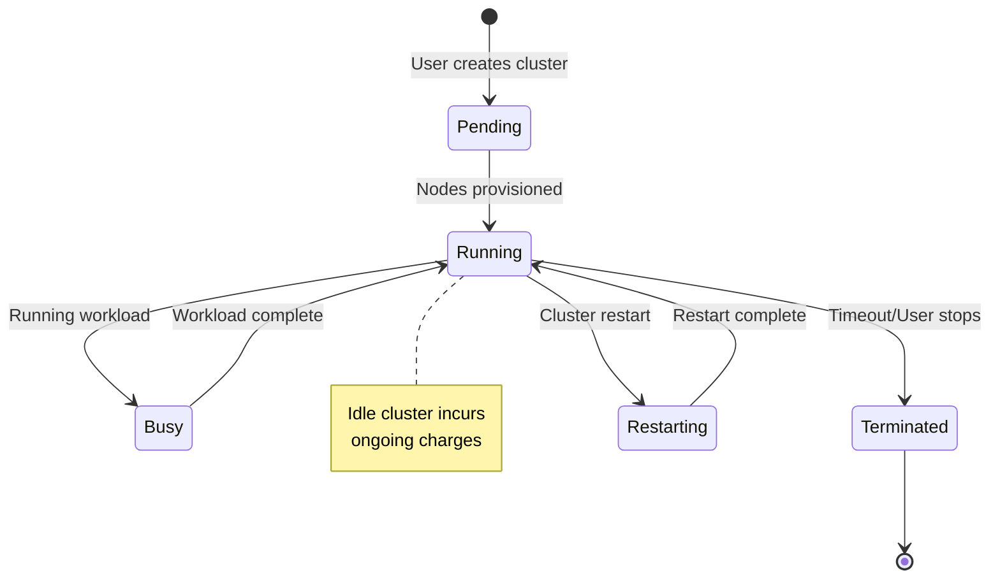

# Compute and Clusters

## Overview

Compute clusters provide scalable processing power for your notebooks and jobs. Understanding cluster types, configuration, and costs is critical for data engineers.

## Cluster Architecture



## Cluster Types

### All-Purpose Clusters

**Use Case**: Interactive development and collaboration

```yaml
Startup Time: 5-10 minutes
Billing: Per DBU (Databricks Unit) per second
Max Uptime: Configurable auto-termination
Multi-user: Yes, multiple users can attach

Typical Config:
  - Node type: i3.xlarge (general purpose)
  - Min workers: 2
  - Max workers: 8
  - Timeout: 30 minutes no activity
```

**Cost**: $0.40-$1.00 per DBU per hour (depends on region)

### Job Clusters

**Use Case**: Automated batch or streaming jobs

```yaml
Startup Time: 2-5 minutes (optimized)
Billing: Per job run
Max Uptime: Duration of job
Multi-user: No, single job only

Typical Config:
  - Node type: m5.large (cost-optimized)
  - Min workers: 1
  - Max workers: 10
  - Auto-terminate: When job finishes
```

**Cost**: Lower per-DBU cost (optimized pricing)

### SQL Warehouses (formerly SQL Endpoints)

**Use Case**: SQL queries and BI tool connectivity

```yaml
Startup Time: 1-2 minutes
Billing: Per SQL endpoint per second
Max Uptime: Always available
Multi-user: Yes, multiple concurrent queries

Typical Config:
  - Warehouse size: Small (2 clusters), Medium (4), Large (8)
  - Auto-scaling: Enabled by default
  - Spot instances: Enabled for cost savings
```

**Cost**: $2-$4 per DBU per hour (premium for always-on)

## Cluster Configuration

### Essential Settings

| Setting | Purpose | Recommendation |
|---------|---------|-----------------|
| **Node Type** | VM size/capabilities | Use general-purpose for most workloads |
| **Driver Type** | Leader node specs | Same as workers for balanced load |
| **Workers** | Slave nodes count | Min 2, Max based on workload |
| **Runtime** | Spark/Python versions | Latest stable (DBR 14.0+) |
| **Auto-scaling** | Dynamic worker count | Enable for variable workloads |
| **Timeout** | Auto-termination | 30-60 mins for dev clusters |

### Node Types

```text
GPU Optimized (G4/A40):      ML workloads, distributed training
General Purpose (i3/m5):      Most data engineering tasks
Memory Optimized (r7/z1):     Large in-memory datasets
Compute Optimized (c5/c6):    Complex transformations
Spot Instances:               Cost savings (can be interrupted)
```

### Databricks Runtime (DBR)

```python

# DBR includes:
# - Apache Spark with optimizations
# - Python, R, Scala, SQL pre-installed
# - ML libraries (MLlib, scikit-learn)
# - High-level APIs

# Available flavors:

DBR Base              # Spark only
DBR for ML           # Spark + ML libraries
DBR SQL               # Optimized for SQL queries
DBR for Serverless   # Auto-managed
```

## Cluster Lifecycle



## Scaling Strategies

### Vertical Scaling (Node Type)

```python

# Larger nodes = more memory/CPU per worker
# Pros: Simpler, fewer network copies
# Cons: More expensive, slower scaling

Small:   i3.xlarge    (4 vCPU, 30.5 GB RAM)
Medium:  i3.2xlarge   (8 vCPU, 61 GB RAM)
Large:   i3.4xlarge   (16 vCPU, 122 GB RAM)
```

### Horizontal Scaling (Worker Count)

```python

# More workers = distributed processing
# Pros: Faster scaling, handles growing data
# Cons: More network I/O, coordination overhead

Min Workers:  1-2  (development)
Target:       3-8  (typical workload)
Max Workers:  10+  (peak load)
```

### Dynamic Scaling (Databricks Managed)

```python
# Cluster auto-scales based on pending workload

dbfs.conf.set("spark.databricks.cluster.profile", "singleNode")

# Configuration in cluster settings:

Auto-scaling: Enabled
Min workers: 2
Max workers: 8
# Scales up/down automatically based on task queue

```

## Cost Optimization

### DBU Calculation

```text
1 DBU = 1 hour of processing on 1 worker
        OR
        1 hour of processing on 1 SQL warehouse

Monthly Bill = (Nodes × Hours × DBU Rate) + Storage
             = (3 nodes × 730 hours × $0.40) + Storage
             = $876 + Storage
```

### Cost Reduction Tactics

1. **Spot Instances** (-60% cost)

   ```yaml
   Enable Spot: Cluster will use cheaper interruptible VMs
   Trade-off: Can be terminated without warning
   Use for: Non-critical jobs with checkpointing
   ```

2. **Right-sizing** (-30-40%)

   ```python
   # Profile actual usage
   # Don't over-provision
   # Use smaller nodes, scale horizontally
   ```

3. **Auto-termination** (-20-50%)

   ```python
   # Set 15 min timeout for dev clusters
   # Prevents forgotten clusters running 24/7
   # Job clusters auto-terminate (no cost waste)
   ```

4. **Shared Clusters**

   ```python
   # All-purpose cluster for team
   # Shares costs across users
   # Higher utilization
   ```

## Monitoring & Troubleshooting

### Cluster Metrics

```python
# Available in Cluster Details UI:

CPU Utilization      # % of compute used
Memory Usage         # RAM in use
Disk I/O             # Read/Write speed
Network I/O          # Communication overhead
Task Execution Time  # Job performance
```

### Common Issues & Solutions

| Problem | Cause | Solution |
|---------|-------|----------|
| **Cluster fails to start** | Insufficient quota | Request more capacity or use different region |
| **Out of Memory (OOM)** | Dataset too large | Increase node type or add workers |
| **Slow job execution** | Under-resourced cluster | Scale up horizontally or upgrade node type |
| **High costs** | Over-provisioned | Use spot instances, smaller nodes, auto-terminate |
| **Driver node OutOfMemory** | Large broadcast variables | Use distributed instead of broadcast |

### Logging & Debugging

```python
# Access cluster logs

dbutils.fs.ls("/mnt/logs/cluster-logs/")

# Monitor in real-time
# Spark UI: Available during job execution
# Driver logs: Check for errors
# Worker logs: Troubleshoot data processing issues

```

## Cluster as a Service (Premium Feature)

```python

# Databricks manages cluster lifecycle
# Features:

- Auto-scaling based on workload
- Automatic updates and patches
- Serverless SQL queries
- No manual cluster management
```

## Use Cases

- **Right-Sizing for Cost Optimization**: Selecting appropriate node types and auto-scaling ranges based on workload profiling to balance performance and cost for both interactive development and production jobs.
- **Cluster Pools for Fast Startup**: Pre-provisioning idle instances in cluster pools so that job clusters spin up in under a minute, enabling tight SLA adherence for time-sensitive data pipelines.

## Common Issues & Errors

### Configuration Oversights

**Scenario:** The default settings for Compute and Clusters do not scale well with sudden spikes in data volume.
**Fix:** Explicitly define and tune the configuration parameters for Compute and Clusters to handle production-scale workloads.

### Auto-Termination Kills Long-Running Jobs

**Scenario:** A cluster's auto-termination setting shuts down the cluster while a long-running job is still executing, causing the job to fail.
**Fix:** Increase the auto-termination timeout for interactive clusters running long workloads, or use dedicated job clusters that only terminate when the job completes.

### Cluster Startup Time Delays

**Scenario:** Job clusters take 5-10 minutes to provision, causing unacceptable latency for time-sensitive pipelines.
**Fix:** Use cluster pools to pre-provision idle instances, reducing startup time to under a minute for new clusters drawn from the pool.

## Exam Tips

- Know the three cluster types: All-Purpose (interactive dev), Job Clusters (automated jobs), SQL Warehouses (SQL/BI)
- Job clusters are more cost-efficient than all-purpose clusters because they auto-terminate when the job finishes
- Understand DBU billing: 1 DBU = 1 hour of processing on 1 worker; job clusters have lower per-DBU rates
- Spot instances save up to 60% but can be interrupted -- suitable for non-critical, checkpointed workloads

## Key Takeaways

- **All-Purpose vs Job Clusters**: Purpose, cost, multi-user support
- **Node Types**: Impact on performance and cost
- **Auto-scaling**: How it works, benefits, limitations
- **DBU Pricing**: How charges are calculated
- **Best Practice**: Right-size clusters, use auto-terminate
- **Spot Instances**: Cost savings with trade-offs

## Related Topics

- [Databricks Workspace](./02-databricks-workspace.md)
- [Spark Fundamentals (Shared)](../../../shared/fundamentals/spark-fundamentals.md)
- [Performance Optimization (Shared)](../../../shared/cheat-sheets/performance-optimization.md)

## Official Documentation

- [Compute Overview](https://docs.databricks.com/en/compute/index.html)
- [Cluster Configuration Best Practices](https://docs.databricks.com/en/compute/cluster-config-best-practices.html)

---

**[← Previous: Databricks Workspace](./02-databricks-workspace.md) | [↑ Back to Databricks Lakehouse Platform](./README.md)**
