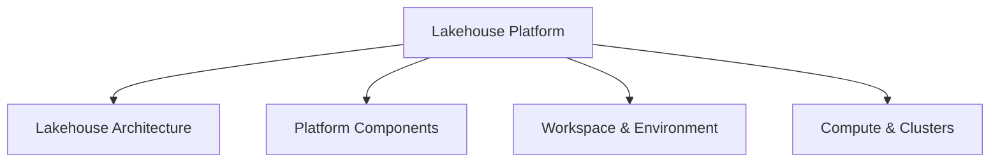

# Databricks Lakehouse Platform (24% of Exam)

Understanding the Databricks lakehouse architecture and platform components is fundamental to the Associate certification.

## Topics Overview

## Section Contents

| File | Topic | Priority |
| :--- | :--- | :--- |
| [01-lakehouse-architecture.md](01-lakehouse-architecture.md) | Lakehouse concept, benefits, components | High |
| [02-databricks-workspace.md](02-databricks-workspace.md) | Workspace organization, notebooks, repos | High |
| [03-compute-clusters.md](03-compute-clusters.md) | Cluster types, configuration, lifecycle | High |

## Key Concepts

- **Lakehouse**: Unified data platform combining data warehouse and data lake
- **Unity Catalog**: Metadata layer for governance and access control
- **Workspace**: Collaborative environment for data engineering and analytics
- **Clusters**: Compute infrastructure for processing data

## Related Resources

- [Databricks Workspace Fundamentals](../../../shared/fundamentals/databricks-workspace.md)
- [Platform Architecture](../../../shared/fundamentals/platform-architecture.md)
- [Code Examples](../../../shared/code-examples/README.md)

## Next Steps

Proceed to [02-ETL with Spark SQL and Python](../02-etl-spark-sql/README.md) to learn how to process data in the lakehouse.

---

**[← Back to Certification](../README.md)**
