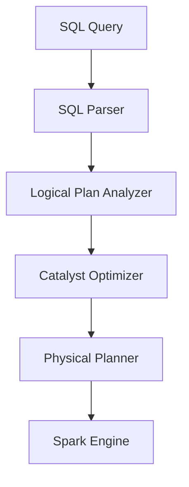

# Spark SQL Fundamentals

## Overview

Spark SQL provides a SQL interface to process structured data with Spark's distributed computing power. It handles SQL queries, CSV, Parquet, Delta, and connects to external data sources.

## Spark SQL Architecture



## Spark SQL vs DataFrames

| Aspect | Spark SQL | DataFrames |
|--------|-----------|------------|
| **Interface** | SQL queries | Python/Scala/Java API |
| **Performance** | Optimized via Catalyst | Same Catalyst optimizer |
| **Learning Curve** | Easy for SQL users | Requires API knowledge |
| **Flexibility** | SQL syntax | Programmatic control |
| **Interop** | Can mix with DataFrames | Can mix with SQL |

## Creating Tables

### Managed vs External Tables

```python
# Managed table (data stored in warehouse directory)

spark.sql("""
CREATE TABLE my_table (
    id INT,
    name STRING,
    salary DECIMAL(10, 2)
)
USING DELTA
""")

# External table (data stored in external location)

spark.sql("""
CREATE TABLE my_external (
    id INT,
    name STRING
)
USING DELTA
LOCATION '/mnt/data/my_table'
""")
```

### From DataFrame

```python
# Create from existing data

df.write.mode("overwrite").saveAsTable("my_table")  # Managed

# Create external

df.write \
    .mode("overwrite") \
    .option("path", "/mnt/data/external") \
    .saveAsTable("my_external_table")

# From file

spark.sql("""
CREATE TABLE my_parquet
USING PARQUET
LOCATION '/mnt/data/input.parquet'
""")
```

## Queries and Aggregations

### Basic SELECT

```python
spark.sql("""
SELECT
    id,
    name,
    salary
FROM employees
WHERE salary > 50000
ORDER BY salary DESC
LIMIT 10
""").show()
```

### Aggregations

```python
spark.sql("""
SELECT
    department,
    COUNT(*) as emp_count,
    AVG(salary) as avg_salary,
    MAX(salary) as max_salary,
    MIN(salary) as min_salary
FROM employees
GROUP BY department
HAVING COUNT(*) > 5
""")
```

### Window Functions

```sql
SELECT
    name,
    department,
    salary,
    ROW_NUMBER() OVER (PARTITION BY department ORDER BY salary DESC) as rank,
    SUM(salary) OVER (PARTITION BY department) as dept_total
FROM employees
```

## Views and Temporary Views

### Permanent Views

```python
# Create view (stored in metastore)

spark.sql("""
CREATE VIEW high_earners AS
SELECT name, salary
FROM employees
WHERE salary > 100000
""")

# Drop view

spark.sql("DROP VIEW IF EXISTS high_earners")
```

### Temporary Views

```python
# Session-scoped (deleted when session ends)

spark.sql("""
CREATE TEMP VIEW temp_view AS
SELECT * FROM employees LIMIT 100
""")

# Global temporary (accessible across sessions)

spark.sql("""
CREATE GLOBAL TEMP VIEW global_view AS
SELECT * FROM large_table
""")

# Query global temp view

spark.sql("SELECT * FROM global_temp.global_view")
```

## Catalog Operations

### Listing Objects

```python
# List databases

spark.catalog.listDatabases()

# List tables in database

spark.catalog.listTables("default")

# List columns

spark.catalog.listColumns("my_table")

# Check if table exists

spark.catalog.tableExists("my_table")
```

### Switching Context

```python
# Set current database

spark.sql("USE my_database")

# Now queries reference my_database by default

spark.sql("SELECT * FROM my_table")  # Uses my_database.my_table
```

## Data Types

```sql
-- Numeric Types
INT, BIGINT, FLOAT, DOUBLE, DECIMAL(10,2)

-- String Types
STRING, VARCHAR(100), CHAR(10)

-- Boolean
BOOLEAN

-- Date/Time
DATE, TIMESTAMP, TIMESTAMP_NTZ

-- Complex Types
ARRAY<INT>
MAP<STRING, INT>
STRUCT<name STRING, age INT>

-- Binary
BINARY
```

## Partitioning

```python
# Create partitioned table

spark.sql("""
CREATE TABLE sales (
    id INT,
    amount DECIMAL(10, 2)
)
PARTITIONED BY (year INT, month INT)
USING DELTA
""")

# Insert with partition

spark.sql("""
INSERT INTO sales
PARTITION (year=2025, month=1)
SELECT id, amount FROM new_sales
""")
```

## SQL vs Hive SQL Differences

| Feature | Spark SQL | Hive SQL |
|---------|-----------|----------|
| **Performance** | Fast (Catalyst) | Slower |
| **Data Types** | 20+ types | Limited |
| **Compliance** | ANSI SQL | Hive dialect |
| **Execution** | Spark engine | Hive + MapReduce |

## Key Takeaways

- **Managed vs External**: Data location and lifecycle
- **Temporary Views**: Session-scoped, auto-deleted
- **Partitioning**: Organize large tables for performance
- **Catalog**: Metadata management
- **SQL Optimization**: Catalyst optimizer benefits

## Use Cases

- **Large Scale Transformations**: Leveraging Spark SQL distributed execution semantics to transform multi-terabyte datasets efficiently.
- **Optimized Spark SQL Fundamentals Workflows**: Using the advanced capabilities of Spark SQL Fundamentals to automate processes and reduce manual operational overhead.

## Common Issues & Errors

### OOM Errors

**Scenario:** Data skew causes an executor to run out of memory.
**Fix:** Use Adaptive Query Execution (AQE) and review joining logic.

### Integration Bottlenecks

**Scenario:** Connecting Spark SQL Fundamentals to other downstream components results in unexpected failures.
**Fix:** Ensure that permissions and network access rules are correctly provisioned for Spark SQL Fundamentals prior to deployment.

---

**[↑ Back to ETL with Spark SQL and Python](./README.md) | [Next: DataFrame Operations](./02-dataframe-operations.md) →**
