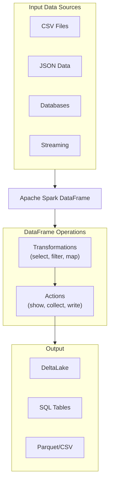

# DataFrame Operations

## Overview

DataFrames are the primary abstraction in Spark for structured data. They provide a distributed collection of rows organized into named columns with a defined schema. DataFrames combine the familiarity of SQL with the power of distributed computing.

## What is a DataFrame?



## Creating DataFrames

### From Python Collections

```python
# From list of tuples

data = [
    (1, "Alice", 85000),
    (2, "Bob", 75000),
    (3, "Charlie", 95000)
]

df = spark.createDataFrame(data, ["id", "name", "salary"])
df.show()
```

### From Files

```python
# CSV

df_csv = (spark.read.format("csv")
    .option("header", "true")
    .option("inferSchema", "true")
    .load("/path/to/data.csv"))

# JSON

df_json = spark.read.json("/path/to/data.json")

# Parquet

df_parquet = spark.read.parquet("/path/to/data.parquet")

# Delta

df_delta = spark.read.format("delta").load("/path/to/delta/table")
```

### From Pandas

```python
import pandas as pd

pandas_df = pd.DataFrame({
    "id": [1, 2, 3],
    "name": ["Alice", "Bob", "Charlie"],
    "salary": [85000, 75000, 95000]
})

spark_df = spark.createDataFrame(pandas_df)
```

### From SQL Query

```python
df = spark.sql("""
    SELECT id, name, salary
    FROM employees
    WHERE department = 'Engineering'
""")
```

## DataFrame Schema

### Inspecting Schema

```python
# Print schema

df.printSchema()

# Output:
# root
#  |-- id: long (nullable = true)
#  |-- name: string (nullable = true)
#  |-- salary: decimal(10,2) (nullable = true)

# Get schema as StructType

schema = df.schema

# Get column names

columns = df.columns  # ['id', 'name', 'salary']

# Get data types

dtypes = df.dtypes  # [('id', 'long'), ('name', 'string'), ...]
```

### Defining Schema Explicitly

```python
from pyspark.sql.types import StructType, StructField, IntegerType, StringType, DecimalType

schema = StructType([
    StructField("id", IntegerType(), True),
    StructField("name", StringType(), True),
    StructField("salary", DecimalType(10, 2), True)
])

df = spark.read.schema(schema).csv("/path/to/data.csv", header=True)
```

## Core DataFrame Transformations

### Select and Projection

```python
# Select specific columns

df.select("id", "name").show()

# Select with alias

df.select(
    col("id"),
    col("name").alias("employee_name"),
    col("salary")
).show()

# Select with expressions

df.selectExpr(
    "id",
    "name as employee_name",
    "salary * 1.1 as projected_salary"
).show()
```

### Filter and WHERE

```python
# Filter with conditions

df.filter(col("salary") > 80000).show()

# Multiple conditions

df.filter((col("salary") > 50000) & (col("name") != "Bob")).show()

# Using SQL filter

df.filter("salary > 80000 AND department = 'Engineering'").show()
```

### Adding and Dropping Columns

```python
# Add column

df_new = df.withColumn("bonus", col("salary") * 0.1)

# Add multiple columns

df_new = (df.withColumn("annual_bonus", col("salary") * 0.15)
    .withColumn("is_manager", col("salary") > 100000))

# Rename column

df_renamed = df.withColumnRenamed("salary", "annual_salary")

# Drop column

df_dropped = df.drop("bonus")
```

### Distinct and Deduplication

```python
# Get distinct rows

df.distinct().show()

# Count distinct values

df.select(col("department")).distinct().count()

# Drop duplicates on specific columns

df.dropDuplicates(["id", "name"])
```

### Sorting

```python
# Sort by single column

df.orderBy("salary").show()

# Sort descending

df.orderBy(col("salary").desc()).show()

# Sort by multiple columns

df.orderBy(
    col("department").asc(),
    col("salary").desc()
).show()
```

## DataFrame Actions

Actions compute and return results to the driver or write data:

```python
# Show (display first 20 rows)

df.show()
df.show(100)  # Show 100 rows
df.show(truncate=False)  # Don't truncate long strings

# Collect (retrieve all rows to driver - use carefully!)

all_rows = df.collect()

# Count

row_count = df.count()

# Take (get first n rows)

first_5 = df.take(5)

# Write

df.write.format("delta").mode("overwrite").save("/path/to/table")
```

## Data Types Reference

| Type | Python Example | Size |
|------|---|---|
| `IntegerType` | `123` | 4 bytes |
| `LongType` | `123456789` | 8 bytes |
| `FloatType` | `1.23` | 4 bytes |
| `DoubleType` | `1.23456` | 8 bytes |
| `StringType` | `"text"` | Variable |
| `BooleanType` | `True` | 1 byte |
| `DateType` | `date(2025, 1, 15)` | 4 bytes |
| `TimestampType` | `datetime.now()` | 8 bytes |
| `ArrayType` | `[1, 2, 3]` | Variable |
| `MapType` | `{"key": "value"}` | Variable |

## Common DataFrame Patterns

### Check DataFrame Size

```python
# Number of rows

num_rows = df.count()

# Approximate size — cache first, then check via Spark UI Storage tab
# There is no direct .memory_usage API in PySpark

df.cache()
df.count()  # triggers caching
# Check "Storage" tab in Spark UI for cached size

# Alternatively, estimate from row count and schema
print(f"Estimated rows: {df.count()}")

# Schema info

print(f"Columns: {len(df.columns)}")
print(f"Rows: {df.count()}")
```

### DataFrame to Pandas (for small datasets only)

```python
# WARNING: pulls all data to driver, only use for small DataFrames

pandas_df = df.toPandas()

# Only first 1000 rows

pandas_df = df.limit(1000).toPandas()
```

### Sample Data

```python
# Random sample

sample_df = df.sample(fraction=0.1)  # 10% sample

# Stratified sample

sample_df = df.sampleBy("category", fractions={
    "A": 0.2,
    "B": 0.3
})
```

## Performance Considerations

| Operation | Cost | When to Use |
|-----------|------|-----------|
| `select` | Low | Always use to reduce columns |
| `filter` | Low | Push filters early |
| `collect` | High | Avoid on large DataFrames |
| `distinct` | High | Use carefully on large datasets |
| `take` | Low | Use before show/collect |

## Use Cases

- **Schema-Enforced ETL Pipelines**: Defining explicit schemas with `StructType` to validate incoming data before writing to Delta tables, catching type mismatches early in the pipeline.
- **Exploratory Data Profiling**: Using `describe()`, `summary()`, `printSchema()`, and `distinct().count()` to profile new datasets and identify data quality issues before building transformation logic.

## Common Issues & Errors

### Configuration Oversights

**Scenario:** The default settings for DataFrame Operations do not scale well with sudden spikes in data volume.
**Fix:** Explicitly define and tune the configuration parameters for DataFrame Operations to handle production-scale workloads.

### Column Name Ambiguity After Joins

**Scenario:** After joining two DataFrames that share identically-named columns, subsequent `select()` or `filter()` calls raise `AnalysisException: Reference is ambiguous`.
**Fix:** Use table aliases or the `df["col"]` syntax to disambiguate columns, or join on a single column expression (e.g., `["id"]`) which automatically deduplicates the join key.

### AnalysisException From Misspelled Column Names

**Scenario:** A `withColumn()` or `select()` call fails with `AnalysisException: cannot resolve column name` due to a typo or case mismatch in the column reference.
**Fix:** Inspect the DataFrame schema with `df.columns` or `df.printSchema()` before applying transformations to verify exact column names and types.

## Exam Tips

- Understand the difference between transformations (lazy, return new DataFrame) and actions (trigger execution: `show`, `collect`, `count`, `write`)
- Know how to define schemas explicitly using `StructType` and `StructField` -- exam often tests this
- `collect()` pulls all data to the driver; avoid on large DataFrames -- use `take()` or `limit()` instead
- `dropDuplicates(["col1", "col2"])` deduplicates on specific columns; `distinct()` uses all columns

## Key Takeaways

- **DataFrame**: Distributed, immutable collection of rows with schema
- **Lazy Evaluation**: Transformations don't execute until action called
- **Schema**: Column names, types, nullability metadata
- **Transformations**: Return new DataFrame (select, filter, withColumn)
- **Actions**: Compute and return results (show, collect, count, write)
- **Column Selection**: Use `col()` function for expressions
- **Filter Conditions**: Use `&` (and), `|` (or), `~` (not) for logic operators

## Related Topics

- [Spark SQL Fundamentals](./01-spark-sql-fundamentals.md)
- [Joins and Aggregations](./03-joins-aggregations.md)
- [PySpark API Quick Reference](../../../shared/cheat-sheets/pyspark-api-quick-ref.md)

## Official Documentation

- [PySpark DataFrame API](https://docs.databricks.com/en/pyspark/index.html)
- [Introduction to DataFrames](https://docs.databricks.com/en/dataframes/index.html)

---

**[← Previous: Spark SQL Fundamentals](./01-spark-sql-fundamentals.md) | [↑ Back to ETL with Spark SQL and Python](./README.md) | [Next: Joins and Aggregations](./03-joins-aggregations.md) →**
