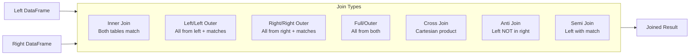

# Joins and Aggregations

## Overview

Joins and aggregations are fundamental operations for combining data from multiple sources and computing summary statistics. Mastering join optimization and aggregation functions is critical for building efficient data pipelines.

## Join Types



## SQL Joins Syntax

### Inner Join

```sql
SELECT
    l.id,
    l.name,
    r.department,
    r.salary
FROM employees l
INNER JOIN departments r
    ON l.department_id = r.id
WHERE l.salary > 50000
```

```python
df_inner = employees.join(
    departments,
    employees.department_id == departments.id,
    how="inner"
)

# Or specify both join keys

df_inner = employees.join(
    departments,
    ["department_id"],
    how="inner"
)
```

### Left Outer Join

```sql
SELECT
    l.id,
    l.name,
    COALESCE(r.department, 'Unknown') as department
FROM employees l
LEFT OUTER JOIN departments r
    ON l.department_id = r.id
```

```python
df_left = employees.join(
    departments,
    employees.department_id == departments.id,
    how="left"
)
```

### Right Outer Join

```sql
SELECT
    l.id,
    l.name,
    r.department
FROM employees l
RIGHT OUTER JOIN departments r
    ON l.department_id = r.id
```

```python
df_right = employees.join(
    departments,
    employees.department_id == departments.id,
    how="right"
)
```

### Full Outer Join

```sql
SELECT
    COALESCE(l.id, r.id) as id,
    l.name,
    r.department
FROM employees l
FULL OUTER JOIN departments r
    ON l.department_id = r.id
```

```python
df_full = employees.join(
    departments,
    employees.department_id == departments.id,
    how="outer"
)
```

### Cross Join

```sql
-- Cartesian product (each row from left with each row from right)
SELECT
    l.id,
    r.option
FROM employees l
CROSS JOIN product_options r
```

```python
df_cross = employees.join(
    options,
    how="cross"
)
```

### Semi Join (Filtering Join)

```sql
-- Returns rows from left that have match in right (but no right columns)
SELECT *
FROM employees l
WHERE EXISTS (
    SELECT 1 FROM departments r
    WHERE l.department_id = r.id
    AND r.budget > 100000
)
```

```python
df_semi = employees.join(
    departments,
    employees.department_id == departments.id,
    how="semi"
)
```

### Anti Join (Anti-Filter)

```sql
-- Returns rows from left that DON'T have match in right
SELECT *
FROM employees l
WHERE NOT EXISTS (
    SELECT 1 FROM blacklist r
    WHERE l.id = r.employee_id
)
```

```python
df_anti = employees.join(
    blacklist,
    employees.id == blacklist.employee_id,
    how="anti"
)
```

## Join Comparison

| Join Type | Left Rows | Right Rows | Use Case |
|-----------|-----------|----------|----------|
| Inner | Matches only | Matches only | Find matching records |
| Left | All | Matches only | Keep left data, enrich if matched |
| Right | Matches only | All | Keep right data, enrich if matched |
| Full | All | All | Never lose data from either side |
| Cross | All | All | Create every combination |
| Semi | All | Never | Filter left based on right existence |
| Anti | All | Never | Filter left by non-existence |

## Aggregations and GROUP BY

### Basic Aggregations

```sql
SELECT
    department,
    COUNT(*) as emp_count,
    AVG(salary) as avg_salary,
    MAX(salary) as max_salary,
    MIN(salary) as min_salary,
    SUM(salary) as total_salary
FROM employees
GROUP BY department
```

```python
df_agg = (employees
    .groupBy("department")
    .agg(
        F.count("*").alias("emp_count"),
        F.avg("salary").alias("avg_salary"),
        F.max("salary").alias("max_salary"),
        F.min("salary").alias("min_salary"),
        F.sum("salary").alias("total_salary")
    )
)
```

### Multiple Grouping Columns

```python
df_multi_group = (employees
    .groupBy("department", "job_title")
    .agg(
        F.count("*").alias("count"),
        F.avg("salary").alias("avg_salary"),
        F.stddev("salary").alias("salary_stddev")
    )
)
```

### HAVING Clause (Filter After GROUP BY)

```sql
SELECT
    department,
    COUNT(*) as emp_count,
    AVG(salary) as avg_salary
FROM employees
GROUP BY department
HAVING COUNT(*) > 10 AND AVG(salary) > 80000
```

```python
df_having = (employees
    .groupBy("department")
    .agg(
        F.count("*").alias("emp_count"),
        F.avg("salary").alias("avg_salary")
    )
    .filter((F.col("emp_count") > 10) & (F.col("avg_salary") > 80000))
)
```

## Aggregation Functions

| Function | Purpose | Example |
|----------|---------|---------|
| `COUNT(*)` | Row count | `COUNT(*) = 5` |
| `SUM()` | Total | `SUM(salary)` |
| `AVG()` | Average | `AVG(salary)` |
| `MIN()` / `MAX()` | Extremes | `MAX(salary)` |
| `STDDEV()` | Standard deviation | `STDDEV(salary)` |
| `VARIANCE()` | Variance | `VARIANCE(salary)` |
| `COLLECT_LIST()` | Collect into array | `COLLECT_LIST(name)` |
| `COLLECT_SET()` | Collect unique into array | `COLLECT_SET(category)` |
| `FIRST()` / `LAST()` | First/last value | `FIRST(hire_date)` |
| `APPROX_COUNT_DISTINCT()` | Approx distinct count | `APPROX_COUNT_DISTINCT(id)` |

## Advanced Grouping

### Multiple Aggregations in One Query

```python
from pyspark.sql import functions as F

df_complex = (employees
    .groupBy("department", "year")
    .agg(
        F.count("id").alias("headcount"),
        F.sum(F.when(F.col("salary") > 100000, 1).otherwise(0))
            .alias("high_earners"),
        F.avg("salary").alias("avg_salary"),
        F.collect_list("name").alias("employee_names")
    )
)
```

### Conditional Aggregation

```python
# Count by condition

df_conditional = (employees
    .groupBy("department")
    .agg(
        F.count(F.when(F.col("salary") > 100000, 1))
            .alias("high_earners"),
        F.count(F.when(F.col("salary") <= 100000, 1))
            .alias("regular_earners")
    )
)
```

## Join Performance Considerations

### Broadcast Join (Small Table)

```python
# Spark auto-broadcasts tables < 10MB, but can force:

from pyspark.sql.functions import broadcast

df_result = large_df.join(
    broadcast(small_df),
    large_df.key == small_df.key,
    how="inner"
)
```

### Bucketing for Joins

```python
# Pre-bucket large table for faster joins

(employees.write
    .bucketBy(10, "department_id")
    .mode("overwrite")
    .saveAsTable("employees_bucketed"))

# Subsequent joins on department_id will be faster

```

### Salting for Skewed Joins

```python
# Add random salt to skewed join keys

import pyspark.sql.functions as F

SALT_BUCKETS = 10

employees_salt = employees.withColumn(
    "salt", (F.rand() * SALT_BUCKETS).cast("int")
)

departments_salt = (departments
    .crossJoin(spark.range(0, SALT_BUCKETS).toDF("salt"))
)

result = (employees_salt.join(
    departments_salt,
    (employees_salt.dept_id == departments_salt.id) &
    (employees_salt.salt == departments_salt.salt),
    "inner"
).drop("salt"))
```

## Window Functions with Aggregations

```sql
SELECT
    name,
    department,
    salary,
    AVG(salary) OVER (PARTITION BY department) as dept_avg,
    RANK() OVER (PARTITION BY department ORDER BY salary DESC) as salary_rank
FROM employees
```

```python
from pyspark.sql.window import Window

window = Window.partitionBy("department").orderBy(F.desc("salary"))

df_window = employees.withColumn(
    "dept_avg", F.avg("salary").over(Window.partitionBy("department"))
).withColumn(
    "salary_rank", F.rank().over(window)
)
```

## Common Join Issues

| Issue | Cause | Solution |
|-------|-------|----------|
| Cartesian explosion | Wrong join condition or missing ON | Check join keys match correctly |
| Memory errors | Joinin large unbroadcasted tables | Use broadcast or bucketing |
| Skewed data | One join key value has many rows | Apply salting technique |
| Duplicates | Multiple matches on both sides | Use semi-join or apply deduplication |

## Use Cases

- **Large Scale Transformations**: Leveraging Spark SQL distributed execution semantics to transform multi-terabyte datasets efficiently.
- **Enriching Fact Tables with Dimension Lookups**: Using broadcast joins to enrich large transaction tables with small reference/dimension tables (e.g., joining millions of orders with a few thousand product categories) with minimal shuffle overhead.

## Common Issues & Errors

### OOM Errors

**Scenario:** Data skew causes an executor to run out of memory.
**Fix:** Use Adaptive Query Execution (AQE) and review joining logic.

### Shuffle Spill on Large Joins Causing OOM

**Scenario:** Joining two large tables causes excessive shuffle spill to disk or `OutOfMemoryError` on executors.
**Fix:** Broadcast the smaller table using the `broadcast()` hint, or increase `spark.sql.shuffle.partitions` to distribute data across more tasks and reduce per-partition memory pressure.

### Duplicate Columns After Join on Identically-Named Keys

**Scenario:** After joining two DataFrames on columns with the same name (e.g., both have `id`), the result contains two `id` columns, causing ambiguity errors in downstream operations.
**Fix:** Join on a single column expression (e.g., `df1.join(df2, ["id"])`) which automatically deduplicates the key column, or explicitly drop the duplicate column post-join.

## Exam Tips

- Know all seven join types and when to use each: inner, left, right, full, cross, semi, anti
- Semi join returns columns from the left table only (no right columns); anti join returns rows with no match
- `HAVING` filters after `GROUP BY` aggregation; `WHERE` filters before grouping
- Broadcast joins are automatic for tables under 10 MB; use `broadcast()` to force for larger reference tables

## Key Takeaways

- **Inner Join**: Only matching rows from both tables
- **Left Join**: All rows from left table, matching rows from right
- **Full Join**: All rows from both tables, nulls where no match
- **GROUP BY**: Aggregate data by specified columns
- **HAVING**: Filter groups after aggregation (not WHERE)
- **Window Functions**: Compute aggregates over partitions
- **Join Optimization**: Broadcast small tables, bucket large tables
- **Anti-Join**: Returns unmatched rows from left table

## Related Topics

- [DataFrame Operations](./02-dataframe-operations.md)
- [Advanced Transformations](./04-advanced-transformations.md)
- [Window Functions (SQL Examples)](../../../shared/code-examples/sql/window_functions.md)

## Official Documentation

- [Join Hints](https://docs.databricks.com/en/sql/language-manual/sql-ref-syntax-qry-select-hints.html)
- [Aggregate Functions](https://docs.databricks.com/en/sql/language-manual/sql-ref-functions-builtin.html)

---

**[← Previous: DataFrame Operations](./02-dataframe-operations.md) | [↑ Back to ETL with Spark SQL and Python](./README.md) | [Next: Advanced Transformations](./04-advanced-transformations.md) →**
