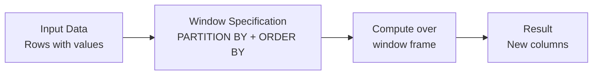

# Advanced Transformations

## Overview

Advanced transformation techniques enable complex data processing beyond standard SQL operations. User-defined functions (UDFs), window functions, and collection operations provide flexibility for sophisticated data pipelines.

## User-Defined Functions (UDFs)

### Python UDFs

```python
from pyspark.sql.functions import udf
from pyspark.sql.types import StringType, IntegerType

# Simple Python UDF

def categorize_salary(salary):
    if salary < 50000:
        return "Entry"
    elif salary < 100000:
        return "Mid"
    else:
        return "Senior"

# Register UDF

categorize_udf = udf(categorize_salary, StringType())

# Use in DataFrame

df_categorized = (employees
    .withColumn("level", categorize_udf(col("salary")))
)
```

### Pandas UDFs (Vectorized)

Pandas UDFs are faster than regular Python UDFs because they operate on batches:

```python
from pyspark.sql.functions import pandas_udf
import pandas as pd

@pandas_udf("string")
def categorize_salary_pandas(salary_series: pd.Series) -> pd.Series:
    """Vectorized UDF - processes entire batch at once"""
    return pd.cut(
        salary_series,
        bins=[0, 50000, 100000, float('inf')],
        labels=['Entry', 'Mid', 'Senior']
    )

df_categorized = (employees
    .withColumn("level", categorize_salary_pandas(col("salary")))
)
```

### SQL UDFs

```python
# Register as SQL function

spark.udf.register("categorize_salary_sql", categorize_salary, StringType())

# Use in SQL

result = spark.sql("""
    SELECT
        id,
        name,
        salary,
        categorize_salary_sql(salary) as level
    FROM employees
""")
```

### Scala UDFs

```python
spark.udf.registerJavaFunction(
    "my_java_udf",
    "com.example.MyFunctions.processData",
    StringType()
)
```

## Window Functions



### Window Function Syntax

```sql
SELECT
    name,
    department,
    salary,
    -- Ranking functions
    ROW_NUMBER() OVER (PARTITION BY department ORDER BY salary DESC) as row_num,
    RANK() OVER (PARTITION BY department ORDER BY salary DESC) as rank,
    DENSE_RANK() OVER (PARTITION BY department ORDER BY salary DESC) as dense_rank,

    -- Aggregate functions over window
    AVG(salary) OVER (PARTITION BY department) as dept_avg,
    SUM(salary) OVER (PARTITION BY department) as dept_total,

    -- Lead/Lag
    LAG(salary) OVER (ORDER BY hire_date) as prev_salary,
    LEAD(salary) OVER (ORDER BY hire_date) as next_salary
FROM employees
```

### Window Functions in Python

```python
from pyspark.sql.window import Window
from pyspark.sql.functions import row_number, rank, dense_rank, lag, lead, avg

# Define window

window_dept = Window.partitionBy("department").orderBy(F.desc("salary"))

df_windowed = (employees
    .withColumn("row_num", row_number().over(window_dept))
    .withColumn("rank", rank().over(window_dept))
    .withColumn("dense_rank", dense_rank().over(window_dept))
    .withColumn("dept_avg", avg("salary").over(Window.partitionBy("department")))
)
```

### Common Window Functions

| Function | Purpose | Example |
|----------|---------|---------|
| `ROW_NUMBER()` | Unique row number in window | `1, 2, 3, ...` |
| `RANK()` | Rank with gaps | `1, 1, 3, ...` |
| `DENSE_RANK()` | Rank without gaps | `1, 1, 2, ...` |
| `LAG()` | Previous row value | Get prior salary |
| `LEAD()` | Next row value | Get next salary |
| `FIRST_VALUE()` | First value in window | First salary in partition |
| `LAST_VALUE()` | Last value in window | Last salary in partition |
| `NTH_VALUE()` | Nth value in window | 3rd highest salary |

## Collection Functions

### Arrays

```python
from pyspark.sql.functions import array, concat, array_contains

# Create arrays

df_array = employees.select(
    col("name"),
    array(col("first_name"), col("last_name")).alias("name_parts")
)

# Array operations

df_array = employees.select(
    col("skills"),
    array_contains(col("skills"), "Python").alias("knows_python"),
    F.size(col("skills")).alias("num_skills")
)

# Explode array into rows

df_exploded = (employees
    .selectExpr("name", "explode(skills) as skill")
)

# Collect array from GROUP BY

df_collected = (employees
    .groupBy("department")
    .agg(F.collect_list("name").alias("employees"))
)
```

### Maps

```python
from pyspark.sql.functions import create_map, map_keys, map_values

# Create map

df_map = employees.select(
    col("name"),
    create_map(
        lit("salary"), col("salary"),
        lit("department"), col("department")
    ).alias("info")
)

# Access map values

df_accessed = (employees
    .withColumn("dept", col("info")["department"])
    .withColumn("sal", col("info")["salary"])
)

# Explode map into key-value rows

df_exploded = (employees
    .selectExpr("name", "explode(info) as (key, value)")
)
```

### Structs

```python
from pyspark.sql.functions import struct, col

# Create struct

df_struct = employees.select(
    col("name"),
    struct(
        col("name").alias("full_name"),
        col("salary").alias("annual_salary"),
        col("department").alias("dept")
    ).alias("employee_info")
)

# Access struct fields

df_accessed = (employees
    .withColumn("emp_name", col("employee_info.full_name"))
    .withColumn("emp_sal", col("employee_info.annual_salary"))
)
```

## String Operations

```python
from pyspark.sql.functions import lower, upper, trim, substring, concat, length

df_strings = employees.select(
    col("name"),
    lower(col("name")).alias("name_lower"),
    upper(col("department")).alias("dept_upper"),
    trim(col("email")).alias("email_clean"),
    substring(col("name"), 1, 3).alias("name_prefix"),
    concat(col("first_name"), lit(" "), col("last_name")).alias("full_name"),
    length(col("name")).alias("name_length")
)
```

## Date and Timestamp Operations

```python
from pyspark.sql.functions import to_date, to_timestamp, year, month, day, datediff, date_add, from_unixtime
from datetime import datetime, timedelta

df_dates = employees.select(
    col("hire_date"),
    year(col("hire_date")).alias("hire_year"),
    month(col("hire_date")).alias("hire_month"),
    day(col("hire_date")).alias("hire_day"),
    datediff(current_date(), col("hire_date")).alias("days_employed"),
    date_add(col("hire_date"), 365).alias("one_year_anniversary"),
    from_unixtime(col("timestamp_ms") / 1000).alias("readable_timestamp")
)
```

## Conditional Logic

```python
from pyspark.sql.functions import when, otherwise, case, coalesce

# Simple when/otherwise

df_conditional = (employees
    .withColumn("bonus_eligible",
        when(col("salary") > 100000, True).otherwise(False)
    )
)

# Multiple conditions

df_bonus = (employees
    .withColumn("bonus_pct",
        when(col("salary") >= 150000, 0.20)
        .when(col("salary") >= 100000, 0.15)
        .when(col("salary") >= 50000, 0.10)
        .otherwise(0.05)
    )
)

# Coalesce (first non-null value)

df_coalesce = (employees
    .withColumn("contact",
        coalesce(col("email"), col("phone"), lit("No contact"))
    )
)
```

## Flattening nested structures

```python
# Unnest array column

df_unnested = (employees
    .select("id", "name", F.explode("addresses").alias("address"))
    .select("id", "name", "address.street", "address.city")
)

# Flatten struct

df_flattened = (employees
    .select(
        "id",
        "name",
        col("contact_info.email").alias("email"),
        col("contact_info.phone").alias("phone")
    )
)
```

## Pivot Operations

### Pivot to Columns

```sql
SELECT *
FROM employees
PIVOT (
    SUM(salary)
    FOR department IN ('Engineering' as eng, 'Sales' as sales, 'HR' as hr)
)
```

```python
df_pivoted = (employees
    .groupBy("year")
    .pivot("department", ["Engineering", "Sales", "HR"])
    .agg(F.sum("salary"))
)
```

## Null Handling

```python
from pyspark.sql.functions import isnan, isnull, fillna, dropna

# Check for nulls

df_nulls = employees.select(
    col("name"),
    isnull(col("email")).alias("email_missing"),
    isnan(col("salary")).alias("salary_invalid")
)

# Drop nulls

df_clean = employees.dropna(subset=["email"])

# Fill nulls with value

df_filled = (employees
    .fillna({
        "email": "unknown@company.com",
        "department": "Unassigned"
    })
)

# Fill nulls with forward fill

window_fill = Window.orderBy(col("hire_date"))
df_forward_filled = employees.withColumn(
    "salary",
    F.last(col("salary"), ignoringNulls=True).over(
        window_fill.rowsBetween(Window.unboundedPreceding, 0)
    )
)
```

## Performance Considerations

### Broadcast vs Shuffle

```python
# Broadcast for small reference tables

from pyspark.sql.functions import broadcast

result = large_df.join(
    broadcast(small_reference),
    large_df.key == small_reference.key
)

# Shuffle for large-to-large joins

result = df1.join(df2, df1.key == df2.key)
```

### Caching Strategy

```python
# Cache frequently used DataFrames

df_cleaned = df.filter(col("sales") > 100)
df_cleaned.cache()

# Use it multiple times

result1 = df_cleaned.select("name", "sales")
result2 = df_cleaned.filter(col("sales") > 500)

# Remove from cache

df_cleaned.unpersist()
```

## UDF vs Built-in Functions

| Aspect | Built-in | UDF |
|--------|----------|-----|
| **Performance** | Fast (optimized) | Slower |
| **Flexibility** | Limited | Unlimited |
| **Optimization** | Catalyst optimizes | Limited optimization |
| **When to Use** | Always prefer | Last resort |

## Use Cases

- **Flattening Nested JSON Payloads**: Using `explode()`, `from_json()`, and struct access patterns to transform deeply nested API responses or event logs into flat, queryable Delta tables.
- **Custom Business Logic via UDFs**: Applying Python or Pandas UDFs for domain-specific transformations (e.g., address parsing, custom scoring functions) that cannot be expressed with built-in Spark functions.

## Common Issues & Errors

### Configuration Oversights

**Scenario:** The default settings for Advanced Transformations do not scale well with sudden spikes in data volume.
**Fix:** Explicitly define and tune the configuration parameters for Advanced Transformations to handle production-scale workloads.

### UDF Serialization Errors

**Scenario:** A Python UDF fails with `PicklingError` or `SerializationException` because it references a non-serializable object (e.g., a database connection or logger).
**Fix:** Use Pandas UDFs (vectorized) or built-in Spark functions instead. If a custom UDF is necessary, ensure all referenced objects are serializable or instantiate them inside the UDF function body.

### Schema Mismatch When Exploding Nested Data

**Scenario:** `explode()` on a JSON-derived column fails with `AnalysisException` because the inferred schema for `ArrayType` or `MapType` is inconsistent across rows.
**Fix:** Use `from_json()` with an explicit schema definition before exploding, ensuring all rows conform to the same expected structure.

## Exam Tips

- Always prefer built-in Spark functions over UDFs; UDFs bypass Catalyst optimization and are slower
- Pandas UDFs (vectorized) are significantly faster than regular Python UDFs because they process batches
- Know the difference between `ROW_NUMBER()`, `RANK()`, and `DENSE_RANK()` -- especially how they handle ties
- `explode()` converts an array column into multiple rows; this is a common exam question pattern

## Key Takeaways

- **UDF**: User-defined functions for custom logic; Pandas UDFs faster than Python UDFs
- **Window Functions**: Compute values over partitions without aggregating rows
- **Collections**: Arrays, maps, structs for complex data types
- **String/Date**: Standard functions for text and temporal data
- **Conditionals**: when/otherwise for complex business logic
- **Null Handling**: Use fillna/dropna for data quality
- **Optimization**: Use broadcast for small tables, avoid UDFs when possible
- **Pivot**: Transform data from rows to columns

## Related Topics

- [Joins and Aggregations](./03-joins-aggregations.md)
- [PySpark API Quick Reference](../../../shared/cheat-sheets/pyspark-api-quick-ref.md)
- [Python Patterns (Code Examples)](../../../shared/code-examples/python/python_patterns.md)

## Official Documentation

- [PySpark Built-in Functions](https://docs.databricks.com/en/pyspark/index.html)
- [Window Functions](https://docs.databricks.com/en/sql/language-manual/sql-ref-functions-builtin.html#window-functions)

---

**[← Previous: Joins and Aggregations](./03-joins-aggregations.md) | [↑ Back to ETL with Spark SQL and Python](./README.md)**
