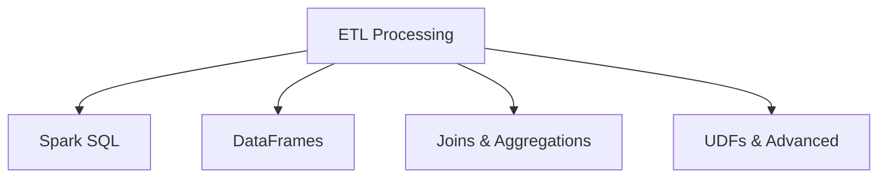

# ETL with Spark SQL and Python (29% of Exam)

The highest-weighted section covering data transformation and processing.

## Topics Overview

## Section Contents

| File | Topic | Priority |
| :--- | :--- | :--- |
| [01-spark-sql-fundamentals.md](01-spark-sql-fundamentals.md) | SQL queries, tables, views on Delta | High |
| [02-dataframe-operations.md](02-dataframe-operations.md) | DataFrame API, transformations, actions | High |
| [03-joins-aggregations.md](03-joins-aggregations.md) | Join types, grouping, aggregations | High |
| [04-advanced-transformations.md](04-advanced-transformations.md) | UDFs, window functions, complex operations | High |

## Key Concepts

- **Spark SQL**: SQL interface to structured data
- **DataFrames**: Distributed collection of rows with schema
- **Transformations**: Lazy operations (map, filter, select, etc.)
- **Actions**: Operations that trigger execution (collect, write, etc.)

## Related Resources

- [Spark Fundamentals](../../../shared/fundamentals/spark-fundamentals.md)
- [SQL Essentials](../../../shared/fundamentals/sql-essentials.md)
- [Python Essentials](../../../shared/fundamentals/python-essentials.md)
- [PySpark API Quick Reference](../../../shared/cheat-sheets/pyspark-api-quick-ref.md)

## Next Steps

Progress to [03-Delta Lake](../03-delta-lake/README.md) to learn persistence and versioning.

---

**[← Back to Certification](../README.md)**
