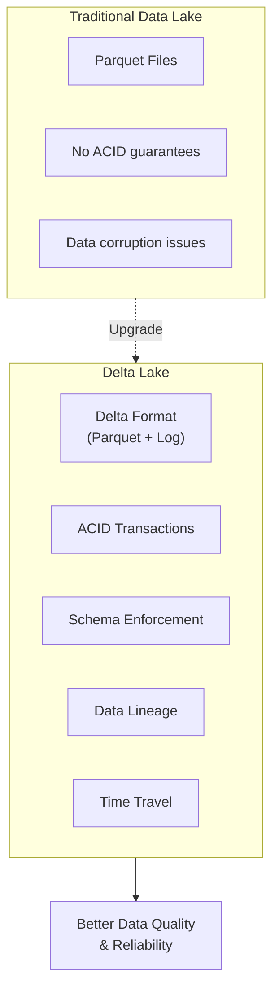
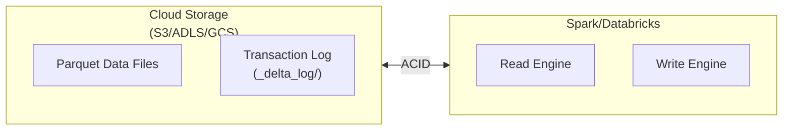

# Delta Lake Fundamentals

## Overview

Delta Lake is an open-source storage layer that brings ACID transactions, data lineage, and unified streaming/batch processing to data lakes. It sits on top of cloud storage (S3, ADLS, GCS) and complements Apache Spark.

## What is Delta Lake?



## Why Delta Lake Matters

| Challenge | Legacy Data Lake | Delta Lake |
|-----------|---|---|
| **Concurrent Updates** | Fails, data corruption | ACID guarantees consistency |
| **Schema Evolution** | Manual versioning | Built-in schema enforcement/evolution |
| **Debugging** | Lost data, no history | Full audit trail via logs |
| **Late Data** | Rewrite entire table | Efficient UPSERT via MERGE |
| **Accidental Deletes** | Permanent data loss | Time travel to recover data |
| **Performance** | Variable, slow queries | Optimized with statistics |

## Delta Lake Architecture



The Delta table consists of:

- **Data Files**: Parquet format (at `/path/to/table/`)
- **Transaction Log**: JSON files tracking all changes (at `/path/to/table/_delta_log/`)

## ACID Transactions

### ACID Guarantees

- **Atomicity**: All-or-nothing writes; no partial commits
- **Consistency**: Schema and data constraints enforced
- **Isolation**: Multiple readers and writers don't interfere
- **Durability**: Committed writes never lost

### Example: ACID Protection

```python

# Traditional Parquet - no ACID
# If write fails midway, data is corrupted

df.write.format("parquet").mode("overwrite").save("/path")

# Delta Lake - ACID protected
# If write fails, table rolled back automatically

df.write.format("delta").mode("overwrite").save("/path")
```

## Delta Table Formats

### Managed Tables (Default)

```python
# Data stored in warehouse directory managed by Databricks

spark.sql("""
CREATE TABLE employees (
    id INT,
    name STRING,
    salary DECIMAL(10, 2)
)
USING DELTA
""")

# Data location: /user/hive/warehouse/employees
# Dropping table also deletes data

spark.sql("DROP TABLE employees")  # Data deleted
```

### External Tables

```python
# Data stored in external location you control

spark.sql("""
CREATE TABLE employees_external (
    id INT,
    name STRING,
    salary DECIMAL(10, 2)
)
USING DELTA
LOCATION '/mnt/data/employees'
""")

# Data location: /mnt/data/employees
# Dropping table does NOT delete data

spark.sql("DROP TABLE employees_external")  # Data remains
```

## Creating Delta Tables

### From DataFrame

```python
# Write DataFrame as Delta table

employees_df = spark.createDataFrame([
    (1, "Alice", 85000),
    (2, "Bob", 75000)
], ["id", "name", "salary"])

(employees_df.write
    .format("delta")
    .mode("overwrite")
    .save("/mnt/data/employees"))

# Or create managed table

(employees_df.write
    .format("delta")
    .mode("overwrite")
    .saveAsTable("employees"))
```

### Convert Existing Parquet

```python
from delta.tables import DeltaTable

# Convert existing Parquet to Delta

DeltaTable.convertToDelta(
    spark,
    "parquet.`/path/to/parquet/data`"
)

# Table now has transaction log and ACID guarantees

```

### Using SQL

```sql
-- Create new Delta table
CREATE TABLE products (
    product_id INT,
    name STRING,
    price DECIMAL(10, 2),
    category STRING
)
USING DELTA;

-- Create from query results
CREATE TABLE high_earners AS
SELECT name, salary
FROM employees
WHERE salary > 100000
USING DELTA;

-- Create external Delta table
CREATE TABLE orders (
    order_id INT,
    customer_id INT,
    amount DECIMAL(10, 2)
)
USING DELTA
LOCATION '/mnt/data/orders';
```

## Table Metadata

### Inspecting Table Info

```python
# Get table metadata

spark.sql("DESCRIBE TABLE employees").show()

# Get column details

spark.sql("DESCRIBE TABLE EXTENDED employees").show()

# List tables

spark.sql("SHOW TABLES").show()

# Check if table is Delta

spark.sql("SHOW TBLPROPERTIES employees").show()
```

### Delta Table Properties

```python
# Set table properties

spark.sql("""
ALTER TABLE employees
SET TBLPROPERTIES (
    'delta.dataSkippingNumIndexedCols' = '32',
    'delta.columnMapping.mode' = 'name'
)
""")

# Check property

spark.sql("SHOW TBLPROPERTIES employees").show()
```

## Appending vs Overwriting

### Append Mode

```python
# Add new rows to existing table

new_employees = spark.createDataFrame([
    (3, "Charlie", 95000)
], ["id", "name", "salary"])

(new_employees.write
    .format("delta")
    .mode("append")
    .save("/mnt/data/employees"))
```

### Overwrite Modes

```python
# Overwrite all data

(updated_data.write
    .format("delta")
    .mode("overwrite")
    .save("/mnt/data/employees"))

# Error if schema doesn't match

(updated_data.write
    .format("delta")
    .mode("append")
    .save("/mnt/data/employees"))

# Merge schemas (add new columns)

(updated_data.write
    .format("delta")
    .mode("append")
    .option("mergeSchema", "true")
    .save("/mnt/data/employees"))
```

## Schema Enforcement and Evolution

### Schema Enforcement (Prevent Bad Data)

```python

# Table schema: id INT, name STRING, salary DECIMAL
# Attempt to write wrong schema -> ERROR

bad_data = spark.createDataFrame([
    ("Alice", "Not a number", 85000)  # Wrong types
], ["name", "salary", "bonus"])

(bad_data.write
    .format("delta")
    .mode("append")
    .save("/mnt/data/employees"))  # Failed!
```

### Schema Evolution (Add New Columns)

```python

# Table has: id, name, salary
# New data adds: department column

new_schema_data = spark.createDataFrame([
    (1, "Alice", 85000, "Engineering")
], ["id", "name", "salary", "department"])

(new_schema_data.write
    .format("delta")
    .mode("append")
    .option("mergeSchema", "true")
    .save("/mnt/data/employees"))

# Table now has: id, name, salary, department

```

## Mutation Operations

### INSERT

```sql
INSERT INTO employees VALUES (4, "David", 80000);

INSERT INTO employees
SELECT id, name, salary FROM new_hires;
```

### UPDATE

```sql
UPDATE employees
SET salary = salary * 1.1
WHERE department = 'Engineering';
```

### DELETE

```sql
DELETE FROM employees
WHERE salary < 30000;
```

### MERGE (Upsert)

```sql
MERGE INTO employees t
USING new_employees s
ON t.id = s.id
WHEN MATCHED THEN UPDATE SET *
WHEN NOT MATCHED THEN INSERT *;
```

## Comparison: Delta vs Parquet vs Iceberg

| Feature | Delta Lake | Parquet | Apache Iceberg |
|---------|-----------|---------|---|
| **ACID** | Yes | No | Yes |
| **Schema Evolution** | Yes | Limited | Yes |
| **Time Travel** | Yes | No | Yes |
| **Governance** | Strong | Weak | Strong |
| **Performance** | Optimized | Good | Good |
| **Adoption** | Very High | Highest | Growing |

## Transaction Log Details

The `_delta_log/` directory contains JSON files recording every transaction:

```json
{
  "add": {
    "path": "part-00000-abc123.parquet",
    "size": 1024000,
    "modificationTime": 1684756800000,
    "dataChange": true
  }
}
```

Each JSON file represents one committed transaction, enabling:

- Atomicity (all-or-nothing)
- Consistency (schema validation)
- Isolation (multi-version concurrency)
- Durability (permanent record)

## Use Cases

- **ACID Transactions for Concurrent Pipelines**: Multiple ETL jobs safely write to the same Delta table concurrently, relying on ACID guarantees to prevent data corruption and partial writes.
- **Schema Enforcement at Ingestion**: Using Delta Lake's schema enforcement to reject malformed records at write time, preventing bad data from entering the lakehouse and catching upstream schema changes early.

## Common Issues & Errors

### Small File Problem

**Scenario:** Frequent micro-batch writes cause slow reads.
**Fix:** Run OPTIMIZE with Z-ORDER regularly.

### Small File Accumulation From Frequent Writes

**Scenario:** Micro-batch streaming or frequent append operations create thousands of small Parquet files, degrading read performance significantly.
**Fix:** Enable `spark.databricks.delta.optimizeWrite.enabled = true` for automatic write-time coalescing, and run `OPTIMIZE` periodically to compact small files into larger ones.

### VACUUM Deleting Files Needed by Active Queries

**Scenario:** Running `VACUUM` with a short retention period removes data files that are still being read by long-running queries, causing those queries to fail with `FileNotFoundException`.
**Fix:** Ensure the VACUUM retention period exceeds the duration of the longest active query. The default 7-day retention is safe for most workloads.

## Exam Tips

- Delta Lake = Parquet files + `_delta_log/` transaction log -- know this structure
- Managed tables: `DROP TABLE` deletes both metadata and data; External tables: `DROP TABLE` deletes only metadata
- Schema enforcement is the default behavior; `.option("mergeSchema", "true")` enables schema evolution
- MERGE (upsert) is a key Delta Lake feature -- understand the `WHEN MATCHED` / `WHEN NOT MATCHED` syntax

## Key Takeaways

- **Delta Lake**: Storage layer adding ACID, governance, and performance to data lakes
- **Managed Tables**: Data in warehouse directory, deleted with table
- **External Tables**: Data in external location, persists after table drop
- **Merge Schema**: Allow new columns during append
- **ACID Guarantees**: Atomicity, Consistency, Isolation, Durability
- **Transaction Log**: `_delta_log/` maintains complete history
- **Schema Enforcement**: Prevents bad data, enforces types
- **Schema Evolution**: Controlled addition of new columns via mergeSchema

## Related Topics

- [Time Travel and Versioning](./02-time-travel-versioning.md)
- [Delta Lake Optimization](./03-delta-optimization.md)
- [Delta Lake Basics (Shared)](../../../shared/fundamentals/delta-lake-basics.md)

## Official Documentation

- [Delta Lake Documentation](https://docs.databricks.com/en/delta/index.html)
- [Delta Lake Table Properties](https://docs.databricks.com/en/delta/table-properties.html)

---

**[↑ Back to Delta Lake](./README.md) | [Next: Time Travel and Versioning](./02-time-travel-versioning.md) →**
